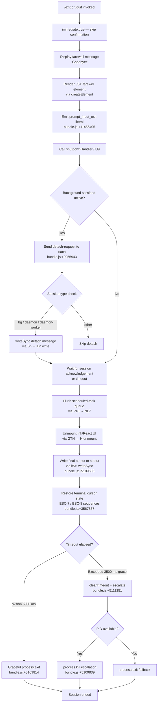

# `/exit`

> Analysis basis: CC v2.1.139 bundle.js (AST extraction + Claude interpretation)
> Minimum version: v2.1.139

---

## Overview

The `/exit` command (also aliased as `/quit`) terminates the Claude Code CLI session. When invoked, it performs an orderly shutdown sequence: it flushes in-flight background workers, unmounts the UI, emits a session-end telemetry event, writes any pending output to stdout, and finally calls `process.exit`. A farewell string ("Goodbye!") is displayed to the user before the process terminates.

---

## Registration

| Field | Value |
|---|---|
| type | `local-jsx` |
| name | `exit` |
| description | `null` |
| aliases | `["quit"]` |
| immediate | `true` |
| module_id | `cjq` |
| load_inline | `true` |
| loc_byte | `11456967` |
| loc_byte_end | `11457128` |
| loc_line | `7148` |
| arbor_handler.name | `UG7` |
| arbor_handler.fqn | `claude-2.1.139::UG7` |
| arbor_handler.kind | `AsyncFunction` |
| arbor_handler.resolution_path | `module_id` |
| arbor_handler.n_hits | `1` |

Analysis basis: CC v2.1.139 bundle.js:+11456967

---

## Input Branching

The exit command has more than three distinct branches across its shutdown sequence (UI unmount path, background session teardown, process-exit escalation, timer/abort paths). A Mermaid flowchart is used.



Analysis basis: CC v2.1.139 bundle.js:+11456217, +11456264, +11456400, +5111054, +5111061, +5109814, +5109839

---

## Behavioral Spec

### 1. Command Entry — Handler `exitCommandHandler` (UG7)

The Arbor-resolved handler is `UG7` (AsyncFunction, resolved via `module_id`). The `immediate: true` registration flag means the command fires without waiting for further user confirmation.

```
async function exitCommandHandler(context):
    // Step 1 — display farewell
    displayFarewellMessage()                   // "Goodbye!" literal @ +11456181
    renderJSXFarewell(createElement(...))      // @ +11456294

    // Step 2 — emit input-exit signal
    emitInputExitSignal("prompt_input_exit")   // @ +11456405

    // Step 3 — background session detach
    detachBackgroundSessions()                 // AKH @ +11456233

    // Step 4 — flush task queue + render final status
    flushScheduledTaskQueue()                  // Pz8 @ +11456264

    // Step 5 — full shutdown sequence
    await runShutdownSequence()                // U9 @ +11456400
```

Analysis basis: CC v2.1.139 bundle.js:+11456217

---

### 2. Background Session Detach — `detachBackgroundSessions` (AKH)

Before the process exits, any active background sessions (identified by type strings `"bg"`, `"daemon"`, or `"daemon-worker"`) receive a `"detach-request"` message so they can outlive the CLI process.

```
function detachBackgroundSessions():
    activeSessionTypes = getActiveSessions()   // NU6 @ +9955909

    for each session in activeSessionTypes:
        if session.type in ["bg", "daemon", "daemon-worker"]:  // @ +2148195
            payload = buildDetachPayload(session)  // A8q @ +9955928
            writeToSessionTransport(payload)       // Bn @ +9955934
            // Bn calls Un.write @ +9084880
            // payload serialized via JSON.stringify (yH @ +9084889)

    notifyDetachComplete()                     // OHH @ +9955989
```

Session type string literals: `"bg"` (+2148195), `"daemon"` (+2148205), `"daemon-worker"` (+2148219), detach message type `"detach-request"` (+9955943).

Analysis basis: CC v2.1.139 bundle.js:+9955909, +9955928, +9955934, +9955943

---

### 3. Task Queue Flush — `flushScheduledTaskQueue` (Pz8)

Any pending scheduled tasks are flushed before the UI is torn down.

```
function flushScheduledTaskQueue():
    taskList = getScheduledTasks()             // NZ @ +9949677
    for each task in taskList:
        taskList.push(task)                    // H.push @ +9949682

    // Format tasks for display
    formattedOutput = formatTaskOutput(tasks)  // NL7 @ +9949723
    // NL7 calls:
    //   parseTaskSchedule()    (OE @ +9949809)
    //   parseCronExpression()  (kV @ +9949826)
    //   computeNextRunTime()   (dUH @ +9949842)
    //   Math.max for timing    (@ +9949901)
    //   Date.now baseline      (@ +9949924)
    //   formatDuration()       (r1 @ +9949958)

    truncatedOutput = truncateToTerminalWidth(formattedOutput)  // U1 @ +9949738
```

Scheduled task label string: `"scheduled task"` (+9949696). Duration formatter uses `Math.floor` (+201876) and `Math.round` (+201876). Terminal width measurement calls `Bun.stringWidth` (L8 → +199857).

Analysis basis: CC v2.1.139 bundle.js:+9949677, +9949723, +9949958

---

### 4. Shutdown Sequence — `runShutdownSequence` (U9)

This is the core async shutdown orchestrator. It coordinates UI teardown, output flushing, telemetry emission, and final process termination.

```
async function runShutdownSequence():
    // 4a — resolve any pending promises first
    await Promise.resolve()                    // @ +5110957

    // 4b — send abort signal with timeout
    abortController = new AbortSignal.timeout(...)  // @ +5111316
    await waitForInflightRequests(abortController)  // aL @ +5110987

    // 4c — emit session-end telemetry
    emitTelemetry("session_end", sessionData)  // @ +5111425

    // 4d — unmount terminal UI + restore cursor
    unmountTerminalUI()                        // GTH @ +5111025
    // GTH steps:
    //   l$H.writeSync — flush buffered output @ +5109137
    //   Q4.get — retrieve component ref @ +5109163
    //   H.unmount — tear down Ink/React tree @ +5109214
    //   Ny — restore cursor / cleanup @ +5109248
    //   Lr6 — write terminal escape sequences @ +5109296
    //     ESC-7 (save cursor) @ +3567867
    //     ESC-8 (restore cursor) @ +3567878
    //     tmux-specific escape handling (sT @ +3567937)

    // 4e — write final stdout payload
    writeExitPayload()                         // OO_ @ +5111031
    // OO_ steps:
    //   IZ / kS — state inspection @ +5109437
    //   V6 — version lookup @ +5109459
    //   q$6 — path resolution + statSync @ +5109468
    //   Q$ — finalization record @ +5109488
    //   replaceAll escape normalization @ +5109507
    //   l$H.writeSync final write @ +5109606
    //   f6.dim — dim formatting for "other" label @ +5109622

    // 4f — schedule watchdog timer then perform graceful exit
    maxGraceMs = Math.max(5000, 3500)          // @ +5111045, +5111054, +5111061
    timer = setTimeout(forceKill, maxGraceMs)
    timer.unref()                              // n$H.unref @ +5111070

    // 4g — parallel cleanup tasks
    await jyH(Promise.all, Array.from, ...)    // jyH @ +5111150

    // 4h — race: graceful vs timeout
    await Promise.race([gracefulExit(), watchdog()])  // @ +5111174

    // 4i — emit cache-eviction hint
    emitTelemetry("tengu_cache_eviction_hint") // @ +5111390

    // 4j — daemon config and supervisor interaction
    runDaemonSupervisorCheck()                 // D @ +5111228

    // 4k — scroll summary report
    emitTelemetry("tengu_scroll_summary")      // @ +5110602

    // 4l — startup perf flush if enabled
    flushStartupPerfReport()                   // eeH @ +5111352

    // 4m — append final newline to stdout
    l$H.writeSync(500ms timeout)               // @ +5111705

    // 4n — perform process exit
    clearTimeout(timer)                        // @ +5111251
    processExitOrKill()                        // zO_ @ +5111037
```

`processExitOrKill` (zO_):
- Clears the watchdog timer (+5109733)
- Looks up the process PID via `Q4.get` (+5109766)
- Calls `process.exit` (+5109814)
- Falls back to `process.kill` if needed (+5109839)
- Throws `Error("unreachable")` if both fail (+5109881, string `"unreachable"` +5109887)

Grace period constants: 5000 ms (+5111054), 3500 ms (+5111061).

Analysis basis: CC v2.1.139 bundle.js:+5110957, +5111025, +5111031, +5111037, +5111054, +5111061, +5111174, +5111251

---

### 5. Farewell Display — `farewellComponent` (pG7)

A small JSX component is rendered that presents the farewell string to the user before the shutdown proceeds.

```
function farewellComponent():
    message = "Goodbye!"                       // @ +11456181
    return createElement(KP, { text: message }) // KP @ +11456172
    // rendered via Km_.createElement @ +11456294
```

Analysis basis: CC v2.1.139 bundle.js:+11456172, +11456181, +11456294

---

### 6. Terminal Escape Handling During Exit — `writeTerminalEscapes` (Lr6)

The shutdown restores terminal state using saved/restored cursor position sequences. It also detects multiplexer environments (tmux, screen) and adjusts escape output accordingly.

```
function writeTerminalEscapes():
    pa.writeSync(ESC_SAVE_CURSOR)              // ESC-7 @ +3567867
    pa.writeSync(ESC_RESTORE_CURSOR)           // ESC-8 @ +3567878

    terminalEnv = detectTerminalEnvironment()  // pWH @ +3567887
    // pWH checks:
    //   terminal === "ghostty" (version >= 1.2.0) @ +3300318, +3300348
    //   terminal === "iTerm.app" (version >= 3.6.6) @ +3300387, +3300419

    if isTmuxEnvironment():                    // sT @ +3567937
        // replaces double-ESC sequences for tmux
        // "tmux" @ +3225460, "\u001b\u001b" replacement @ +3225506
        // also handles "screen" multiplexer @ +3225533

    xWH(...)                                   // additional terminal state cleanup @ +3567916
```

Analysis basis: CC v2.1.139 bundle.js:+3567734, +3567867, +3567878, +3567887, +3567916, +3567937

---

### 7. Startup-Performance Flush on Exit — `flushStartupPerfReport` (eeH)

If startup profiling was enabled, the exit path flushes the performance report before terminating.

```
function flushStartupPerfReport():
    report = collectPerfMarks()                // sV8 @ +205935
    // sV8:
    //   require("perf_hooks") @ +204838
    //   performance.mark entries @ +206315
    //   writes via q.set / q.get @ +206375, +206490
    //   tracks seen marks in Xt_ set @ +206464, +206584
    //   Math.round timing values @ +206543
    //   max buffer 1 048 576 bytes @ +206792

    if report is empty:
        log("No profiling checkpoints recorded") // @ +205531
        return

    formatAndWrite(report)                     // Wt_ @ +205950
    // Wt_:
    //   writes UTF-8 to file via cQ @ +206068
    //   cQ: openSync → writeFileSync → fsyncSync → closeSync @ +178069..178174
    //   logs "Startup profiling report:" @ +206109
    //   formats width-80 banner "STARTUP PROFILING REPORT" @ +205606

    emitTelemetry("tengu_startup_perf")        // @ +206895
```

Analysis basis: CC v2.1.139 bundle.js:+205935, +205950, +206895

---

### 8. Scroll Summary Emission — `emitScrollSummary` (y68)

After the UI is unmounted, a scroll summary telemetry event is emitted summarising the session's visible output.

```
function emitScrollSummary():
    state = getScrollState()                   // IZ @ +5110588
    sessionLabel = getSessionLabel()           // cH1 @ +5110594
    scrollData = computeScrollMetrics()        // dH1 @ +5110629
    // dH1:
    //   Date.now for timestamps @ +5108015
    //   Math.max / Math.round for metric rounding @ +5108083, +5108156
    //   Object.assign to merge state @ +5108295

    renderScrollOverlay()                      // FA @ +5110646
    // FA:
    //   checks "local-agent" context @ +3232244
    //   detects fullscreen inhibition for tmux-CC / Windows SSH @ +3232399, +3232585
    //   emits tengu_pewter_brook @ +3232880
    //   emits tengu_amber_creek @ +3232972

    emitTelemetry("tengu_scroll_summary", scrollData)  // Q @ +5110600
```

Label string `"other"` used for unclassified scroll segments (+5110828).

Analysis basis: CC v2.1.139 bundle.js:+5110588, +5110594, +5110600, +5110602, +5110629, +5110646

---

## State & Side Effects

| Item | Detail |
|---|---|
| Telemetry — `tengu_scroll_summary` | Emitted during exit scroll-summary flush (bundle.js:+5110602) |
| Telemetry — `tengu_cache_eviction_hint` | Emitted to suggest cache eviction after session ends (bundle.js:+5111390) |
| Telemetry — `tengu_startup_perf` | Emitted if startup profiling was active (bundle.js:+206895) |
| Telemetry — `tengu_amber_creek` | Emitted during fullscreen/scroll overlay rendering (bundle.js:+3232972) |
| Telemetry — `tengu_pewter_brook` | Emitted during scroll overlay rendering path (bundle.js:+3232880) |
| Telemetry — `tengu_bg_dispatch_sigkill_escalate` | Emitted if a background worker requires SIGKILL escalation (bundle.js:+14310587) |
| Telemetry — `tengu_bg_dispatch_low_mem` | Emitted if low memory is detected during background dispatch (bundle.js:+14311166) |
| Telemetry — `tengu_bg_spare_enable` | Background spare-worker pool enabled event (bundle.js:+14311781) |
| Telemetry — `tengu_bg_spare_claim` | Background spare-worker successfully claimed (bundle.js:+14311902) |
| Telemetry — `tengu_bg_spare_claim_fail` | Background spare-worker claim failed (bundle.js:+14312165) |
| Telemetry — `tengu_bg_spare_spawn` | Background spare-worker spawned (bundle.js:+14310364) |
| Telemetry — `tengu_daemon_config_reload` | Daemon config reloaded during supervisor interaction (bundle.js:+14324140) |
| Terminal state | ESC-7 (save cursor) and ESC-8 (restore cursor) written to stdout on exit |
| Background sessions | Sent `"detach-request"` payload so `bg`/`daemon`/`daemon-worker` processes survive CLI exit |
| Process termination | `process.exit` called; fallback to `process.kill` if needed. Watchdog fires at `Math.max(5000, 3500)` = 5000 ms |
| UI teardown | Ink/React component tree unmounted via `H.unmount` before process exits |
| Startup perf file | Written synchronously via `openSync` → `writeFileSync` → `fsyncSync` → `closeSync` if profiling was active |
| `session_end` literal | Written to output payload marking end of conversation (bundle.js:+5111425) |
| `prompt_input_exit` literal | Signalled on command entry (bundle.js:+11456405) |
| Sound | <!-- TODO: not found in depth-2 traversal; needs --depth 4 --> |
| appState changes | UI state cleared via scroll/overlay state flush before unmount |

---

## Version History

| Version | Change |
|---|---|
| v2.1.139 | Initial analysis |

---

## Common Mistakes

1. **Expecting an instant exit on `/exit`**: The command is `immediate: true`, so it does not wait for user confirmation, but the shutdown sequence is async and includes a 5000 ms watchdog — callers should not assume the process exits in < 1 ms.
2. **Assuming `/quit` is a different command**: `/quit` is a registered alias; both names trigger the exact same handler (`UG7`).
3. **Assuming background daemon processes are killed**: `/exit` sends a `"detach-request"` to `bg`, `daemon`, and `daemon-worker` sessions — they are intentionally kept alive after the CLI exits.
4. **Ignoring the tmux/screen escape quirk**: In tmux or GNU screen environments the ESC-7/ESC-8 sequences are rewritten to avoid double-ESC artifacts. Tools that capture raw output in these environments may see different byte sequences than in a plain terminal.
5. **Treating missing startup perf output as a bug**: The startup performance report is only flushed if profiling was explicitly enabled; otherwise the exit path skips it silently.

---

## Appendix — Identifier Mapping

> For bundle debugging only. Identifiers change across versions.

| Identifier | Role |
|---|---|
| `UG7` | Main exit command handler (AsyncFunction; Arbor FQN: `claude-2.1.139::UG7`) |
| `Z1` | Session/context accessor called at handler entry |
| `Zo` | Inner helper called by session accessor |
| `H` | General-purpose helper / farewell random-delay scheduler (calls `Math.random`, `setTimeout`) |
| `AKH` | Background-session detach orchestrator |
| `NU6` | Active-session list retriever |
| `A8q` | Detach payload builder |
| `rVH` | Payload field formatter (called by detach payload builder) |
| `x8` | Transport/channel accessor |
| `Bn` | Session transport writer (calls `Un.write`) |
| `yH` | JSON serializer wrapper (calls `JSON.stringify`) |
| `OHH` | Post-detach notification / cleanup |
| `lf` | Misc utility invoked after detach |
| `Pz8` | Scheduled-task queue flusher |
| `NZ` | Scheduled-task list getter |
| `NL7` | Task output formatter |
| `OE` | Cron/schedule expression parser |
| `K` | Cron field map/pad helper |
| `w` | Daemon process supervisor record |
| `L` | Async task lifecycle tracker (add/finally/delete) |
| `J` | Process-list iterator (calls `A.values`, `v.kill`) |
| `Y` | Background spare-worker spawn helper |
| `$` | Pattern matcher / config helper |
| `j` | Date/UTC manipulation wrapper |
| `kV` | Cron expression trim + sub-parser |
| `alL` | Cron field tokeniser (split/match/parseInt/add/Array.from) |
| `A` | String lowercasing helper |
| `dUH` | Next-run datetime calculator |
| `_` | Generic date/time state object |
| `O` | Date object with set/get time methods |
| `f` | Session close helper (A.close, q.close) |
| `q` | File unlink helper (calls `Aaq.unlinkSync`) |
| `r1` | Duration formatter (Math.floor / Math.round) |
| `U1` | Terminal-width-aware string truncator |
| `L8` | String visual-width measurer (calls `Bun.stringWidth`) |
| `n9` | Grapheme-aware string segmenter |
| `xO` | Unicode / grapheme cluster helper |
| `pG7` | Farewell JSX component factory |
| `U9` | Core async shutdown sequence orchestrator |
| `GTH` | UI unmount + terminal restore handler |
| `Ny` | Post-unmount cursor cleanup |
| `Lr6` | Terminal escape sequence writer |
| `pWH` | Terminal environment detector (ghostty / iTerm version check) |
| `xWH` | Additional terminal state cleanup step |
| `sT` | Tmux/screen escape rewriter |
| `SH` | String coercion wrapper (calls `String()`) |
| `OO_` | Final stdout payload writer |
| `IZ` | Scroll / UI state inspector |
| `kS` | Key-state accessor |
| `V6` | Version string accessor |
| `q$6` | Path resolver + `statSync` checker |
| `pQ` | Path component helper |
| `A_` | Additional path helper |
| `B6` | File-existence checker |
| `Q$` | Finalisation record builder |
| `uL` | Output record formatter |
| `lH1` | Line-height / layout helper |
| `zO_` | Process-exit / process-kill executor |
| `jyH` | Parallel async task runner (Promise.all + Array.from) |
| `D` | Daemon supervisor interaction handler |
| `fwH` | Supervisor IPC reader |
| `w8` | IPC write helper |
| `Vp_` | IPC frame parser |
| `IH` | String coercion for IPC data |
| `rWq` | Column-width / alignment formatter |
| `T` | Remote-control / input event handler |
| `u` | Event with `preventDefault` |
| `D2` | User-settings key accessor (`"userSettings"`) |
| `V` | Supervisor config manager (stop/updateConfig/start) |
| `haq` | Heartbeat sender |
| `Ja` | Heartbeat payload builder |
| `Z` | Subprocess lifecycle controller (start) |
| `Q` | Generic event / state emitter |
| `eeH` | Startup performance report flusher |
| `sV8` | Performance mark collector |
| `Kx` | `perf_hooks` module loader |
| `Wt_` | Perf report file writer |
| `Zt_` | Perf report path builder |
| `cQ` | Synchronous file-write helper (openSync/writeFileSync/fsyncSync/closeSync) |
| `Jt_` | Profiling checkpoint aggregator |
| `N` | Log/debug writer (calls `yH`/JSON.stringify, `toUpperCase`) |
| `y68` | Scroll-summary emission coordinator |
| `cH1` | Session label getter |
| `dH1` | Scroll metric calculator (Date.now / Math.max / Math.round / Object.assign) |
| `gH1` | Scroll metric sub-helper |
| `FA` | Scroll overlay renderer / fullscreen check |
| `TSH` | Terminal capability set checker |
| `r__` | Fullscreen mode resolver |
| `vc` | Visual config helper |
| `N46` | Boolean/optional field coercer |
| `m_` | Mode initialiser |
| `evL` | Event-loop / render tick helper |
| `j6` | Telemetry event dispatcher |
| `vtH` | Session validation helper |
| `o8` | Abort-signal / timeout wrapper |