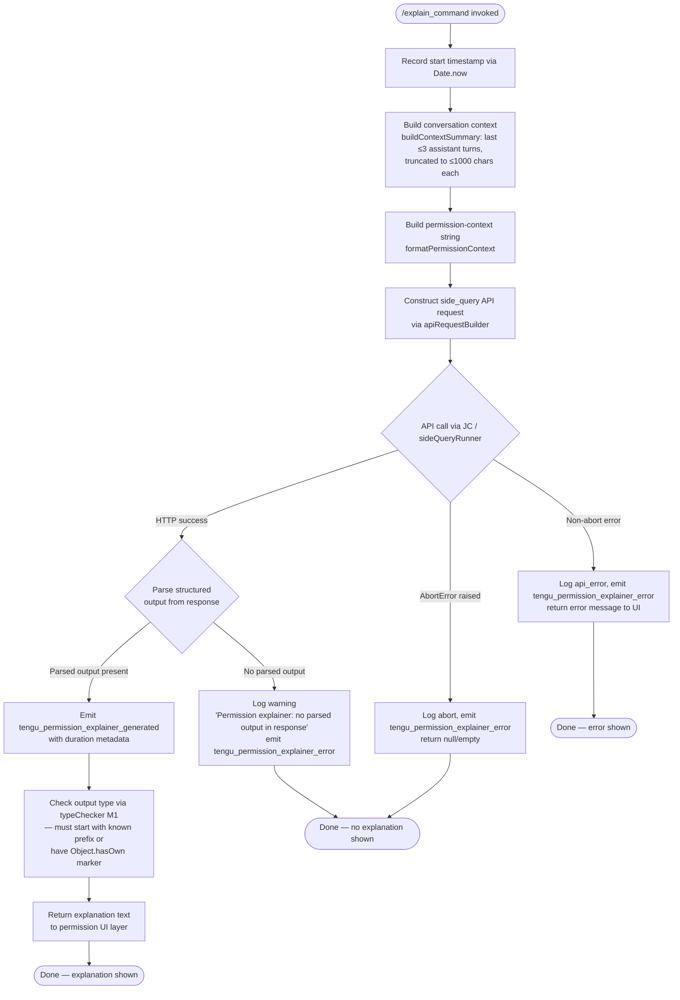

# `/explain_command`

> Analysis basis: CC v2.1.139 bundle.js (AST extraction + Claude interpretation)
> Minimum version: v2.1.139

---

## Overview

`/explain_command` is an internal tool-type slash command that invokes a permission-explainer sub-agent via the API to generate a human-readable explanation of a pending tool-use permission request. It gathers conversation context (recent assistant messages), constructs a side-query API call, parses the structured response, and emits the explanation back to the user interface. The command is the backbone of CC's "Why is Claude asking for this permission?" UI flow.

---

## Registration

| Field | Value |
|---|---|
| type | `tool` |
| name | `explain_command` |
| description | `null` |
| loc_byte | `12559694` |
| loc_byte_end | `12559730` |
| loc_line | `9198` |
| arbor_handler.name | `Dyq` |
| arbor_handler.fqn | `claude-2.1.139::Dyq` |
| arbor_handler.kind | `AsyncFunction` |
| arbor_handler.resolution_path | `direct` |
| arbor_handler.n_hits | `1` |

Analysis basis: CC v2.1.139 bundle.js:+12559694

---

## Input Branching

The handler has 4+ distinct branches: abort/error handling, missing parsed output, successful generation, and API error — a Mermaid flowchart is used.



---

## Behavioral Spec

### Main Handler — `permissionExplainerHandler` (bundle: `Dyq`)

```
async function permissionExplainerHandler(toolInput, appContext):
    startTime = Date.now()                          // +12559413

    // 1. Build conversation context
    contextSummary = buildContextSummary(appContext)    // cx7 +12559434
    permContext    = buildPermissionContext(toolInput)   // lx7 +12559452

    // 2. Fire side-query API call
    response = await sideQueryRunner(                   // JC  +12559612
        queryType = "side_query",                       // literal +12206698
        messages  = [contextSummary, permContext],
        cacheControl = "1h"                             // literal +12207548
    )

    // 3. Check for abort
    if response.error.name == "AbortError":             // literal +12560837
        emit tengu_permission_explainer_error
        return null

    // 4. Check for API error
    if response has "api_error" flag:                   // literal +12560908
        emit tengu_permission_explainer_error
        return errorMessage

    // 5. Check for parsed output
    parsed = extractParsedOutput(response)              // dx7 +12560019
    if parsed is null or undefined:
        log "Permission explainer: no parsed output in response"   // +12560524
        emit tengu_permission_explainer_error
        return null

    // 6. Validate output shape
    valid = outputTypeChecker(parsed)                   // M1  +12560227
    // M1 checks Object.hasOwn and H.startsWith +3086668/+3086720

    // 7. Emit success telemetry
    emit tengu_permission_explainer_generated           // +12560177
        with { duration: Date.now() - startTime,
               tool: "permission_explainer" }           // literal +12559752

    // 8. Return explanation
    return buildExplanationResult(parsed,               // N   +12559792
                                  yH,                   // yH  +12559985
                                  kH, xH, LH, IH)      // +12560276/+12560728/+12560737/+12560873
```

Analysis basis: CC v2.1.139 bundle.js:+12559389

---

### Context Summary Builder — `buildContextSummary` (bundle: `cx7`)

```
function buildContextSummary(appContext):
    // Serialize app state for the explainer model
    serialized = jsonStringify(appContext)               // yH -> JSON.stringify +177562
    truncated  = String(serialized).slice(0, 2)         // limit constant 2 +12558909
                                                         // (depth-2 cut; exact char limit
                                                         // needs --depth 4)
    return truncated
```

Analysis basis: CC v2.1.139 bundle.js:+12558899

---

### Recent-Messages Collector — `recentMessagesCollector` (bundle: `lx7`)

```
function recentMessagesCollector(messageHistory):
    // Filter to assistant messages only
    assistantMsgs = messageHistory.filter(
        m => m.role == "assistant"                      // literal +12558988
    )

    // Reverse chronological, take last 3
    recent = assistantMsgs.reverse()                    // +12559033
                           .slice(0, 3)                 // literal 3 +12559008

    // For each message, extract text blocks up to 1000 chars
    textParts = recent.map(msg =>
        msg.content
           .filter(block => block.type == "text")       // literal "text" +12559091
           .join("") )

    // Truncate long entries and join with ellipsis separator
    result = textParts
        .map(t => t.slice(0, 1000))                     // literal 1000 +12558953
        .unshift("...")                                  // literal "..." +12559189
        .join("  ")                                     // literal "  " (two spaces) +14333012

    return result
```

Analysis basis: CC v2.1.139 bundle.js:+12558965

---

### Side-Query Runner — `sideQueryRunner` (bundle: `JC`)

```
async function sideQueryRunner(queryType, messages, options):
    // Delegate to core API request pipeline (rx)
    apiResponse = await coreApiRequest(rx, messages, {   // rx +12206666
        queryType,                                        // "side_query" +12206698
        cacheControl: options.cacheControl,               // "1h" +12207548
        model: resolveModel(U2H),                         // U2H +12206804
        temperature: options.temperature                  // "temperature" +2878867
    })

    // Optionally hash request for deduplication
    requestHash = computeHash(RB_)                        // RB_ dZq.createHash +12165043
                                                          // algo: "sha256" +12165058, "hex" +12165085

    // Add message metadata tags (Ln6, Kn6)
    taggedMessages = tagMessages(apiResponse)             // Ln6 +12207231, Kn6 +12207296

    // Apply 1h cache_control breakpoint
    withCache = applyPromptCache(uZH, "1h")               // uZH +12207529, literal "1h"

    // Emit result
    emit tengu_api_success                                // +12208122
    return apiResponse
```

Analysis basis: CC v2.1.139 bundle.js:+12206666

---

### Config / File-System Layer — `configLoader` (bundle: `cfH`)

```
function configLoader(configPath):
    if accessNotYetAllowed:
        throw Error("Config accessed before allowed.")   // literal +3134784

    raw = fs.readFileSync(configPath, "utf-8")           // literal +3134867

    parsed = jsonParse(raw)                              // U6 -> JSON.parse +178301

    // Strip leading comment prefix from keys
    cleaned = stripCommentPrefix(cS)                     // cS: H.startsWith + H.slice +1066059

    // Handle ENOENT gracefully
    if error.code == "ENOENT":                           // literal +3135014
        return defaultConfig

    // Backup rotation (up to 30 backups in "backups/" subdir)
    backupDir = path.join(configDir, "backups")          // literal +3134352
    existingBackups = fs.readdirStringSync(backupDir)
    if existingBackups.length > 30:                      // literal 30 via Z09
        pruneOldestBackup()

    // Save with timestamp
    timestamp = Date.now()                               // +3135911
    fs.copyFileSync(src, dst)                            // +3135929

    if error.code == "EEXIST":                           // literal +3135635
        skip

    // Log parse error if malformed
    emit tengu_config_parse_error                        // +3135421

    return parsed
```

Analysis basis: CC v2.1.139 bundle.js:+3134778

---

### Output Type Checker — `outputTypeChecker` (bundle: `M1`)

```
function outputTypeChecker(parsedOutput):
    // Two checks:
    // 1. Object.hasOwn — verifies a discriminant property exists
    hasDiscriminant = Object.hasOwn(parsedOutput, key)   // +3086668

    // 2. String prefix check — validates type tag
    validPrefix = parsedOutput.type.startsWith(prefix)   // +3086720

    // "mcp_tool" is one known valid type tag
    // literal "mcp_tool" +3086748

    return hasDiscriminant && validPrefix
```

Analysis basis: CC v2.1.139 bundle.js:+3086668

---

## State & Side Effects

| Item | Detail |
|---|---|
| Telemetry — success | `tengu_permission_explainer_generated` (emitted with duration, loc +12560177) |
| Telemetry — error | `tengu_permission_explainer_error` (emitted on abort, API error, or missing parsed output, loc +12560389) |
| Telemetry — API | `tengu_api_success` (emitted inside side-query runner, loc +12208122) |
| Telemetry — config | `tengu_config_parse_error` (emitted on malformed config in supporting layer, loc +3135421) |
| Telemetry — auth | Multiple `tengu_oauth_token_refresh_*` events emitted by auth sub-layer during API call (locs +2903040–+2904512) |
| Telemetry — prompt cache | `tengu_prompt_cache_1h_config` (emitted when 1h cache breakpoint applied, loc +12170323) |
| appState changes | None observed in depth-2 traversal — explainer result is returned to caller for UI rendering, not written to persistent state |
| Hook registration | None observed in depth-2 traversal |
| File system | Config read/backup via `fs.readFileSync`, `fs.copyFileSync`, `fs.mkdirSync` in `cfH`; backup directory `"backups/"` created if absent |
| Sound | None observed |
| Network | One HTTPS POST to Anthropic API (or configured gateway) via `sideQueryRunner` / `rx` pipeline; timeout 600 000 ms (literal +2864336) |
| Cache control | Prompt-cache breakpoint `"1h"` applied to side-query messages (literal +12207548) |

---

## Version History

| Version | Change |
|---|---|
| v2.1.139 | Initial analysis |

---

## Common Mistakes

1. **Treating `/explain_command` as a user-facing slash command**: It is registered as `type: "tool"`, meaning it is invoked programmatically by the permission-dialog layer, not typed by the user in the chat input.
2. **Expecting a description string**: The `description` field is `null` in the registration; do not rely on it for UI display text.
3. **Assuming synchronous execution**: The handler `Dyq` is an `AsyncFunction`; callers must `await` it or handle the returned Promise.
4. **Ignoring the abort path**: The handler explicitly checks for `"AbortError"` and returns `null` silently — callers must handle a `null` return gracefully.
5. **Miscounting the context window**: The recent-messages collector takes only the last 3 assistant messages at up to 1 000 characters each; very long conversations are significantly truncated before being sent to the explainer model.
6. **Confusing `permission_explainer` with `permission_explainer_generate`**: The telemetry event `tengu_permission_explainer_generated` (loc +12560177) uses the identifier string `"permission_explainer_generate"` (loc +12560279) as an event sub-key — they are distinct and both present in the success path.

---

## Appendix — Identifier Mapping

> For bundle debugging only. Identifiers change across versions.

| Identifier | Role |
|---|---|
| `Dyq` | Main async handler for `/explain_command` (permissionExplainerHandler) |
| `Og_` | Intermediate dispatch wrapper called by Dyq |
| `b6` | Configuration loader / watcher initializer |
| `B6` | Config-path resolver utility |
| `U8_` | Config-state accessor |
| `cfH` | Low-level config file reader with backup rotation |
| `U6` | JSON.parse wrapper (safe parser) |
| `cS` | Comment-prefix stripper for config keys |
| `w8` | Config field normalizer |
| `Z09` | Backup directory enumerator / pruner |
| `N` | Logger / diagnostic emitter |
| `LH` | Error logger (Jd.logError wrapper) |
| `Q` | General utility / result wrapper |
| `l8_` | Backup path constructor |
| `pVL` | File-watcher registration helper |
| `Xc` | Watch-event debouncer |
| `C9` | Subscription set manager (add/delete/assign) |
| `cx7` | Context summary builder (serializes app state for explainer) |
| `yH` | JSON.stringify wrapper |
| `lx7` | Recent assistant-messages collector |
| `Tq` | Prompt/message formatter entry point |
| `Xo` | Message-list assembler |
| `Po` | Single-message processor / normalizer |
| `rm6` | Object.entries-based field mapper |
| `vbH` | Provider inclusion checker |
| `HoA` | Provider index locator |
| `OKL` | Operator-keyword list checker |
| `O_H` | Operator-specific header includes checker |
| `Kq` | Model-name normalizer / alias resolver |
| `zKL` | Model-prefix validator |
| `IJ` | Inner message decorator |
| `dP` | Message-type dispatcher |
| `e_` | First-party provider credential resolver |
| `sU` | Max-plan subscription checker |
| `C5H` | Team-plan subscription checker |
| `hbH` | Enterprise-plan subscription checker |
| `tZ` | Model tier selector |
| `xj` | Provider-specific message transformer |
| `uM` | Provider capability mapper |
| `WA` | Auth-provider SH adapter |
| `$M` | Extended model metadata builder |
| `eZ` | Model + tier combiner |
| `JC` | Side-query runner (main API call orchestrator) |
| `rx` | Core API request pipeline |
| `DY` | AsyncLocalStorage context getter (qoA.getStore) |
| `AWL` | Request-line parser (split/trim/indexOf/slice) |
| `Z1` | Zone/context identifier (Zo lookup) |
| `Dc` | Diagnostic context fetcher (ld6/E$9.getStore) |
| `ld6` | AsyncLocalStorage store reader |
| `V6` | API version string builder |
| `SH` | String coercion helper |
| `D7` | OAuth / auth token orchestrator |
| `$H_` | OAuth token refresh lock manager |
| `M$` | Auth-state accessor |
| `HWL` | HTTP request header builder |
| `zuH` | Request timestamp + auth annotator |
| `T_` | Trust-level checker |
| `db6` | Proxy-auth helper invoker |
| `iPH` | SH-based string builder for proxy |
| `QNA` | Proxy-auth response validator |
| `ddK` | parseInt / Number.isNaN safe parser |
| `eS` | Error serializer |
| `pP` | Permission policy resolver ($PH) |
| `LWL` | Streaming response handler |
| `Q3` | Stream queue processor |
| `fWL` | Authorization header filter |
| `KWL` | Stream-header SH/j6 assembler |
| `le8` | Math.max / Number token-count helper |
| `qWL` | Byte watchdog / streaming timeout manager |
| `$w` | Provider-type selector |
| `nm6` | WA/SH provider-name normalizer |
| `xAL` | H.startsWith-based prefix checker for providers |
| `lm6` | toLowerCase / Object.values case-normalizer |
| `fO` | SH / error-serializer for fetch |
| `xd` | URL parser (split/toLowerCase/includes/startsWith) |
| `hS6` | TK/Nx transport-kind resolver |
| `dNA` | DNS/network address helper |
| `_WL` | Request-line transformer |
| `kd6` | R1/mj/kZ request normalizer |
| `kZ` | Request canonicalizer |
| `WyH` | Header whitelist checker |
| `UJH` | R8K.find-based header lookup |
| `GA` | OAuth URL validator ($4A / V0K / hy6) |
| `U5H` | Gateway JWT refresh manager |
| `ZE8` | JWT expiry checker |
| `eKL` | Gateway token refresh HTTP poster |
| `YZ6` | Refresh pre-flight validator |
| `EE8` | Date.now-based timestamp helper |
| `OL6` | Object.entries / toLowerCase header normalizer |
| `kfH` | console.error SDK-log wrapper |
| `S` | Rate-limit / retry scheduler |
| `yB` | Back-off calculator |
| `v` | Away-summary generator |
| `Z` | Async task queue |
| `SUq` | Summary request builder |
| `W` | Session-event broadcaster |
| `z` | Session state set (kH/xH/NR/Cb) |
| `A3H` | ConfigChange policy-settings handler |
| `spH` | H.some-based skill filter |
| `R$8` | Session result builder |
| `le` | Session life-cycle manager (M1H/K$8/Hi1) |
| `UnH` | s38.clear session-store cleaner |
| `Rj` | Auth resolver (w$) |
| `w$` | API-key / OAuth credential picker |
| `WR` | API-client factory (_p6/fL/JL6/Do/sx/SH) |
| `_p6` | A_H environment-variable reader |
| `fL` | SH-based field extractor |
| `JL6` | SH-based client-label builder |
| `Do` | wFA OAuth descriptor resolver |
| `sx` | fL/v8/LA provider-selector |
| `FbH` | WIF-credentials / provider token exchange |
| `iU6` | WIF credential resolver (fetch + AbortSignal) |
| `kH` | tengu_feature_ok emitter |
| `xH` | tengu_feature_bad emitter |
| `qLL` | Provider includes-check helper |
| `G` | Token-provider interface (NP6/U08) |
| `P` | Buffer-concat / HTTP response reader |
| `j` | Process map (w lookup) |
| `kf` | H.end / yH stream finalizer |
| `ht7` | Daemon IPC message handler |
| `St7` | Daemon state tracker |
| `$` | Daemon write stream (NXq) |
| `PY` | QfH background-session helper |
| `bl_` | Lease-list manager |
| `Maq` | Lease expiry / timeout calculator |
| `o8` | K/Error/setTimeout/clearTimeout async-timeout helper |
| `MG` | USH.join / mZ / pO path builder |
| `AO` | Px.realpath / H.normalize path normalizer |
| `o4H` | Px.open / readline / createReadStream file reader |
| `kt7` | j6 / Math.max stall-timer helper |
| `b` | clearTimeout / $.write deferred write helper |
| `u` | Interval-based heartbeat helper |
| `OHH` | Oversized-output handler |
| `WK` | KX.join / rW working-directory resolver |
| `yt7` | Full attach sequence orchestrator |
| `_H` | G.current / c.setTimeout / N focus-timeout handler |
| `m` | y / clearTimeout / setTimeout / z.write transient-message writer |
| `a` | Voice-recording session manager |
| `F` | bH.filter / DH.has MCP tool-permission filter |
| `g` | I78 / Be permission classifier |
| `d` | w/l daemon write-channel helper |
| `l` | i.filter tool-list filter |
| `GT6` | H.destroy / H.write / yH snapshot writer |
| `IH` | String coercion (IH -> String +168190) |
| `U2H` | Model capability / version resolver (R1/$w/My) |
| `R1` | rm6 / zw / _Z8 / uj response-text normalizer |
| `zw` | H.toLowerCase / H.includes / H.replace model-string cleaner |
| `_Z8` | Model-tag extractor |
| `uj` | H.replace text sanitizer |
| `My` | WA-based auth metadata resolver |
| `DS7` | H.find / A.find conversation-message finder |
| `RB_` | dZq.createHash SHA-256 request hasher |
| `Ln6` | vq / WA / ld6 / N message tagger |
| `vq` | String coercion wrapper |
| `Kn6` | WA-based message pre-tagger |
| `uZH` | Prompt-cache / 1h breakpoint applier |
| `sE8` | Cache-control sentinel builder |
| `j6` | L46 / M46 / Ya / Ql6 session-job dispatcher |
| `L46` | Job-list accessor |
| `M46` | Job-metadata builder |
| `Ya` | SH / Da job-state resolver |
| `Ql6` | T8_ / gfH / G8_ / k8_ job-cache manager |
| `tE8` | Cache-control token builder |
| `iT` | ae8 / SH input-type tagger |
| `ae8` | WA-based input annotator |
| `PVq` | Message priority mapper |
| `xd6` | so / R1 / A.includes output-record builder |
| `K2` | H.map message-list transformer |
| `Y3H` | Y1 / Array.isArray / N / yH / tx / a7 response normalizer |
| `tx` | b6 / V09.randomBytes / H8 / N checkpoint creator |
| `H8` | c8_ / BW / H / suH / E09 / tuH / N / cfH config-snapshot builder |
| `a7` | Pw / b6 agent sub-task launcher |
| `Pw` | fL / WR / dO / LA / w$ / JL6 API-client builder |
| `tLH` | Cache-tag label helper |
| `WGH` | LoL / LH agent-capability gating |
| `LoL` | XGH / ct6.has agent-feature flag checker |
| `XGH` | Agent feature descriptor |
| `WF` | KoL / LH slash-command agent router |
| `KoL` | H.startsWith / H.slice / dt6 / k7_ / S3H command prefix parser |
| `dt6` | k7_ command-token extractor |
| `k7_` | H.indexOf / H.slice command-segment splitter |
| `S3H` | H.startsWith agent-type prefix checker |
| `NtH` | Post-response notification handler |
| `M1` | Object.hasOwn / H.startsWith output-type validator |
| `Y8` | tengu_feature_sad emitter (Q wrapper) |

---

Note: index built via Arbor fallback; some signals (telemetry, literals) may be missing — see arbor-fallback.js.