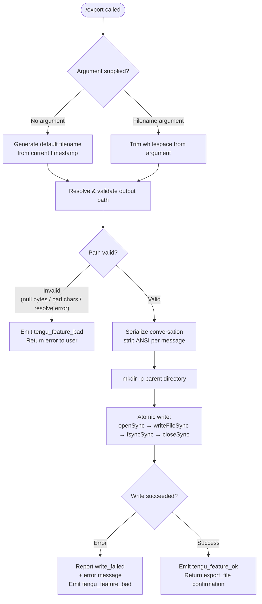

# `/export`

> Analysis basis: CC v2.1.133 bundle.js (AST extraction + Claude interpretation)
> Minimum version: v2.1.133

---

## Overview

The `/export` command serializes the current conversation to a file on disk, with an optional user-supplied filename argument. It walks the conversation message list, strips ANSI escape codes from each entry, formats a timestamp-derived default filename when none is provided, resolves and validates the target path, then writes the result atomically using a sync open/write/fsync/close sequence. Telemetry reports success or failure via `tengu_feature_ok` / `tengu_feature_bad`.

---

## Registration

| Field | Value |
|---|---|
| type | `local-jsx` |
| name | `export` |
| description | Export the current conversation to a file or clipboard |
| argumentHint | `[filename]` |
| module_id | `tOq` |
| load_inline | `true` |
| loc_byte | `11360134` |
| loc_byte_end | `11360330` |
| loc_line | `7115` |
| arbor_handler.name | `gw7` |
| arbor_handler.fqn | `claude-2.1.133::gw7` |
| arbor_handler.kind | `AsyncFunction` |
| arbor_handler.resolution_path | `module_id` |
| arbor_handler.n_hits | `0` |

Analysis basis: CC v2.1.133 bundle.js:+11360134

---

## Input Branching

Four distinct paths exist based on argument presence and path-resolution outcome, so a Mermaid flowchart is required.



Analysis basis: CC v2.1.133 bundle.js:+11359566 (handler entry `gw7`), +11359606 (path logic `fD8`), +11359695 (write-failure literal)

---

## Behavioral Spec

### 1 — Handler entry point (`gw7`)

The Arbor-resolved handler is `gw7` (AsyncFunction, resolution path: `module_id`).

```
async function exportCommandHandler(context):
    rawContent   = buildConversationText(context)        // Fw7 → MD8 → Uw7
    trimmedArg   = trim(context.argument)                // _.trim
    targetPath   = resolveExportPath(trimmedArg)         // fD8 → xw7 → c_
    if targetPath is derived from no argument:
        targetPath = buildDefaultFilename(now())         // Bw7
    targetPath   = resolveFilename(trimmedArg, context)  // aOq / sOq
    try:
        writeConversation(targetPath, rawContent)        // fD8
        reportSuccess("export_file")                     // hH → tengu_feature_ok
        return successResult(targetPath)
    catch writeError:
        reportFailure("write_failed", writeError.message ?? "Unknown error")
        // uH → tengu_feature_bad
        return errorResult
```

Analysis basis: CC v2.1.133 bundle.js:+11359566, +11359575, +11359606, +11359615, +11359678

---

### 2 — Conversation serialization (`buildConversationText` / `MD8` → `Uw7`)

```
function buildConversationText(context):
    segments = []
    for each message in conversationMessages:
        role    = message.role          // "user" | "assistant"
        content = getMessageContent(message)  // pw7: Array.isArray check
        cleaned = stripANSI(content)    // v5 → Bun.stripANSI
        header  = formatMessageHeader(role)  // mw7, CR
        segments.push(header + cleaned)
    return segments.join(separator)     // q.join
```

- Role strings observed: `"user"` (bundle.js:+11359069), `"assistant"` (bundle.js:+11357675).
- Content-type filter: only `"text"` blocks are included (bundle.js:+11359226).
- Format-type filter discriminates `"export"` vs `"prompt"` vs `"message"` content shapes (bundle.js:+11358244, +11358260, +11357760).
- ANSI stripping delegates to `Bun.stripANSI` (bundle.js:+3582221).

Analysis basis: CC v2.1.133 bundle.js:+11358540, +11358558, +11358565, +11358585

---

### 3 — Filename argument parsing (`aOq` / `sOq`)

```
function resolveFilenameFromArg(messages, rawArg):
    candidate = messages.find(role == "user")    // H.find, literal "user"
    trimmed   = trim(rawArg)                     // _.trim
    if Array.isArray(trimmed):
        match = messages.find(...)               // _.find
        content = formatContent(match)           // s7 → s9: indexOf + slice
    prefix    = trimmed.substring(0, 50)         // q.substring, limit 50 (bundle.js:+11359287)
    suffix    = trimmed[49]                      // literal 49 (bundle.js:+11359306)
    slug      = toLowercase(prefix + suffix)     // H.toLowerCase
    return slug
```

- Argument preview truncated to **50 characters** when building a slug from message content (bundle.js:+11359287, +11359306).

Analysis basis: CC v2.1.133 bundle.js:+11359048, +11359164, +11359181, +11359205, +11359272, +11359292, +11359351

---

### 4 — Default filename generation (`Bw7`)

When no argument is provided, a timestamp-based filename is constructed from the local clock:

```
function buildDefaultFilename(date):
    year    = String(date.getFullYear())
    month   = zeroPad(date.getMonth() + 1, 2)
    day     = zeroPad(date.getDate(),      2)
    hours   = zeroPad(date.getHours(),     2)
    minutes = zeroPad(date.getMinutes(),   2)
    seconds = zeroPad(date.getSeconds(),   2)
    return "claude_" + year + month + day + "_" + hours + minutes + seconds
```

Analysis basis: CC v2.1.133 bundle.js:+11358774, +11358792, +11358799, +11358840, +11358878, +11358917, +11358958

---

### 5 — Path resolution and validation (`fD8` → `xw7` → `c_`)

```
function resolveExportPath(rawPath):
    ext = path.extname(rawPath)         // KD8.extname
    if ext is empty:
        rawPath += ".md"                // default extension

    // c_: full validation sequence
    if rawPath contains null bytes:
        throw Error("Path contains null bytes")  // bundle.js:+949965
    normalized = path.normalize(rawPath, "NFC")  // bundle.js:+950047
    if normalized starts with "~/":
        normalized = os.homedir() + normalized.slice(2)  // bundle.js:+950119
    if platform == "windows":           // bundle.js:+950201
        normalized = applyWindowsNormalization(normalized)
    if path.isAbsolute(normalized):
        return path.resolve(normalized)
    else:
        return path.resolve(cwd, normalized)
```

Analysis basis: CC v2.1.133 bundle.js:+11354998, +11355038, +949712, +949758, +949965, +950021, +950047, +950072, +950106, +950132, +950154, +950201, +950261, +950325

---

### 6 — Atomic file write (`_E`)

```
function atomicWriteFile(resolvedPath, content, encoding="utf-8"):
    mkdir(dirname(resolvedPath), { recursive: true })  // nOq.mkdir, KD8.dirname
    fd = fs.openSync(resolvedPath, flags, mode)        // iHH.openSync
    try:
        fs.writeFileSync(fd, content, { encoding, flush: true })  // iHH.writeFileSync
        fs.fsyncSync(fd)                               // iHH.fsyncSync
    finally:
        fs.closeSync(fd)                               // iHH.closeSync
```

- Encoding: **`"utf-8"`** (bundle.js:+11355152).
- The `flush` option is passed as `true` (bundle.js:+143912).
- `mode` and `encoding` option keys are present at bundle.js:+144022, +143966.

Analysis basis: CC v2.1.133 bundle.js:+11355094, +11355104, +11355135, +144055, +144077, +144121, +144160

---

### 7 — Telemetry reporting (`hH` / `uH`)

```
function reportSuccess(featureName):
    emit("tengu_feature_ok", { feature: featureName })  // hH → d

function reportFailure(featureName, errorMessage):
    emit("tengu_feature_bad", { feature: featureName, error: errorMessage })  // uH → d
```

- Success event emitted with label `"export_file"` (bundle.js:+11359618).
- Failure event emitted with label `"write_failed"` (bundle.js:+11359695).
- Fallback error message string: `"Unknown error"` (bundle.js:+11359776).

Analysis basis: CC v2.1.133 bundle.js:+11359615, +11359633, +11359678, +907379, +907435

---

### 8 — Session/stream guard (`CR`)

Before serialization, the handler checks session and plan-mode state:

```
function checkSessionEligibility(session):
    if session.isTeammate():             // CR → H.isTeammate
        return eligible according to role policy
    if session.isPlanModeRequired():     // CR → H.isPlanModeRequired
        modeKey = "plan" | "default"     // literals bundle.js:+6565385, +6565392
    connectionState = session.state      // "none" | "connecting" | ...
    // bundle.js:+6565633, +6565862
    // delegates to: r5, A_, mA, GW, JFH, l3H, S68, $FH
```

Analysis basis: CC v2.1.133 bundle.js:+11357931, +11357946, +6565330, +6565335, +6565346, +6565362

---

## State & Side Effects

| Item | Detail |
|---|---|
| Telemetry: success | `tengu_feature_ok` with feature label `"export_file"` (bundle.js:+907381) |
| Telemetry: failure | `tengu_feature_bad` with feature label `"write_failed"` (bundle.js:+907437) |
| Filesystem: directory creation | `mkdir -p` on parent directory of resolved path before write (bundle.js:+11355094) |
| Filesystem: file write | Atomic open → write → fsync → close; utf-8, flush=true (bundle.js:+11355135) |
| Hook registration | Event listener registered via `L.on("data", …)` inside `kgH` (bundle.js:+7371907) |
| ANSI stripping | `Bun.stripANSI` applied to every message content block before serialization (bundle.js:+3582221) |
| appState changes | No direct appState mutations observed at depth ≤ 2 |
| Sound | None observed at depth ≤ 2 |
| Background session | `"background session"` string present in call graph (bundle.js:+14191243); `"stopped"` state check also present (bundle.js:+14191200) — suggests session must not be stopped |
| Temp file cleanup | `Ydq.unlinkSync` reachable via `q` → `f` path (bundle.js:+14137065); may clean up a temp file on error |

---

## Version History

| Version | Change |
|---|---|
| v2.1.133 | Initial analysis |

---

## Common Mistakes

1. **Omitting the filename argument and expecting a clipboard copy** — the description mentions "or clipboard" but the call graph leads entirely to file-write operations (`openSync`, `writeFileSync`, `fsyncSync`). Clipboard behaviour is <!-- TODO: not found in depth-2 traversal; needs --depth 4 -->.
2. **Providing a filename without an extension** — the path resolver (`xw7`) appends `.md` automatically when `path.extname` returns an empty string. Explicitly supplying a different extension (e.g. `.txt`) overrides this default.
3. **Using paths with null bytes** — validation in `c_` throws immediately with `"Path contains null bytes"` before any I/O occurs (bundle.js:+949965).
4. **Assuming `~/` expansion is universal** — tilde expansion is handled explicitly only for the `~/` prefix; other shell-style expansions (e.g. `~user/`) are not supported by the path resolver.
5. **Running `/export` in a stopped or background session** — the session-eligibility guard (`CR`) checks for `"stopped"` state and `"background session"` conditions; exporting from a non-active session may be rejected before serialization begins.
6. **Expecting the full conversation including tool results** — only `"text"`-typed content blocks are included in the serialized output (bundle.js:+11359226); tool use, tool result, and other non-text content shapes are filtered out.

---

## Appendix — Identifier Mapping

> For bundle debugging only. Identifiers change across versions.

| Identifier | Role |
|---|---|
| `gw7` | Main async export handler (Arbor-resolved, `claude-2.1.133::gw7`) |
| `Fw7` | Intermediate caller: routes to conversation builder (`MD8`) |
| `MD8` | Conversation text builder: iterates messages, joins segments |
| `Uw7` | Per-message formatter: applies role header, content extraction, ANSI strip |
| `mw7` | Message role header formatter (assistant path) |
| `CR` | Session eligibility / plan-mode guard |
| `kgH` | Data event listener registrar (`L.on("data", …)`) |
| `pw7` | Content-type array normalizer (`Array.isArray` branch) |
| `v5` | ANSI strip wrapper (`Bun.stripANSI`) |
| `O` | Background/stopped session state accessor (`d8`) |
| `fD8` | File write orchestrator: mkdir + path resolve + atomic write |
| `xw7` | Extension checker and filename normalizer (`KD8.extname`) |
| `c_` | Full path validation and resolution (null-byte check, tilde expand, normalize, resolve) |
| `N6` | Sub-path helper used by `c_` |
| `F6` | Additional path helper used by `c_` |
| `_E` | Atomic file write implementation (openSync / writeFileSync / fsyncSync / closeSync) |
| `hH` | Success telemetry emitter (`tengu_feature_ok`) |
| `uH` | Failure telemetry emitter (`tengu_feature_bad`) |
| `d` | Core telemetry dispatch function |
| `Bw7` | Default timestamp filename builder (getFullYear / getMonth / … / getSeconds) |
| `aOq` | Filename slug builder from first user message content |
| `sOq` | Argument lowercaser (`H.toLowerCase`) |
| `s7` | Content substring helper (delegates to `s9`) |
| `s9` | Low-level substring via `indexOf` + `slice` |
| `_` | String/array utility module (trim, find, toLowerCase, includes) |
| `f` | Stream/file handle abstraction (close, finally) |
| `q` | Mutable collection used during serialization (push, join, delete, substring) |
| `K` | Set-based in-flight tracker (add, delete, finally) |

---

Note: index built via Arbor fallback; some signals (telemetry, literals) may be missing — see arbor-fallback.js.