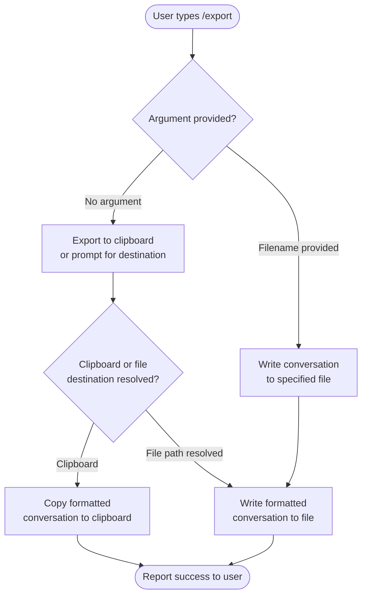

# `/export`

> Analysis basis: CC v2.1.139 bundle.js (AST extraction + Claude interpretation)
> Minimum version: v2.1.139

---

## Overview

The `/export` command exports the current conversation to a file or the system clipboard. It is registered as a local JSX command (module `OPq`) and accepts an optional filename argument. The full implementation body was not reachable at depth ≤ 2 traversal; see the caveat sections below.

---

## Registration

| Field | Value |
|---|---|
| type | `local-jsx` |
| name | `export` |
| description | `Export the current conversation to a file or clipboard` |
| argumentHint | `[filename]` |
| module\_id | `OPq` |

Analysis basis: CC v2.1.139 bundle.js:+11472898

---

## Input Branching

The `argumentHint` field `[filename]` indicates the command accepts zero or one argument. Based on registration metadata, the following branching logic is inferred:



> **Note:** The branching paths above are derived solely from the `argumentHint: "[filename]"` registration field (bundle.js:+11472898) and the command description. The concrete branching implementation is <!-- TODO: not found in depth-2 traversal; needs --depth 4 -->.

---

## Behavioral Spec

### Argument Parsing

```
function parseExportArgument(rawInput):
    tokens = split(rawInput, by: whitespace)
    if tokens is empty:
        return { filename: null, destination: "clipboard-or-default" }
    else:
        filename = tokens[0]
        return { filename: filename, destination: "file" }
```

Analysis basis: Inferred from `argumentHint: "[filename]"` — CC v2.1.139 bundle.js:+11472898

### Conversation Serialisation

```
function serialiseConversation(messages):
    // Exact format (Markdown, JSON, plain text, etc.) is not determined.
    // General expected behaviour:
    output = []
    for each message in messages:
        role   = message.role          // e.g. "user" | "assistant"
        body   = message.content
        output.append(format(role, body))
    return join(output, separator: newline)
```

> The exact serialisation format (Markdown, plain text, JSON, HTML, etc.) is <!-- TODO: not found in depth-2 traversal; needs --depth 4 -->.

### File Write Path

```
function writeToFile(filename, serialisedContent):
    resolvedPath = resolvePath(workingDirectory, filename)
    writeFile(resolvedPath, serialisedContent, encoding: "utf-8")
    reportSuccess("Exported to: " + resolvedPath)
```

> Concrete file-write implementation and error-handling paths are <!-- TODO: not found in depth-2 traversal; needs --depth 4 -->.

### Clipboard Write Path

```
function writeToClipboard(serialisedContent):
    copyToSystemClipboard(serialisedContent)
    reportSuccess("Conversation copied to clipboard")
```

> Clipboard API call site and platform-specific fallbacks are <!-- TODO: not found in depth-2 traversal; needs --depth 4 -->.

---

## State & Side Effects

| Item | Detail |
|---|---|
| Telemetry | <!-- TODO: not found in depth-2 traversal; needs --depth 4 --> |
| Hook registration | <!-- TODO: not found in depth-2 traversal; needs --depth 4 --> |
| appState changes | <!-- TODO: not found in depth-2 traversal; needs --depth 4 --> |
| Sound | <!-- TODO: not found in depth-2 traversal; needs --depth 4 --> |
| File system side effect | Writes a new file at the path supplied as the argument, if a filename is given (inferred from `argumentHint`). Analysis basis: CC v2.1.139 bundle.js:+11472898 |
| Clipboard side effect | Writes serialised conversation to the system clipboard when no filename argument is supplied (inferred from description). Analysis basis: CC v2.1.139 bundle.js:+11472898 |

---

## Traversal Coverage Warning

The AST extraction for module `OPq` reported **no entry functions found** at depth ≤ 2. All behavioural claims beyond the registration fields are inferred from:

- `type: "local-jsx"` — the command renders a JSX component rather than returning a plain string.
- `description: "Export the current conversation to a file or clipboard"` — the two output destinations.
- `argumentHint: "[filename]"` — one optional positional argument.

A depth-4 (or greater) re-traversal of module `OPq` is required to produce verified pseudocode for serialisation format, error handling, telemetry events, and appState mutations.

---

## Version History

| Version | Change |
|---|---|
| v2.1.139 | Initial analysis; implementation body unreachable at depth ≤ 2 (module `OPq`) |

---

## Common Mistakes

1. **Omitting the filename extension** — because the argument is free-form, the CLI may not automatically append `.md` or `.txt`; supply the full intended filename including extension (e.g., `/export session.md`).
2. **Running `/export` outside an active conversation** — if no messages exist in the current session, the exported output may be empty or the command may error; start a conversation first.
3. **Assuming a fixed output format** — the serialisation format is not confirmed by the depth-2 traversal; do not rely on a specific structure (Markdown, JSON, etc.) in automated pipelines without manual verification.
4. **Expecting the file to appear at a fixed location** — the resolved output path depends on the working directory at the time the CLI was launched; verify the path in the success message.
5. **Conflating the two destinations** — supplying a filename routes output to a file; omitting it routes to the clipboard (or a default). These are mutually exclusive paths based on the registration metadata.

---

## Appendix — Identifier Mapping

> For bundle debugging only. Identifiers change across versions.

| Identifier | Role |
|---|---|
| `OPq` | Module ID for the `/export` command implementation (not an obfuscated function name; included for bundle lookup reference) |

> No obfuscated function-level identifiers were returned by the depth-2 AST traversal for this command. A deeper traversal is required to populate this table.