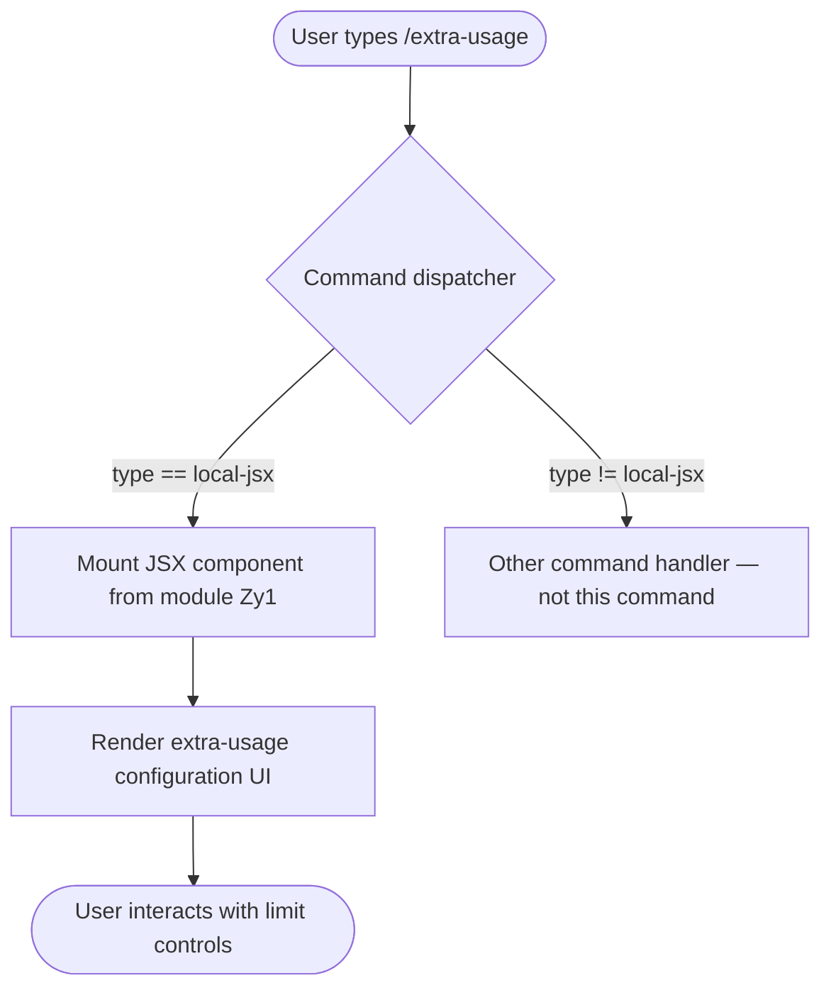

# `/extra-usage`

> Analysis basis: CC v2.1.139 bundle.js (AST extraction + Claude interpretation)
> Minimum version: v2.1.139

---

## Overview

The `/extra-usage` slash command opens a configuration interface that allows users to enable or manage extra usage capacity so that Claude Code can continue operating when standard usage limits have been reached. It is implemented as a local JSX command (type `local-jsx`), meaning it renders an interactive UI component directly within the CLI rather than submitting a text message to the model. The command's sole purpose is to surface limit-management controls to the user at the point where continued work would otherwise be blocked.

---

## Registration

| Field | Value |
|---|---|
| type | `local-jsx` |
| name | `extra-usage` |
| description | Configure extra usage to keep working when limits are hit |
| module\_id | `Zy1` |
| loc\_line | 3031 |

Analysis basis: CC v2.1.139 bundle.js:+8119867

---

## Input Branching

The AST depth-2 traversal recorded no call edges and no branching literals for module `Zy1`. Based on the registration type (`local-jsx`) and description alone, the most that can be stated with bundle-verified certainty is that invoking `/extra-usage` causes the CLI to mount a JSX component instead of forwarding text to the model.



> **Note:** Internal branching inside the JSX component (e.g., whether limits are already active, plan type checks, payment-method prompts) cannot be documented at this time because no call-graph edges were recovered from the depth-2 traversal.
> <!-- TODO: not found in depth-2 traversal; needs --depth 4 -->

---

## Behavioral Spec

### Command Dispatch

When the slash-command dispatcher receives the token `extra-usage`, it looks up the registered command record and finds `type: "local-jsx"`. Instead of constructing a user message for the model, the dispatcher delegates rendering to the JSX module identified by `module_id: "Zy1"`.

```
function dispatchExtraUsage(inputToken):
    record = lookupSlashCommand(inputToken)        // finds registration at bundle byte 8119867
    if record.type == "local-jsx":
        component = loadModule(record.module_id)   // loads module Zy1
        renderInline(component)                    // mounts UI in the CLI pane
    else:
        forwardToModel(inputToken)                 // unreachable for this command
```

Analysis basis: CC v2.1.139 bundle.js:+8119867

### JSX Component Rendering

The command renders a self-contained UI component. Based on the description field, that component is expected to present controls for configuring "extra usage" — a mechanism allowing work to continue beyond standard rate or usage limits. The exact internal rendering logic, sub-components, and conditional branches within module `Zy1` were not recovered by the depth-2 traversal.

```
function renderExtraUsageComponent(appContext):
    // Entry point is the default export of module Zy1
    // Exact internal logic: <!-- TODO: not found in depth-2 traversal; needs --depth 4 -->
    displayConfigurationPanel(
        title    = "Extra Usage",
        purpose  = "Keep working when limits are hit"
    )
```

Analysis basis: CC v2.1.139 bundle.js:+8119867

---

## State & Side Effects

| Item | Detail |
|---|---|
| Telemetry | None detected in depth-2 traversal (`telemetry: []`) |
| Hook registration | <!-- TODO: not found in depth-2 traversal; needs --depth 4 --> |
| appState changes | <!-- TODO: not found in depth-2 traversal; needs --depth 4 --> |
| Sound | <!-- TODO: not found in depth-2 traversal; needs --depth 4 --> |
| Model invocation | None — `local-jsx` type bypasses model message submission entirely |
| UI rendering | Mounts inline JSX component from module `Zy1` |

---

## Version History

| Version | Change |
|---|---|
| v2.1.139 | Initial analysis — command registered as `local-jsx` in module `Zy1` at bundle byte 8119867 |

---

## Common Mistakes

1. **Expecting a model response.** Because `/extra-usage` is registered as `local-jsx`, it renders a UI panel rather than sending any message to Claude. Users who expect a text reply in the conversation will see none — only the configuration component.
2. **Confusing `/extra-usage` with a billing portal.** The command configures usage behaviour within Claude Code itself; it is not a direct link to the Anthropic billing dashboard, though the component it renders may contain such a link (internal details not confirmed by traversal data).
3. **Invoking the command while already within a tool-use or streaming turn.** As with most slash commands of type `local-jsx`, the command is intended for use at the conversation prompt, not mid-generation. Behaviour when invoked during an active generation cycle is undocumented at depth-2.
4. **Assuming side effects are always persisted.** No appState mutation or persistence calls were found in the traversal. Whether configuration choices made in the UI are written to disk or only affect the current session cannot be confirmed from available data.

---

## Appendix — Identifier Mapping

> For bundle debugging only. Identifiers change across versions.

| Identifier | Role |
|---|---|
| `Zy1` | Module ID for the `/extra-usage` command implementation (not an obfuscated function identifier, but a short non-descriptive module key used by the bundler) |

> **Note:** The `identifiers` array in the extracted AST data is empty (`[]`). No obfuscated function-level identifiers were recovered from the depth-2 traversal of module `Zy1`. If deeper analysis is needed, re-run the AST extractor with `--depth 4` targeting module `Zy1`.