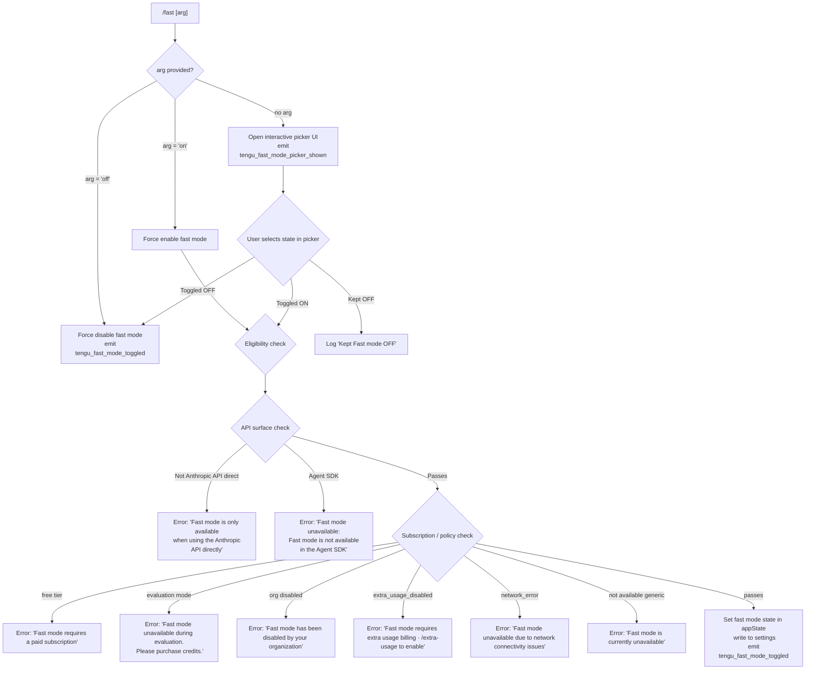

# `/fast`

> Analysis basis: CC v2.1.139 bundle.js (AST extraction + Claude interpretation)
> Minimum version: v2.1.139

---

## Overview

`/fast` toggles **Fast mode** — a research-preview capability that switches the active model to a higher-throughput, lower-latency configuration (backed by an Opus-class model when available). The command accepts an optional `on|off` argument; when omitted it opens an interactive picker UI that lets the user select the desired state. Availability is gated by a multi-step eligibility check that inspects the current API surface, subscription tier, organizational policy, and network reachability.

---

## Registration

| Field | Value |
|---|---|
| type | `local-jsx` |
| name | `fast` |
| description | `Toggle fast mode ( ... only)` |
| argumentHint | `[on\|off]` |
| immediate | `null` |
| thinClientDispatch | `control-request` |
| isHidden | `null` |
| module_id | `bDq` |
| load_inline | `true` |
| loc_byte | `11238047` |
| loc_byte_end | `11238324` |
| loc_line | `6905` |
| arbor_handler.name | `V27` |
| arbor_handler.fqn | `claude-2.1.139::V27` |
| arbor_handler.kind | `AsyncFunction` |
| arbor_handler.resolution_path | `module_id` |
| arbor_handler.n_hits | `3` |

Analysis basis: CC v2.1.139 bundle.js:+11238047

---

## Input Branching

The command has 4+ distinct branches based on the argument value and eligibility state.



---

## Behavioral Spec

### Main Handler (`V27`)

`V27` is an `AsyncFunction` resolved via `module_id → bDq`. It is the primary entry point invoked when the user types `/fast [arg]`.

Analysis basis: CC v2.1.139 bundle.js:+11237093

```
async function fastCommandHandler(context, args):
    arg = args.trim().toLowerCase()           // e.g. "on", "off", or ""

    // 1. Determine intent
    if arg == "off":
        intent = DISABLE
    else if arg == "on":
        intent = ENABLE
    else:
        intent = SHOW_PICKER                  // no argument → interactive UI

    // 2. Run availability prefetch (non-blocking, uses in-flight promise cache)
    startFastModePrefetch(context)            // calls prefetchHandler (IbH)

    // 3. Branch on intent
    if intent == SHOW_PICKER:
        emitTelemetry("tengu_fast_mode_picker_shown")
        result = await showFastModePicker(context)   // renders JSX picker (bw8 / Cw8)
        if result == KEEP_OFF:
            log("Kept Fast mode OFF")
            return
        intent = result                        // picker resolves to ENABLE or DISABLE

    if intent == DISABLE:
        applyFastModeState(false, context)
        emitTelemetry("tengu_fast_mode_toggled", { enabled: false })
        return

    // 4. ENABLE path: eligibility gate
    eligibility = await checkFastModeEligibility(context)   // calls wo / eq
    if not eligibility.available:
        displayError(eligibility.reason)      // one of the literal error strings below
        emitTelemetry("tengu_penguins_off")
        return

    applyFastModeState(true, context)
    emitTelemetry("tengu_fast_mode_toggled", { enabled: true })
```

Analysis basis: CC v2.1.139 bundle.js:+11237093 – +11237314

---

### Eligibility Check (`wo` / `eq`)

Performs a sequential gate sequence to determine whether Fast mode is currently usable.

Analysis basis: CC v2.1.139 bundle.js:+2127093 – +2127703

```
function checkFastModeEligibility(context):
    apiSurface = getApiSurface(context)      // inspects provider string via WA/SH

    // Gate 1: API surface
    if apiSurface not in ["firstParty", direct Anthropic]:
        return { available: false,
                 reason: "Fast mode is only available when using the Anthropic API directly" }
                 // literal at bundle.js:+2127134

    // Agent SDK check
    if runningInAgentSDK(context):
        return { available: false,
                 reason: "Fast mode is not available in the Agent SDK" }
                 // literal at bundle.js:+2127456

    // Gate 2: subscription / org policy  (string constants from eq / SH chain)
    tier = getSubscriptionTier(context)
    if tier == "free":
        return { available: false,
                 reason: "Fast mode requires a paid subscription" }
                 // literal at bundle.js:+2126656

    if tier == "evaluation":
        return { available: false,
                 reason: "Fast mode unavailable during evaluation. Please purchase credits." }
                 // literal at bundle.js:+2126697

    orgPolicy = getOrgPolicy(context)
    if orgPolicy.fastModeDisabled == "preference":
        return { available: false,
                 reason: "Fast mode has been disabled by your organization" }
                 // literal at bundle.js:+2126788

    if orgPolicy.extraUsageDisabled == "extra_usage_disabled":
        return { available: false,
                 reason: "Fast mode requires extra usage billing · /extra-usage to enable" }
                 // literal at bundle.js:+2126872

    // Gate 3: network
    authType = getAuthType(context)          // "oauth" or "api-key"  (literals at +2127683/+2127691)
    networkState = getNetworkState(context)
    if networkState == "network_error":
        return { available: false,
                 reason: "Fast mode unavailable due to network connectivity issues" }
                 // literal at bundle.js:+2126967

    if fastModeUnavailableGeneric(context):
        return { available: false,
                 reason: "Fast mode is currently unavailable" }
                 // literal at bundle.js:+2127046

    return { available: true }
```

---

### Fast Mode Prefetch (`IbH`)

A background pre-fetch that contacts the Anthropic API to warm the Fast mode eligibility cache before the user acts on the result.

Analysis basis: CC v2.1.139 bundle.js:+2130679 – +2131812

```
async function prefetchFastMode(context):
    // Return in-flight promise if one exists (deduplication)
    if inFlightPrefetchPromise != null:
        log("Fast mode prefetch in progress, returning in-flight promise")
        // literal at bundle.js:+2130762
        return inFlightPrefetchPromise

    // Skip if fetched recently
    lastFetchTime = getLastFetchTimestamp()
    if (Date.now() - lastFetchTime) < PREFETCH_COOLDOWN:
        log("Skipping fast mode prefetch, fetched recently")
        // literal at bundle.js:+2131009
        return

    // Auth guard
    auth = getAuthCredentials(context)       // via _KL → GA
    if auth == null:
        log("No auth available")             // literal at bundle.js:+2131185
        return

    try:
        response = await callFastModeStatusEndpoint(auth)  // via Rj → w$ chain
        storeFastModeStatus(response)
        saveSettingsIfChanged()              // via H8 → c8_ / d8_
        emitEvent("Zl8.emit", response)
    except HTTP_401:
        handleOAuthRecovery(context)         // via Fd → bWL chain
    except HTTP_403:
        handleForbidden(context)
    except:
        emitTelemetry("tengu_org_penguin_mode_fetch_failed")
        // literal event at bundle.js:+2132181
```

---

### Interactive Picker UI (`bw8` / `Cw8`)

Renders a JSX-based interactive model/mode picker when the user invokes `/fast` without arguments.

Analysis basis: CC v2.1.139 bundle.js:+11233538 – +11234896

```
function renderFastModePicker(context):
    // Reads current fast mode state from appState (D6 / Hq_ / useSyncExternalStore)
    currentFastMode = appState.fastMode

    // Renders a picker component (bw8) that presents:
    //   - " Fast mode (research preview)"  (literal at bundle.js:+11235356)
    //   - Toggle row: "Fast mode"  ON / OFF  (literals at +11236063, +11236132, +11236138)
    //   - Status indicators:
    //       "overloaded" → "Fast mode overloaded and is temporarily unavailable" (+11236304)
    //       rate-limited → "You've hit your fast limit · resets in <time>" (+11236358/+11236387)
    //   - Keyboard bindings:
    //       escape → "cancel"
    //       tab    → "toggle"
    //       enter  → "confirm"

    // Model display names shown in picker:
    //   "Opus 4.7"  (literal at bundle.js:+2127875)
    //   "Opus 4.6"  (literal at bundle.js:+2127886)
    //   model string "claude-opus-4-6"  (+2127931)

    // Documentation link rendered:
    //   "https://code.claude.com/docs/en/fast-mode"  (literal at +11236578)

    result = await picker.waitForSelection()

    if result == "Fast mode OFF" or result == "Kept Fast mode OFF":
        return KEEP_OFF
    return USER_SELECTION
```

---

### Fast Mode Cooldown Monitoring (`El8`)

A background timer watches for Fast mode cooldown expiry and re-enables the mode automatically.

Analysis basis: CC v2.1.139 bundle.js:+2128270 – +2128383

```
function watchFastModeCooldown(context):
    if appState.fastModeStatus == "cooldown":
        scheduleCheck(Date.now(), () =>
            log("Fast mode cooldown expired, re-enabling fast mode")
            // literal at bundle.js:+2128323
            applyFastModeState(true, context)
            emitEvent("grA.emit", { status: "active" })
            // "active" literal at +2128728
        )
```

---

### Settings Persistence (`Cw8` → `Rw8` → flag application)

After the user confirms a toggle, the new fast mode preference is written to settings.

Analysis basis: CC v2.1.139 bundle.js:+11233252 – +11233411

```
function applyFastModeToSettings(enabled, context):
    // Uses flag settings path ("apply_flag_settings" literal at bundle.js:+11233291)
    // Writes "fastMode" key (literal at +11232969) to the appropriate settings layer
    // Settings layers resolved via k_ → wf → Zd chain:
    //   - userSettings   (literal at +1177344)
    //   - projectSettings (literal at +1177408)
    //   - localSettings   (literal at +1177430)
    writeToSettingsLayer("fastMode", enabled)
    // Model field also updated: "model" key (literal at +11233052)
```

---

## State & Side Effects

| Item | Detail |
|---|---|
| Telemetry: `tengu_fast_mode_toggled` | Fired on every confirmed toggle (on or off). Analysis basis: bundle.js:+11233623 |
| Telemetry: `tengu_fast_mode_picker_shown` | Fired when the interactive picker UI is displayed (no-arg invocation). Analysis basis: bundle.js:+11237316 |
| Telemetry: `tengu_penguins_off` | Fired when eligibility check fails and fast mode is denied. Analysis basis: bundle.js:+2127240 |
| Telemetry: `tengu_org_penguin_mode_fetch_failed` | Fired when the background prefetch API call fails. Analysis basis: bundle.js:+2132181 |
| Telemetry: `tengu_config_lock_contention` | Fired when settings-file lock acquisition takes longer than expected. Analysis basis: bundle.js:+3132840 |
| Telemetry: `tengu_config_stale_write` | Fired when a stale settings write is detected. Analysis basis: bundle.js:+3132976 |
| Telemetry: `tengu_config_auth_loss_prevented` | Fired when a write that would erase auth credentials is blocked. Analysis basis: bundle.js:+3133319 |
| Telemetry: `tengu_oauth_401_sdk_callback_refreshed` | Fired when OAuth 401 recovery succeeds via SDK callback. Analysis basis: bundle.js:+2901114 |
| Telemetry: `tengu_oauth_401_recovered_from_disk` | Fired when OAuth 401 recovery succeeds from disk token. Analysis basis: bundle.js:+2901809 |
| Telemetry: `tengu_oauth_401_recovered_from_keychain` | Fired when OAuth 401 recovery succeeds from keychain. Analysis basis: bundle.js:+2902162 |
| Telemetry: `tengu_feature_ok` / `tengu_feature_bad` | Fired by the feature-flag check sub-path. Analysis basis: bundle.js:+943635, +943693 |
| Telemetry: `tengu_config_parse_error` | Fired on config JSON parse failure in settings layer. Analysis basis: bundle.js:+3135421 |
| appState changes | `fastMode` boolean field toggled; `model` field may be updated to `claude-opus-4-6`; status field transitions among `active`, `cooldown`, `overloaded`. |
| Settings write | `fastMode` and `model` keys written to the resolved settings layer (user / project / local) via locked file I/O. |
| Background prefetch | Fires an async HTTP request to the Anthropic API on command entry to warm eligibility cache. Deduplicated via in-flight promise. |
| Cooldown monitor | `El8` schedules a timer that fires when fast-mode cooldown expires, automatically re-enabling the mode. |
| Sound | <!-- TODO: not found in depth-2 traversal; needs --depth 4 --> |
| thinClientDispatch | `control-request` — the command is dispatched as a control request in thin-client mode. |

---

## Version History

| Version | Change |
|---|---|
| v2.1.139 | Initial analysis. Fast mode (research preview) with interactive picker, multi-gate eligibility, background prefetch, and cooldown monitoring. |

---

## Common Mistakes

1. **Invoking `/fast on` on a non-Anthropic API surface** (e.g., AWS Bedrock, Vertex, Foundry): the command will immediately reject with "Fast mode is only available when using the Anthropic API directly" (bundle.js:+2127134). Fast mode is gated to `firstParty` / direct Anthropic API only.
2. **Expecting instant availability on a free-tier account**: The eligibility check blocks fast mode for `free` tier accounts with the message "Fast mode requires a paid subscription" (bundle.js:+2126656). A paid subscription is required.
3. **Using `/fast` inside an Agent SDK session**: Fast mode is explicitly disallowed in the Agent SDK context; the error "Fast mode is not available in the Agent SDK" is returned (bundle.js:+2127456).
4. **Expecting `/fast off` to affect a rate-limited state**: The "overloaded" and rate-limit states are server-side; disabling locally does not clear them. The picker UI shows the reset countdown ("resets in …", literal at bundle.js:+11236387) but the cooldown is server-enforced.
5. **Assuming the setting is immediate**: The command performs a background prefetch (`IbH`) before or concurrently with showing the picker. If the prefetch is already in-flight, the command reuses the existing promise rather than issuing a new request (bundle.js:+2130762).

---

## Appendix — Identifier Mapping

> For bundle debugging only. Identifiers change across versions.

| Identifier | Role |
|---|---|
| `V27` | Main async handler for `/fast` command (arbor_handler) |
| `eq` | Fast mode eligibility / state query function |
| `WA` | API surface / provider resolver |
| `SH` | String utility / provider string normalizer |
| `wo` | Eligibility gate chain orchestrator |
| `j6` | Feature-flag / experiment evaluation helper |
| `L46` | Feature-flag sub-resolver A |
| `M46` | Feature-flag sub-resolver B |
| `Ya` | Experiment value reader |
| `Da` | Experiment data accessor |
| `Ql6` | GrowthBook experiment evaluator |
| `G8_` | GrowthBook experiment event emitter |
| `k8_` | GrowthBook result processor |
| `b6` | Config file read/write orchestrator |
| `B6` | Config path resolver |
| `U8_` | Config schema validator |
| `cfH` | Config file I/O handler (read/write/backup) |
| `pVL` | Config file watcher |
| `N` | Logging / debug output utility |
| `y9K` | Log level resolver |
| `Xo_` | Log transport selector |
| `yH` | JSON serializer for logging |
| `LM` | Log message formatter |
| `os_` | Log entry builder |
| `QyH` | Log write dispatcher |
| `ms_` | Raw log writer |
| `R9K` | Transcript / log file writer |
| `JyH` | Buffered write scheduler |
| `n6H` | Log path resolver |
| `IV8` | File error classifier |
| `qt_` | Transcript path builder |
| `At_` | Log file rotation handler |
| `S9K` | Log directory + file appender |
| `C9` | Active-write tracker (set operations) |
| `T_` | Terminal/UI context |
| `ptH` | VS Code integration guard (`claude-vscode` literal) |
| `nI` | Network interface checker |
| `v8` | Settings store accessor |
| `VS6` | Settings cache resolver |
| `nr_` | Settings LRU cache lookup |
| `Ix8` | Settings object builder (policy + flag layers) |
| `ir_` | Settings LRU cache setter |
| `Gl8` | App-state getter helper |
| `tqL` | Thin-client dispatch helper |
| `IbH` | Fast mode background prefetch handler |
| `S1` | HTTP client builder |
| `G7A` | Anthropic base-URL resolver |
| `Rj` | API request dispatcher |
| `w$` | Low-level HTTP request constructor |
| `fL` | Response parser |
| `sx` | Streaming response handler |
| `LH_` | Request header builder |
| `yZ` | Auth header injector |
| `Ed8` | File-descriptor token reader |
| `AR` | API-key slicer/trimmer |
| `cT` | Request retry wrapper |
| `_KL` | Access-token extractor |
| `GA` | OAuth endpoint resolver |
| `$4A` | OAuth URL builder helper |
| `V0K` | Environment variable reader |
| `q` | File system sync utility |
| `Fd` | In-flight request map manager |
| `bWL` | OAuth 401 recovery orchestrator |
| `F2H` | OAuth token refresher |
| `wL6` | OAuth refresh response handler |
| `ytH` | Token expiry checker |
| `kH` | Feature-flag check (ok path) |
| `xH` | Feature-flag check (bad path) |
| `Do` | File-descriptor OAuth token reader |
| `QK` | Feature gate checker |
| `S6H` | OAuth disk-token loader |
| `LH` | HTTP response logger |
| `D7` | OAuth error classifier |
| `k_` | Settings load-from-disk orchestrator |
| `wf` | Settings file path resolver |
| `Zd` | Settings directory walker |
| `wIK` | Settings parse helper |
| `ak` | `.claude` directory path builder |
| `YIK` | Managed-settings path resolver |
| `Kr` | Settings merge/override applier |
| `LG` | Settings layer combiner |
| `ZU` | Raw settings file reader |
| `D8` | File-write error handler |
| `w8` | File-system error code classifier |
| `Sb8` | Settings cache timestamp recorder |
| `dSH` | Atomic file writer (temp + rename) |
| `DD` | Settings cache invalidator |
| `Sh6` | Global config file manager |
| `C6` | Git ignore checker |
| `jb8` | Git subprocess runner |
| `Gb8` | Git binary locator |
| `kZK` | User home config path resolver |
| `Ix` | Settings load telemetry wrapper |
| `NS` | Settings load span opener |
| `P1` | Memory-usage sampler |
| `vx8` | Settings load telemetry emitter |
| `nE6` | Settings load span closer |
| `H8` | Global config saver (main) |
| `c8_` | Global config save with lock |
| `ioA` | Config merge utility |
| `w46` | Config auth presence checker |
| `l8_` | Config backup path builder |
| `suH` | Config dirty-field detector |
| `E09` | Config entry enumerator |
| `tuH` | Config lock timer |
| `d8_` | Project config saver |
| `Cw8` | Fast mode toggle/commit handler |
| `Rw8` | Flag-settings applicator |
| `h5H` | Flag-settings schema parser |
| `LN` | CCR (remote config) flag loader |
| `G3` | CCR flag resolver |
| `VbH` | Model picker data builder |
| `Bd` | Model name builder |
| `xj` | Model picker option renderer |
| `RKH` | Flag-settings value coercer |
| `SD` | Flag-settings write dispatcher |
| `dP` | Flag-settings field setter |
| `Kq` | Model alias resolver (`opusplan`, `sonnet`, `haiku`, `best`) |
| `dYH` | Theme/color state reader |
| `Ea` | Theme resolver |
| `I46` | Theme mode selector |
| `kn6` | Theme name validator |
| `ifH` | Theme prefix stripper |
| `JT9` | Theme fallback resolver |
| `q7` | Model availability checker |
| `mT` | Active-model set manager |
| `fA` | ANSI foreground color resolver |
| `qMH` | ANSI color-code mapper |
| `kB` | Color fallback handler |
| `yv` | Picker border renderer |
| `lT` | Number formatter (time display) |
| `trA` | Integer/decimal formatter |
| `zXH` | Fast mode state reader (from eligibility) |
| `bw8` | Fast mode picker UI component (JSX) |
| `D6` | App-state store subscriber |
| `Hq_` | App-state context reader |
| `Q_` | App-state context accessor variant |
| `El8` | Fast mode cooldown monitor |
| `NXq` | Daemon status file writer |
| `Eo` | Conversation message trimmer |
| `b5H` | Message content extractor |
| `RD` | Atomic file write helper (async) |
| `fW6` | Daemon status path builder |
| `d_` | MCP handler registration component |
| `RG` | MCP context reader |
| `M` | MCP server manager |
| `WIH` | MCP server connection orchestrator |
| `Le` | MCP tool descriptor builder |
| `aV` | MCP tool schema validator |
| `M_` | MCP tool name normalizer |
| `NP6` | MCP server list filter |
| `Q_7` | MCP connection state recorder |
| `vL8` | MCP transport factory |
| `A8` | MCP debug logger |
| `Kk_` | MCP OAuth tool injector |
| `Lk_` | MCP OAuth callback handler |
| `oa1` | MCP session file persister |
| `Ak_` | MCP tool call dispatcher |
| `B2_` | MCP server include-list checker |
| `O7` | MCP error logger |
| `IH` | Generic string coercer |
| `la1` | MCP server name resolver |
| `kP6` | MCP port parser A |
| `Nk_` | MCP port parser B |
| `Niq` | MCP update applicator |
| `vO8` | MCP update serializer |
| `WI` | MCP client cleanup runner |
| `Wa7` | MCP global server reconciler |
| `kL8` | MCP server allowlist checker |
| `o8` | MCP connection timeout manager |
| `DiH` | MCP debug state serializer |
| `r1` | Human-readable duration formatter (days/hours/minutes/seconds) |