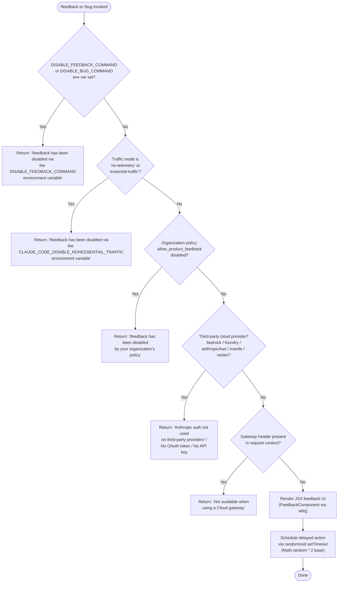

# `/feedback`

> Analysis basis: CC v2.1.139 bundle.js (AST extraction + Claude interpretation)
> Minimum version: v2.1.139

---

## Overview

The `/feedback` command (also aliased as `/bug`) allows users to submit feedback or bug reports about Claude Code directly from the CLI. Before presenting a feedback UI component, the handler runs a multi-layered eligibility check that inspects environment variables, telemetry/traffic settings, cloud provider context, and organizational policy to determine whether the command is permitted in the current environment. If any gate fails, the command returns a descriptive error message and halts.

---

## Registration

| Field | Value |
|---|---|
| type | `local-jsx` |
| name | `feedback` |
| description | `Submit feedback about Claude Code` |
| aliases | `["bug"]` |
| argumentHint | `[report]` |
| module_id | `J6q` |
| load_inline | `true` |
| loc_byte | `9922710` |
| loc_byte_end | `9922918` |
| loc_line | `5544` |
| arbor_handler.name | `dK7` |
| arbor_handler.fqn | `claude-2.1.139::dK7` |
| arbor_handler.kind | `AsyncFunction` |
| arbor_handler.resolution_path | `module_id` |
| arbor_handler.n_hits | `0` |

Analysis basis: CC v2.1.139 bundle.js:+9922710

---

## Input Branching

The handler has 5+ distinct gate branches before the feedback UI is rendered, requiring a flowchart representation.



Analysis basis: CC v2.1.139 bundle.js:+9922536, +9906793, +9906922, +9907004, +9907015, +9907119, +9907154, +9922406

---

## Behavioral Spec

### Main Handler (`dK7`)

The primary entry point is the async function `dK7`, resolved via `module_id` → `J6q`. It calls the eligibility checker (`Lz8`), renders the JSX feedback component (`w6q`) using `Jh_.createElement`, and schedules a follow-up action.

```
async function feedbackCommandHandler(context):
    eligibilityResult = await checkFeedbackEligibility(context)
    if eligibilityResult.disabled:
        return eligibilityResult.errorMessage

    uiElement = createFeedbackJSXComponent(context)
    scheduleDelayedAction()
    return uiElement
```

Analysis basis: CC v2.1.139 bundle.js:+9922536, +9922554, +9922583

---

### Eligibility Check (`Lz8`)

The eligibility checker calls four sub-checks in sequence. Each sub-check can short-circuit with a user-facing error string.

```
function checkFeedbackEligibility(context):

    // Gate 1: Environment variable suppression
    envGate = checkDisableEnvVars(context)
    // Checks DISABLE_FEEDBACK_COMMAND and DISABLE_BUG_COMMAND
    if envGate.disabled:
        return { disabled: true, errorMessage: envGate.message }

    // Gate 2: Telemetry / non-essential traffic mode
    trafficGate = checkTrafficMode(context)
    // Checks for 'no-telemetry' and 'essential-traffic' mode strings
    if trafficGate.disabled:
        return { disabled: true, errorMessage: trafficGate.message }

    // Gate 3: Organizational policy
    policyGate = checkOrgPolicy(context)
    // Inspects 'allow_product_feedback' flag
    if policyGate.disabled:
        return { disabled: true, errorMessage: policyGate.message }

    // Gate 4: Provider / auth context
    authGate = checkProviderAndAuthContext(context)
    // Checks provider type and gateway header
    if authGate.disabled:
        return { disabled: true, errorMessage: authGate.message }

    return { disabled: false }
```

Analysis basis: CC v2.1.139 bundle.js:+9906793, +9906922, +9907004, +9907015, +9907119, +9907154

---

### Gate 1 — Environment Variable Check (`SH` via `Lz8`)

Inspects the process environment for two specific variables that explicitly disable the command. Returns one of two distinct error strings depending on which variable is found.

```
function checkDisableEnvVars(context):
    if env["DISABLE_FEEDBACK_COMMAND"] is truthy:
        return {
            disabled: true,
            message: "/feedback has been disabled via the DISABLE_FEEDBACK_COMMAND environment variable"
        }
    if env["DISABLE_BUG_COMMAND"] is truthy:
        return {
            disabled: true,
            message: "/feedback has been disabled via the DISABLE_BUG_COMMAND environment variable"
        }
    return { disabled: false }
```

The truthiness check uses `String(value)` coercion (via `SH` → `String`) and compares against the literals `"yes"` and `"on"`.

Analysis basis: CC v2.1.139 bundle.js:+9905996, +9906793, +9906922, +25188, +25237, +25243

---

### Gate 2 — Traffic / Telemetry Mode Check (`S1` → `G7A`)

Inspects the active traffic mode setting. Two mode strings suppress the command: `"no-telemetry"` and `"essential-traffic"`. The third recognized mode is `"default"`, which permits the command.

```
function checkTrafficMode(context):
    mode = getTrafficModeSetting()   // resolves via G7A → SH
    if mode == "no-telemetry" or mode == "essential-traffic":
        return {
            disabled: true,
            message: "/feedback has been disabled via the CLAUDE_CODE_DISABLE_NONESSENTIAL_TRAFFIC environment variable"
        }
    return { disabled: false }
```

Analysis basis: CC v2.1.139 bundle.js:+9907004, +9907015, +947647, +947706, +947780

---

### Gate 3 — Organizational Policy Check (`Cq` → `kHq` → `ay_`)

Queries the organizational configuration for the `allow_product_feedback` flag. This gate also checks account tier: `"enterprise"` and `"team"` tiers are eligible to have this policy applied. The check uses a Set membership lookup (`fK7.has`) to determine whether the flag is present and disabled.

```
function checkOrgPolicy(context):
    orgConfig = getOrganizationConfig(context)   // resolves via em, kA
    tier = orgConfig.accountTier   // "enterprise" or "team"

    if orgConfig.hasFlag("allow_product_feedback") and orgConfig["allow_product_feedback"] == false:
        return {
            disabled: true,
            message: "/feedback has been disabled by your organization's policy"
        }
    return { disabled: false }
```

Telemetry event `tengu_slate_kestrel` is emitted here (via `j6`) when organizational context is loaded.

Analysis basis: CC v2.1.139 bundle.js:+9878170, +9878186, +9878199, +9878217, +9874941, +9874976, +9907154, +9874855

---

### Gate 4 — Provider and Auth Context Check (`pv` → `eo`, `e_`, `Rj`)

Validates that the current session is using direct Anthropic authentication (not a third-party cloud provider or gateway proxy). Provider names checked: `"bedrock"`, `"foundry"`, `"anthropicAws"`, `"mantle"`, `"vertex"`, and `"firstParty"`.

```
function checkProviderAndAuthContext(context):
    provider = getActiveProvider(context)   // via eo → dO

    if provider in ["bedrock", "foundry", "anthropicAws", "mantle", "vertex"]:
        return {
            disabled: true,
            message: "Anthropic auth not used on third-party providers"
        }

    authToken = getOAuthToken(context)   // via e_ → Pw, lU
    if authToken is null or empty:
        return { disabled: true, message: "No OAuth token available" }

    requestHeaders = getRequestHeaders(context)
    if requestHeaders contains "anthropic-beta" == "gateway":
        return {
            disabled: true,
            message: "Not available when using a Cloud gateway"
        }

    apiKey = getAPIKey(context)   // via Pw → w$
    if apiKey is null:
        return { disabled: true, message: "No API key available" }

    // API key header set to "x-api-key"
    // Target endpoint must be api.anthropic.com
    return { disabled: false }
```

Analysis basis: CC v2.1.139 bundle.js:+2914127, +2914156, +2914211, +2914271, +2914355, +2914387, +2914421, +2914506, +2914546, +2001281, +2001331, +2001387, +2001441, +2001489, +2001498, +2002187

---

### Feedback UI Rendering (`w6q` → `Jh_.createElement`)

If all gates pass, the handler invokes the JSX factory (`Jh_.createElement`) via the `w6q` component function. This produces the interactive feedback UI element returned to the shell runtime for rendering.

```
function renderFeedbackUI(context):
    element = JSXFactory.createElement(FeedbackComponent, context.props)
    return element
```

Analysis basis: CC v2.1.139 bundle.js:+9922406, +9922583

---

### Delayed Action Scheduler (`H` → `Math.random`, `setTimeout`)

After the UI is returned, the handler schedules a deferred action using a randomized delay. The multiplier base is the literal `2`.

```
function scheduleDelayedAction():
    delayMs = Math.random() * 2   // base constant: 2
    setTimeout(deferredCallback, delayMs)
```

Analysis basis: CC v2.1.139 bundle.js:+9922554, +12439007, +12439009, +12439046

---

### HTTP Auth Helper (`w$`)

The auth-resolution helper (`w$`) is called from multiple gate paths to resolve credentials. It inspects `ANTHROPIC_API_KEY` from the environment, falls back to an `apiKeyHelper` if configured, and errors when neither is available. The `none` string signals an explicitly disabled key state.

```
function resolveAuthCredentials(context):
    apiKey = env["ANTHROPIC_API_KEY"]   // checked first
    if apiKey is null:
        helperName = config["apiKeyHelper"]
        if helperName == "none" or helperName is null:
            raise Error("ANTHROPIC_API_KEY or CLAUDE_CODE_OAUTH_TOKEN env var is required")
        apiKey = invokeKeyHelper(helperName)   // via fL, sx, LH_, yZ, ptH
    return apiKey
```

Analysis basis: CC v2.1.139 bundle.js:+2889202, +2889289, +2889383, +2889422, +2889534, +2889710

---

## State & Side Effects

| Item | Detail |
|---|---|
| Telemetry | `tengu_slate_kestrel` — emitted when organizational configuration context is loaded during the policy eligibility gate (bundle.js:+9874855) |
| Hook registration | None detected within depth-2 traversal |
| appState changes | None detected within depth-2 traversal |
| Sound | None detected within depth-2 traversal |
| Environment reads | `DISABLE_FEEDBACK_COMMAND`, `DISABLE_BUG_COMMAND`, `CLAUDE_CODE_DISABLE_NONESSENTIAL_TRAFFIC` (indirectly via traffic mode), `ANTHROPIC_API_KEY` |
| Network | Uses `api.anthropic.com` as the expected Anthropic endpoint; `x-api-key` header used for API key auth |
| Set membership | `fK7.has` used for org policy flag lookup; `gfH.has`, `ZB.has`/`ZB.get`, `q46.add` used in telemetry deduplication path |
| Deferred action | `setTimeout` with `Math.random() * 2` ms delay scheduled after UI render |

---

## Version History

| Version | Change |
|---|---|
| v2.1.139 | Initial analysis |

---

## Common Mistakes

1. **Using `/feedback` on a third-party cloud provider (Bedrock, Vertex, etc.)** — The command is fully disabled in these environments with the message "Anthropic auth not used on third-party providers." There is no workaround at the CLI level; submit feedback through the provider's native channel instead.

2. **Setting `DISABLE_FEEDBACK_COMMAND=1` vs `DISABLE_FEEDBACK_COMMAND=yes`** — The env var truthiness check coerces via `String()` and compares against `"yes"` and `"on"`. The value `"1"` or `"true"` may not match, depending on the coercion logic. Use `yes` or `on` to be safe.

3. **Expecting `/feedback` to work with `no-telemetry` mode active** — The `CLAUDE_CODE_DISABLE_NONESSENTIAL_TRAFFIC` flag (or equivalent traffic-mode setting) blocks the feedback command since feedback submission is classified as non-essential traffic. Disabling telemetry implicitly disables this command.

4. **Confusing `/bug` and `/feedback`** — Both aliases invoke the exact same handler. There is no behavioral difference between them; the alias `/bug` is purely cosmetic.

5. **Assuming organizational policy only applies to enterprise** — The `allow_product_feedback` flag check applies to both `"enterprise"` and `"team"` tier accounts. If your organization has disabled this flag, neither tier can use the command.

---

## Appendix — Identifier Mapping

> For bundle debugging only. Identifiers change across versions.

| Identifier | Role |
|---|---|
| `dK7` | Main async handler for `/feedback` command (AsyncFunction, arbor_handler) |
| `w6q` | JSX feedback UI component function; calls `Jh_.createElement` |
| `Lz8` | Eligibility/gate orchestrator; sequences all disable checks |
| `SH` | String coercion utility; used for env-var truthiness evaluation |
| `dO` | Provider/environment resolver; determines active cloud provider |
| `WA` | Provider name normalizer; maps provider strings to canonical form |
| `S1` | Traffic mode accessor; reads the current non-essential-traffic setting |
| `G7A` | Traffic mode string resolver; calls `SH` for coercion |
| `Cq` | Organizational policy gate; checks `allow_product_feedback` flag |
| `kHq` | Org config fetcher; retrieves organization configuration object |
| `ay_` | Org config sub-resolver; calls `em` and `vHq` |
| `em` | Session/account context reader; reads tier and account metadata |
| `Q3` | Account context sub-reader (called from `em`) |
| `w$` | HTTP auth credential resolver; reads `ANTHROPIC_API_KEY` and `apiKeyHelper` |
| `j6` | Telemetry deduplication tracker; emits `tengu_slate_kestrel`, uses Sets |
| `fWH` | Supplementary string utility in org gate path; calls `SH` |
| `pv` | Provider-and-auth gate orchestrator; sequences provider and token checks |
| `eo` | Provider type resolver; delegates to `dO` |
| `e_` | OAuth token resolver; calls `Pw` and `lU` |
| `Pw` | Primary auth builder; reads API key, OAuth token, and headers |
| `lU` | Boolean coercion helper for OAuth token presence check |
| `Rj` | Auth retry/fallback wrapper; calls `w$` |
| `H` | Delayed-action scheduler; uses `Math.random` and `setTimeout` |

---

Note: index built via Arbor fallback; some signals (telemetry, literals) may be missing — see arbor-fallback.js.