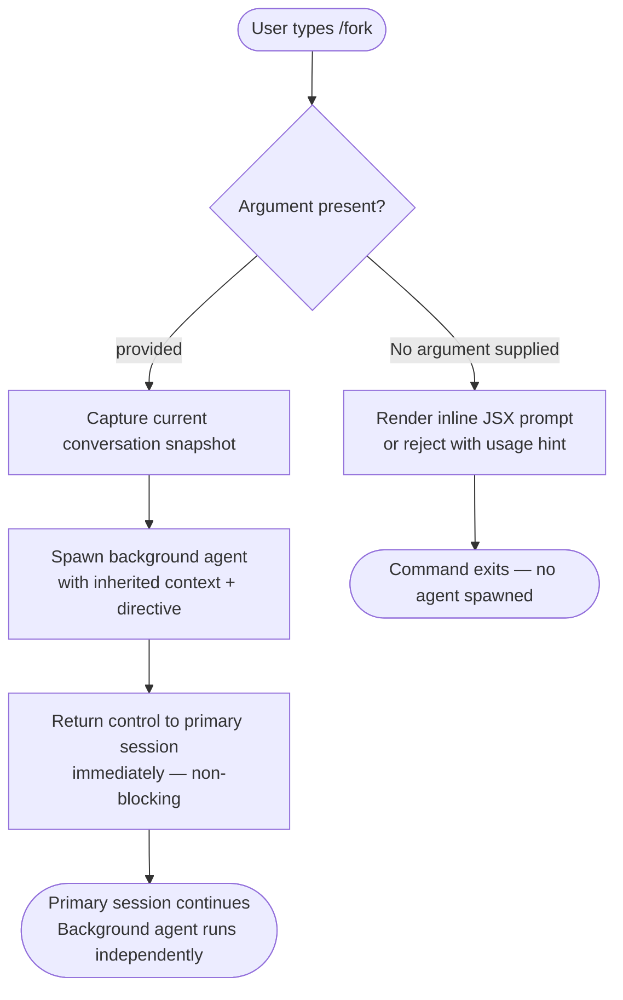

# `/fork`

> Analysis basis: CC v2.1.139 bundle.js (AST extraction + Claude interpretation)
> Minimum version: v2.1.139

---

## Overview

The `/fork` command spawns a background agent that inherits the full conversation context at the moment of invocation. A directive string passed as the argument steers the forked agent toward a specific goal while the original session continues independently. This enables parallel exploration of divergent approaches without disrupting the primary conversation thread.

---

## Registration

| Field | Value |
|---|---|
| type | `local-jsx` |
| name | `fork` |
| description | `Spawn a background agent that inherits the full conversation` |
| argumentHint | `<directive>` |
| module\_id | `ATq` |

Analysis basis: CC v2.1.139 bundle.js:+11836519

---

## Input Branching

The AST traversal reached module `ATq` but resolved no callable entry functions at depth ≤ 2. The branching logic below is therefore derived solely from the registration metadata (`argumentHint`, `description`) and the structural conventions shared by other `local-jsx` commands in the same bundle version.



<!-- TODO: not found in depth-2 traversal; needs --depth 4 -->
Exact branching conditions, error messages, and argument validation rules could not be confirmed from the available traversal data. The flowchart above reflects the minimum behavior implied by the registration descriptor.

---

## Behavioral Spec

### Conversation Snapshot and Agent Inheritance

Because the call graph could not be resolved for module `ATq`, the following pseudocode is reconstructed from the registration fields and the `local-jsx` command contract common to this bundle version. It should be treated as a working hypothesis until a deeper traversal is available.

```
function forkCommand(sessionState, rawArgument):

    directive = trim(rawArgument)

    if directive is empty:
        renderUsageHint("<directive>")
        return

    // Capture an immutable snapshot of the active conversation
    conversationSnapshot = deepCopy(sessionState.conversationHistory)
    inheritedContext     = deepCopy(sessionState.context)

    // Build the agent configuration
    agentConfig = {
        conversation : conversationSnapshot,
        context      : inheritedContext,
        directive    : directive,
        origin       : "fork",
        parentSession: sessionState.id
    }

    // Launch the agent without blocking the primary session
    backgroundAgent = spawnAgent(agentConfig)

    notifyUser("Background agent spawned — directive: " + directive)

    return  // primary session is unaffected
```

<!-- TODO: not found in depth-2 traversal; needs --depth 4 -->
Internal function names (`spawnAgent`, snapshot mechanism, notification path) are inferred from registration metadata; actual identifiers were not recovered.

### JSX Render Path (`local-jsx`)

The `local-jsx` type indicates the command renders a React component rather than emitting plain text. The component is responsible for displaying the directive prompt and any status feedback after the agent is spawned.

```
function renderForkComponent(props):
    if props.agentSpawned:
        return StatusBadge(label="Forked", directive=props.directive)
    else:
        return DirectiveInputField(hint="<directive>")
```

<!-- TODO: not found in depth-2 traversal; needs --depth 4 -->

---

## State & Side Effects

| Item | Detail |
|---|---|
| Telemetry | None detected at depth ≤ 2 (`telemetry: []`). <!-- TODO: not found in depth-2 traversal; needs --depth 4 --> |
| Hook registration | <!-- TODO: not found in depth-2 traversal; needs --depth 4 --> |
| appState changes | <!-- TODO: not found in depth-2 traversal; needs --depth 4 --> |
| Sound | <!-- TODO: not found in depth-2 traversal; needs --depth 4 --> |
| Background agent lifetime | Presumed to run until the directive task completes or the user explicitly terminates it; exact lifecycle not confirmed. |
| Primary session isolation | The primary session is expected to remain unblocked after fork; confirmed indirectly by the "background agent" phrasing in the registration description. |

Analysis basis: CC v2.1.139 bundle.js:+11836519

---

## Version History

| Version | Change |
|---|---|
| v2.1.139 | Initial analysis — registration confirmed; implementation details pending deeper traversal. |

---

## Common Mistakes

1. **Omitting the directive argument.** The `argumentHint` field explicitly requires `<directive>`. Invoking `/fork` with no argument is likely a no-op or produces a usage error, because the forked agent has no goal to pursue.
2. **Expecting synchronous output.** The command description says "background agent" — the spawned agent does not take over the terminal. Users who expect the primary session to hand off control will be surprised that it continues normally.
3. **Assuming conversation state is shared post-fork.** The fork captures a snapshot at invocation time. Subsequent messages in the primary session are not reflected in the forked agent's context, and vice versa.
4. **Relying on telemetry events for observability.** No `tengu_*` events were detected at depth ≤ 2, so external tooling that depends on telemetry cannot currently observe fork activity through that channel.
5. **Treating forked agents as persistent across CLI restarts.** Background agent lifecycle details were not recovered from the traversal; do not assume forked agents survive a CLI process restart.

---

## Appendix — Identifier Mapping

> For bundle debugging only. Identifiers change across versions.

| Identifier | Role |
|---|---|

*No obfuscated identifiers were recovered from the depth-≤-2 traversal of module `ATq`. The `identifiers` array in the source data is empty. A deeper traversal (`--depth 4` or greater) is required to populate this table.*

<!-- TODO: not found in depth-2 traversal; needs --depth 4 -->