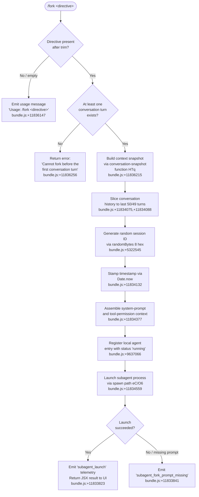

# `/fork`

> Analysis basis: CC v2.1.139 bundle.js (AST extraction + Claude interpretation)
> Minimum version: v2.1.139

---

## Overview

`/fork` spawns a background agent that inherits a full snapshot of the current conversation context — messages, system prompt, tool permissions, and memory — and then runs a user-supplied directive independently. The parent session continues normally while the forked agent executes asynchronously in the background.

---

## Registration

| Field | Value |
|---|---|
| type | `local-jsx` |
| name | `fork` |
| description | Spawn a background agent that inherits the full conversation |
| argumentHint | `<directive>` |
| module_id | `ATq` |
| load_inline | `true` |
| loc_byte | `11836519` |
| loc_byte_end | `11836715` |
| loc_line | `7896` |
| arbor_handler.name | `NN7` |
| arbor_handler.fqn | `claude-2.1.139::NN7` |
| arbor_handler.kind | `AsyncFunction` |
| arbor_handler.resolution_path | `module_id` |
| arbor_handler.n_hits | `0` |

Analysis basis: CC v2.1.139 bundle.js:+11836519

---

## Input Branching

The command has 3+ distinct branches based on directive presence, conversation state, and subagent launch path. A Mermaid flowchart is required.



Analysis basis: CC v2.1.139 bundle.js:+11836123 – +11836715

---

## Behavioral Spec

### 1. Directive validation (handler entry — `NN7`)

```
async function forkCommandHandler(userInput, context):
    directive = userInput.trim()           // bundle.js:+11836123
    if directive is empty:
        return usage_message("Usage: /fork <directive>")  // bundle.js:+11836147

    conversationHistory = context.getConversationHistory()
    if conversationHistory.length < 1:
        return error("Cannot fork before the first conversation turn")
        // bundle.js:+11836256

    return launchFork(directive, context)
```

Analysis basis: CC v2.1.139 bundle.js:+11836123

---

### 2. Conversation snapshot assembly (`HTq`)

```
async function buildForkSnapshot(directive, context):
    // Collect REPL contexts (IDE / shell)
    replContexts = context.getReplContexts()         // bundle.js:+11833930

    // Collect message history, truncate to at most 50 items
    // then take only the last 49 of those
    messageSlice = context.messages.slice(-50, -49 or end)
    // bundle.js:+11834075, +11834088

    // Normalise messages: filter assistant/user/tool_use/tool_result types
    normalisedMessages = normaliseMessageBlock(messageSlice)  // via nM8

    // Generate a cryptographically random session identifier
    sessionId = randomBytes(8).toString("hex")        // bundle.js:+5322561,+5322573

    // Record a creation timestamp
    createdAt = Date.now()                            // bundle.js:+11834132

    // Resolve full system-prompt snapshot (memory, guidelines, etc.)
    systemSnapshot = buildSystemPromptSnapshot(context)  // via IN7 → Z0 → f06
    // Incorporates memory load prompt: "memory_load_prompt" bundle.js:+11994187
    // Respects team memory path if enabled: bundle.js:+11994388, +11994414

    // Collect tool-permission context
    toolPerms = context.getToolPermissionContext()    // bundle.js:+11834377

    return {sessionId, createdAt, systemSnapshot, normalisedMessages,
            replContexts, toolPerms, directive}
```

Analysis basis: CC v2.1.139 bundle.js:+11833803, +11834025, +11834078, +11834132

---

### 3. System-prompt construction for the fork (`IN7` + `Z0`)

```
function buildSystemPromptSnapshot(context):
    appState = context.getAppState()                  // bundle.js:+11835389

    // Assemble ordered prompt sections via Z0 and its sub-builders:
    sections = []

    // Core identity section
    sections.push(buildIdentitySection())             // Xh7 bundle.js:+12145696
    // Contains: "You are an interactive agent that helps users with software
    //  engineering tasks." bundle.js:+12143747

    // Environment info (static)
    sections.push(buildEnvironmentInfo())             // Eh7 bundle.js:+12145382
    // Contains git-worktree note bundle.js:+12147170

    // Session-specific guidance
    if sessionGuidanceEnabled(appState):              // Jh7 bundle.js:+12145220
        sections.push(buildSessionGuidance())

    // Memory load (auto memory)
    sections.push(loadMemoryPrompt(appState))         // f06 bundle.js:+12145283
    // Calls Hy7.buildCombinedMemoryPrompt bundle.js:+11995039

    // Output style and language settings
    sections.push(buildOutputStyleSection())          // Oh7 bundle.js:+12145803
    // Agent threads use absolute file paths only bundle.js:+12150720

    // Background-session marker
    sections.push(buildBgSessionMarker("bg-session")) // bundle.js:+12145496

    // Context management / brief mode check
    if briefEnabled:                                  // kh7 bundle.js:+12145622
        sections.push(buildBriefSection())

    // Reproduce/verify workflow section
    sections.push(buildReproduceVerifySection())      // Sh7 bundle.js:+12145653

    systemPrompt = joinSections(sections)
    return {role: "system", content: systemPrompt}   // bundle.js:+11836187
```

Analysis basis: CC v2.1.139 bundle.js:+11835389, +12144837, +12145049, +12145283

---

### 4. Subagent registration and launch (`$lH` → `UVH` + `eC`)

```
async function launchForkedSubagent(snapshot):
    // Register the agent entry in the local-agent registry
    agentEntry = {
        type:     "local_agent",           // bundle.js:+9637021
        status:   "running",               // bundle.js:+9637066
        purpose:  "general-purpose",       // bundle.js:+9637140
        sessionId: snapshot.sessionId
    }
    agentRegistry.register(agentEntry)    // via K.register bundle.js:+9637332

    // Ensure subagents directory exists (mkdir EEXIST-safe)
    ensureSubagentsDir()                  // qB_ → Vi.mkdir bundle.js:+12014546
    // "subagents" path component bundle.js:+11923683

    // Create symlink for session transcript access
    createSessionSymlink()                // UVH → Vi.symlink bundle.js:+12016688

    // Emit launch telemetry
    emit("subagent_launch")               // bundle.js:+11833823

    // Run the agent process loop
    result = await runAgentProcess(        // eC / O6 path
        messages:    snapshot.normalisedMessages,
        systemPrompt: snapshot.systemSnapshot,
        directive:   snapshot.directive,
        toolPerms:   snapshot.toolPerms,
        sessionId:   snapshot.sessionId,
        mode:        "subagent",           // bundle.js:+11834574
        source:      "fork"                // bundle.js:+11833890
    )
    return result
```

Analysis basis: CC v2.1.139 bundle.js:+9636974, +9637021, +12016635, +11833823

---

### 5. Subagent lifecycle and completion (`BcH` → `O6`)

```
async function subagentProcessLoop(config):
    // Stall watchdog: 600 000 ms timeout, 10 s interval
    // bundle.js:+8039291, +8039296

    while not done:
        chunk = readNextChunk()

        // Update agent state on each message
        updateAgentState(chunk)            // Lw6, e1H bundle.js:+8040470

        if chunk.type == "subagent_complete":   // bundle.js:+8040424
            finaliseCompletion(chunk)
            emit("subagent_complete")
            break

        if stalled:                             // bundle.js:+8040444
            emit("subagent_stall_timeout")
            break

    // Post-run classification (safety handoff check)
    classifyOutput(result)                 // UzH bundle.js:+8041425
    // If classifier unavailable, emit warning bundle.js:+8038362

    // Mark agent as completed / killed / cancelled
    // Statuses: "completed", "killed", "cancelled" bundle.js:+9634639, +9635372, +8042153

    return agentResult
```

Analysis basis: CC v2.1.139 bundle.js:+8039230, +8040424, +8040444, +8041425

---

### 6. Error / missing-prompt path

```
function handleMissingPrompt():
    // Triggered when directive is absent at launch time
    emit("subagent_fork_prompt_missing")   // bundle.js:+11833841
    return error_result
```

Analysis basis: CC v2.1.139 bundle.js:+11833841

---

## State & Side Effects

| Item | Detail |
|---|---|
| Telemetry — launch | `tengu` events fired on subagent launch (see `subagent_launch` literal bundle.js:+11833823) |
| Telemetry — missing prompt | `subagent_fork_prompt_missing` fired when directive absent (bundle.js:+11833841) |
| Telemetry — completion | `subagent_complete` / `subagent_stall_timeout` (bundle.js:+8040424, +8040444) |
| Telemetry — safety | `tengu_auto_mode_decision` (bundle.js:+8037929), `tengu_agent_tool_terminated` (bundle.js:+8042177) |
| Telemetry — background spare | `tengu_bg_spare_spawn`, `tengu_bg_spare_claim` (bundle.js:+14310364, +14311902) |
| Telemetry — async stall | `tengu_async_agent_stall_timeout` (bundle.js:+8040187) |
| Telemetry — subagent end | `tengu_agent_tool_completed` (bundle.js:+8036303), `tengu_cache_eviction_hint` (bundle.js:+8036846) |
| Local-agent registry | New entry added with `type: "local_agent"`, `status: "running"` (bundle.js:+9637021, +9637066) |
| Filesystem — subagents dir | `mkdir` call to ensure `subagents/` directory exists; EEXIST-safe (bundle.js:+12014546) |
| Filesystem — symlink | `Vi.symlink` creates session link; `Vi.unlink` removes stale one (bundle.js:+12016688, +12016747) |
| Filesystem — transcript | Session transcript written as `.jsonl`; metadata as `.meta.json` (bundle.js:+11923964, +11923808) |
| AbortController | New `AbortController` registered for the fork's lifetime (bundle.js:+4218284) |
| appState | Fork reads `getAppState()` to copy permissions; does not mutate parent's appState |
| Sound / notification | No audio side effects found in depth-2 traversal |
| Tool permissions | Fork inherits parent's `getToolPermissionContext()` snapshot (bundle.js:+11834377) |
| Memory | `buildCombinedMemoryPrompt` called to bake memory into the forked system prompt (bundle.js:+11995039) |
| Stall watchdog | 600 000 ms (10 minutes) hard timeout; interval 10 000 ms (bundle.js:+8039291, +8039296) |
| History truncation | Conversation sliced to the trailing 50 messages, then last 49 sent (bundle.js:+11834075, +11834088) |
| Session ID | 8-byte `randomBytes` hex string used as unique fork session identifier (bundle.js:+5322545) |
| Resume mode | Fork uses `"resume"` mode string internally during context rehydration (bundle.js:+11834009) |

---

## Version History

| Version | Change |
|---|---|
| v2.1.139 | Initial analysis |

---

## Common Mistakes

1. **Running `/fork` before any turn exists** — the command returns a hard error (`"Cannot fork before the first conversation turn"`, bundle.js:+11836256). At least one completed exchange must exist in the session.
2. **Omitting the `<directive>` argument** — without a directive the command prints the usage string and does nothing. The directive is required and must be non-empty after trimming (bundle.js:+11836123, +11836147).
3. **Expecting the fork to share the parent's ongoing state** — the fork receives a *snapshot* of the conversation at the moment `/fork` is invoked. Changes the parent makes after that point are not visible to the forked agent.
4. **Using relative paths in the directive** — agent threads always have their `cwd` reset between bash calls; use absolute paths in any file references within the directive (bundle.js:+12150720).
5. **Assuming instant completion** — the fork runs as an asynchronous background agent. It may be subject to the 10-minute stall watchdog and will be reported as `subagent_stall_timeout` if it produces no output for that duration (bundle.js:+8039296, +8040444).
6. **Expecting classifier-verified output** — if the safety handoff classifier is unavailable the fork's output is returned with an explicit warning but is not blocked. Always verify sub-agent actions when the classifier warning appears (bundle.js:+8038362, +8038451).

---

## Appendix — Identifier Mapping

> For bundle debugging only. Identifiers change across versions.

| Identifier | Role |
|---|---|
| `NN7` | Main async handler for `/fork` command (Arbor-resolved entry point) |
| `HTq` | Fork context snapshot builder (conversation + system-prompt assembler) |
| `IN7` | System-prompt sub-builder (reads appState, calls Z0 section builders) |
| `Z0` | Ordered section assembler for the forked system prompt |
| `f06` | Memory load sub-section builder (calls `buildCombinedMemoryPrompt`) |
| `Hh7` | System-prompt section: model override / coding style guidance |
| `Jh7` | Session-specific guidance section builder |
| `Eh7` | Environment info (static) section builder |
| `Th7` | Environment info (simple / git-worktree) section builder |
| `Xh7` | Core identity ("You are an interactive agent…") section builder |
| `Oh7` | Output style section builder |
| `kh7` | Brief-mode check and section builder |
| `Sh7` | Reproduce/verify workflow section builder |
| `$lH` | Agent registration and launch coordinator |
| `UVH` | Filesystem setup for subagent (mkdir, symlink, session file) |
| `qB_` | `mkdir` wrapper for subagents directory |
| `y3` | Session file-path builder |
| `wP8` | Active-session set management (add/delete) |
| `KT` | Session path resolver (reads `SU_` map) |
| `zN` | AbortController factory and abort-event wiring |
| `eC` | Full agent run loop setup and initialisation |
| `O6` | Core agent execution loop (streaming, tool dispatch, hooks) |
| `BcH` | Background-agent process driver (watchdog, stall detection) |
| `UzH` | Post-run safety classifier dispatcher |
| `GIH` | Handoff safety classifier logic |
| `Lw6` | Agent state updater on chunk receipt |
| `e1H` | Agent transcript / state persistence handler |
| `TO6` | Subagent turn executor (calls NE, $8, MM1) |
| `nM8` | Message normaliser / history filter |
| `vN7` | Message content trimmer for history snapshot |
| `qm` | Random-bytes session ID generator |
| `dC` | Main-thread system-prompt fetcher |
| `hB_` | Memory-mode state reader (off/additive/compact) |
| `j$6` | Tool permission helper |
| `jEq` | Context reference builder for fork (`fork-context-ref`) |
| `fv_` | Context-ref writer (`"fork-context-ref"` literal) |
| `wt` | Anti-loop watcher for background sessions |
| `K06` | Tool-filter for background/fork context |
| `gw6` | Transcript writer (`.jsonl` + `.meta.json`) |
| `aTq` | Session-path resolver helper |
| `Sf6` | Fork-specific flag/state emitter |
| `ggH` | Fork completion UI update handler |
| `N78` | Subagent completed-results processor |
| `S78` | Agent status update writer (sets "completed") |
| `_qH` | Agent state update on cancellation/kill |
| `MM1` | Agent state updater on run completion |
| `sO` | Pending-session flush helper |
| `Uk_` | Timestamp-keyed state updater |
| `YM` | String/display helper for agent results |
| `jN` | Language detection for agent events |
| `HL` | Event emitter for agent lifecycle events |
| `T9H` | SHA-256 hash helper for agent source tagging |
| `Pu4` | Plugin handoff checker |
| `HqH` | Agent hook-run scheduler |
| `fw6` | Hook-run state machine |
| `y78` | Pre-turn hook runner |
| `v78` | Async tool-progress reporter |
| `h78` | Tool output classifier |
| `_w6` | Auto-mode classifier (parses tool-use response) |
| `xN1` | Classifier result types (RN1/SN1/bN1) |
| `Mw6` | Agent state updater on API response |
| `HM6` | Agent message reducer |
| `ju4` | Agent turn error handler |
| `AB` | Agent appState loader on turn start |
| `WC` | Session-level conversation loop (wraps la4) |
| `la4` | Core query/model-call loop for the forked agent |
| `M_8` | Subagent-exit state cleaner |
| `Jd1` | Parallel-agent state synchroniser |
| `mVH` | State-map updater with debounce |
| `ZUH` | Pending-event queue flusher |
| `cV` | Agent-state version checker |
| `bqH` | Subagent start sequencer (calls IX) |
| `IX` | Full subagent run orchestrator |
| `xh` | Subagent output display helpers |
| `Rj6` | Subagent session builder |
| `q4` | Model config resolver for subagent |
| `oH` | Subagent output renderer |
| `AA` | ANSI/text parser for subagent output |
| `P6` | REPL session manager (timers, close) |
| `UH` | Remote-bridge connection handler for subagent |
| `sjq` | Bridge message ingestor |
| `tjq` | Bridge outbound message serialiser |
| `sz_` | Subagent appState initialiser |
| `qv_` | MCP tool-permission context builder for subagent |
| `u$_` | Tool-name deduplication and bundling |
| `c9H` | Retry-backoff calculator |
| `oU` | Tool resolution helper |
| `iP` | Port/integer parser |
| `Gn` | Tool context merger (allowed/denied sets) |
| `r0_` | Tool filter (blocked-set lookup) |
| `qO` | Permission-mode string parser |
| `Qj` | Permission context formatter |
| `Cz` | String helper for permission strings |
| `ML` | Common map/list utility |
| `vB_` | System-prompt section registry helper |
| `SH` | String coercion / output helper |
| `H$8` | Plugin/extension section builder |
| `m_` | Markdown/text section joiner |
| `lG` | Language-section builder |
| `Kh7` | Prompt-cache tracking section |
| `Lh7` | Live-messages section marker |
| `fh7` | Repl-hydration section marker |
| `Vh7` | Scratchpad section builder |
| `Ih7` | Dynamic hint injector (dHH / YwH) |
| `vh7` | Focus-mode section builder |
| `_A1` | Additional-context (attachments) assembler |
| `Ph7` | Permission-mode section builder |
| `Mh7` | MCP monitors section builder |
| `$h7` | Shell-tasks / system section builder |
| `Dh7` | Tool-search section builder |
| `jh7` | Tone-and-style section builder |
| `zh7` | Reproduce-verify workflow alias |
| `hfH` | Auth/credential section builder |
| `WG` | Whitespace/gap helper |

---

Note: index built via Arbor fallback; some signals (telemetry, literals) may be missing — see arbor-fallback.js.