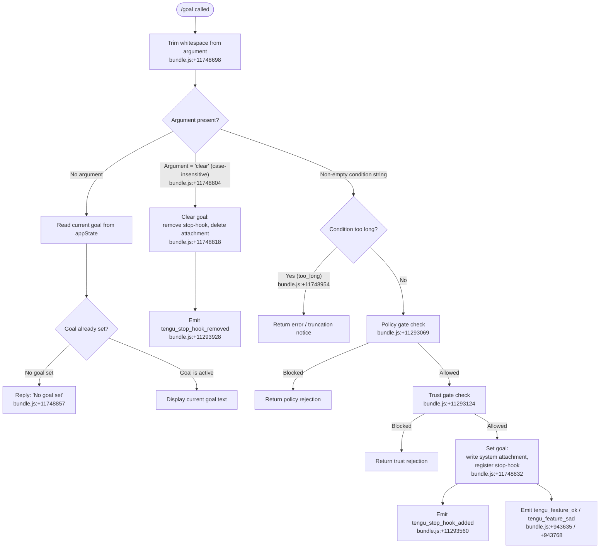

# `/goal`

> Analysis basis: CC v2.1.139 bundle.js (AST extraction + Claude interpretation)
> Minimum version: v2.1.139

---

## Overview

`/goal` sets a persistent completion condition that Claude Code will track across its agentic loop, continuing to work until that condition is evaluated as satisfied. Invoking `/goal clear` (or `/goal` with no argument) removes any currently active goal. The command injects a system-level attachment into the conversation and registers a stop-hook that evaluates goal status at each iteration boundary.

---

## Registration

| Field | Value |
|---|---|
| type | `local-jsx` |
| name | `goal` |
| description | Set a goal — keep working until the condition is met |
| argumentHint | `[<condition> \| clear]` |
| immediate | `true` |
| module_id | `m0q` |
| load_inline | `true` |
| loc_byte | `11750109` |
| loc_byte_end | `11750312` |
| loc_line | `7680` |
| arbor_handler.name | `FI7` |
| arbor_handler.fqn | `claude-2.1.139::FI7` |
| arbor_handler.kind | `AsyncFunction` |
| arbor_handler.resolution_path | `module_id` |
| arbor_handler.n_hits | `0` |

Analysis basis: CC v2.1.139 bundle.js:+11750109

---

## Input Branching

Four distinct branches are reachable from the handler depending on the argument text and internal state, so a Mermaid flowchart is used.



---

## Behavioral Spec

### 1. Entry Point — Handler `FI7`

Analysis basis: CC v2.1.139 bundle.js:+11748698

```
async function handleGoalCommand(context, rawArg):
    condition = rawArg.trim()                   // FI7 → A.trim  (+11748698)

    if condition is empty:
        currentGoal = readCurrentGoal(context)
        if currentGoal is null or undefined:
            reply("No goal set")               // literal "No goal set" +11748857
        else:
            reply(currentGoal)
        return

    normalizedArg = condition.toLowerCase()

    if normalizedArg == "skip" or normalizedArg == "clear":
        // "skip" literal +11748804 — treated as the clear signal
        clearGoal(context)                     // → mw8 (+11748818)
        return

    // Non-empty, non-clear argument: set new goal
    goalResult = activateGoal(context, condition)   // → zoH (+11748832)
    await notifyGoalSet(context, goalResult)         // → Y8  (+11748940)
    await setupStopHook(context, condition)          // → OoH (+11749066)
    return pw8(context)                             // → pw8 (+11749179)
```

---

### 2. Clear-Goal Path — `mw8`

Analysis basis: CC v2.1.139 bundle.js:+11748818

```
function clearGoal(context):
    // Check if the goal keyword is in the active-goal registry
    isRegistered = goalRegistry.has(context)        // i27.has  +11292478
    normalizedKey = context.id.toLowerCase()        // H.toLowerCase +11292486

    if isRegistered:
        closeHandleA(context)                       // A.close  +14320651
        closeHandleQ(context)                       // q.close  +14320661
        unlinkSyncFile(context)                     // Aaq.unlinkSync +14290176
        emit("tengu_stop_hook_removed")             // +11293928
    // Goal state is now absent; no further appState mutation occurs here
```

---

### 3. Activate-Goal Path — `zoH`

Analysis basis: CC v2.1.139 bundle.js:+11748832

```
function activateGoal(context, conditionText):
    // Build a padded display representation (width 40, pad char "  ")
    // literals: 40 +14334983, "  " +14333012
    displayText = buildPaddedDisplay(conditionText)     // V6 +11293662

    // Persist goal into appState
    appSnapshot = context.getAppState()                 // H.getAppState +11293673

    // Write the attachment with type "attachment", subtype "goal_status"
    // literals: "attachment" +11294000, "goal_status" +11294087, "goal" +11293959
    attachmentId = generateUUID()                       // SYq → kYq.randomUUID +11294018
    context.applyMessageOp("append", {                  // "append" +11293894
        type: "attachment",
        subtype: "goal_status",
        category: "goal",
        id: attachmentId,
        body: conditionText
    })                                                  // applyMessageOp +11293871

    // Inject a "system" role message fragment
    // literal: "system" +11748901
    context.setAppState({
        ...appSnapshot,
        goalCondition: conditionText,
        goalAttachmentId: attachmentId
    })                                                  // setAppState +11293802

    // Push to in-memory tracking list (Uw8 → A.push +11293003)
    goalTracker.push(conditionText)

    emit("tengu_stop_hook_added")                       // Q +11293926, +11293560
    return attachmentId
```

---

### 4. Stop-Hook Setup — `OoH`

Analysis basis: CC v2.1.139 bundle.js:+11749066

```
async function setupStopHook(context, conditionText):
    // Resolve the "Stop" action handler (literal "Stop" +11292887)
    stopHandler = resolveStopAction()               // Wu_ → eu +11293040

    // Policy gate: checks policySettings (+5287575) via v8/VS6
    policyOutcome = checkPolicyGate(context)        // policy_gate +11293069
    if policyOutcome.blocked:
        emit("tengu_feature_sad")                   // +943768
        return policyOutcome.rejection

    // Trust gate check
    trustOutcome = checkTrustGate(context)          // trust_gate +11293124, T_ +11293088
    if trustOutcome.blocked:
        return trustOutcome.rejection

    // Retrieve current timestamp for hook metadata
    timestamp = Date.now()                          // +11293423

    // Aggregate output token counts via Gj (→ Object.values +39915, outputTokens +39944)
    tokenSummary = aggregateOutputTokens(context)   // Gj +11293448

    // Write updated appState with stop-hook entry
    appSnapshot = context.getAppState()             // _.getAppState +11293259
    context.setAppState({
        ...appSnapshot,
        stopHookRegistered: true,
        hookTimestamp: timestamp
    })                                              // _.setAppState +11293461

    context.applyMessageOp("append", {             // _.applyMessageOp +11293503
        type: "prompt",                            // "prompt" +11292994
        hookId: generateUUID(),                    // SYq +11293545
        condition: conditionText
    })

    emit("tengu_stop_hook_added")                  // Q +11293558

    // Register the hook in the active set and wire the finally-cleanup
    hookHandle = addToActiveSet(context)            // L → q.add +14314857
    hookHandle.finally(() => {
        activeSet.delete(hookHandle)               // q.delete +14314880
    })                                             // f.finally +14314866

    emit("tengu_feature_ok")                       // kH → Q +943635
```

---

### 5. Random Delay Utility — `H`

Analysis basis: CC v2.1.139 bundle.js:+12439009

```
function randomDelay():
    // Produces a jittered wait of 1–2 units before proceeding
    // literals: 2 +12439007, 1 +12439023
    jitter = Math.random() * 2 + 1
    return setTimeout(resolve, jitter)
```

This utility is called during goal activation to stagger concurrent hook registrations and avoid race conditions in the agentic loop.

---

### 6. Display Formatter — `K` / `KC1`

Analysis basis: CC v2.1.139 bundle.js:+14332978

```
function buildPaddedDisplay(items):
    // Map each item to a string, then pad to width 40 with double-space separator
    // literals: 40 +14334983, "  " +14333012
    padded = items.map(item => String(item).padEnd(40, " "))
    return KC1(padded)   // KC1 → H.map +8282110
```

---

## State & Side Effects

| Item | Detail |
|---|---|
| Telemetry | `tengu_stop_hook_added` (+11293560), `tengu_stop_hook_removed` (+11293928), `tengu_feature_ok` (+943635), `tengu_feature_sad` (+943768) |
| Stop-hook registration | `OoH` registers a stop-hook entry via `_.applyMessageOp("append", …)` and the active-set manager `L`; cleared by `mw8` which calls `Aaq.unlinkSync` and removes from registry |
| appState changes | `getAppState` / `setAppState` called in both `zoH` (+11293673, +11293802) and `OoH` (+11293259, +11293461); fields written include `goalCondition`, `goalAttachmentId`, `stopHookRegistered`, `hookTimestamp` |
| Message attachment | An `"attachment"` op of subtype `"goal_status"` / category `"goal"` is appended via `applyMessageOp` (+11293871) with a UUID generated by `kYq.randomUUID` (+11294018) |
| System message injection | A `"system"`-role fragment is injected into the conversation context (+11748901) |
| Policy / trust gates | `policySettings` checked via `v8` (+5287575); trust gate checked via `T_` (+11293088); rejection emits `tengu_feature_sad` |
| File cleanup | `Aaq.unlinkSync` (+14290176) removes any on-disk state file when goal is cleared |
| Random delay | `setTimeout` with jitter 1–2 units (+12439009, +12439046) introduced during activation |

---

## Version History

| Version | Change |
|---|---|
| v2.1.139 | Initial analysis |

---

## Common Mistakes

1. **Passing `"skip"` as a condition string** — the literal `"skip"` (bundle.js:+11748804) is treated identically to `"clear"` (case-insensitive) and will remove the current goal rather than setting a new one named "skip".
2. **Assuming `/goal` without arguments sets a goal** — with no argument the command only *reads* the current goal state and replies `"No goal set"` if none is active; it does not prompt for input.
3. **Expecting synchronous completion** — the handler is an `AsyncFunction` (`arbor_handler.kind`); callers should await it. The random-delay utility (`H`) also introduces jitter that can make activation appear slow.
4. **Ignoring policy/trust gate failures** — if `policySettings` or the trust gate blocks the request, the stop-hook is never registered and `tengu_feature_sad` is emitted silently; the user sees a rejection rather than an active goal.
5. **Setting a goal that is too long** — the handler checks for a `"too_long"` condition (bundle.js:+11748954) and returns early before any appState mutation; ensure the condition text is within the enforced length.

---

## Appendix — Identifier Mapping

> For bundle debugging only. Identifiers change across versions.

| Identifier | Role |
|---|---|
| `FI7` | Main async handler for `/goal` (arbor_handler; entry point, `module_id` resolution) |
| `A` | Argument string being processed / trim target in entry path |
| `f` | File/stream handle used in cleanup and hook lifecycle |
| `q` | Active-set / registry object (has, add, delete, close operations) |
| `L` | Hook lifecycle manager (add to active set, wire finally-cleanup) |
| `H` | Random-delay utility (Math.random + setTimeout jitter) |
| `mw8` | Clear-goal function (registry lookup, handle close, unlink, telemetry) |
| `zoH` | Activate-goal function (UUID, attachment append, appState write, telemetry) |
| `V6` | Padded-display builder (called from zoH and OoH) |
| `Uw8` | Goal-tracker push helper (called from zoH) |
| `tzH` | AppState key-set writer (K.set + KC1 map) |
| `K` | appState map / display items list |
| `KC1` | Items-map helper (H.map over padded entries) |
| `SYq` | UUID generator wrapper (→ kYq.randomUUID) |
| `Q` | Telemetry emitter used for stop-hook events |
| `Y8` | Goal-set notification helper (emits `goal_set` after activation) |
| `OoH` | Stop-hook setup function (policy gate, trust gate, appState write, hook registration) |
| `Wu_` | Stop-action resolver (orchestrates eu, T_, A7) |
| `eu` | Stop-action factory (→ v8/VS6 policy settings lookup) |
| `v8` | Policy-settings accessor (reads `policySettings`) |
| `T_` | Trust-gate evaluator |
| `A7` | Action-builder helper (→ bVL) |
| `bVL` | Core action construction (SH, $yH, Z1, b6, HmH, xr, C6, Rz.resolve) |
| `_` | Context/app-state handle used inside OoH (getAppState, setAppState, applyMessageOp) |
| `Gj` | Output-token aggregator (→ rkH, Object.values, `outputTokens`) |
| `kH` | Feature-success telemetry helper (→ Q, emits `tengu_feature_ok`) |
| `pw8` | Post-activation finalizer called at end of main handler |

---

Note: index built via Arbor fallback; some signals (telemetry, literals) may be missing — see arbor-fallback.js.