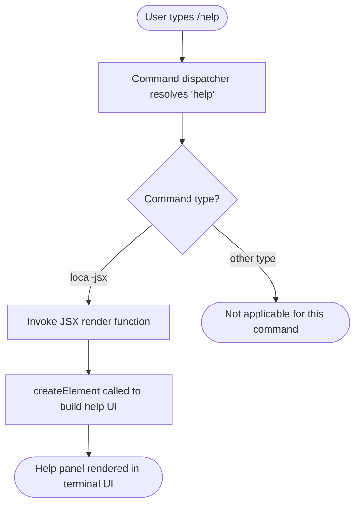

# `/help`

> Analysis basis: CC v2.1.132 bundle.js (AST extraction + Claude interpretation)
> Minimum version: v2.1.132

---

## Overview

The `/help` command displays the help panel and lists all available slash commands to the user within the Claude Code CLI interface. It is implemented as a local JSX command, meaning its output is rendered directly as a React element rather than producing plain text output. When invoked, the command triggers a JSX rendering call that constructs and returns the help UI component.

---

## Registration

| Field | Value |
|---|---|
| type | `local-jsx` |
| name | `help` |
| description | `Show help and available commands` |
| module_id | `kHq` |

Analysis basis: CC v2.1.132 bundle.js:+10336831

---

## Input Branching

Because the depth-2 call graph contains only a single edge (the command handler calling `createElement`) and the `literals` array is empty, no input-conditional branching paths were identified within the traversal boundary.



Analysis basis: CC v2.1.132 bundle.js:+10336716

<!-- TODO: deeper branching logic within the help UI component (e.g., filtering, sections) not found in depth-2 traversal; needs --depth 4 -->

---

## Behavioral Spec

### Help Panel Rendering

The core behavior of `/help` is to produce a JSX element tree that represents the help panel. The command handler is a function that, when called by the CLI dispatcher, immediately invokes the React element factory to construct the help UI component. No arguments or user-supplied input appear to be processed at this traversal depth.

```
function renderHelpPanel(commandContext):
    element = createElement(HelpUIComponent, props derived from commandContext)
    return element
```

Analysis basis: CC v2.1.132 bundle.js:+10336716

### Command Dispatch Integration

The command is registered under the `local-jsx` type, which instructs the dispatcher to treat the return value of the handler as a renderable JSX node rather than a text string or side-effect action. The dispatcher renders this node inline within the active terminal UI session.

```
function dispatchLocalJSXCommand(command, context):
    if command.type is "local-jsx":
        jsxNode = command.handler(context)
        renderInlineToTerminalUI(jsxNode)
    else:
        // other dispatch paths not relevant here
```

Analysis basis: CC v2.1.132 bundle.js:+10336831

<!-- TODO: the exact props passed to the help UI component and the list of commands it enumerates are not found in depth-2 traversal; needs --depth 4 -->

---

## State & Side Effects

| Item | Detail |
|---|---|
| Telemetry | None detected at depth ≤ 2 traversal (`telemetry` array is empty) |
| Hook registration | <!-- TODO: not found in depth-2 traversal; needs --depth 4 --> |
| appState changes | <!-- TODO: not found in depth-2 traversal; needs --depth 4 --> |
| Sound | <!-- TODO: not found in depth-2 traversal; needs --depth 4 --> |

> **Note:** The absence of telemetry events in the extracted data indicates that `/help` does not emit any `tengu_*` analytics events at the handler level, at least within the depth-2 call boundary. This is consistent with help being a passive, read-only display command.

---

## Version History

| Version | Change |
|---|---|
| v2.1.132 | Initial analysis; command registered as `local-jsx` type under module `kHq` |

---

## Common Mistakes

1. **Expecting plain-text output:** Because `/help` is typed `local-jsx`, its output is a rendered UI component, not a raw string. Integrations that intercept command output as text will not capture the help content from this handler directly.
2. **Assuming telemetry is emitted:** No telemetry events are fired by `/help` at the handler level. Do not rely on analytics signals to detect user invocations of this command.
3. **Treating `/help` as stateful:** The command appears to be purely presentational with no detectable side effects on application state at the traversal depth analyzed. It should not be expected to change session state, toggle modes, or persist any data.
4. **Assuming input arguments are processed:** No argument-parsing logic or string literals suggesting option handling were found. Passing additional tokens after `/help` may be silently ignored; behavior for such input is <!-- TODO: not found in depth-2 traversal; needs --depth 4 -->.

---

## Appendix — Identifier Mapping

> For bundle debugging only. Identifiers change across versions.

| Identifier | Role |
|---|---|
| `n17` | Help command handler function — the top-level function registered as the `/help` command implementation; calls `createElement` to produce the help JSX element |