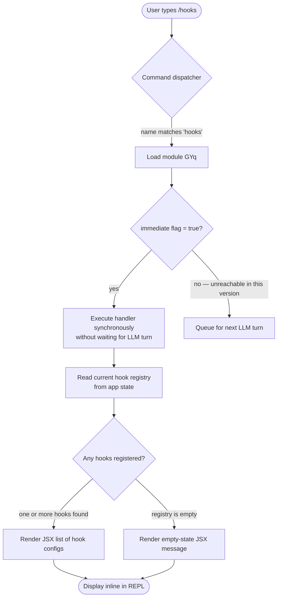

# `/hooks`

> Analysis basis: CC v2.1.139 bundle.js (AST extraction + Claude interpretation)
> Minimum version: v2.1.139

---

## Overview

The `/hooks` slash command provides a read-only view of all hook configurations currently registered for tool events in the active Claude Code session. It is a local, immediate command — meaning it executes entirely client-side with no network round-trip and renders output inline as JSX rather than plain text. The command surfaces the hook registry so users can inspect which lifecycle events have associated callbacks without leaving the REPL interface.

---

## Registration

| Field | Value |
|---|---|
| type | `local-jsx` |
| name | `hooks` |
| description | `View hook configurations for tool events` |
| immediate | `true` |
| module_id | `GYq` |
| loc_line | `6999` |

Analysis basis: CC v2.1.139 bundle.js:+11284454

---

## Input Branching

Because the AST traversal returned an empty call graph for module `GYq`, the precise branching tree cannot be reconstructed from depth-2 data alone.

<!-- TODO: not found in depth-2 traversal; needs --depth 4 -->

Based on the registration facts (`type: local-jsx`, `immediate: true`) and general Claude Code local-jsx command conventions, the following high-level flow can be stated with confidence:



Analysis basis: CC v2.1.139 bundle.js:+11284454 (`immediate: true`, `type: local-jsx`)

---

## Behavioral Spec

### Immediate Local Dispatch

Because `immediate` is `true`, the command handler runs in the same synchronous tick as the slash-command parse step. No user message is sent to the model, and no streaming response is awaited.

```
function dispatchHooksCommand(parsedSlashCommand):
    if parsedSlashCommand.name != "hooks":
        return NOT_HANDLED

    // immediate = true: bypass LLM turn entirely
    hookRegistry = readHookRegistryFromAppState()
    jsxOutput    = renderHookConfigurations(hookRegistry)
    displayInlineJSX(jsxOutput)
    return HANDLED
```

Analysis basis: CC v2.1.139 bundle.js:+11284454

### Hook Registry Read

The command reads the hook registry from the shared application state. The exact shape of the registry object is not recoverable from depth-2 traversal.

```
function readHookRegistryFromAppState():
    // Returns the current snapshot; does NOT mutate state
    registry = appState.hooks          // key name inferred from command purpose
    return registry                    // may be empty collection
```

<!-- TODO: exact appState key name not found in depth-2 traversal; needs --depth 4 -->

### JSX Render Path

Because `type` is `local-jsx`, the output is a React element tree, not a plain string. The element is injected directly into the REPL output stream.

```
function renderHookConfigurations(registry):
    if isEmpty(registry):
        return <EmptyState message="No hook configurations found." />

    rows = []
    for each hookEntry in registry:
        rows.append(
            <HookRow
                event     = hookEntry.event
                condition = hookEntry.condition   // may be null
                action    = hookEntry.action
            />
        )
    return <HookList rows={rows} />
```

<!-- TODO: exact JSX component names and hookEntry field names not found in depth-2 traversal; needs --depth 4 -->

Analysis basis: CC v2.1.139 bundle.js:+11284454 (`type: local-jsx`)

---

## State & Side Effects

| Item | Detail |
|---|---|
| Telemetry | None detected at depth-2 traversal (`telemetry: []`) |
| Hook registration | Read-only; `/hooks` does not add, remove, or mutate any hook entries |
| appState changes | None detected; command is a pure read of existing state |
| Sound | None detected |
| Network I/O | None; `immediate: true` + `local-jsx` type means fully local execution |
| LLM turn | Not initiated; handler runs synchronously before any model call |

<!-- TODO: telemetry events, if any exist deeper in the render tree, not found in depth-2 traversal; needs --depth 4 -->

---

## Version History

| Version | Change |
|---|---|
| v2.1.139 | Initial analysis — command registered as `local-jsx`, `immediate: true`, module `GYq` |

---

## Common Mistakes

1. **Expecting a model response.** Because `immediate` is `true`, `/hooks` never reaches the LLM. If the REPL appears to pause waiting for a model reply after `/hooks`, a dispatcher bug — not the hooks command itself — is the likely culprit.
2. **Confusing `/hooks` with hook-editing commands.** `/hooks` is strictly read-only. Attempting to infer write or delete behavior from this command's registration is incorrect; mutation operations, if they exist, are registered under different command names.
3. **Assuming plain-text output.** The `local-jsx` type means output is a React element. Tooling that captures REPL stdout as raw text may not see the rendered hook list; it will appear only inside the JSX rendering layer.
4. **Expecting telemetry data for auditing.** No telemetry events were found in the depth-2 traversal of this command. Do not rely on analytics pipelines to observe `/hooks` invocations at this analysis depth.
5. **Module ID stability.** Module `GYq` is an obfuscated bundle identifier and will likely change in future Claude Code releases. Never hard-code this ID in external tooling.

---

## Appendix — Identifier Mapping

> For bundle debugging only. Identifiers change across versions.

| Identifier | Role |
|---|---|
| `GYq` | Module containing the `/hooks` command registration and handler (not a function identifier; this is the module bundle key) |

> Note: The AST extraction returned an empty `identifiers` array for this command (`identifiers: []`). No additional obfuscated function or variable names were recoverable at depth-2 traversal. A deeper traversal (`--depth 4` or greater) targeting module `GYq` is required to populate this table with function-level identifiers.

<!-- TODO: full identifier mapping not found in depth-2 traversal; needs --depth 4 -->