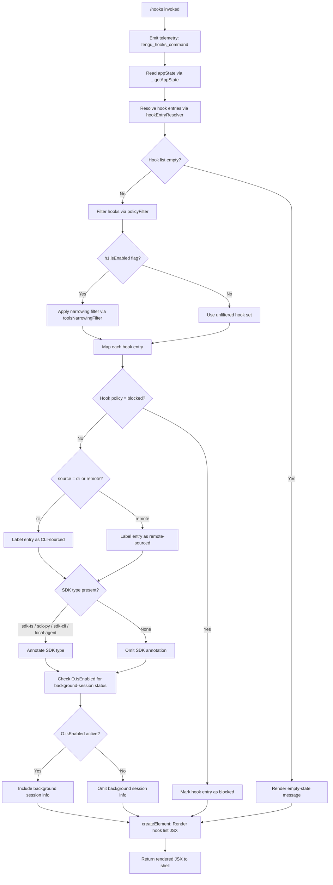

# `/hooks`

> Analysis basis: CC v2.1.139 bundle.js (AST extraction + Claude interpretation)
> Minimum version: v2.1.139

---

## Overview

The `/hooks` command displays the current hook configurations associated with tool events in the active Claude Code session. It is a read-only, immediate JSX-rendered command that reads application state, resolves hook entries, and renders a structured view of all registered hooks, their tool scopes, matchers, and policy settings without requiring any user-supplied arguments.

---

## Registration

| Field | Value |
|---|---|
| type | `local-jsx` |
| name | `hooks` |
| description | `View hook configurations for tool events` |
| immediate | `true` |
| module_id | `GYq` |
| load_inline | `true` |
| loc_byte | `11284454` |
| loc_byte_end | `11284604` |
| loc_line | `6999` |
| arbor_handler.name | `d27` |
| arbor_handler.fqn | `claude-2.1.139::d27` |
| arbor_handler.kind | `AsyncFunction` |
| arbor_handler.resolution_path | `module_id` |
| arbor_handler.n_hits | `0` |

Analysis basis: CC v2.1.139 bundle.js:+11284454

---

## Input Branching

The command exhibits several distinct branches when assembling and rendering the hook list. The logic forks on: (1) whether the hooks collection is empty, (2) whether each individual hook entry is blocked, (3) whether a hook source type is `cli` or `remote`, (4) whether SDK type values (`sdk-ts`, `sdk-py`, `sdk-cli`, `local-agent`) are present, and (5) whether the `h1.isEnabled` / `O.isEnabled` feature flags are active.



---

## Behavioral Spec

### 1. Command Entry Point — `d27` (AsyncFunction)

`d27` is the primary handler resolved by Arbor via the `module_id` path. It is an `AsyncFunction` registered inline (load_inline) under module `GYq`.

```
async function hooksCommandHandler(context):
    emit telemetry("tengu_hooks_command")          // bundle.js:+11284227
    state = context.getAppState()                  // bundle.js:+11284259
    hookDisplay = buildHookDisplayComponent(state) // bundle.js:+11284299
    element = createElement(hookDisplay)           // bundle.js:+11284329
    return element
```

Analysis basis: CC v2.1.139 bundle.js:+11284225

---

### 2. Hook Entry Resolution — `hookEntryResolver` (`iE`)

`iE` is the central hook-assembly routine. It orchestrates all sub-steps: formatting, policy filtering, source-type classification, feature-flag gating, and final JSX construction.

```
function hookEntryResolver(state):
    rawEntries = formatHookSource(state)           // SH  bundle.js:+8967231
    policyEntries = applyPolicyMap(rawEntries)     // Qj  bundle.js:+8967270
    filteredEntries = applyPermitFilter(policyEntries) // pe bundle.js:+8967302
    displayProps = buildDisplayProps(filteredEntries)   // DI_ bundle.js:+8967326
    labelledEntries = applyLabelMap(displayProps)       // LK  bundle.js:+8967338
    renderedBlock = renderHookBlock(labelledEntries)    // Be  bundle.js:+8967425

    if hookRegistry.has(renderedBlock):            // A.has bundle.js:+8967443
        // entry already registered; skip duplicate
        pass
    if anyEntry.some(isRelevant):                  // K.some bundle.js:+8967470
        applyMiscellaneousLogic()                  // ML  bundle.js:+8967482

    if featureFlag_h1.isEnabled():                 // bundle.js:+8967493
        filteredByFeature = entries.filter(...)    // K.filter bundle.js:+8967569
        if omitSet.has(entry):                     // OmH.has bundle.js:+8967584
            skip entry
        mappedEntries = filteredByFeature.map(...) // K.map  bundle.js:+8967612
        if featureFlag_O.isEnabled():              // O.isEnabled bundle.js:+8967623
            // background session mode active
            pass

    cz = formatConditionString(entries)            // Cz  bundle.js:+8967665
    if includeList.includes(entry):                // $.includes bundle.js:+8967709
        // final inclusion check
        pass

    return assembledHookView
```

Analysis basis: CC v2.1.139 bundle.js:+8967231

---

### 3. Policy Map Application — `applyPolicyMap` (`Qj`)

`Qj` iterates hook entries and classifies each by source type. Source values observed: `"cli"` and `"remote"`. It also emits telemetry `tengu_slate_harbor` and applies the `j6` (hook-registry-lookup) routine.

```
function applyPolicyMap(entries):
    for entry in entries:
        formatted = formatEntry(entry)             // TR  bundle.js:+3162847
        valueString = stringifyValue(entry)        // vq  bundle.js:+3162864
        label = formatLabel(entry)                 // SH  bundle.js:+3162909
        emit telemetry("tengu_slate_harbor")       // bundle.js:+3163029
        if entry.source == "cli":                  // bundle.js:+3162999
            classifyAsCli(entry)
        elif entry.source == "remote":             // bundle.js:+3163010
            classifyAsRemote(entry)
        sdkType = detectSdkType(entry)
        // sdk-ts, sdk-py, sdk-cli, local-agent    // bundle.js:+3163256–3163299
        registryEntry = resolveHookRegistry(entry) // j6  bundle.js:+3163026
    return classifiedEntries
```

Analysis basis: CC v2.1.139 bundle.js:+3162847

---

### 4. Hook Registry Lookup — `resolveHookRegistry` (`j6`)

`j6` checks and updates an internal hook registry using two set/map structures (`gfH`, `ZB`) and a deduplication set (`T8_`). It calls `Ql6` (dedup guard) and `b6` (timestamp writer).

```
function resolveHookRegistry(entry):
    primary = lookupPrimary(entry)                 // L46  bundle.js:+3112402
    secondary = lookupSecondary(entry)             // M46  bundle.js:+3112439
    ancestor = resolveAncestor(entry)              // Ya   bundle.js:+3112474

    if mainHookSet.has(entry):                     // gfH.has bundle.js:+3112491
        dedupResult = deduplicateEntry(entry)      // Ql6  bundle.js:+3112502
        mainSet.add(entry)                         // q46.add bundle.js:+3112514

    if secondaryMap.has(entry):                    // ZB.has bundle.js:+3112528
        existing = secondaryMap.get(entry)         // ZB.get bundle.js:+3112545
        writeTimestamp(existing)                   // b6   bundle.js:+3112565
    return resolvedEntry
```

Analysis basis: CC v2.1.139 bundle.js:+3112402

---

### 5. Deduplication Guard — `deduplicateEntry` (`Ql6`)

```
function deduplicateEntry(entry):
    if seenSet.has(entry):                         // T8_.has  bundle.js:+3110202
        cached = hookCache.get(entry)              // gfH.get  bundle.js:+3110226
        return cached
    seenSet.add(entry)                             // T8_.add  bundle.js:+3110242
    resolved = resolveGuarded(entry)               // G8_  bundle.js:+3110253
    fallback = resolveKeyFallback(entry)           // k8_  bundle.js:+3110327
    return resolved ?? fallback
```

Analysis basis: CC v2.1.139 bundle.js:+3110202

---

### 6. Timestamp Writer — `writeTimestamp` (`b6`)

`b6` records a wall-clock timestamp for the hook entry using `Date.now()`, alongside a composite key built from several subcomponents, then calls a persistence helper.

```
function writeTimestamp(entry):
    base = buildBase(entry)                        // B6   bundle.js:+3131668
    wrapped = wrapEntry(entry)                     // BW   bundle.js:+3131682
    unit = resolveUnit(entry)                      // U8_  bundle.js:+3131701
    config = getConfig(entry)                      // cfH  bundle.js:+3131705
    ts = Date.now()                                //      bundle.js:+3131757
    persist(entry, ts)                             // pVL  bundle.js:+3131810
```

Analysis basis: CC v2.1.139 bundle.js:+3131668

---

### 7. Permit Filter — `applyPermitFilter` (`pe`)

`pe` filters entries whose policy state evaluates to `"blocked"` and then applies the tool-narrowing logic (`W38`).

```
function applyPermitFilter(entries):
    nonBlocked = entries.filter(e => e.policy != "blocked") // H.filter bundle.js:+8966590
    narrowed = applyToolNarrowing(nonBlocked)               // W38 bundle.js:+8966605
    return narrowed
```

Analysis basis: CC v2.1.139 bundle.js:+8966590

The literal `"blocked"` appears at bundle.js:+8966651.

---

### 8. Tool Narrowing — `applyToolNarrowing` (`W38`)

`W38` applies two narrowing strategies: deny-list narrowing (`iDH`) and source-type narrowing (`Jy_`). It also calls a tertiary step `tt1`.

```
function applyToolNarrowing(entries):
    denyNarrowed = applyDenyNarrowing(entries)      // iDH bundle.js:+9744379
    sourceNarrowed = applySourceNarrowing(entries)  // Jy_ bundle.js:+9744396
    result = applyTertiaryNarrowing(sourceNarrowed) // tt1 bundle.js:+9744420
    return result
```

`iDH` uses `flatMap` over a tool list (`wy_`) and marks entries with policy `"deny"` (bundle.js:+9743746). It queries `qO` for tool metadata (bundle.js:+9743763).

`Jy_` checks for source classifications `"cliArg"` (bundle.js:+9744316) and `"toolsNarrowing"` (bundle.js:+9744337) via sub-routines `ab8`, `B_6`, and `ok`.

Analysis basis: CC v2.1.139 bundle.js:+9744379

---

### 9. Display Props Builder — `buildDisplayProps` (`DI_`)

`DI_` constructs the property object used for JSX rendering. It emits telemetry `tengu_cobalt_ridge`, handles Windows platform differences, and delegates to the module-registration helper `t_`.

```
function buildDisplayProps(entries):
    osContext = resolveOsContext(entries)           // yu  bundle.js:+8967158
    if platform == "windows":                      //     bundle.js:+4319386
        applyWindowsAdjustments(osContext)
    emit telemetry("tengu_cobalt_ridge")           //     bundle.js:+4319480
    moduleRegistrar = registerModule()             // t_  bundle.js:+8967188
    extraProps = buildFvhProps(entries)            // FVH bundle.js:+8967182
    return mergedProps
```

`yu` itself calls `o6` (OS resolver), `SH` (string formatter), `vq` (value stringifier), `W8H` (width helper), and `j6` (hook registry lookup).

Analysis basis: CC v2.1.139 bundle.js:+8967158

---

### 10. Label Mapper — `applyLabelMap` (`LK`)

```
function applyLabelMap(props):
    base = resolveBaseLabel(props)                 // o6  bundle.js:+4319522
    width = applyWidthConstraint(props)            // W8H bundle.js:+4319555
    return labelledProps
```

Analysis basis: CC v2.1.139 bundle.js:+4319522

---

### 11. Hook Block Renderer — `renderHookBlock` (`Be`)

`Be` is the most complex rendering sub-routine. It assembles the final hook display block including labels, condition strings, SDK-type annotations, permission states, and model-provider context.

```
function renderHookBlock(props):
    labels = applyLabelMap(props)                  // LK   bundle.js:+8965972
    conditionStr = formatConditionString(props)    // Cz   bundle.js:+8965988
    permissionStr = formatPermission(props)        // _P   bundle.js:+8966092
    headerStr = formatHeader(props)                // SH   bundle.js:+8966185
    windowNote = formatWindowNote(props)           // WnH  bundle.js:+8966256

    hookCreator_A = buildHookCreatorA(props)       // ar4  bundle.js:+8966275
    permCheck = checkPermission(props)             // q1   bundle.js:+8966316
    hookCreator_B = buildHookCreatorB(props)       // rr4  bundle.js:+8966322
    hookCreator_C = buildHookCreatorC(props)       // or4  bundle.js:+8966328

    displayProps = buildDisplayProps(props)        // DI_  bundle.js:+8966479
    toolCount = countTools(props)                  // Tc1  bundle.js:+8966520
    modelContext = buildModelContext(props)        // Qm   bundle.js:+8966547

    return assembleBlock(labels, conditionStr, permissionStr,
                         hookCreator_A, hookCreator_B, hookCreator_C,
                         toolCount, modelContext)
```

Analysis basis: CC v2.1.139 bundle.js:+8965972

---

### 12. Model Context Builder — `buildModelContext` (`Qm`)

`Qm` assembles provider/model context used in the hook display. Provider types encountered: `"standard"` (bundle.js:+9458699), `"tst"` (bundle.js:+9458778), `"tst-auto"` (bundle.js:+9458828). It also checks for `"bedrock"`, `"foundry"`, `"anthropicAws"`, `"mantle"`, `"vertex"`, and `"firstParty"` provider identifiers.

```
function buildModelContext(props):
    modelSpec = resolveModelSpec(props)            // FN_  bundle.js:+9459177
    tier = classifyModelTier(modelSpec)
    // tier: "standard" | "tst" | "tst-auto"
    // max tst count: 100                          //      bundle.js:+9458791
    providerStr = resolveProvider(modelSpec)       // N    bundle.js:+9459217
    // providers: bedrock, foundry, anthropicAws,
    //            mantle, vertex, firstParty        //      bundle.js:+2001281–2001498
    apiTarget = resolveApiTarget(providerStr)      // WA   bundle.js:+9459241
    // api.anthropic.com target                    //      bundle.js:+2002187
    debugMode = checkDebugMode()                   // N    bundle.js:+197070
    toolSearchWarning = checkVertexToolSearch()
    // "[ToolSearch:optimistic] disabled: Vertex AI..." // bundle.js:+9459713
    finalContext = buildQ3(modelSpec)              // Q3   bundle.js:+9459391
    return finalContext
```

Analysis basis: CC v2.1.139 bundle.js:+9459177

---

### 13. Permission Formatter — `formatPermission` (`_P`)

```
function formatPermission(props):
    baseStr = formatString(props)                  // SH  bundle.js:+5071591
    tail = appendTail(props)                       // T_  bundle.js:+5071648
    return baseStr + tail
```

Analysis basis: CC v2.1.139 bundle.js:+5071591

---

### 14. Permission Checker — `checkPermission` (`q1`)

```
function checkPermission(props):
    base = formatString(props)                     // SH   bundle.js:+5179436
    condition = buildCondition(props)              // Cq4  bundle.js:+5179491
    if agentTeamsFlag present:                     // "--agent-teams" bundle.js:+5179401
        applyTeamsCheck(props)
    emit telemetry("tengu_amber_flint")            //      bundle.js:+5179513
    registryLookup = resolveHookRegistry(props)    // j6   bundle.js:+5179510
    return permissionResult
```

Analysis basis: CC v2.1.139 bundle.js:+5179436

---

### 15. Condition String Formatter — `formatConditionString` (`Cz`)

```
function formatConditionString(props):
    result = formatString(props)                   // SH  bundle.js:+3163184
    return result
```

Analysis basis: CC v2.1.139 bundle.js:+3163184

---

### 16. Boolean / Toggle Literals

Throughout the call graph, boolean-like string literals control enable/disable semantics:
- Enabled: `"yes"` (bundle.js:+25237), `"on"` (bundle.js:+25243)
- Disabled: `"no"` (bundle.js:+25388), `"off"` (bundle.js:+25393)

These are evaluated by the string formatter `SH` which calls `String()` (bundle.js:+25188) and the value stringifier `vq` which also calls `String()` (bundle.js:+25338).

Analysis basis: CC v2.1.139 bundle.js:+25237

---

### 17. Daemon Status File

The hook display path reaches `fW6`, which constructs a path by joining with `vXq` and reading `"daemon.status.json"` (bundle.js:+11520008). This suggests hook configuration may include daemon-level status in certain display modes.

```
function resolveDaemonStatus():
    path = pathJoin(baseDir, "daemon.status.json") // fW6  bundle.js:+11519994
    timestamp = Date.now()                         //      bundle.js:+11520120
    data = readStatusFile(path)                    // RD   bundle.js:+11520152
    return data
```

Analysis basis: CC v2.1.139 bundle.js:+11520003

---

## State & Side Effects

| Item | Detail |
|---|---|
| Telemetry: `tengu_hooks_command` | Fired immediately on command invocation (bundle.js:+11284227) |
| Telemetry: `tengu_slate_harbor` | Fired during policy-map classification of each hook entry (bundle.js:+3163029) |
| Telemetry: `tengu_cobalt_ridge` | Fired during display-props construction, related to OS/platform context (bundle.js:+4319480) |
| Telemetry: `tengu_amber_flint` | Fired during permission checking, associated with `--agent-teams` path (bundle.js:+5179513) |
| appState changes | Read-only; `_.getAppState()` called but no write-back observed in depth-2 traversal (bundle.js:+11284259) |
| Hook registry (gfH / ZB / T8_) | Internal dedup sets and maps are read and updated during hook resolution (bundle.js:+3112491, +3112528, +3110202) |
| Timestamp recording | `Date.now()` written via `b6` / `pVL` for resolved entries (bundle.js:+3131757) |
| Daemon status file | `daemon.status.json` may be read during display construction (bundle.js:+11520008) |
| File I/O (RD path) | `randomBytes`, `writeFile`, `rename`, `copyFile`, `unlink` reachable via `NXq → RD`; depth-2 only, may be conditional (bundle.js:+2179223–2179450) |
| JSX rendering | `Pu_.createElement` called to produce the output element (bundle.js:+11284329) |
| Sound | <!-- TODO: not found in depth-2 traversal; needs --depth 4 --> |

---

## Version History

| Version | Change |
|---|---|
| v2.1.139 | Initial analysis |

---

## Common Mistakes

1. **Expecting argument parsing**: `/hooks` takes no arguments. It is `immediate: true` and renders the current hook configuration directly. Passing additional text after `/hooks` has no effect.
2. **Assuming hooks are writable via this command**: `/hooks` is a read-only display command. To modify hook configurations, use the Claude Code settings or configuration files directly.
3. **Confusing `blocked` state with an error**: Hook entries with policy `"blocked"` are a valid policy classification displayed in the output, not a runtime error condition.
4. **Expecting the command to re-read config from disk synchronously**: Hook data flows through `appState` and an internal registry with timestamp caching; the view may reflect a snapshot rather than live disk state.
5. **Overlooking SDK-type annotations**: Hooks sourced via `sdk-ts`, `sdk-py`, `sdk-cli`, or `local-agent` are annotated differently from `cli` or `remote` hooks. The display output varies by source type.
6. **Assuming uniform output across providers**: The model-context builder (`Qm`) produces different output depending on whether the active provider is `bedrock`, `vertex`, `foundry`, `anthropicAws`, `mantle`, or first-party. The `/hooks` display may include provider-specific annotations.

---

## Appendix — Identifier Mapping

> For bundle debugging only. Identifiers change across versions.

| Identifier | Role |
|---|---|
| `d27` | Primary handler (AsyncFunction) for the `/hooks` command; Arbor-resolved entry point |
| `Q` | Initial telemetry emitter / event dispatcher called first in handler |
| `_` | App-state accessor namespace (provides `getAppState`) |
| `iE` | Central hook-entry resolver; orchestrates all sub-steps |
| `SH` | String formatter utility (calls `String()` internally) |
| `Qj` | Policy map applicator; classifies hooks as `cli` or `remote` |
| `TR` | Entry formatter used within policy map |
| `vq` | Value stringifier (calls `String()` internally) |
| `j6` | Hook registry lookup and update routine |
| `L46` | Primary-lookup sub-routine within hook registry |
| `M46` | Secondary-lookup sub-routine within hook registry |
| `Ya` | Ancestor resolver within hook registry (calls `SH` and `Da`) |
| `Ql6` | Deduplication guard; checks/updates seen-set `T8_` |
| `b6` | Timestamp writer; records `Date.now()` for resolved entries |
| `pe` | Permit filter; removes `blocked` entries and delegates to tool narrowing |
| `H` | Utility with `filter`, `includes`, `trim` methods; also references `Math.random` / `setTimeout` |
| `W38` | Tool narrowing coordinator; applies deny and source narrowing |
| `iDH` | Deny-narrowing sub-routine; uses `flatMap` over tool list |
| `Jy_` | Source-narrowing sub-routine; handles `cliArg` and `toolsNarrowing` |
| `tt1` | Tertiary narrowing step called after source narrowing |
| `DI_` | Display-props builder; handles OS context and module registration |
| `yu` | OS context resolver (handles `"windows"` platform) |
| `t_` | Module registrar / ES-module setup helper |
| `$E6` | Bound module export reference used in module registration |
| `LK` | Label mapper; applies base label and width constraints |
| `Be` | Hook-block renderer; assembles full display block |
| `Cz` | Condition string formatter |
| `_P` | Permission formatter (string + tail) |
| `T_` | Tail-appender helper used by permission formatter |
| `WnH` | Window/platform note formatter |
| `ar4` | Hook creator variant A (calls `ed1` and `t_`) |
| `q1` | Permission checker (handles `--agent-teams`, emits `tengu_amber_flint`) |
| `Cq4` | Condition builder used within permission checker |
| `rr4` | Hook creator variant B (calls `bd1` and `t_`) |
| `or4` | Hook creator variant C (calls `Bd1` and `t_`) |
| `Qm` | Model context builder; resolves provider and tier |
| `FN_` | Model spec resolver (handles `standard`, `tst`, `tst-auto`) |
| `N` | Provider string resolver; handles debug mode, uppercase, trim |
| `WA` | API target resolver (handles `bedrock`, `vertex`, etc.) |
| `Q3` | Final model context assembler |
| `A` | Hook registry set; uses `toLowerCase` on keys |
| `f` | File/socket handle manager (close operations) |
| `q` | Unlink / file-set manager |
| `L` | File operation wrapper (add, finally, delete) |
| `K` | Entry collection with `map`, `filter`, `some`, `padEnd` operations |
| `ML` | Miscellaneous logic handler for relevant entries |
| `O` | Feature-flag object providing `isEnabled` (background session) |
| `x8` | Background session sub-resolver |
| `$` | Inclusion-list checker (provides `includes`) |
| `NXq` | Daemon status file reader coordinator |
| `Eo` | Sub-routine called during status resolution (calls `b5H`) |
| `RD` | File I/O executor (randomBytes, writeFile, rename, copyFile, unlink) |
| `fW6` | Path builder for `daemon.status.json` |
| `yH` | JSON serializer (calls `JSON.stringify`) |

---

Note: index built via Arbor fallback; some signals (telemetry, literals) may be missing — see arbor-fallback.js.