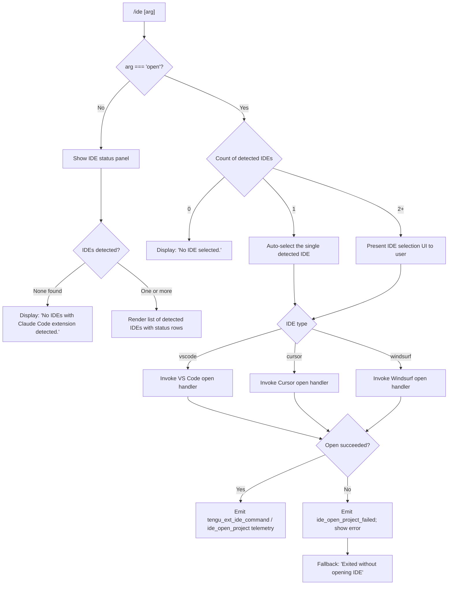

# `/ide`

> Analysis basis: CC v2.1.139 bundle.js (AST extraction + Claude interpretation)
> Minimum version: v2.1.139

---

## Overview

The `/ide` command manages IDE integrations for Claude Code: it scans the current environment for supported IDEs that have the Claude Code extension installed, displays their status, and — when the `open` subcommand argument is supplied — attempts to open the current project in a detected IDE. It operates as a `local-jsx` command, meaning it renders a React (JSX) component directly inside the Claude Code terminal UI rather than delegating to the agent loop.

---

## Registration

| Field | Value |
|---|---|
| type | `local-jsx` |
| name | `ide` |
| description | `Manage IDE integrations and show status` |
| argumentHint | `[open]` |
| module_id | `qqq` |
| load_inline | `true` |
| loc_byte | `10463951` |
| loc_byte_end | `10464107` |
| loc_line | `5782` |
| arbor_handler.name | `h37` |
| arbor_handler.fqn | `claude-2.1.139::h37` |
| arbor_handler.kind | `AsyncFunction` |
| arbor_handler.resolution_path | `module_id` |
| arbor_handler.n_hits | `0` |

Analysis basis: CC v2.1.139 bundle.js:+10463951

---

## Input Branching

The command has four well-defined branches based on the argument string and detected IDE state, so a Mermaid flowchart is used.



Analysis basis: CC v2.1.139 bundle.js:+10460011 (handler entry `h37`), +10460119 (`"open"` literal), +10460228 (`"No IDEs…"` literal), +10460366 (`"No IDE selected."` literal)

---

## Behavioral Spec

### Handler entry — `ideCommandHandler` (`h37`)

The Arbor-resolved handler is the async function `h37`. It is reached via the `module_id` resolution path through module `qqq`.

```
async function ideCommandHandler(context):
    emit telemetry("tengu_ext_ide_command")           // loc +10460013
    args = context.args                                // parsed CLI tokens
    ideList = await detectIDEs()                       // calls ideDetector (RFH)

    if args[0] === "open":                             // loc +10460119
        if ideList.length === 0:
            return renderText("No IDE selected.")      // loc +10460366
        else if ideList.length === 1:
            selected = ideList[0]
        else:
            selected = await promptUserToSelectIDE(ideList)

        if selected is null or user cancelled:
            return renderText("Exited without opening IDE")  // loc +10460963

        result = await openProjectInIDE(selected, context)   // calls ideOpenProject

        if result.ok:
            emit telemetry("ide_open_project")         // loc +10460566
        else:
            emit telemetry("ide_open_project_failed")  // loc +10460673
            renderError(result.error)
    else:
        // Status display path
        if ideList.length === 0:
            return renderText(
              "No IDEs with Claude Code extension detected.")  // loc +10460228
        renderIDEStatusPanel(ideList)
```

Analysis basis: CC v2.1.139 bundle.js:+10460011

---

### IDE detection — `ideDetector` (`RFH`)

`RFH` (called from `h37` at +10460171) discovers running IDEs and resolves their workspace paths.

```
async function ideDetector():
    candidates = []

    // Platform branch
    if platform === "linux":                          // loc +5097471
        rawOutput = shell("ps aux | grep -E 'code|cursor|windsurf|idea|...'")
        // grep pattern loc +5097497
        candidates = parseProcessList(rawOutput)      // calls processListParser (foA)
    else:
        candidates = await collectIDEsViaLockFiles()  // calls lockFileCollector (T68)

    emit telemetry("ide_detect")                      // loc +5093963

    results = await Promise.all(candidates.map(resolveIDEWorkspace))
    // resolveIDEWorkspace calls workspacePathResolver (c14)

    filtered = results.filter(isValid)
    if filtered.length === 0:
        emit telemetry("ide_detect_failed")           // loc +5094027

    return filtered
```

Analysis basis: CC v2.1.139 bundle.js:+5092620

---

### Lock-file IDE collector — `lockFileCollector` (`T68`)

Scans well-known lock-file directories to discover running IDE instances without relying on process enumeration.

```
async function lockFileCollector():
    lockDirs = buildLockFilePaths()        // calls lockPathBuilder (c14)
    // Uses path.join + homedir (GH1.homedir) loc +5090750
    // Checks ".claude" subdirectory loc +5090764

    instances = await Promise.all(
        lockDirs.map(async dir =>
            scanDirForLockFiles(dir)       // reads *.lock files loc +5089602
        )
    )
    return instances.flat().filter(Boolean)
```

Analysis basis: CC v2.1.139 bundle.js:+5089492

---

### Workspace path resolver — `workspacePathResolver` (`c14`)

Resolves a candidate IDE entry to a canonical workspace path, with special handling for WSL and Windows paths.

```
function workspacePathResolver(candidate):
    base = path.join(homedir, "ide")       // "ide" string loc +5090686

    // WSL detection
    if platform === "wsl":                 // loc +5090809
        // Skips paths under /mnt/c/Users/Public,
        //   /mnt/c/Users/Default, /mnt/c/Users/Default User,
        //   /mnt/c/Users/All Users              loc +5090971–5091129
        if path.startsWith("/mnt/c/Users"):
            if isSystemUser(path):
                return null

    resolved = fs.realpath(candidate.path)  // XH1.realpath loc +5091349

    if seen.has(resolved):                  // dedup set loc +5091393
        return null
    seen.add(resolved)

    if stat(resolved).isDirectory():        // loc +5091007
        return buildIDEEntry(resolved, candidate.type)
    if stat(resolved).isSymbolicLink():     // loc +5091025
        return resolveSymlink(resolved)

    return null
```

Analysis basis: CC v2.1.139 bundle.js:+5090673

---

### Process list parser — `processListParser` (`foA`)

Parses raw `ps aux` output to extract IDE PID and process name on Linux.

```
function processListParser(rawOutput):
    lines = String(rawOutput).split("\n")      // String() loc +2144102
    results = []
    for line of lines:
        pid = parseInt(line.fields[1])         // loc +2144442
        if isNaN(pid): continue               // loc +2144471
        // Runs shell command via "sh -c" loc +2144311 with 3000 ms timeout loc +2144334
        ideType = classifyProcessName(line)
        results.push({pid, ideType})
    return results
```

Analysis basis: CC v2.1.139 bundle.js:+5089195

---

### IDE type classifier — `ideTypeClassifier` (`rJ`)

Derives a canonical IDE type string from a process name or lock-file basename.

```
function ideTypeClassifier(processName):
    lower = processName.toLowerCase()          // loc +5098322
    base  = path.basename(lower)               // loc +5098380

    if lower.includes("code"):   return "vscode"    // "vscode" loc +10460426
    if lower.includes("cursor"): return "cursor"    // "cursor" loc +10460467
    if lower.includes("windsurf"): return "windsurf" // "windsurf" loc +10460508
    if lower.includes("appcode") or
       lower.includes("jetbrains"): return "jetbrains"
       // "appcode" loc +5097871, "jetbrains" loc +5089388
    // Additional JetBrains IDE names matched via regex (fH1) loc +5085065
    return classifyByRegex(lower)
```

Analysis basis: CC v2.1.139 bundle.js:+5098322

---

### Open project in IDE — `ideOpenProject` (`KO_` → `s14`)

Attempts to open the current project directory in the selected IDE.

```
async function openProjectInIDE(ide, context):
    // Determines open mode: "worktree" or "project" loc +10460600, +10460611
    openMode = context.isWorktree ? "worktree" : "project"

    // Retrieves IDE connection information
    connInfo = await getIDEConnection(ide)       // calls ideConnectionInfo (pP → $PH)

    // Sends open request via IDE extension protocol
    entries = Object.entries(connInfo)           // loc +5096911
    for [key, val] of entries:
        if allowedKeys.includes(key):            // loc +5096968
            payload.push({key, val})             // loc +5096983

    // IDE-type branch for display label loc +5097424
    label = ide.type.toLowerCase()

    result = await sendOpenRequest(payload)      // uses LH (logHandler)
    return result
```

Analysis basis: CC v2.1.139 bundle.js:+5097959

---

### IDE status panel renderer — `ideStatusPanel` (`V37`)

Called when no `open` argument is given and at least one IDE is present.

```
function renderIDEStatusPanel(ideList):
    // Renders a JSX component showing:
    //   - IDE type name (bold via f6.bold loc +10460627)
    //   - Connection status (connected / disconnected)
    //   - Protocol: "sse-ide" loc +10457998 or "ws-ide" loc +10458018
    // Shows advice: "restart your IDE" loc +10461231
    // Filters active connections: L.filter loc +10461561

    return <IDEStatusTable rows={ideList} />
```

Analysis basis: CC v2.1.139 bundle.js:+10461622

---

### Random IDE session token — `randomTokenHelper` (`VR_`)

A utility called during IDE session setup to generate a unique display-safe token for correlation.

```
function generateIDESessionToken(length = 100):  // 100 loc +10463415
    pool = existingTokens.slice(0, 0)            // initial slice loc +10463434
    // Uses Math.random + Math.floor loc +10463519
    // Unicode normalizes to "NFC" loc +10463556
    // Pads to at most 3 chars per segment loc +10463488
    // Joins with ", " loc +10463713 and ", …" for overflow loc +10463727
    return normalizedToken
```

Analysis basis: CC v2.1.139 bundle.js:+10463415

---

## State & Side Effects

| Item | Detail |
|---|---|
| Telemetry — `tengu_ext_ide_command` | Fired on every invocation of `/ide` (loc +10460013) |
| Telemetry — `ide_detect` | Fired after IDE detection completes (loc +5093963) |
| Telemetry — `ide_detect_failed` | Fired when zero IDEs are found (loc +5094027) |
| Telemetry — `ide_open_project` | Fired on successful project open (loc +10460566) |
| Telemetry — `ide_open_project_failed` | Fired when the open request fails (loc +10460673) |
| Telemetry — `tengu_bg_spare_*` | Background daemon spare-process lifecycle events emitted indirectly via daemon subsystem |
| Telemetry — `tengu_daemon_control` | Emitted by daemon control path reached through IDE session management (loc +14345083) |
| Telemetry — `tengu_config_parse_error` | Emitted if the config file cannot be parsed during IDE connection setup (loc +3135421) |
| Connection protocol | IDEs connect over `sse-ide` (Server-Sent Events) or `ws-ide` (WebSocket) — both detected at registration time (loc +10457998, +10458018) |
| File-system side effects | Reads lock files (`*.lock`) under the user's home `.claude` directory; may call `fs.realpath`, `fs.stat` on candidate paths |
| No appState mutations | The command renders a UI panel; it does not persist any appState changes itself |
| Sound | None observed in depth-2 traversal |

---

## Version History

| Version | Change |
|---|---|
| v2.1.139 | Initial analysis |

---

## Common Mistakes

1. **Invoking `/ide open` with no IDE running**: If no IDE with the Claude Code extension is active, the command reports `"No IDE selected."` and exits — install and start the extension in VS Code, Cursor, or Windsurf first.
2. **Forgetting the `open` subcommand**: `/ide` alone only displays status; it does not open anything. Use `/ide open` to trigger the project-open flow.
3. **Multiple IDEs detected ambiguity**: When two or more IDEs are detected, the command will present a selection prompt. Automating this flow (e.g. via piped input) may stall waiting for selection.
4. **WSL path exclusions**: On WSL, Windows system-user directories (`Public`, `Default`, `Default User`, `All Users`) under `/mnt/c/Users` are silently excluded from IDE scanning. A Claude Code extension installed only under one of these paths will not be detected.
5. **JetBrains IDEs**: JetBrains support exists in the detector but the displayed type string differs from VS Code variants. Ensure the matching JetBrains plugin is installed; the process scanner uses a broad regex (loc +5097497) that may produce false positives from similarly named processes.
6. **Protocol mismatch**: The background daemon must be running and speaking a compatible protocol. A `tengu_bg_proto_mismatch` event (loc +14299718) indicates the daemon needs to be restarted.

---

## Appendix — Identifier Mapping

> For bundle debugging only. Identifiers change across versions.

| Identifier | Role |
|---|---|
| `h37` | Main async handler for `/ide` command (Arbor-resolved) |
| `VR_` | IDE session token generator / display-list formatter |
| `C6` | IDE context / connection state accessor |
| `ry6` | Store accessor helper (calls `iy6.getStore`) |
| `UQ` | Unknown utility reached from store accessor |
| `A_` | Auxiliary helper called from connection state accessor |
| `RFH` | IDE detector — orchestrates platform-specific discovery |
| `T68` | Lock-file IDE collector |
| `c14` | Workspace path resolver (WSL-aware) |
| `foA` | Linux process list parser |
| `fH1` | JetBrains IDE regex matcher |
| `rJ` | IDE type classifier (process name → canonical string) |
| `i1` | String slice/index helper used in classification |
| `KO_` | IDE open-project orchestrator |
| `s14` | Open-project implementation (sends open request via extension protocol) |
| `pP` | IDE connection info fetcher |
| `$PH` | IDE extension protocol client constructor |
| `Q14` | IDE instance resolver called from detector |
| `O8` | IDE selection UI component |
| `$_` | IDE selection prompt logic |
| `V37` | IDE status panel renderer (JSX) |
| `SFH` | Status formatting helper called from handler |
| `QG` | Query/get helper called from handler |
| `yl` | Utility called from handler after open path |
| `lf` | Helper called at handler start |
| `LH` | Log/error handler |
| `q_` | Error constructor helper |
| `SH` | String coercion / safe-stringify helper |
| `S1` | Logging sub-helper |
| `G7A` | Logging sub-helper (calls SH) |
| `CGK` | Queue rotation helper (shift/push) |
| `yH` | JSON serialiser wrapper (calls JSON.stringify) |
| `U6` | JSON parser wrapper (calls JSON.parse) |
| `D8` | Error code wrapper (calls w8) |
| `w8` | Error code constant helper |
| `IH` | String coercion wrapper |
| `kH` | Key formatter / accessor helper |
| `xH` | Value formatter / accessor helper |
| `Y8` | Query wrapper calling Q |
| `TH1` | Process kill helper (calls process.kill) |
| `NXq` | Daemon status file writer |
| `RD` | Atomic file write helper (randomBytes + writeFile + rename) |
| `fW6` | Daemon status path builder |
| `ul_` | Platform dispatcher (macos / other) |
| `j6` | IDE registry / roster manager |
| `L46` | Registry sub-helper A |
| `M46` | Registry sub-helper B |
| `Ya` | Registry entry builder |
| `Da` | Registry data accessor |
| `Ql6` | IDE registration de-duplicator |
| `G8_` | IDE registration emitter (randomUUID + emit) |
| `k8_` | IDE registration finaliser |
| `b6` | Config watcher initialiser |
| `B6` | Config path resolver |
| `cfH` | Config file reader/writer |
| `U8_` | Config utility helper |
| `pVL` | File watcher setup (tl6.watchFile / unwatchFile) |
| `NXq` | Daemon status writer |
| `Eo` | Daemon bootstrap helper |
| `hl_` | Background PTY spare-process spawner |
| `x1` | PTY path helper |
| `R9q` | PTY socket path builder |
| `HQ` | PTY socket path resolver (calls XHH) |
| `C9q` | Secondary PTY path builder |
| `Zt7` | JSON array validator |
| `j3` | Array type-check wrapper |
| `Wt7` | Spawn options builder (Object.assign) |
| `Hk` | PTY PID file helper |
| `tIH` | PTY PID file path builder |
| `ml_` | Background session manager (main dispatch loop) |
| `K` | Session column formatter (padEnd) |
| `WK` | Job directory path builder |
| `rW` | Job path resolver |
| `Q1` | Job roster reader (stat + readFile + JSON cache) |
| `Vw` | Active-job filter |
| `KE` | Active-job predicate |
| `pf` | Job state persistence writer |
| `j2` | Job cache invalidator |
| `aiH` | Roster entry writer (async, with mkdir) |
| `Mp` | Roster file reader |
| `YM7` | Roster directory + file creator |
| `OKH` | Roster socket path builder |
| `fp` | PTY socket path helper |
| `aS_` | PTY socket descriptor builder |
| `riH` | PTY socket name builder |
| `w` | Background daemon session loop / supervisor |
| `S` | Session state machine |
| `yB` | State machine sub-routine |
| `v` | Away-summary / session resumption helper |
| `N` | Log-level message formatter |
| `_58` | App-state snapshot accessor |
| `_c7` | Away-summary context builder |
| `SUq` | Summary utility helper |
| `Z` | Promise/cancellation token |
| `WA8` | Away-summary API caller |
| `LHq` | UUID generator wrapper |
| `g` | Message history accessor |
| `b` | Session timeout handler |
| `Sl_` | Claim-frame sender (Unix socket write) |
| `Tt7` | Send-claim with timeout |
| `Et7` | Unix socket connect helper |
| `o8` | TCP/socket connection helper with timeout |
| `Gt7` | Claim frame builder |
| `_p` | Binary frame encoder (Buffer + UInt32BE + UInt8) |
| `P` | IPC message framer / dispatcher |
| `j` | IPC stream |
| `kf` | IPC response finaliser |
| `ht7` | IPC message router (main daemon protocol handler) |
| `St7` | IPC sub-handler |
| `M` | Session map lookup |
| `PY` | Permission query helper |
| `bl_` | Lease/backoff helper |
| `Maq` | Dispatch timeout/retry logic |
| `MG` | Multiplex path joiner |
| `AO` | Real-path normaliser |
| `o4H` | PTY log tail reader |
| `kt7` | Stall detection helper |
| `OHH` | Unknown IPC helper |
| `yt7` | Session garbage collector |
| `_H` | Input focus recorder |
| `m` | Supervisor idle-exit timer |
| `a` | Voice recording session state machine |
| `F` | MCP tool filter |
| `d` | IPC write proxy |
| `l` | Message filter |
| `GT6` | IPC write/destroy helper |
| `G` | Session group accessor |
| `X` | MCP / SSE connection handler |
| `U08` | Unknown session utility |
| `W` | Skill / hook runner |
| `z` | Skill / hook registry |
| `NR` | Hook registration helper |
| `Cb` | Graceful-exit coordinator |
| `A3H` | Hook dispatch orchestrator |
| `q4` | Hook effort evaluator |
| `uX` | Hook execution engine |
| `spH` | Hook "some" predicate |
| `R$8` | Hook result reducer |
| `le` | Hook post-processor |
| `M1H` | Hook output helper A |
| `K$8` | Hook output helper B |
| `Hi1` | Hook output helper C |
| `UnH` | Hook state clearer |