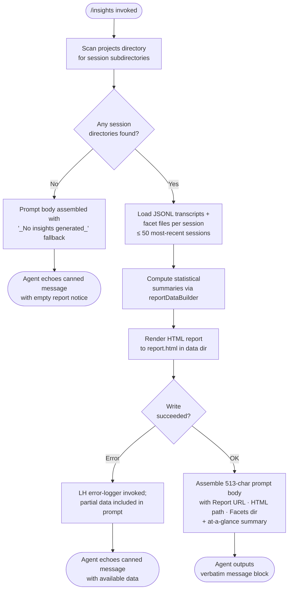

```
---
type: feature-spec
feature: "insights"
cc_version: "2.1.139"
updated: "2026-05-31"
tags: ["insights", "commands", "slash-commands"]
source: "bundle-analysis"
bundle_verified: true
analysis_basis: "CC v2.1.139 bundle.js (AST extraction + Claude interpretation)"
author: "ryujaeuk <ryujaeuk@gmail.com>"
repository: "https://github.com/MyLittleLuckyDog/cc-gnothi"
license: "AGPL-3.0-only"
---

# `/insights`

> Analysis basis: CC v2.1.139 bundle.js (AST extraction + Claude interpretation)
> Minimum version: v2.1.139

---

## Overview

`/insights` generates a comprehensive HTML usage-analytics report by reading the local Claude Code session data (JSONL transcripts, facets, and session-metadata files), building structured statistical summaries across all recorded projects, and then instructing the agent to surface a single canned confirmation message to the user along with a shareable URL and file path to the rendered report. The command's handler (`getPromptForCommand`) performs all data-collection and HTML-rendering work synchronously before the agent speaks; the agent's only job is to echo the pre-formatted `<message>` block verbatim.

---

## Registration

| Field | Value |
|---|---|
| type | `prompt` |
| name | `insights` |
| description | `Generate a report analyzing your Claude Code sessions` |
| loc_byte | `11910306` |
| loc_byte_end | `11911610` |
| loc_line | `8794` |
| handler_method | `getPromptForCommand` |
| handler_method_start | `11910480` |
| handler_method_end | `11911609` |
| prompt_body.length | `513` characters |
| prompt_body.trace | `call→DTq(...) (1 literals)` |
| arbor_handler.name | `getPromptForCommand` |
| arbor_handler.kind | `Method` |
| arbor_handler.resolution_path | `direct` |
| arbor_handler.fqn | `claude-2.1.139::getPromptForCommand` |
| arbor_handler.n_hits | `1` |

Analysis basis: CC v2.1.139 bundle.js:+11910306

---

## Input Branching

The command takes no user-supplied arguments. Internally the handler follows three major branches depending on the availability of session data and whether the HTML report can be written successfully. There are four distinct paths, so a flowchart is used.



---

## Behavioral Spec

### 1. Session Discovery (`sessionDirectoryScanner`)

Analysis basis: CC v2.1.139 bundle.js:+11897225

```
function sessionDirectoryScanner(dataRoot):
    entries = fs.readdir(dataRoot)                    # Hk7 → th.readdir
    dirs = filter(entries, entry => entry.isDirectory())  # Hk7 → K.isDirectory
    for each dir in dirs:
        subEntries = fs.readdir(join(dataRoot, dir))  # Hk7 → jQ.join + th.readdir
        jsonlFiles = filter(subEntries, isJsonlFile)  # aoH → K.isFile, extension ".jsonl"
        push discovered sessions into queue
    setImmediate(continueScan)                        # yields the event loop during heavy scans
    sorted = queue.sort(...)                          # Hk7 → q.sort — chronological order
    return sorted
```

- Session root path is constructed by joining `"projects"` as a sub-directory key (bundle.js:+11923340).
- Only files with extension `".jsonl"` are admitted (bundle.js:+11975477).
- The scanner caps the working set: only the **50 most-recent sessions** are passed to the data-loader (`A.slice` at bundle.js:+11897690; limit value `50` at bundle.js:+11897636 / `200` total scanned at bundle.js:+11897641).

### 2. Session Data Loading (`sessionDataLoader` / `gN7`)

Analysis basis: CC v2.1.139 bundle.js:+11843084

```
function sessionDataLoader(sessionDir):
    usageDataPath    = join(sessionDir, "usage-data")   # literal bundle.js:+11837020
    sessionMetaPath  = join(sessionDir, "session-meta") # literal bundle.js:+11837116
    facetsDir        = join(sessionDir, "facets")       # literal bundle.js:+11837070
    raw = fs.readFile(usageDataPath, "utf-8")           # encoding literal bundle.js:+11843151
    parsed = jsonSafeParse(raw)                         # U6 → JSON.parse bundle.js:+178301
    return { usageData: parsed, sessionMetaPath, facetsDir }
```

- `"utf-8"` encoding is used for all reads (bundle.js:+11843151).
- Missing files are handled gracefully; errors are logged via the `LH` error logger (bundle.js:+11843372).

### 3. Facet File Enumeration (`facetDirectoryScanner` / `aoH`)

Analysis basis: CC v2.1.139 bundle.js:+11975371

```
function facetDirectoryScanner(facetsDir):
    entries = fs.readdir(facetsDir)           # zL.readdir
    files   = filter(entries, e => e.isFile() AND extensionFilter(e))
    names   = entries.map(e => path.basename(e))   # t3.basename
    stats   = await Promise.all(files.map(f => fs.stat(f)))  # zL.stat
    metadata = stats.map(s => set(s.mtime, s.size, ...))
    return { fileNames: names, metadata }
```

- Only files (not sub-directories) whose names pass `extensionFilter` (via `Ul` / `m44.test`) are retained (bundle.js:+11975502).
- Stale or deleted facet files may be unlinked during enumeration (`Aaq.unlinkSync` reached via `q` at bundle.js:+14290176).

### 4. Report-Data Assembly (`reportDataBuilder` / `zTq`)

Analysis basis: CC v2.1.139 bundle.js:+11897617

The builder aggregates data from all loaded sessions and produces the structured object that is later used for HTML rendering and for the prompt's "at-a-glance summary".

```
function reportDataBuilder(sessions):
    # Trim to the 50-session working set
    workingSet = sessions.slice(0, 50)        # bundle.js:+11897690

    # Load each session in parallel
    loaded = await Promise.all(workingSet.map(sessionDataLoader))

    # Accumulate stats per project
    for session in loaded:
        if session includes "record_facets":  # literal bundle.js:+11898074
            push facet records
        push usage records

    # Build sub-reports
    activityReport   = buildActivityTimeline(loaded)   # $Tq path
    toolUsageReport  = buildToolUsageSummary(loaded)   # cN7 path
    errorReport      = buildErrorSummary(loaded)       # nN7 path
    timeOfDayReport  = buildTimeOfDayBuckets(loaded)   # tN7 path
    atAGlance        = buildAtAGlance(loaded)          # literal "at_a_glance" bundle.js:+11850814

    # Validate JSON-only output requirement
    # An intermediate sub-call emits: "RESPOND WITH ONLY A VALID JSON OBJECT"
    # (bundle.js:+11898021) when requesting structured facet data from the model

    return { activityReport, toolUsageReport, errorReport,
             timeOfDayReport, atAGlance }
```

Key limits and constants found in the builder:

| Constant | Value | Purpose | Citation |
|---|---|---|---|
| Max sessions sliced | 50 | Working-set cap | bundle.js:+11897636 |
| Scan window | 200 | Candidates examined before slice | bundle.js:+11897641 |
| Batch parallelism | controlled by `Promise.all` | Parallel load | bundle.js:+11897713 |
| Max token budget for facets | 4096 | Facet data size guard | bundle.js:+11844526 |
| Session-age cutoff | 1 800 000 ms (30 min) | Recency window for live sessions | bundle.js:+11845042 |
| Chunk size for parallel HTML render | 8192 | Internal buffer | bundle.js:+11852956 |

### 5. Activity-Timeline Sub-Report (`activityTimelineBuilder` / `$Tq`)

Analysis basis: CC v2.1.139 bundle.js:+11837554

```
function activityTimelineBuilder(sessions):
    for session in sessions:
        if Array.isArray(session.messages):
            for msg in session.messages:
                classify(msg)           # WebSearch, WebFetch, Edit, Write literals
                if msg startsWith "git commit": recordCommit()   # bundle.js:+11838100
                if msg startsWith "git push":   recordPush()     # bundle.js:+11838132
                bucket by hour using msg.timestamp.getHours()    # bundle.js:+11838403
                categorise duration (1000 ms = 1 s, 3600 s = 1 h thresholds)
                                                                 # bundle.js:+11838502 / +11838517
    return timelineSeries
```

Tool names recognised: `"WebSearch"`, `"WebFetch"`, `"Edit"`, `"Write"` (bundle.js:+11837713–11837856).

Failure categories emitted into the report: `"Command Failed"`, `"User Rejected"`, `"Edit Failed"`, `"File Changed"`, `"File Too Large"`, `"File Not Found"` (bundle.js:+11838731–11839127).

### 6. Statistical-Summary Sub-Reports

#### Tool-Usage Summary (`toolUsageSummaryBuilder` / `cN7`)

Analysis basis: CC v2.1.139 bundle.js:+11846405

```
function toolUsageSummaryBuilder(sessions):
    counts = {}
    for session in sessions:
        Object.entries(session.toolCalls).forEach(([tool, n]) => counts[tool] += n)
    sorted   = counts.sort(desc)
    medians  = computeMedian(sorted)          # Math.floor + Array.at bundle.js:+11848407/11848298
    rounded  = Math.round(medians)            # bundle.js:+11848586
    histogram = buildHistogram(sorted, OTq)  # percentile bucketing
    return { sorted, medians, histogram }
```

#### Error Summary (`errorSummaryBuilder` / `nN7`)

Analysis basis: CC v2.1.139 bundle.js:+11849268

```
function errorSummaryBuilder(sessions):
    allErrors = Array.from(sessions.values())
    Object.entries(allErrors).forEach(entry => tally(entry))
    roundedRates = Math.round(rates)          # bundle.js:+11849733
    fallback     = "None captured"            # literal bundle.js:+11850148
    return errorTally
```

- Uses `Promise.all` with parallel per-session processing (bundle.js:+11850173).
- Delegates HTML rendering of individual error rows to `fTq` (bundle.js:+11850198).

#### Time-of-Day Report (`timeOfDayReportBuilder` / `tN7`)

Analysis basis: CC v2.1.139 bundle.js:+11855421

```
function timeOfDayReportBuilder(sessions):
    buckets = {
        "Morning (6-12)":   hours [6,7,...,11],
        "Afternoon (12-18)": hours [12,13,14,15,16,17],
        "Evening (18-24)":  hours [18,19,20,21,22,23],
        "Night (0-6)":      hours [0,1,2,3,4,5]
    }
    # Literals at bundle.js:+11854635 / +11854682 / +11854736 / +11854788
    for session in sessions:
        hour = session.timestamp.getHours()
        bucket = classify(hour, buckets)
        increment(bucket)
    return buckets
```

Response-time bands labelled in the HTML report: `"2-10s"`, `"10-30s"`, `"30s-1m"`, `"1-2m"`, `"2-5m"`, `"5-15m"`, `">15m"` (bundle.js:+11853787–11853847).

### 7. HTML Report Rendering (`htmlReportRenderer` / `tN7` + `iKH` + `oN7` + `aN7`)

Analysis basis: CC v2.1.139 bundle.js:+11855421

```
function htmlReportRenderer(reportData):
    # HTML escaping (d5 helper)
    escaped = input.replaceAll("&", "&amp;")
                   .replaceAll("<", "&lt;")
                   .replaceAll(">", "&gt;")   # bundle.js:+4215637/4215661/4215684
    # Markdown-to-HTML passes
    bold    = text.replace(/\*\*(.*?)\*\*/g, "<strong>$1</strong>")  # bundle.js:+11855493
    bullets = "• " + line                                              # bundle.js:+11855536
    lineBreaks = "\n" → "<br>"                                         # bundle.js:+11855566
    # Colour palette used for chart bars
    colors = ["#2563eb", "#0891b2", "#10b981", "#8b5cf6",
              "#dc2626", "#16a34a", "#eab308"]
    # bundle.js:+11891452 / +11891590 / +11891762 / +11891905
    # bundle.js:+11895168 / +11895417 / +11895910
    # Empty-state placeholders
    emptyData = '<p class="empty">No data</p>'              # bundle.js:+11853278
    emptyRT   = '<p class="empty">No response time data</p>' # bundle.js:+11853735
    emptyTime = '<p class="empty">No time data</p>'          # bundle.js:+11854585
    emptyErr  = '<p class="empty">No tool errors</p>'        # bundle.js:+11895179
    # "Add to CLAUDE.md" suggestion button text
    ctaText = "Add to CLAUDE.md"                             # bundle.js:+11859131
    # Write completed HTML to disk
    fs.writeFile(join(dataDir, "report.html"), html)         # literal bundle.js:+11899673
```

Maximum HTML content length passed to the buffer: 8192 bytes (bundle.js:+11852956).

### 8. Prompt Construction (`getPromptForCommand` / handler)

Analysis basis: CC v2.1.139 bundle.js:+11910480

```
function getPromptForCommand(context):
    reportData  = await reportDataBuilder(context.sessions)   # zTq call bundle.js:+11910579
    atAGlance   = reportData.atAGlance                        # "at_a_glance" key
    roundedStat = Math.round(atAGlance.primaryMetric)         # bundle.js:+11910867
    separator   = " · "                                       # literal bundle.js:+11910938

    reportURL   = buildReportURL(reportData)   # DTq call bundle.js:+11911512
    htmlPath    = cj8(dataDir, "report.html")  # bundle.js:+11911576
    facetsDir   = resolvePathHelper(dataDir)

    if no sessions found OR report generation failed:
        fallback = "_No insights generated_"   # literal bundle.js:+11911377

    promptBody = assemblePrompt(
        insightsData = reportData,
        reportURL    = reportURL,
        htmlFile     = htmlPath,
        facetsDir    = facetsDir,
        atAGlance    = atAGlance,
        fallback     = fallback
    )
    # Total assembled prompt: 513 characters (bundle.js trace)
    # Agent is instructed to output ONLY the <message>…</message> block verbatim.
    return promptBody
```

The `<message>` block the agent is instructed to reproduce verbatim contains:
- A confirmation line beginning "Your shareable insights report is ready:" followed by the report URL.
- A follow-up offer: "Want to dig into any section or try one of the suggestions?"

The handler includes an explicit directive: **"Do not omit any line"** from the `<message>` block, making the agent's response effectively non-generative — it must reproduce the pre-built string exactly.

### 9. JSON-Only Facet Sub-Call

Analysis basis: CC v2.1.139 bundle.js:+11898021

During data assembly, a sub-invocation to the model requests structured facet classification. The literal `"RESPOND WITH ONLY A VALID JSON OBJECT"` (bundle.js:+11898021) is prepended to that sub-request. This is an internal, non-user-visible call; the user only ever sees the final `<message>` block.

---

## State & Side Effects

| Item | Detail |
|---|---|
| Telemetry | No `tengu_insights_*` events found in depth-2 traversal; telemetry events found in reach are daemon/bg/transcript lifecycle events (see table below) |
| File writes | `report.html` written to the Claude Code data directory (bundle.js:+11899673); facet JSON files may be written via `QN7` → `th.writeFile` (bundle.js:+11843306) |
| File reads | JSONL transcripts, `usage-data`, `session-meta` per session; `facets/` directory entries via `zL.readdir` |
| File deletes | Stale facet files unlinked via `Aaq.unlinkSync` during enumeration (bundle.js:+14290176) |
| Directory creation | `th.mkdir` called to ensure data and facets directories exist (bundle.js:+11899615, +11843225, +11842911) |
| appState changes | None observed at depth-2 for `/insights` specifically |
| Sound | None |
| Hook registration | None directly registered by this command |
| MCP side effects | None; `WIH`/`Wa7` in the call graph are reached via generic MCP state — not triggered by `/insights` directly |

### Telemetry Events Reached (Indirect)

These events are reachable within the depth-2 call graph but belong to shared infrastructure, not to `/insights` specifically:

| Event | Location |
|---|---|
| `tengu_daemon_yield` | bundle.js:+14328174 |
| `tengu_bg_dispatch_sigkill_escalate` | bundle.js:+14310587 |
| `tengu_bg_dispatch_low_mem` | bundle.js:+14311166 |
| `tengu_bg_spare_enable` | bundle.js:+14311781 |
| `tengu_bg_spare_claim` | bundle.js:+14311902 |
| `tengu_bg_spare_claim_fail` | bundle.js:+14312165 |
| `tengu_daemon_control` | bundle.js:+14345083 |
| `tengu_daemon_config_reload` | bundle.js:+14324140 |
| `tengu_bg_spare_spawn` | bundle.js:+14310364 |
| `tengu_transcript_phantom_parent` | bundle.js:+11961119 |
| `tengu_relink_walk_broken` | bundle.js:+11943241 |
| `tengu_transcript_parent_cycle` | bundle.js:+11964537 |
| `tengu_chain_parent_cycle` | bundle.js:+11944257 |
| `tengu_chain_timestamp_fallback` | bundle.js:+11944406 |
| `tengu_chain_parallel_tr_recovered` | bundle.js:+11946272 |

---

## Version History

| Version | Change |
|---|---|
| v2.1.139 | Initial analysis |

---

## Common Mistakes

1. **Expecting rich agent commentary**: The agent is explicitly instructed to output *only* the `<message>` block verbatim. Any follow-up analysis requires the user to ask a separate question after the command completes.
2. **Running `/insights` before any sessions exist**: If the `projects` directory contains no session subdirectories, the prompt body will include the `"_No insights generated_"` fallback (bundle.js:+11911377) and the report URL will be empty or absent.
3. **Assuming real-time data**: The report is built from on-disk JSONL transcripts and pre-recorded facet files, not from the live in-memory session state. Sessions not yet flushed to disk may be absent from the report.
4. **Expecting the HTML report at a fixed global path**: The `report.html` path is assembled dynamically using the user's Claude Code data directory; it is not a stable, version-independent path.
5. **Confusing the internal JSON sub-call with the user-facing output**: The `"RESPOND WITH ONLY A VALID JSON OBJECT"` directive (bundle.js:+11898021) belongs to an internal facet-classification sub-invocation, not to the user-facing response format.
6. **Running on a large session history and expecting instant results**: The command processes up to 50 sessions in parallel, each requiring filesystem reads. On machines with slow I/O or very large JSONL files, invocation latency can be noticeable.

---

## Appendix — Identifier Mapping

> For bundle debugging only. Identifiers change across versions.

| Identifier | Role |
|---|---|
| `__handler_insights` | Synthetic BFS entry for the `/insights` command handler (not a real bundle symbol) |
| `zTq` | `reportDataBuilder` — top-level data-aggregation function called by the handler |
| `Hk7` | `sessionDirectoryScanner` — walks the projects directory for session subdirs |
| `sg` | `projectsPathHelper` — joins the `"projects"` string onto the data root |
| `aoH` | `facetDirectoryScanner` — enumerates `.jsonl` facet files in a session's facets dir |
| `Ul` | `jsonlExtensionFilter` — regex test for `.jsonl` file extension |
| `gN7` | `sessionDataLoader` — reads `usage-data` and `session-meta` files for one session |
| `XU_` | `sessionMetaPathBuilder` — joins `"session-meta"` onto the session directory |
| `dj8` | `usageDataPathBuilder` — joins `"usage-data"` onto the session directory |
| `U6` | `jsonSafeParse` — wraps `JSON.parse` |
| `yH` | `jsonStringify` — wraps `JSON.stringify` |
| `QN7` | `facetFileWriter` — mkdir + writeFile for facet JSON output |
| `BN7` | `facetFileReader` — readFile + parse for stored facet files |
| `cj8` | `facetsSubdirPathBuilder` — joins `"facets"` subdirectory onto the session path |
| `GU_` | `reportSectionBuilder` — builds one section of the aggregated report |
| `$Tq` | `activityTimelineBuilder` — session-level activity timeline sub-report |
| `cN7` | `toolUsageSummaryBuilder` — per-tool call-count aggregation and sorting |
| `OTq` | `percentileHistogramBuilder` — builds percentile-bucket histogram for tool usage |
| `nN7` | `errorSummaryBuilder` — tallies error categories across sessions |
| `fTq` | `errorRowRenderer` — renders individual error rows to HTML |
| `tN7` | `htmlReportRenderer` — full HTML report renderer and time-of-day report |
| `iKH` | `tableRendererHelper` — renders HTML table sections within the report |
| `oN7` | `maxValueCalculator` — computes max values for chart scaling |
| `aN7` | `barChartRenderer` — renders horizontal bar chart HTML |
| `sN7` | `sectionJsonSerializer` — serializes a report section to JSON for embedding |
| `Qj8` | `markdownInlineRenderer` — converts inline markdown to HTML within report |
| `C7` | `htmlEscapeHelper` — delegates to `d5` for entity escaping |
| `d5` | `htmlEntityEscaper` — replaces `&`, `<`, `>`, `"`, `'` with HTML entities |
| `h26` | `promptTokenizer` — tokenizes prompt text for compact representation |
| `pU_` | `compactPromptFormatter` — replaces and slices prompt for summary display |
| `ZcH` | `messageMapper` — maps message objects to display format |
| `KEq` | `facetAccumulator` — accumulates facet records into running totals |
| `d1H` | `chainBuilder` — builds conversation chains from parent-uuid links |
| `Sk7` | `chainValidator` — validates chain integrity (NaN checks, deduplication) |
| `Rk7` | `chainSorter` — sorts chain entries by timestamp/index |
| `yk7` | `chainTopologicalSorter` — topological sort with cycle detection |
| `lj8` | `sessionStateAggregator` — reads and merges per-session KV metadata store |
| `Xe` | `sessionStateStore` — in-memory KV store for session metadata |
| `Qk7` | `sessionFileBinaryReader` — low-level binary reader for session transcript files |
| `dk7` | `sessionFileHeaderReader` — reads and parses file header portion |
| `gTq` | `sessionRelinkWalker` — walks and repairs broken parent-uuid links |
| `gk7` | `sessionFileMerger` — merges binary transcript segments |
| `bN7` | `nanGuard` — wraps `Number.isNaN` check for safe numeric operations |
| `dN7` | `reportGenerationOrchestrator` — orchestrates the full report generation pipeline |
| `UN7` | `parallelSessionProcessor` — fans out session processing with `Promise.all` |
| `uN7` | `sectionChunkProcessor` — chunks and processes one report section |
| `XDH` | `insightsFacetGenerator` — calls the model for structured facet JSON |
| `MTq` | `templateRenderer` — renders a named template with data bindings |
| `tZ` | `templateLookup` — resolves template by name |
| `NK` | `messageFilterByRole` — filters messages by role (`H.filter`) |
| `fTq` | `errorRowRenderer` — per-error-row HTML fragment builder |
| `yN7` | `insightsTemplateResolver` — resolves the `"insights"` template (literal bundle.js:+11844417) |
| `DTq` | `reportUrlBuilder` — constructs the shareable report URL inserted into the prompt |
| `WU_` | `warmupMinimalHelper` — handles `"warmup_minimal"` mode (literal bundle.js:+11899432) |
| `lM` | `durationFormatter` — formats millisecond durations for display |
| `LH` | `errorLogger` — logs errors via `Jd.logError` and pushes to `RSH` |
| `q_` | `errorWrapper` — wraps errors with `String()` coercion |
| `IH` | `stringCoercer` — wraps `String()` constructor |
| `SH` | `stringConstructor` — thin wrapper around `String` |
| `_k7` | `objectKeyLister` — enumerates `Object.keys` of a report object |
| `ooH` | `objectEntryIterator` — iterates `Object.entries` for nested report data |
| `i1` | `stringSliceHelper` — `H.indexOf` + `H.slice` pair for substring extraction |
| `WIH` | `mcpConnectionManager` — MCP connection lifecycle manager (shared infra) |
| `Wa7` | `mcpServerGroupManager` — manages groups of MCP server connections (shared infra) |
| `Niq` | `mcpServerUpdater` — applies incremental MCP server configuration updates |
| `DiH` | `mcpYieldHelper` — yields to MCP async scheduler |
| `NXq` | `backgroundSessionTimer` — timestamps background session events |
| `Kk_` | `oauthFlowInitiator` — starts OAuth flow for MCP servers (shared infra) |
| `Lk_` | `oauthCallbackHandler` — handles OAuth redirect callback (shared infra) |
| `oa1` | `insightsFileWriter` — writes insights data file via `iqH.writeFile` |
| `vO8` | `mcpAuthStateHelper` — reads MCP auth state |
| `WI` | `mcpCleanupHelper` — runs MCP connection cleanup |
| `Q_7` | `timestampRecorder` — records `Date.now()` timestamps |
| `vk_` | `insightsPathResolver` — resolves the insights output file path |
| `IO8` | `insightsOutputFormatter` — formats insights data for file output |
```