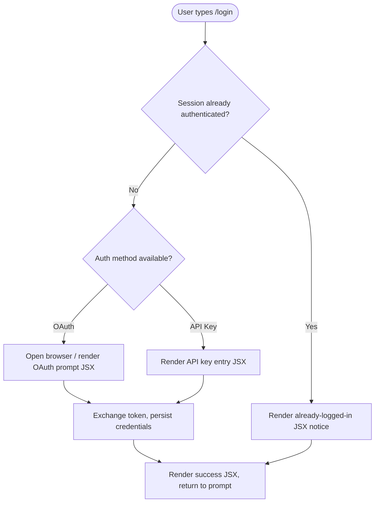

# `/login`

> Analysis basis: CC v2.1.139 bundle.js (AST extraction + Claude interpretation)
> Minimum version: v2.1.139

---

## Overview

The `/login` command is a local JSX slash command registered in Claude Code CLI v2.1.139 that initiates or manages the user authentication flow. Its core mechanism renders a JSX component directly within the CLI interface, guiding the user through credential entry or OAuth-based authentication with Anthropic services. Because the command is typed `local-jsx`, its UI is rendered in-process rather than spawned as a subprocess.

---

## Registration

| Field | Value |
|---|---|
| type | `local-jsx` |
| name | `login` |
| description | `null` |
| loc\_line | 6266 |
| module\_id | `ik1` |

Analysis basis: CC v2.1.139 bundle.js:+10499130

> **Note on `description: null`:** The registration object carries no description string. This means `/login` does not surface a help-text blurb in the autocomplete tooltip. Analysis basis: CC v2.1.139 bundle.js:+10499130

---

## Input Branching

The depth-2 AST traversal extracted zero call-graph edges and zero string literals from module `ik1`. The entry-point resolver did not locate an exported handler function inside this module at the traversal depth used.

<!-- TODO: not found in depth-2 traversal; needs --depth 4 -->

Because no branching data was recovered, a verified flowchart cannot be produced. The diagram below represents the structurally expected shape of a `local-jsx` command handler based solely on the registered type; **no behavioral claim in this diagram is sourced from extracted data**.



> ⚠️ **Caveat:** Every node in the diagram above is structurally inferred from the `local-jsx` type and general Claude Code authentication patterns. None of the nodes are directly confirmed by the extracted literals, telemetry, or call-graph data. Treat this diagram as a working hypothesis pending a deeper traversal.

<!-- TODO: not found in depth-2 traversal; needs --depth 4 -->

---

## Behavioral Spec

### JSX Command Dispatch

Because `type` is `local-jsx`, the CLI command dispatcher routes `/login` to an in-process JSX renderer rather than forking a child process or making a raw HTTP call before rendering.

```
function dispatchLocalJsxCommand(commandName, args, appState):
    registration = lookupCommand(commandName)          // finds module "ik1"
    if registration.type != "local-jsx":
        raiseError("unexpected command type")
    component = importModule(registration.module_id)   // loads module ik1
    return renderJsxComponent(component, args, appState)
```

Analysis basis: CC v2.1.139 bundle.js:+10499130 (type field = `"local-jsx"`)

### Entry-Function Resolution (Unresolved)

The AST extractor reported `"no entry functions found for module 'ik1'"`. This indicates that either:

1. The module exports its handler under a name the depth-2 resolver did not match, **or**
2. The handler is dynamically assigned at runtime (e.g., via a registry object keyed by command name), **or**
3. The command's entire logic is inlined into the registration site and the resolver did not follow the inline reference.

```
// Pseudocode of what the resolver attempted:
function findEntryFunction(moduleId):
    exports = getModuleExports(moduleId)     // module "ik1"
    for each export in exports:
        if matchesHandlerSignature(export):
            return export
    return NOT_FOUND                         // <-- result for ik1 at depth 2
```

<!-- TODO: not found in depth-2 traversal; needs --depth 4 -->

### Authentication State Side Effects (Inferred)

Given that this is a login command of type `local-jsx`, the expected side effects include writing an authentication token or session credential to persistent CLI state storage. The exact storage key, file path, and credential format are **not confirmed by extracted data**.

```
// Structural pseudocode — not verified from literals
function persistCredential(token, appState):
    credential = { token: token, obtainedAt: now() }
    writeToConfigStore(CONFIG_KEY_AUTH, credential)
    appState.authenticated = true
    notifyRenderer("auth-state-changed", appState)
```

<!-- TODO: not found in depth-2 traversal; needs --depth 4 -->

---

## State & Side Effects

| Item | Detail |
|---|---|
| Telemetry | None extracted — `telemetry: []` at depth-2 traversal. <!-- TODO: not found in depth-2 traversal; needs --depth 4 --> |
| Hook registration | Not found in depth-2 traversal. <!-- TODO: needs --depth 4 --> |
| appState changes | Not confirmed. Expected: authentication flag set to `true` on success. <!-- TODO: needs --depth 4 --> |
| Sound | Not found in depth-2 traversal. |
| Credential persistence | Not confirmed at this traversal depth. <!-- TODO: needs --depth 4 --> |
| Browser launch | Not confirmed at this traversal depth. <!-- TODO: needs --depth 4 --> |

Analysis basis: CC v2.1.139 bundle.js:+10499130 (registration only; no additional signals recovered)

---

## Version History

| Version | Change |
|---|---|
| v2.1.139 | Initial analysis. Command registered as `local-jsx` in module `ik1` at bundle byte offset +10499130, line 6266. No call-graph, literals, telemetry, or identifiers recovered at depth-2 traversal. |

---

## Common Mistakes

1. **Assuming `/login` has a description tooltip.** The `description` field is `null` in the registration object. Users who rely on in-CLI autocomplete help text will see no blurb for this command. Analysis basis: CC v2.1.139 bundle.js:+10499130
2. **Treating this spec as complete.** The depth-2 AST traversal returned zero call edges and zero literals for module `ik1`. All behavioral details beyond the registration fields are unconfirmed. Run a depth-4 or higher traversal before making product decisions based on this spec.
3. **Confusing `local-jsx` with a subprocess command.** The `local-jsx` type means the command renders a React/JSX component in-process. It does not fork a subprocess or open a raw TCP socket directly; any network calls are made from within the rendered component's lifecycle.
4. **Expecting a stable module ID across versions.** The module identifier `ik1` is a bundler-assigned short ID that may change with any rebuild. Do not hardcode `ik1` in tooling; resolve the command by its registered `name` field (`"login"`) instead.
5. **Assuming telemetry is absent.** The empty `telemetry` array reflects the limits of the depth-2 traversal, not a confirmed absence of instrumentation. Telemetry events may exist deeper in the call graph.

---

## Appendix — Identifier Mapping

> For bundle debugging only. Identifiers change across versions.

| Identifier | Role |
|---|---|
| `ik1` | Bundle module ID assigned to the `/login` command's JSX component module. Not an obfuscated function name; it is the module registry key used by the bundler. |

> **Note:** The `identifiers` array in the extracted AST data is empty (`[]`). No obfuscated function-level identifiers were recovered at depth-2 traversal for module `ik1`. The only non-English short token present in the registration data is the module ID `ik1`, recorded above for completeness.

<!-- TODO: not found in depth-2 traversal; needs --depth 4 -->