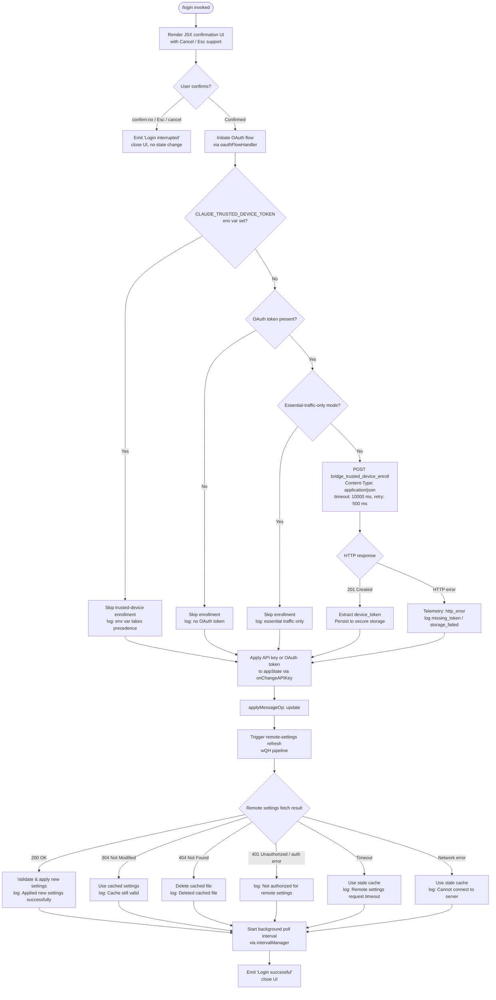

# `/login`

> Analysis basis: CC v2.1.139 bundle.js (AST extraction + Claude interpretation)
> Minimum version: v2.1.139

---

## Overview

The `/login` command initiates an interactive OAuth-based authentication flow that allows a user to sign in with their Anthropic account or switch between Anthropic accounts. It renders a JSX confirmation UI within the CLI, performs OAuth token acquisition and trusted-device enrollment, then propagates the resulting API key or OAuth token into application state, triggering a downstream refresh of remote settings and policy limits.

---

## Registration

| Field | Value |
|---|---|
| type | `local-jsx` |
| name | `login` |
| description | `Switch Anthropic accounts \| Sign in with your Anthropic account` |
| loc_byte | `10499130` |
| loc_byte_end | `10499363` |
| loc_line | `6266` |
| module_id | `ik1` |
| load_inline | `true` |
| arbor_handler.name | `Wqq` |
| arbor_handler.fqn | `claude-2.1.139::Wqq` |
| arbor_handler.kind | `Function` |
| arbor_handler.resolution_path | `direct` |
| arbor_handler.n_hits | `2` |

Analysis basis: CC v2.1.139 bundle.js:+10499130

---

## Input Branching

The command exhibits more than three distinct execution branches: successful login completion, user interruption/cancellation, OAuth flow sub-paths (trusted-device enrollment, API-key path vs. OAuth path), and downstream remote-settings refresh paths. A Mermaid flowchart is therefore used.



Analysis basis: CC v2.1.139 bundle.js:+8070409, +8070451, +8070854, +8070873, +6522225, +6522528, +6522602, +6522856, +6522899, +6639277, +6640442

---

## Behavioral Spec

### Handler Entry Point (Wqq / g78)

The `local-jsx` command type means the handler returns a JSX element rather than a prompt string. The Arbor-resolved handler `Wqq` (bundle identifier `g78`) is the React component factory for the login UI. It is called inline via the `load_inline` mechanism: `load: () => Promise.resolve({ call: Wqq })`.

```
function loginCommandHandler(appStateContext):
    // Reads current appState
    currentState = appStateContext.getAppState()

    // Initialises child component references:
    //   confirmationComponent    (cu4 / QzH subtree)
    //   oauthFlowComponent       (eY_)
    //   remoteSettingsRefresher  (wQH)
    //   policyLimitsPoller       (Ew6)

    // Renders JSX tree via KqH.createElement
    return <LoginUIRoot
                onChangeAPIKey={handleAPIKeyChange}
                applyMessageOp={"update"}
                onDone={handleDone}
           />
```

Analysis basis: CC v2.1.139 bundle.js:+8070409, +8070451, +8070496, +8070574, +8070706, +8070794, +8070841

---

### Confirmation UI (QzH subtree)

The JSX subtree rooted at the confirmation component presents a dialog with title `"Login"` and supports three dismissal paths: `"confirm:no"`, `Esc` key, and explicit `"cancel"`. The dialog has a permission context (`"permission"`) attached.

```
function renderConfirmationUI(props):
    memoCache = initMemoCache(size=3)  // sentinel: "react.memo_cache_sentinel"

    return ConfirmationDialog(
        title    = "Confirmation",
        escLabel = "Esc",
        cancel   = "cancel",
        onNo     = () => emitMessage("confirm:no"),
        onDone   = props.onDone,
        context  = "permission"
    )
```

Key literals observed: `"confirm:no"` (bundle.js:+8071108), `"Confirmation"` (bundle.js:+8071129), `"Esc"` (bundle.js:+8071153), `"cancel"` (bundle.js:+8071171), `"Login"` (bundle.js:+8071550), `"permission"` (bundle.js:+8071575).

Numeric memo slot indices 3–13 are used for React compiler output caching (bundle.js:+8071032 through +8071623).

Analysis basis: CC v2.1.139 bundle.js:+8070919, +8070938, +8070973, +8071037

---

### OAuth Flow Handler (eY_)

This is the core authentication procedure. It orchestrates trusted-device enrollment, token acquisition, and result propagation.

```
async function oauthFlowHandler(appState, apiKeyStore):
    // Step 1: Check trusted-device bypass
    if env("CLAUDE_TRUSTED_DEVICE_TOKEN") is set:
        log("[trusted-device] CLAUDE_TRUSTED_DEVICE_TOKEN env var is set, skipping enrollment")
        goto applyCredentials

    // Step 2: Require OAuth token for enrollment
    if oauthToken is absent:
        log("[trusted-device] No OAuth token, skipping enrollment")
        goto applyCredentials

    // Step 3: Check network policy
    await policyLimitsLoader.waitForPolicyLimitsToLoad()
    if policyLimitsLoader.isPolicyAllowed() is false:
        log("[trusted-device] Essential traffic only, skipping enrollment")
        goto applyCredentials

    // Step 4: Platform check (enrollment only on darwin)
    if platform == "darwin":
        response = await httpPost(
            url          = buildEnrollmentURL(appState),   // uses ZM1.hostname
            headers      = {
                "Content-Type": "application/json",
                "User-Agent":   userAgent
            },
            timeout      = 10000,   // ms  (bundle.js:+6522899)
            retryDelay   = 500      // ms  (bundle.js:+6522925)
        )
        telemetry("bridge_trusted_device_enroll", ...)   // bundle.js:+6523001

        if response.status == 201:                        // bundle.js:+6523087
            deviceToken = response.body.device_token
            if deviceToken is absent:
                telemetry(outcome="missing_token")        // bundle.js:+6523385
            else:
                persistToSecureStorage(deviceToken)
                // may emit: storage_failed, unknown      // bundle.js:+6523546, +6523593
        else:
            telemetry(outcome="http_error")               // bundle.js:+6523206

    // Step 5: Apply credentials to app state
    applyCredentials:
        appState.setAppState(newCredentials)
        onChangeAPIKey(newKey)

    // Step 6: Trigger downstream refresh
    remoteSettingsRefresh()
    policyLimitsRefresh()
```

Trusted-device log prefixes observed: `"[trusted-device] ..."` (bundle.js:+6522225, +6522528, +6522602, +6523284).

Analysis basis: CC v2.1.139 bundle.js:+6522011, +6522020, +6522092, +6522349, +6522364, +6522395, +6522502, +6522594, +6522679, +6522711, +6522783, +6522806, +6522856, +6522871, +6522899, +6522925, +6522989, +6522998, +6523145, +6523425, +6523711

---

### API Key / Credential Application (w$)

When a new key or OAuth token is obtained, the credential-apply function validates the source and stores it.

```
function applyCredentials(keySource, value):
    // Accepted key sources checked against env vars:
    //   "ANTHROPIC_API_KEY"                       (bundle.js:+2889289)
    //   "CLAUDE_CODE_API_KEY_FILE_DESCRIPTOR"     (bundle.js:+2018400)
    //   apiKeyHelper strategy: "none"             (bundle.js:+2889422)

    if keySource is absent and oauth token absent:
        throw Error("ANTHROPIC_API_KEY or CLAUDE_CODE_OAUTH_TOKEN env var is required")
        // bundle.js:+2889710

    // Slice first 20 characters for display/log purposes (bundle.js:+2019742)
    displayKey = value.slice(0, 20)

    // Determine auth provider type
    providerType = detectProvider(value)
    // Known types: "bedrock", "foundry", "anthropicAws", "mantle",
    //              "vertex", "firstParty", "gateway"
    // Default API endpoint: "api.anthropic.com"  (bundle.js:+2002187)

    // Persist flagSettings + apiKeyHelper fields
    persistSettings({ flagSettings, apiKeyHelper })
```

Analysis basis: CC v2.1.139 bundle.js:+2889202, +2889289, +2889313, +2889370, +2889383, +2889422, +2889481, +2889534, +2889548, +2889704, +2889861, +2889908

---

### Remote Settings Refresh Pipeline (wQH / lw_)

After credential change, the remote settings pipeline is triggered. It fetches, validates, and caches settings from the remote server.

```
async function remoteSettingsPipeline(authContext):
    // Phase 1: Fetch
    response = await fetchWithRetry(
        headers = {
            "User-Agent":    userAgent,
            "If-None-Match": cachedETag
        }
    )

    switch response.status:
        case 200:
            validate(response.body)           // throws "Invalid remote settings format"
                                              //    or "Invalid settings structure"
            applySettings(response.body)
            log("Remote settings: Applied new settings successfully")  // bundle.js:+6642006
        case 204:
            // treat as success, no body
        case 304:
            log("Remote settings: Cache still valid (304 Not Modified)") // bundle.js:+6641638
        case 404:
            deleteLocalCache()
            log("Remote settings: Deleted cached file (404 response)")   // bundle.js:+6642171
        case 401/auth error:
            log("Not authorized for remote settings")                    // bundle.js:+6640442
        case timeout:
            log("Remote settings: Remote settings request timeout")      // bundle.js:+6640531
        case network:
            log("Cannot connect to server")                              // bundle.js:+6640604
        default:
            telemetry("remote_managed_settings_unexpected")              // bundle.js:+6642472
            log("Remote settings: Using stale cache after error")        // bundle.js:+6642521

    // Phase 2: Security check for new settings
    if settingsChanged:
        showSecurityDialog()
        // emits tengu_managed_settings_security_dialog_shown
        if accepted:
            telemetry("tengu_managed_settings_security_dialog_accepted")
            applyAndPersist()
            log("Remote settings: Applied new settings successfully")
        else:
            telemetry("tengu_managed_settings_security_dialog_rejected")
            log("Remote settings: User rejected new settings, using cached settings")
            // bundle.js:+6641876

    // Phase 3: Start background polling interval
    startPollInterval(intervalManager)

    // On auth change re-trigger:
    //   log("Remote settings: Refreshed after auth change")  // bundle.js:+6642980
    //   log("Remote settings: Changed during background poll") // bundle.js:+6643356
```

HTTP status codes observed: `200` (bundle.js:+6639485), `204` (bundle.js:+6639494), `304` (bundle.js:+6639503), `404` (bundle.js:+6639512).

Analysis basis: CC v2.1.139 bundle.js:+6642890, +6642896, +6642920, +6642932, +6642969, +6643035, +6643075, +6643118

---

### Policy Limits Poller (Ew6 / rP6 / NHq)

In parallel with remote settings, policy limits are fetched after login. The flow mirrors the remote-settings pipeline with its own cache and retry logic.

```
async function policyLimitsPipeline(authContext):
    // Timeout guard: if load promise stalls, resolve anyway
    //   log("Policy limits: Loading promise timed out, resolving anyway")  // bundle.js:+9874129

    authType = detectAuthType()
    // Values: "api_key" | "oauth"  (bundle.js:+9877290, +9877300)

    response = await fetchPolicyLimits(authType)
    telemetry("tengu_policy_limits_fetch", { status, authType })  // bundle.js:+9877369

    switch outcome:
        case success_200:
            applyRestrictions()
            log("Policy limits: Applied new restrictions successfully")  // bundle.js:+9877899
        case success_empty:
            log("Policy limits: No restrictions (cached empty)")         // bundle.js:+9877954
        case 304:
            log("Policy limits: Cache still valid (304 Not Modified)")   // bundle.js:+9877745
        case stale_cache_fallback:
            telemetry("policy_limits_load", { outcome="stale_cache_used" })
            log("Policy limits: Using stale cache after fetch failure")   // bundle.js:+9877576
        case error:
            telemetry("policy_limits_load", { outcome="request_failed" or "unexpected_error" })
            log("Policy limits: Using stale cache after error")           // bundle.js:+9878031

    // Background poll re-trigger on auth change:
    //   log("Policy limits: Refreshed after auth change")   // bundle.js:+9878967
    //   log("Policy limits: Changed during background poll") // bundle.js:+9879196
    //   telemetry("policy_limits_poll")                      // bundle.js:+9879151
```

Retry back-off uses `retryWithBackoff` (identifiers `Tt`, `qK7`): max delay `32000 ms` (bundle.js:+9869070), base factor `0.25` (bundle.js:+9869133), max attempts `10` (bundle.js:+9869163).

Analysis basis: CC v2.1.139 bundle.js:+9878893, +9878899, +9878906, +9878928, +9878939, +9878959, +9878965

---

### Credential Persistence / Secure Storage (HaA)

Credentials acquired during login are persisted using the secure storage layer, with a plaintext fallback.

```
function persistCredentials(credentialValue):
    attempt primarySecureStorage(credentialValue)
    // Telemetry path: "secure_storage_credentials_write"  (bundle.js:+2176594)

    if primary fails:
        attempt plaintextFallback(credentialValue)
        telemetry("plaintext_fallback_used")               // bundle.js:+2176744

    if both fail:
        telemetry("primary_and_fallback_failed")           // bundle.js:+2176847

    // Uses Promise.all for parallel storage backends       // bundle.js:+2176922
```

Analysis basis: CC v2.1.139 bundle.js:+2176469, +2176529, +2176573, +2176591, +2176644, +2176688, +2176706, +2176809, +2176922

---

### Session Teardown / MCP Cleanup (YWH / nuH)

When a login replaces an existing session, the prior session's MCP connections and subscriptions are torn down.

```
function teardownPriorSession():
    luH.emit("exit")                     // bundle.js:+3113185 (session exit event)
    process.off("exit", ...)             // bundle.js:+3113313
    gfH.clear()                          // connection registry
    q46.clear()                          // queued requests
    T8_.clear()                          // tracked sets
    ZB.clear()                           // bundle.js:+3113468
    clearInterval(backgroundInterval)    // bundle.js:+3113958
    process.removeListener(...)          // bundle.js:+3113993
    // "beforeExit" handler also removed  bundle.js:+3114016
```

Analysis basis: CC v2.1.139 bundle.js:+3113163, +3113179, +3113185, +3113200, +3113224, +3113227, +3113303, +3113313, +3113432

---

## State & Side Effects

| Item | Detail |
|---|---|
| Telemetry | `tengu_feature_ok` (bundle.js:+943635), `tengu_feature_bad` (bundle.js:+943693), `tengu_feature_sad` (bundle.js:+943768), `tengu_managed_settings_security_dialog_shown` (+6636520), `tengu_managed_settings_security_dialog_accepted` (+6636615), `tengu_managed_settings_security_dialog_rejected` (+6636665), `tengu_slate_kestrel` (+9874855), `tengu_policy_limits_fetch` (+9877369), `tengu_disable_bypass_permissions_mode` (+9771719), `tengu_auto_mode_config` (+9769788), `tengu_daemon_config_reload` (+14324140) |
| appState changes | `setAppState` called with new credentials (bundle.js:+8070706); `getAppState` read before flow (bundle.js:+8070574); `onChangeAPIKey` propagates new key (bundle.js:+8070409) |
| Remote settings | Pipeline triggered post-login; may write/delete local settings cache file (bundle.js:+6640745, +6642155); file written with 384-byte buffer (bundle.js:+6640730), encoding `"utf-8"` (bundle.js:+6640780); `datasync` called for durability (bundle.js:+6640796) |
| Policy limits cache | Persisted via `iP6.writeFile` (bundle.js:+9876975); hash computed with SHA-256 (bundle.js:+9874580) |
| Session settings hash | SHA-256 hex digest over settings object via `yM1.createHash` (bundle.js:+6529326, +6529341, +6529368) |
| Secure storage write | Credential persisted to OS keychain (primary) or plaintext fallback |
| MCP session teardown | Prior MCP connections cleared when account switches; `gfH`, `q46`, `T8_`, `ZB` registries cleared |
| Background polling | `setInterval`/`clearInterval` pair started for both remote settings and policy limits after successful login |
| Sound | No sound effects observed in this command's call graph |
| Hook registration | `process.on("exit")` / `process.on("beforeExit")` re-registered for new session lifecycle |
| Trusted-device enrollment | `bridge_trusted_device_enroll` event emitted to telemetry on enrollment attempt (bundle.js:+6523001) |

---

## Version History

| Version | Change |
|---|---|
| v2.1.139 | Initial analysis |

---

## Common Mistakes

1. **Running `/login` while `ANTHROPIC_API_KEY` is set in the environment**: The env-var key will be overwritten in `appState` by the OAuth token acquired during the flow, but the environment variable itself is not modified. After the session ends the env-var resumes precedence, which can cause unexpected credential cycling.

2. **Expecting instant remote-settings application**: The remote-settings fetch runs asynchronously after the "Login successful" message is displayed. Settings governed by the remote policy (model limits, permission modes) may not be in effect until the background fetch completes.

3. **Cancelling with Esc vs. `confirm:no`**: Both paths emit "Login interrupted" and abort the OAuth flow, but the `Esc` key is handled at the UI layer (`"Esc"` literal, bundle.js:+8071153) whereas `confirm:no` is a programmatic signal. Either way no credentials are written.

4. **Assuming trusted-device enrollment occurs on all platforms**: The enrollment POST to `bridge_trusted_device_enroll` is only attempted on `"darwin"` (bundle.js:+6522806). Linux and Windows sessions skip enrollment silently.

5. **Misinterpreting "Login successful" timing**: The success string (bundle.js:+8070854) is emitted by the JSX `onDone` callback, which fires after `applyMessageOp("update")` completes — not after remote settings or policy limits have finished loading.

---

## Appendix — Identifier Mapping

> For bundle debugging only. Identifiers change across versions.

| Identifier | Role |
|---|---|
| `Wqq` | Arbor-resolved handler for `/login` command (root JSX factory) |
| `g78` | Login JSX component factory / handler entry (same as Wqq at call-graph root) |
| `cu4` | Inner login UI component renderer |
| `QzH` | Confirmation dialog component |
| `nD` | Confirmation dialog inner render function |
| `Qk1` | Confirmation dialog state/effect hook setup |
| `D6` | App-state context accessor |
| `Hq_` | useContext wrapper for app-state |
| `VB` | External-store subscription hook |
| `q09` | Microtask-queued state notifier |
| `dP` | Ink/React UI composition root (input parser) |
| `eY_` | OAuth flow handler / trusted-device enrollment |
| `kR` | MCP connection initiator used during login session start |
| `wQH` | Remote settings refresh pipeline orchestrator |
| `lw_` | Remote settings fetch-and-apply worker |
| `pw4` | Remote settings HTTP fetch with retry |
| `Uw4` | Remote settings fetch executor |
| `F31` | Remote settings security-check dialog driver |
| `Bw4` | Remote settings atomic file writer |
| `gw4` | Remote settings background poll handler |
| `i31` | Remote settings poll interval manager |
| `Ra6` | Generic interval manager (set/clear interval) |
| `dw_` | Remote settings change notifier |
| `tl` | Settings loader / settings-object reader |
| `Ew6` | Policy limits pipeline orchestrator |
| `rP6` | Policy limits fetch-and-apply worker |
| `NHq` | Policy limits HTTP fetch with cache logic |
| `vHq` | Policy limits local cache reader |
| `yHq` | Policy limits background poll handler |
| `$K7` | Policy limits poll executor |
| `qK7` | Policy limits fetch with backoff retry |
| `LK7` | Policy limits atomic file writer |
| `_K7` | Policy limits hash computation |
| `YWH` | Session teardown orchestrator (MCP cleanup) |
| `nuH` | MCP session cleanup: clears registries, removes process listeners |
| `h8_` | Interval/listener teardown helper |
| `HaA` | Secure credential storage writer |
| `mbH` | Credential read helper with async fallback |
| `w$` | Credential source validation and API key applier |
| `sx` | Flag-settings loader |
| `Ed8` | File-descriptor API key reader (CLAUDE_CODE_API_KEY_FILE_DESCRIPTOR) |
| `AR` | API key display-slice helper (first 20 chars) |
| `b6` | Persistent settings writer |
| `pVL` | Settings persistence helper |
| `tY_` | Session initialiser |
| `eY_` | OAuth + trusted-device enrollment (also listed above) |
| `XOH` | MCP connection setup helper |
| `QK` | IDB/storage read helper |
| `hM1` | Settings hash computation |
| `Aw_` | Deep-clone / recursive object mapper |
| `c31` | Structured-clone wrapper for settings |
| `aI` | structuredClone caller |
| `iS` | Settings-key reader pair |
| `GA` | OAuth URL builder |
| `$4A` | OAuth endpoint resolver |
| `V0K` | OAuth environment selector |
| `WA` | Provider-type classifier |
| `SH` | String coercion utility |
| `N` | Request executor / HTTP client |
| `yH` | JSON serialiser wrapper |
| `LH` | Log dispatcher |
| `q_` | Error/string normaliser |
| `S1` | Log queue emitter |
| `CGK` | Log queue rotation (shift/push) |
| `LM` | Path/URL redaction helper (`[REDACTED]`) |
| `QyH` | Settings masking helper |
| `R9K` | File-backed request helper |
| `Tt` | Exponential back-off calculator |
| `o8` | Abort-controller / timeout wrapper |
| `xH` | Feature-flag reader |
| `Q` | Feature-flag state store |
| `kH` | Feature-flag writer |
| `Y8` | Feature-flag store reader |
| `IH` | String coercion for error codes |
| `j7H` | Cache-clear helper |
| `DD` | Dual-cache clear (lE6 + DT8) |
| `DIK` | Array/object discriminator |
| `Gw6` | Auto-mode configuration manager |
| `Ww6` | Auto-mode wrapper |
| `F78` | Auto-mode gate check |
| `y8_` | Auto-mode MCP connection check |
| `Zy_` | Auto-mode disabled reason reporter |
| `Ey_` | Auto-mode LA (locale/label) adapter |
| `Tq` | Terminal model-name formatter |
| `Kq` | Model name parser/normaliser |
| `IJ` | Formatted model display builder |
| `DuH` | Model suitability checker for auto-mode |
| `R1` | Inference-profile classifier |
| `sU` | Model display-name resolver |
| `IiH` | Auto-mode availability check |
| `yU` | Auto-mode policy resolver |
| `aTH` | Permission-update handler |
| `Uf` | Permission state applier |
| `e4` | bypassPermissions mode gate |
| `Xw6` | Permission mode manager |
| `MG_` | Permission UI message builder |
| `Cs` | Structured-log event emitter |
| `HL` | Log event formatter |
| `sqH` | Batch log entry mapper |
| `tqH` | Auto-mode gate-notification renderer |
| `kk` | Auto-gate-denied signal |
| `dk1` | App-state snapshot accessor |
| `D` | Terminal supervisor / REPL controller |
| `fwH` | Terminal frame reader |
| `rWq` | Terminal layout calculator |
| `T` | Terminal stop/start controller |
| `V` | Config update handler |
| `f` | Terminal stream pair |
| `Z` | Session start trigger |
| `haq` | Heartbeat scheduler |
| `mJ` | Context hook (J0H.useContext) |
| `em` | Policy-limits HTTP client |
| `sO8` | Policy-limits timeout guard |
| `tO8` | Policy-limits cache path builder |
| `bfH` | Post-login cleanup callback |
| `IM1` | Session FM/t_ bridge |
| `t_` | Module initialiser bootstrap |
| `$E6` | Bound event handler factory |
| `dO` | WA-delegating helper |
| `e_` | Ink component base |
| `Pw` | Ink layout primitive |
| `lU` | Boolean coercion for Ink |
| `C5H` | Ink component with o1 renderer |
| `o1` | Ink base renderer |
| `to` | Ink text-output component |
| `hbH` | Ink component with P$9 |
| `P$9` | Ink styled text helper |
| `tZ` | Ink margin/padding component |
| `uM` | Ink WA-delegating layout |
| `$M` | Ink box renderer |
| `xj` | Ink conditional renderer |
| `Y_H` | Ink SH-delegating helper |
| `w_H` | Ink o1-delegating helper |
| `eZ` | Ink combined margin+box |
| `Xo` | Ink lI/LA/Po layout |
| `uw4` | Remote settings URL builder |
| `M$` | Remote settings module reference |
| `da` | (Da) Platform / process info accessor |
| `ex` | Network request executor |
| `XRH` | Remote settings ETag store |
| `IZ` | Remote settings security-check gate |
| `Bw_` | Remote settings approval recorder |
| `wu` | File write helper (b1_/n1_/SAH) |
| `tF` | Remote settings hw4 wrapper |
| `g31` | Remote settings fK delegator |
| `fK` | Remote settings GTH/OO_/zO_ tool dispatcher |
| `d_6` | File path builder (v8H/fOA.join/i8) |
| `w8` | File existence / stat helper |
| `tkH` | Timestamp helper (Date.now) |
| `wuH` | Credential write finaliser |
| `LH_` | Log-header builder |
| `yZ` | Settings-version resolver |
| `ptH` | T_-delegating helper |

---

Note: index built via Arbor fallback; some signals (telemetry, literals) may be missing — see arbor-fallback.js.