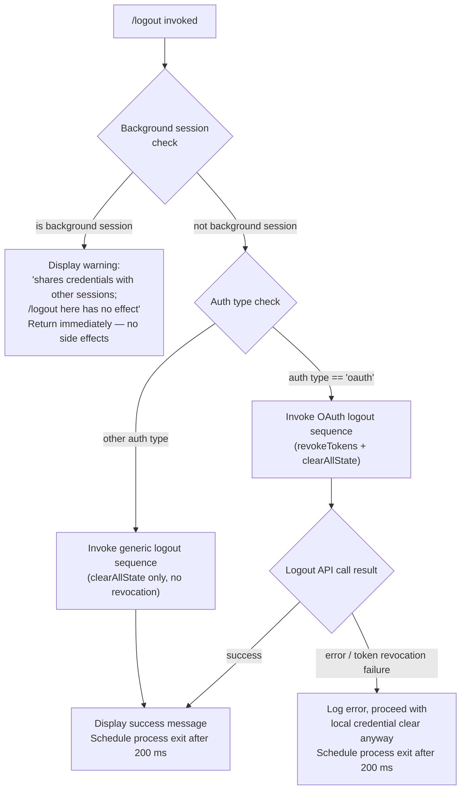

# `/logout`

> Analysis basis: CC v2.1.139 bundle.js (AST extraction + Claude interpretation)
> Minimum version: v2.1.139

---

## Overview

The `/logout` command signs the user out of their Anthropic account by revoking OAuth tokens, clearing all credential caches and session state, and then terminating the CLI process. It performs a short-circuit guard for background sessions—which share credentials with a parent terminal—and refuses to act in that context, instructing the user to run `/logout` from the main terminal instead.

---

## Registration

| Field | Value |
|---|---|
| type | `local-jsx` |
| name | `logout` |
| description | Sign out from your Anthropic account |
| loc_byte | `10499424` |
| loc_byte_end | `10499612` |
| loc_line | `6266` |
| module_id | `yW1` |
| load_inline | `true` |
| arbor_handler.name | `Gk4` |
| arbor_handler.fqn | `claude-2.1.139::Gk4` |
| arbor_handler.kind | `AsyncFunction` |
| arbor_handler.resolution_path | `module_id` |
| arbor_handler.n_hits | `0` |

Analysis basis: CC v2.1.139 bundle.js:+10499424

---

## Input Branching

The handler has four distinct paths based on session type, authentication mode, and logout success/failure.



Analysis basis: CC v2.1.139 bundle.js:+7431201, +7431255, +7431311, +7431510, +7431573

---

## Behavioral Spec

### Top-level handler (`Gk4`)

The Arbor-resolved handler for this command is `Gk4` (an `AsyncFunction`), reached via the `module_id` resolution path from module `yW1`.

```
async function logoutHandler(context):
    sessionType = getSessionType(context)          // calls Z1 → Zo
    authConfig  = getAuthConfig(context)           // calls JBH

    if isBackgroundSession(sessionType):
        // Literal at bundle.js:+7431311
        displayMessage("This background session shares credentials with other sessions; " +
                        "/logout here has no effect. Run /logout from your main terminal " +
                        "to sign out.")
        return                                     // no further action

    authType = authConfig.type                    // string compared at +7431255

    if authType == "oauth":
        performOAuthLogout(context)               // calls GD6
    else:
        performGenericLogout(context)             // calls GD6 with reduced scope

    displaySuccessMessage()                       // literal at +7431510
    scheduleExit(delayMs = 200)                   // setTimeout at +7431573; literal 200 at +7431605
```

Analysis basis: CC v2.1.139 bundle.js:+7431201

---

### Background-session guard

```
function isBackgroundSession(sessionType):
    // Checks session process role; compares against known background identifiers
    // Literals observed: "bg" (+2148195), "daemon" (+2148205), "daemon-worker" (+2148219)
    return sessionType in {"bg", "daemon", "daemon-worker"}
```

When this returns `true` the command exits immediately with the advisory message and does **not** modify any credential store or emit any auth-change event.

Analysis basis: CC v2.1.139 bundle.js:+7431311, +2148195, +2148205, +2148219

---

### OAuth logout sequence (`GD6`)

`GD6` is the core logout orchestrator called for OAuth sessions. It performs the following steps in order:

```
async function oauthLogoutOrchestrator(context):
    // Step 1 — Resolve and invoke credential revocation
    resolvedPromise = Promise.resolve()             // +7430432
    revokeResult    = await revokeCredentials()    // calls eX_ (+7430462)
    normaliseError  = categoriseError(revokeResult)// calls A   (+7430483)

    // Step 2 — Persist logout event to config with "oauth_logout" marker
    saveSessionEvent("oauth_logout")               // literal at +7431002

    // Step 3 — Clear all session/subscription state
    clearSubscriptionSwitchState()                 // calls WD6 (+7430499); literal "subscription-switch" at +7430847

    // Step 4 — Flush pending API traffic
    drainEssentialTraffic()                        // calls S6H (+7430561)

    // Step 5 — Invalidate config file lock and write cleared auth to disk
    invalidateConfigLock()                         // calls VH_ (+7430577)

    // Step 6 — Flush storage (keychain / plaintext fallback)
    flushCredentialStorage()                       // calls QK  (+7430589)

    // Step 7 — Rotate config write-lock token
    rotateLockToken()                              // calls CJH (+7430603)

    // Step 8 — Save global config (with auth-loss guard)
    saveGlobalConfigSafely()                       // calls H8  (+7430625)

    // Step 9 — Verify feature flags cleared
    clearFeatureFlagCache()                        // calls kH  (+7430999)
```

Analysis basis: CC v2.1.139 bundle.js:+7430432 – +7431002

---

### Credential revocation (`eX_` → keychain/plaintext path)

```
async function revokeCredentials():
    // Derives keychain service name
    // Literal: "claude-code-user" at +2018964
    // Uses SHA-256 hash (literal "sha256" at +2018784, "hex" at +2018811)
    // to identify the keychain slot (8-char prefix: literal 8 at +2018830)
    keychainKey = deriveKeychainKey("claude-code-user")

    try:
        unlinkKeychainEntry(keychainKey)           // calls Aaq.unlinkSync via q (+14290176)
    catch error:
        // Literal: "Failed to delete keychain entry" at +2019675
        logWarning("Failed to delete keychain entry", error)
        // continues — does not abort the logout flow
```

Analysis basis: CC v2.1.139 bundle.js:+2019675, +2018964, +2018784

---

### State teardown (`WD6` — subscription/session clear)

```
function clearSubscriptionAndSessionState():
    clearSubscriptionSwitchFlag()   // calls VO6  (+7431059)
    clearModelDaemonState()         // calls md6  (+7431065)
    clearUdState()                  // calls Ud6  (+7431071) → K$9.clear (+2884046)
    clearBackgroundFlags()          // calls bfH  (+7431077)
    shutdownSessionHandlers()       // calls YWH  (+7431102)
    cleanupNetworkResources()       // calls n31  (+7431155)
    cleanupPersistentStorage()      // calls A2_  (+7431167)
```

`YWH` performs: emit teardown event via `luH.emit` (+3113185), call `FW` (+3113200), call `LH` (+3113224), call `q_` (+3113227), call `nuH` (+3113179). `nuH` clears multiple data-structure caches (`gfH`, `q46`, `T8_`, `ZB`) and detaches process event listeners (`process.off` at +3113313, `clearInterval` at +3113958, `process.removeListener` at +3113993).

Analysis basis: CC v2.1.139 bundle.js:+7431059, +7431155, +3113163

---

### Config write guard (`saveGlobalConfigSafely` / `H8` + `c8_`)

The config-save path includes an auth-loss protection mechanism:

```
function saveGlobalConfigSafely(newConfig):
    acquireLock(timeoutMs = 60000)           // literal 60000 at +3133521

    if lockAcquisitionTookTooLong:
        // Literal at +3132751: "Lock acquisition took longer than expected …"
        emit telemetry event "tengu_config_lock_contention"   // +3132840

    reReadConfig = readConfigFromDisk()

    if reReadConfig.auth is missing AND cachedConfig.auth is present:
        // Literal at +3130049: "saveGlobalConfig fallback: re-read config is missing auth …"
        emit telemetry event "tengu_config_stale_write"        // +3132976
        // refuses to write — aborts save to avoid wiping ~/.claude.json (GH #3117)
        return

    rotatingBackupCount = 5                  // literal 5 at +3133770
    keepBackupsFor      = 100                // literal 100 at +3132745
    writeConfigAtomically(newConfig)         // uses dSH for atomic rename
```

Analysis basis: CC v2.1.139 bundle.js:+3132840, +3132751, +3133521

---

### Process exit (`fK` / `U9`)

After a successful logout the handler schedules a clean process exit:

```
function scheduleExit(delayMs):
    // delayMs = 200 (literal at +7431605)
    setTimeout(function():
        performCleanShutdown()    // calls fK → U9
    , delayMs)

function performCleanShutdown():
    // Flushes pending writes (l$H.writeSync at +5111705)
    // Waits for in-flight promises (Promise.race at +5111174)
    // Shutdown timeout: Math.max(5000, 3500) ms (literals +5111054, +5111061)
    // Falls back to process.exit or process.kill("SIGKILL") on timeout (+5109814, +5109839)
    // Emits "session_end" event (literal at +5111425)
    drainAllIO()
    emitSessionEnd()
    exitProcess()
```

Analysis basis: CC v2.1.139 bundle.js:+7431573, +7431605, +5111425

---

## State & Side Effects

| Item | Detail |
|---|---|
| Telemetry — `tengu_config_lock_contention` | Fired when the config write-lock takes longer than expected during credential flush (bundle.js:+3132840) |
| Telemetry — `tengu_config_stale_write` | Fired when auth-loss guard prevents overwriting `~/.claude.json` (bundle.js:+3132976) |
| Telemetry — `tengu_config_parse_error` | Fired if the re-read config cannot be parsed (bundle.js:+3135421) |
| Telemetry — `tengu_config_auth_loss_prevented` | Fired when auth-loss guard triggers (bundle.js:+3133319) |
| Telemetry — `tengu_feature_ok` | Fired on successful feature-flag cache clear (bundle.js:+943635) |
| Telemetry — `tengu_feature_sad` | Fired on non-fatal feature-flag failure (bundle.js:+943768) |
| Telemetry — `tengu_feature_bad` | Fired on hard feature-flag failure (bundle.js:+943693) |
| Telemetry — `tengu_daemon_config_reload` | Fired during daemon-side config reload (bundle.js:+14324140) |
| Telemetry — `tengu_startup_perf` | Fired as part of startup profiling flush on exit (bundle.js:+206895) |
| Telemetry — `tengu_scroll_summary` | Fired during terminal output cleanup (bundle.js:+5110602) |
| Telemetry — `tengu_pewter_brook` | Fired during fullscreen/terminal-type detection teardown (bundle.js:+3232880) |
| Telemetry — `tengu_cache_eviction_hint` | Fired during cache-eviction bookkeeping on shutdown (bundle.js:+5111390) |
| Credential store | Keychain entry for `"claude-code-user"` unlinked via `Aaq.unlinkSync`; plaintext fallback also cleared |
| Config file (`~/.claude.json`) | Auth fields removed; atomic write via temp-file rename; up to 5 rotating backups retained |
| Session/subscription state | Multiple in-memory caches (`K$9`, `gfH`, `q46`, `T8_`, `ZB`) cleared |
| Persistent socket/lock files | Removed via `LEH.unlink` (n31 path) and `iP6.unlink` (A2_ path) |
| Process listeners | `process.off("exit")`, `process.removeListener("beforeExit")` called; all intervals cleared |
| OTEL metrics | Session attributes (`user.id`, `session.id`, `organization.id`, `user.email`, `user.account_uuid`) emitted before shutdown |
| Process exit | `process.exit` or `SIGKILL` scheduled ~200 ms after success display; hard timeout at max(5000, 3500) ms |
| Background session | **No side effects** — command returns immediately with advisory message |

---

## Version History

| Version | Change |
|---|---|
| v2.1.139 | Initial analysis |

---

## Common Mistakes

1. **Running `/logout` inside a background/daemon session** — The command detects this and refuses to act. The warning message explicitly instructs the user to run `/logout` from the main interactive terminal.

2. **Expecting immediate credential invalidation on disk** — The command uses a locking protocol with a 60-second timeout. If another Claude instance holds the config lock, the credential wipe may be delayed and `tengu_config_lock_contention` will be emitted.

3. **Assuming the CLI stays open after logout** — The handler schedules `process.exit` approximately 200 ms after displaying the success message. Any work in flight at that point is abandoned.

4. **Using `/logout` when authenticated via API key (non-OAuth)** — The OAuth token-revocation step is skipped; only local credential caches are cleared. The API key itself is not invalidated server-side.

5. **Confusing keychain failure with logout failure** — If the keychain `unlinkSync` call fails (e.g., permissions, macOS Keychain locked), the error is logged but the logout proceeds. The literal `"Failed to delete keychain entry"` (+2019675) in the logs does not mean the local session persists.

---

## Appendix — Identifier Mapping

> For bundle debugging only. Identifiers change across versions.

| Identifier | Role |
|---|---|
| `Gk4` | Top-level logout command handler (AsyncFunction; Arbor-resolved entry point) |
| `GD6` | OAuth logout orchestrator — sequences all revocation and state-clear steps |
| `WD6` | Subscription/session state teardown coordinator |
| `VO6` | Clears subscription-switch flag |
| `md6` | Clears model-daemon state |
| `Ud6` | Clears `K$9` map (credential/session cache) |
| `bfH` | Clears background-mode flags |
| `YWH` | Shuts down session event handlers and emits teardown event |
| `Ya` | Session handler helper called by `YWH` |
| `SH` | String-to-environment-variable lookup utility |
| `Da` | Config field accessor called by `Ya` |
| `nuH` | Clears multiple in-memory caches and detaches process listeners |
| `h8_` | Clears interval and removes `beforeExit` listener |
| `LH` | Queues essential network traffic drain |
| `q_` | Error classification/construction utility |
| `S1` | Essential-traffic queue helper |
| `CGK` | Traffic queue shift/push manager |
| `n31` | Network resource cleanup (socket/lock file removal) |
| `r31` | Network cleanup sub-step |
| `Qw_` | Secondary cleanup sub-step (calls `MOA`) |
| `MOA` | Low-level resource release |
| `v8H` | Path utility used in cleanup |
| `d_6` | File path joiner for cleanup (uses `fOA.join`) |
| `A2_` | Persistent storage cleanup (unlinks `iP6` socket/lock) |
| `ry_` | Storage cleanup helper (calls `ty_`, `clearTimeout`) |
| `ty_` | Inner timeout-clear sub-step |
| `tO8` | Path resolver for persistent storage files |
| `S6H` | Essential-traffic drain trigger |
| `VH_` | Config lock invalidation and global-config write initiator |
| `J$9` | Config write sub-coordinator (calls `XFA`, `LH`) |
| `XFA` | Keychain/plaintext credential resolver |
| `$y` | Keychain key derivation (SHA-256, "claude-code-user") |
| `pP` | Plaintext fallback credential accessor |
| `Iv` | OS user-info lookup (for keychain slot) |
| `H8` | Global config save with auth-loss guard |
| `c8_` | Atomic config file writer (lock, backup rotation, rename) |
| `_` | Generic path/string utility (multiple use sites) |
| `B6` | File-system base-path helper |
| `ioA` | Config object merger (`Object.assign` wrapper) |
| `N` | Log-level / debug string formatter |
| `Q` | Promise/async utility |
| `w8` | Error-code checker |
| `cfH` | Config file reader with backup and parse-error handling |
| `w46` | Config write helper |
| `yH` | JSON serialiser (`JSON.stringify` wrapper) |
| `l8_` | Backup-file path builder |
| `Z` | String utility (startsWith check) |
| `X` | Async SDK/MCP connection manager |
| `V` | Renderer/display component |
| `dSH` | Atomic file writer (temp-file + rename + fchmod + fsync) |
| `H` | Generic async retry / random-delay helper |
| `suH` | Config-save sub-step |
| `E09` | Config entry enumerator (`Object.entries`) |
| `tuH` | Timestamp utility (`Date.now`) |
| `d8_` | Alternate config write path (calls `dSH`) |
| `AH_` | Additional config-lock helper |
| `QK` | Credential storage flush (keychain + plaintext) |
| `HaA` | Storage read/write/delete coordinator |
| `mbH` | Storage slot resolver |
| `oKL` | Storage async-local-store context manager |
| `kH` | Feature-flag cache verifier (emits `tengu_feature_ok/bad`) |
| `Y8` | Feature-flag sad-path handler |
| `xH` | Feature-flag bad-path handler |
| `CJH` | Config write-lock token rotator |
| `JBH` | Auth-config reader (returns type, token fields) |
| `oI` | Auth config field extractor |
| `IH` | String conversion utility |
| `HL` | Auth event emitter / session attribute setter |
| `AE8` | OTEL attribute helper |
| `wBH` | OTEL metrics attribute builder |
| `tx` | OTEL trace/span initialiser |
| `V6` | Attribute value normaliser |
| `Af_` | String-format helper for OTEL |
| `a7` | OTEL dimension builder |
| `mQ9` | OTEL metric flush helper |
| `nt6` | Identity/gateway-OIDC attribute builder |
| `ctH` | Terminal-type attribute setter |
| `fK` | Clean-shutdown wrapper |
| `U9` | Core process-shutdown sequencer |
| `K` | Column-padding utility (padEnd) |
| `GTH` | Terminal output finaliser (unmount + writeSync) |
| `Ny` | Shutdown notification emitter |
| `Lr6` | Terminal escape-sequence writer |
| `OO_` | Output formatter (replaces special chars, dim styling) |
| `IZ` | Output stream selector |
| `kS` | Output encoding selector |
| `q$6` | Session stat file path resolver |
| `Q$` | Stat file writer |
| `lH1` | Formatted line writer |
| `zO_` | Hard-exit path (`process.exit` / `process.kill("SIGKILL")`) |
| `jyH` | Parallel flush (`Promise.all` + `Array.from`) |
| `D` | Render-loop / event-dispatch controller |
| `fwH` | Input reader and key-event dispatcher |
| `rWq` | Column-width calculator |
| `T` | Keyboard event interceptor |
| `haq` | Heartbeat manager |
| `eeH` | Startup-profiling report emitter |
| `sV8` | Profiling metric recorder |
| `Wt_` | Profiling data persister |
| `y68` | Cache-eviction hint emitter |
| `cH1` | Cache-hit counter |
| `dH1` | Eviction timestamp calculator |
| `FA` | Fullscreen / terminal-mode detector |
| `vtH` | Session-end metadata recorder |
| `$` | Session-end event builder |
| `NXq` | Session-end payload serialiser |
| `O` | Background-session state checker |
| `x8` | Background-session identifier resolver |
| `o8` | Abort/timeout signal handler |
| `Z1` | Session-type resolver (called early in `Gk4`) |
| `Zo` | Low-level session-type string lookup |

---

Note: index built via Arbor fallback; some signals (telemetry, literals) may be missing — see arbor-fallback.js.