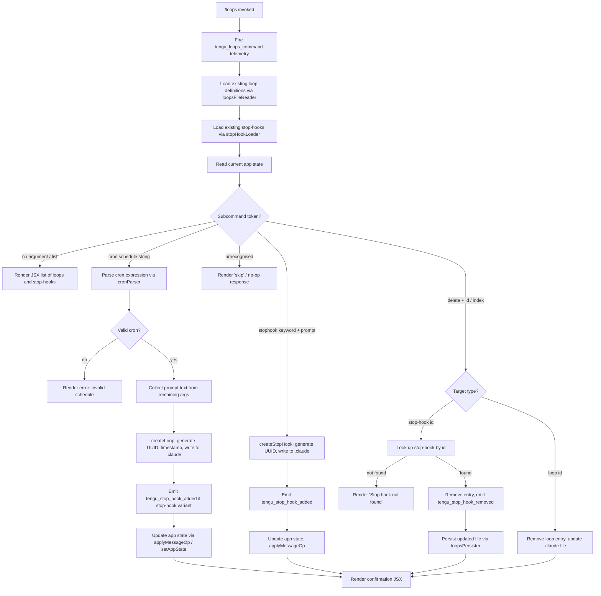

# `/loops`

> Analysis basis: CC v2.1.139 bundle.js (AST extraction + Claude interpretation)
> Minimum version: v2.1.139

---

## Overview

The `/loops` command provides an interactive management interface for recurring loops (scheduled cron-based tasks) and stop-hooks (one-shot triggers that fire when a session ends). Users can list existing entries, create new ones by specifying a prompt and schedule, and delete entries they no longer need. The command renders a JSX component directly in the terminal UI and persists loop/hook definitions under the `.claude` project directory.

---

## Registration

| Field | Value |
|---|---|
| type | `local-jsx` |
| name | `loops` |
| description | `List, create, and delete recurring loops and stop-hooks` |
| loc_byte | `11296436` |
| loc_byte_end | `11296618` |
| loc_line | `6999` |
| immediate | `true` |
| module_id | `RYq` |
| load_inline | `true` |
| arbor_handler.name | `t27` |
| arbor_handler.fqn | `claude-2.1.139::t27` |
| arbor_handler.kind | `AsyncFunction` |
| arbor_handler.resolution_path | `module_id` |
| arbor_handler.n_hits | `0` |

Analysis basis: CC v2.1.139 bundle.js:+11296436

---

## Input Branching

The handler inspects the parsed subcommand token and dispatches to one of several distinct branches (list, create-cron, create-stophook, delete-stophook, and delete-loop), making a Mermaid flowchart the appropriate representation.



---

## Behavioral Spec

### Handler Entry — `loopsCommandHandler` (bundle: `t27`)

The async handler is resolved via `module_id` → `RYq` → `t27`.

```
async function loopsCommandHandler(context):
    emit telemetry("tengu_loops_command")           // bundle.js:+11295393

    existingLoops   = await loopsFileReader(context)  // R3H → t0H
    stopHooks       = await stopHookLoader(context)   // Uw8 → tzH
    appState        = context.getAppState()           // bundle.js:+11295443

    subcommand = parseSubcommandToken(context.args)   // V6, bundle.js:+11295459

    if subcommand is "cron" type:                     // literal "cron", bundle.js:+11295489
        result = await createOrUpdateLoop(context, appState, existingLoops)
    else if subcommand is "stophook" type:            // literal "stophook", bundle.js:+11295575
        stopHookEntries = context.args.map(...)       // bundle.js:+11295555
        result = await createStopHook(context, appState, stopHookEntries)
    else if subcommand is delete / clear target:
        result = await deleteEntry(context, appState)
    else:
        result = renderListJSX(existingLoops, stopHooks, appState)

    return Gu_.createElement(...)                     // bundle.js:+11296196
```

Analysis basis: CC v2.1.139 bundle.js:+11295391

---

### Loop File I/O — `loopsFileReader` (bundle: `R3H` → `t0H`)

Reads the loops definition file from the `.claude` subdirectory of the project root.

```
async function loopsFileReader(context):
    dir  = resolveLoopsDir(context)               // z9H: Mt6.join + bK, bundle.js:+4296062
    path = joinPath(dir, loopsFileName)
    raw  = await fs.readFile(path, "utf-8")       // literal "utf-8", bundle.js:+4296079

    if read error:
        if error.code in [ENOENT, EACCES, EPERM,  // literals, bundle.js:+168771..168827
                          ENOTDIR, ELOOP]:
            return []                              // graceful empty fallback
        else:
            logError(error)                        // LH → Jd.logError, bundle.js:+949122
            return []

    parsed = parseLoopsJSON(raw)                  // T1 → w8, bundle.js:+4296101
    if not Array.isArray(parsed):                 // bundle.js:+4296195
        return []

    return parsed
```

Analysis basis: CC v2.1.139 bundle.js:+4298039

---

### Stop-Hook Loader — `stopHookLoader` (bundle: `Uw8` → `tzH`)

Collects the currently registered stop-hooks from app state and formats them into a display map.

```
function stopHookLoader(appState):
    hookMap = new Map()
    for entry in appState.stopHooks:             // tzH: K.set, bundle.js:+8282341
        displayItems = buildDisplayItems(entry)  // KC1: H.map, bundle.js:+8282110
        hookMap.set(entry.id, displayItems)
    push to accumulator                          // Uw8: A.push, bundle.js:+11293003
    return hookMap
```

Analysis basis: CC v2.1.139 bundle.js:+11295439

---

### Cron Expression Parser — `cronParser` (bundle: `OE`)

Translates a human-readable or standard cron string into a normalized schedule object.

```
function cronParser(input):
    trimmed = input.trim()                        // bundle.js:+4293823

    if matches "Every minute" pattern:            // literal, bundle.js:+4293943
        return { type:"cron", minute:"*", ... }

    if matches "Every hour" pattern:              // literal, bundle.js:+4294160
        return { type:"cron", minute:0, hour:"*", ... }

    // generic numeric cron: parse up to 5 fields
    fields = trimmed.match(cronRegex)             // OE: K.match, bundle.js:+4293964
    if not fields:
        return null

    [minute, hour, dom, month, dow] = fields.map(parseInt)

    // day-of-week normalisation (0-based UTC)
    date = new Date()
    date.setUTCDate(...)                          // bundle.js:+4294719
    date.getUTCDay()                              // bundle.js:+4294700
    date.setUTCHours(...)                         // bundle.js:+4294750
    date.getDay()                                 // bundle.js:+4294779

    // range "1-5" is accepted                   // literal "1-5", bundle.js:+4294867
    return normalised schedule object
```

Analysis basis: CC v2.1.139 bundle.js:+11295522

---

### Schedule Serialiser — `scheduleToString` (bundle: `s27`)

Converts a structured schedule back to a human-readable label used in the list view.

```
function scheduleToString(schedule):
    raw = schedule.match(pattern)                // bundle.js:+11294979
    if not raw: return schedule as-is

    minute = parseInt(raw[1])                    // bundle.js:+11295016
    hour   = parseInt(raw[2])

    // boundary constants used during normalisation:
    //   max seconds  = 60  (bundle.js:+11295124)
    //   max seconds2 = 59  (bundle.js:+11295158)
    //   max hours    = 23  (bundle.js:+11295229)
    //   max days     = 31  (bundle.js:+11295282)

    display = Math.max(0, Math.ceil(normalised)) // bundle.js:+11295101, +11295112
    display = Math.round(display)                // bundle.js:+11295185

    parsed  = parseCronFields(display)           // kV, bundle.js:+11295349
    return formatted string
```

Analysis basis: CC v2.1.139 bundle.js:+11295943

---

### Loop Creator — `createLoop` (bundle: `Ot6`)

Persists a new loop entry to disk and triggers a UI state update.

```
async function createLoop(context, appState, existingLoops):
    id        = crypto.randomUUID()              // CB9.randomUUID, bundle.js:+4297379
    createdAt = Date.now()                       // bundle.js:+4297441
    entry     = buildLoopEntry(id, createdAt)    // bJH, bundle.js:+4297487

    await loopsFileReader(context)               // t0H, bundle.js:+4297531
    existingLoops.push(entry)                    // bundle.js:+4297544

    dir = resolveLoopsDir(context)               // z9H → Mt6.join + bK
    await fs.mkdir(dir, { recursive:true })      // nUH: ft6.mkdir, bundle.js:+4297199

    serialised = JSON.stringify(existingLoops)   // yH → JSON.stringify
    await fs.writeFile(loopsPath, serialised)    // nUH: ft6.writeFile, bundle.js:+4297296

    triggerMcpPush(context)                      // V6, bundle.js:+4297576
    notifyUI(context)                            // Eo, bundle.js:+4297625

    return entry
```

Analysis basis: CC v2.1.139 bundle.js:+11296041

---

### Stop-Hook Creator — `createStopHook` (bundle: `zoH`)

Registers a new stop-hook in app state, appends it as a message, and fires telemetry.

```
async function createStopHook(context, appState, hookItems):
    currentState = context.getAppState()          // zoH: H.getAppState, bundle.js:+11293673

    id = generateStopHookId()                     // SYq: kYq.randomUUID, bundle.js:+11294018

    newState = {
        ...currentState,
        stopHooks: [...currentState.stopHooks, {
            id,
            prompt: hookItems.join(" "),
            goal:   "goal",                       // literal "goal", bundle.js:+11293959
            goal_status: "goal_status",           // literal, bundle.js:+11294087
        }]
    }
    context.setAppState(newState)                 // bundle.js:+11293802

    // Append confirmation message to conversation
    context.applyMessageOp({
        op:   "append",                           // literal "append", bundle.js:+11293894
        type: "attachment",                       // literal "attachment", bundle.js:+11294000
        content: confirmationText,
    })                                            // bundle.js:+11293871

    emit telemetry("tengu_stop_hook_added")       // bundle.js:+11293560

    return { id, result: "Stop hook set" }        // literal, bundle.js:+11296153
```

Analysis basis: CC v2.1.139 bundle.js:+11295817

---

### Stop-Hook Deleter — `deleteStopHook` (bundle: `OoH`)

Finds and removes a named stop-hook, or reports that it was not found.

```
async function deleteStopHook(context, appState, targetId):
    currentState = context.getAppState()          // bundle.js:+11293259

    hookList = currentState.stopHooks or []
    match    = hookList.find(h => h.id === targetId)

    if not match:
        return "Stop hook not found"              // literal, bundle.js:+11295835

    // Check gate (policy / trust)
    policyOk  = checkPolicyGate(context)          // Wu_ → eu → v8 "policySettings", +5287575
    trustOk   = checkTrustGate(context)           // Wu_ → T_,  "trust_gate", +11293124

    if policyOk and trustOk:
        filtered = hookList.filter(h => h.id !== targetId)
        context.setAppState({ ...currentState, stopHooks: filtered })
                                                  // bundle.js:+11293461

        context.applyMessageOp({ op:"append", content: removal })
                                                  // bundle.js:+11293503

        emit telemetry("tengu_stop_hook_removed") // bundle.js:+11293928

        emit signal("goal_set")                   // literal, bundle.js:+11293202

        return "Stop hook cleared"                // literal, bundle.js:+11295857

    return "skip"                                 // literal, bundle.js:+11296302
```

Analysis basis: CC v2.1.139 bundle.js:+11296129

---

### Loops File Persister — `loopsPersister` (bundle: `D9H`)

Validates and rewrites the loops definition file after a delete operation.

```
async function loopsPersister(context, updatedList):
    schemaOk = validateLoopSchema(updatedList)    // Mr: _.has, bundle.js:+47645
    current  = await loopsFileReader(context)     // t0H, bundle.js:+4297758

    filtered = current.filter(l => !deletedSet.has(l.id))
                                                  // D9H: q.filter + A.has, bundle.js:+4297767

    await ensureDir(context)                      // nUH: ft6.mkdir
    await fs.writeFile(loopsPath,
        JSON.stringify(filtered, null, 2))        // nUH: ft6.writeFile

    return filtered
```

Analysis basis: CC v2.1.139 bundle.js:+11295678

---

### Cron Field Tokeniser — `cronFieldTokeniser` (bundle: `alL` via `kV`)

Splits a raw cron string into validated numeric fields, supporting ranges and step values.

```
function cronFieldTokeniser(raw):
    parts = raw.split(" ")                        // H.split, bundle.js:+4292072
    result = new Set()

    for each part:
        match = part.match(rangeOrStepRegex)      // L.match, bundle.js:+4292092

        if match has step:
            step  = parseInt(match.step)          // bundle.js:+4292137
            // Upper bounds enforced:
            //   max per-field items = 10          // literal 10, bundle.js:+4292151
            //   offset 3 used for DOM field      // literal 3, bundle.js:+4292313
            //   offset 6 (Saturday), 7 (Sunday)  // literals, bundle.js:+4292349, +4292355
            for i in range(start, end, step):
                result.add(i)                     // K.add, bundle.js:+4292198

    return Array.from(result)                     // bundle.js:+4292600
```

Analysis basis: CC v2.1.139 bundle.js:+11295349 (called from `s27`)

---

## State & Side Effects

| Item | Detail |
|---|---|
| Telemetry: `tengu_loops_command` | Fired once on every `/loops` invocation (bundle.js:+11295393) |
| Telemetry: `tengu_stop_hook_added` | Fired when a new stop-hook is successfully persisted (bundle.js:+11293560) |
| Telemetry: `tengu_stop_hook_removed` | Fired when an existing stop-hook is deleted (bundle.js:+11293928) |
| Telemetry: `tengu_feature_ok` | Fired on successful feature-gate evaluation (bundle.js:+943635) |
| Telemetry: `tengu_feature_bad` | Fired on failed feature-gate check (bundle.js:+943693) |
| Telemetry: `tengu_feature_sad` | Fired on error in feature evaluation path (bundle.js:+943768) |
| Telemetry: `tengu_bg_dispatch_sigkill_escalate` | Background-session kill escalation, reached via daemon dispatch path (bundle.js:+14310587) |
| Telemetry: `tengu_bg_low_mem_mb` | Low-memory threshold breached in background worker (bundle.js:+14309754) |
| Telemetry: `tengu_bg_dispatch_low_mem` | Dispatch skipped due to low available memory (bundle.js:+14311166) |
| Telemetry: `tengu_bg_spare_enable` | Spare background session enabled (bundle.js:+14311781) |
| Telemetry: `tengu_bg_spare_claim` | Spare session claimed for loop execution (bundle.js:+11311902) |
| Telemetry: `tengu_bg_spare_spawn` | New spare session spawned (bundle.js:+14310364) |
| Telemetry: `tengu_bg_spare_claim_fail` | Spare session claim failed (bundle.js:+14312165) |
| Telemetry: `tengu_bg_sendclaim_failed` | IPC claim message delivery failed (bundle.js:+14292516) |
| Telemetry: `tengu_daemon_yield` | Daemon yields foreground to supervisor (bundle.js:+14328174) |
| Disk write: loops definition | Written to `<project>/.claude/<loopsFile>` as UTF-8 JSON (bundle.js:+4297296) |
| Disk write: stop-hook definition | Written to `<project>/.claude/<stopHookFile>` via `nUH` persister (bundle.js:+4297199) |
| appState changes | `stopHooks` array updated via `setAppState` / `applyMessageOp` with `append` op (bundle.js:+11293802, +11293871) |
| Message appended | Confirmation or removal message appended to conversation as `attachment` type (bundle.js:+11294000) |
| Hook registration | Stop-hooks registered under `goal_set` signal emitted after creation/deletion (bundle.js:+11293202) |
| Sound | <!-- TODO: not found in depth-2 traversal; needs --depth 4 --> |
| MCP side-effects | `V6` trigger pushes MCP state after loop creation (bundle.js:+4297576) |
| Background daemon | Loop execution dispatched to background daemon sessions via `Bun.spawn` (bundle.js:+14291302); IPC uses framed binary protocol (`_p`: `Buffer.allocUnsafe` + `writeUInt32BE` + `writeUInt8`, bundle.js:+9951337) |

---

## Version History

| Version | Change |
|---|---|
| v2.1.139 | Initial analysis |

---

## Common Mistakes

1. **Omitting the prompt when creating a cron loop** — The subcommand requires both a valid cron expression and a non-empty prompt body. Providing only the schedule string results in the command falling through to the list view with no error message.

2. **Using a 6-field cron expression** — The tokeniser (`alL`) processes standard 5-field cron strings (minute, hour, DOM, month, DOW). A 6-field (seconds-included) expression will fail to match the parser's regex, returning `null` and triggering the invalid-schedule branch.

3. **Attempting to delete a stop-hook whose ID is partially typed** — Matching is done by exact UUID string comparison. Partial identifiers do not resolve; the command returns the literal "Stop hook not found" string.

4. **Expecting immediate loop execution** — Creating a loop via `/loops` only persists the schedule definition. The actual execution is dispatched asynchronously by the background daemon subsystem and is subject to availability (spare-session claiming, low-memory guards, etc.).

5. **Mixing loop and stop-hook management in a single invocation** — The handler dispatches on a single subcommand token. Only one operation (create cron, create stophook, or delete) is processed per invocation; chaining is not supported.

---

## Appendix — Identifier Mapping

> For bundle debugging only. Identifiers change across versions.

| Identifier | Role |
|---|---|
| `t27` | Main handler (`loopsCommandHandler`) — async entry point for `/loops` |
| `Q` | Shared utility: telemetry emitter helper |
| `R3H` | Loops-file bootstrapper: calls `loopsFileReader` and path resolver |
| `t0H` | Core loops file reader (reads, parses, validates JSON array from disk) |
| `B6` | Project-root resolver used by file reader |
| `z9H` | Loops directory path builder (`Mt6.join` + `bK`) |
| `bK` | Base `.claude` directory name supplier |
| `T1` | JSON parse wrapper called by file reader |
| `w8` | Low-level JSON / encoding utility |
| `LH` | Log-and-rethrow error handler; calls `Jd.logError` |
| `q_` | Error code classifier (`ENOENT`, `EACCES`, etc.) |
| `SH` | String normaliser used in error handling |
| `S1` | Essential-traffic network guard |
| `CGK` | Queue manager (shift/push ring buffer for request queue) |
| `N` | Telemetry dispatch / API call wrapper |
| `y9K` | API request builder |
| `yH` | `JSON.stringify` wrapper |
| `LM` | URL / path sanitiser (replaces sensitive tokens with `[REDACTED]`) |
| `QyH` | Metrics formatter (`ms_`) |
| `R9K` | HTTP fetch dispatcher with retry and byte-length guard |
| `kV` | Cron string pre-processor: trims and delegates to `alL` |
| `alL` | Cron field tokeniser (splits, matches ranges/steps, integer-parses) |
| `A` | Generic accumulator / array variable (context-dependent) |
| `L` | Generic list / task-tracking variable (context-dependent) |
| `q` | Generic set / queue variable (context-dependent) |
| `f` | Generic promise / stream variable (context-dependent) |
| `NZ` | Path normaliser called from file bootstrapper |
| `Uw8` | Stop-hook loader / formatter (builds display map from app state) |
| `tzH` | Inner stop-hook map builder (`K.set`) |
| `K` | Generic map / column-width variable (context-dependent) |
| `KC1` | Display-item builder for stop-hook rows |
| `V6` | MCP state push trigger (notifies connected MCP clients) |
| `OE` | Cron expression parser (normalises to UTC schedule object) |
| `w` | Background-session dispatcher / manager |
| `S` | Background-session kill / backoff handler |
| `yB` | Session state transition helper |
| `v` | Session lifecycle worker (spawns, monitors, retires sessions) |
| `Z` | Session state enum / constant set |
| `SUq` | Session status updater |
| `xH` | Feature-gate evaluator (emits `tengu_feature_bad`) |
| `kH` | Feature-gate evaluator (emits `tengu_feature_ok`) |
| `ul_` | Low-memory check and dispatch guard |
| `j6` | Daemon connection helper (checks `gfH`, `ZB` sets) |
| `b` | Background-session promise wrapper with timeout |
| `$` | Stream / IPC writer |
| `Sl_` | IPC claim sender (connects socket, frames binary message) |
| `Tt7` | Claim-send timeout enforcer (5000 ms, bundle.js:+14292941) |
| `Gt7` | Claim frame builder (`Ip.buildClaimFrame`) |
| `IH` | String coercion utility |
| `_p` | Binary IPC frame serialiser (`Buffer.allocUnsafe`, `writeUInt32BE`, `writeUInt8`) |
| `ml_` | Background-session spawn / lifecycle manager |
| `WK` | Worker path builder (`KX.join`) |
| `Q1` | Session roster file reader/writer |
| `Vw` | Active-session state tracker |
| `pf` | Session PID file writer |
| `aiH` | Session heartbeat / timestamp updater |
| `OKH` | Session output path builder |
| `Hk` | Session log-path builder + line splitter |
| `fp` | Session socket-path builder |
| `Y` | Background-session spawn orchestrator (calls `hl_`) |
| `hl_` | Actual `Bun.spawn` caller for background PTY process |
| `u` | Disposable resource handle |
| `J` | Iterator over active sessions for bulk-kill |
| `j` | Date wrapper for day-of-week calculations in `OE` |
| `D9H` | Loops file persister (validates, filters, rewrites) |
| `Mr` | Loop schema validator (`_.has`) |
| `nUH` | Directory-ensure + file-write helper for loop/hook definitions |
| `zoH` | Stop-hook creator: updates app state, appends message, emits telemetry |
| `SYq` | UUID generator for stop-hooks (`kYq.randomUUID`) |
| `s27` | Schedule-to-display-string serialiser |
| `Ot6` | Loop entry creator (UUID, timestamp, persist, MCP push) |
| `bJH` | Loop entry builder / metadata assembler |
| `M` | MCP server manager (starts MCP update cycle) |
| `WIH` | MCP server connection handler (stdio/SSE/HTTP/ws-ide) |
| `Le` | MCP tool-list builder |
| `aV` | MCP tool schema assembler |
| `M_` | MCP message formatter |
| `NP6` | MCP capability filter |
| `Q_7` | MCP timestamp recorder |
| `vL8` | MCP resource-list processor |
| `A8` | MCP debug logger (`Jd.logMCPDebug`) |
| `Kk_` | OAuth flow initiator for MCP servers |
| `Lk_` | OAuth callback handler |
| `oa1` | MCP server config writer |
| `Ak_` | MCP authentication state manager |
| `B2_` | MCP transport type checker |
| `h` | Supervisor IPC writer / yielder |
| `O7` | MCP error logger (`Jd.logMCPError`) |
| `la1` | MCP server list retriever (`N3H`) |
| `kP6` | MCP server index parser |
| `Nk_` | MCP server count parser |
| `Niq` | MCP update applicator (`H.applyMcpUpdate`) |
| `vO8` | MCP diff serialiser |
| `WI` | MCP cleanup orchestrator |
| `Wa7` | MCP roster reconciler (diff + reconnect) |
| `kL8` | MCP capability set checker (`qh4.has`, `Kh4.has`) |
| `o8` | Async operation wrapper with abort/timeout |
| `DiH` | MCP state serialiser (`yH`) |
| `Eo` | UI notification trigger post-loop-create |
| `b5H` | Text chunk processor for display output |
| `T8H` | Line-slice helper with byte-limit (`200`, `1000000`) |
| `OoH` | Stop-hook deleter: gate-checks, filters state, emits `tengu_stop_hook_removed` |
| `Wu_` | Policy + trust gate evaluator chain |
| `eu` | Policy settings reader (`v8` → `policySettings`) |
| `v8` | Raw policy config accessor |
| `T_` | Trust-gate evaluator |
| `A7` | Permission / sandbox boundary checker |
| `bVL` | Path trust resolver (resolves `..` components) |
| `Y8` | Feature check Q-gate |
| `Gj` | Output-token counter (`rkH` + `Object.values`) |