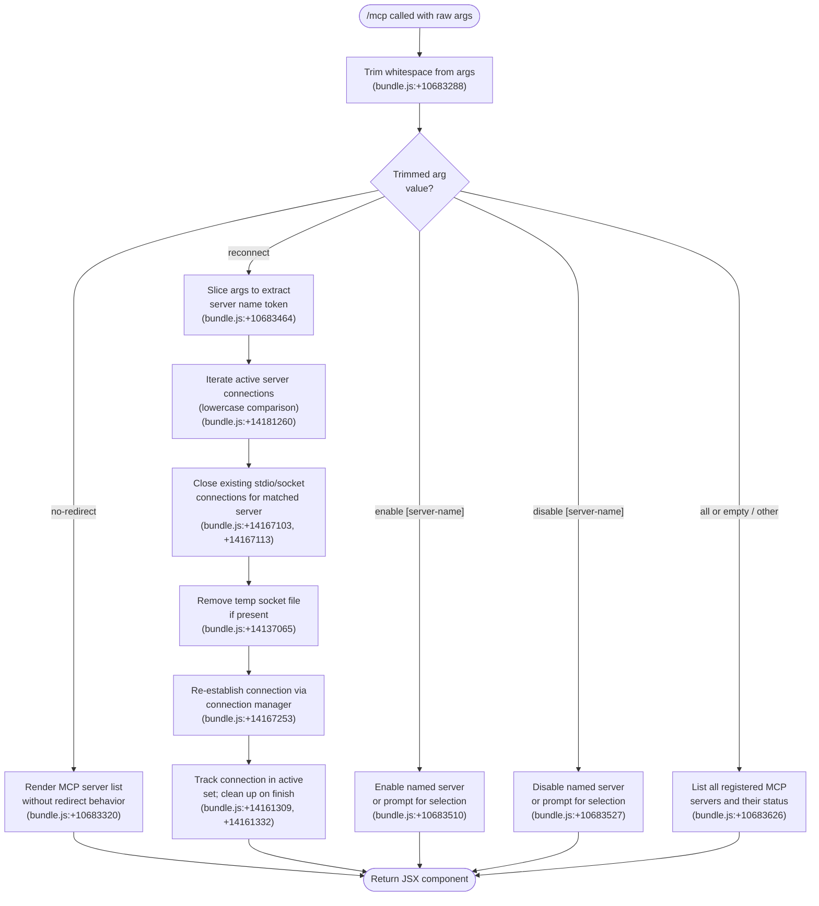

# `/mcp`

> Analysis basis: CC v2.1.133 bundle.js (AST extraction + Claude interpretation)
> Minimum version: v2.1.133

---

## Overview

The `/mcp` command provides interactive management of Model Context Protocol (MCP) servers registered with Claude Code. It supports enabling, disabling, and reconnecting individual or all MCP servers, and renders its output as an inline JSX component rather than plain text. The command is executed immediately upon invocation (`immediate: true`) and dispatches to sub-actions based on the trimmed argument string.

---

## Registration

| Field | Value |
|---|---|
| type | `local-jsx` |
| name | `mcp` |
| description | `Manage MCP servers` |
| argumentHint | `[enable\|disable [server-name]]` |
| immediate | `true` |
| module_id | `z_q` |
| load_inline | `true` |
| loc_byte | `10683817` |
| loc_byte_end | `10683989` |
| loc_line | `6431` |
| arbor_handler.name | `rK7` |
| arbor_handler.kind | `AsyncFunction` |
| arbor_handler.fqn | `claude-2.1.133::rK7` |
| arbor_handler.resolution_path | `module_id` |
| arbor_handler.n_hits | `0` |

Analysis basis: CC v2.1.133 bundle.js:+10683817

---

## Input Branching

The handler parses the trimmed argument string and dispatches across five distinct branches (`no-redirect`, `reconnect`, `enable`, `disable`, and `all`/default listing), requiring a Mermaid flowchart.



---

## Behavioral Spec

### 1. Argument Normalization

The handler is the async function `rK7` (Arbor resolution: `module_id` path from module `z_q`).

```
async function mcpCommandHandler(rawArgs):
    trimmedArgs = trim(rawArgs)           // bundle.js:+10683288
    subcommand  = firstToken(trimmedArgs)
    remainder   = trimmedArgs after subcommand

    dispatch(subcommand, remainder)
```

Analysis basis: CC v2.1.133 bundle.js:+10683288

---

### 2. `no-redirect` Sub-command

When the trimmed argument equals the literal `"no-redirect"` the command renders the MCP server list view in a mode that suppresses any automatic redirect/navigation side-effect.

```
if subcommand == "no-redirect":           // bundle.js:+10683320
    return renderMcpListComponent(redirectEnabled=false)
```

Analysis basis: CC v2.1.133 bundle.js:+10683320

---

### 3. `reconnect` Sub-command

When the argument begins with `"reconnect"`, the handler slices the remaining argument string to obtain the target server name, then tears down and rebuilds the server's transport connection.

```
if subcommand == "reconnect":
    serverName = slice(trimmedArgs, 1)    // bundle.js:+10683464
    targetName = serverName.toLowerCase() // bundle.js:+14181260

    for each activeConnection in connectionRegistry:
        if activeConnection.name.toLowerCase() == targetName:
            activeConnection.stdioHandle.close()   // bundle.js:+14167103
            activeConnection.socketHandle.close()  // bundle.js:+14167113

            if tempSocketFile exists:
                filesystem.unlinkSync(tempSocketFile)  // bundle.js:+14137065

            newConnection = establishConnection(activeConnection.config)
            // bundle.js:+14167253

            activeConnectionSet.add(newConnection)      // bundle.js:+14161309
            newConnection.finally(() =>
                activeConnectionSet.delete(newConnection)  // bundle.js:+14161332
            )

    return renderMcpStatusComponent()
```

The numeric literal `40` found at bundle.js:+14181334 likely represents a display truncation or timeout constant used inside the connection manager; the numeric literal `0` at bundle.js:+14167101 likely represents the initial index or a zero-length check within the same loop.

Analysis basis: CC v2.1.133 bundle.js:+10683464, +14181260, +14167103, +14167113, +14137065, +14167253, +14161309, +14161332

---

### 4. `enable` Sub-command

When the argument is `"enable"` optionally followed by a server name, the handler enables the specified MCP server. If no server name is provided, it is inferred to present a selection prompt (exact prompt UI is <!-- TODO: not found in depth-2 traversal; needs --depth 4 -->).

```
if subcommand == "enable":                // bundle.js:+10683510
    targetServer = remainder or promptUserForSelection()
    setServerEnabled(targetServer, enabled=true)
    return renderMcpStatusComponent()
```

Analysis basis: CC v2.1.133 bundle.js:+10683510

---

### 5. `disable` Sub-command

Symmetric to `enable`: disables the named server or prompts for selection when the name is omitted.

```
if subcommand == "disable":               // bundle.js:+10683527
    targetServer = remainder or promptUserForSelection()
    setServerEnabled(targetServer, enabled=false)
    return renderMcpStatusComponent()
```

Analysis basis: CC v2.1.133 bundle.js:+10683527

---

### 6. Default / `all` — Server Listing

Any other argument value (including the explicit literal `"all"` or an empty string) causes the handler to render the full MCP server roster with their current statuses.

```
else:                                     // bundle.js:+10683626
    serverList = getAllRegisteredServers()
    return renderMcpListComponent(servers=serverList, redirectEnabled=true)
```

Analysis basis: CC v2.1.133 bundle.js:+10683626

---

## State & Side Effects

| Item | Detail |
|---|---|
| Telemetry | No `tengu_*` events detected in this command's implementation at depth ≤ 2 |
| Transport teardown | `reconnect` closes both stdio and socket handles before reconnecting (bundle.js:+14167103, +14167113) |
| Filesystem mutation | `reconnect` calls `unlinkSync` on the server's temporary socket file when present (bundle.js:+14137065) |
| Connection registry | `reconnect` adds the new connection to the active-connection `Set` and registers a `finally` cleanup to remove it (bundle.js:+14161309, +14161332) |
| Server enabled-state | `enable` / `disable` mutate the persistent server configuration stored in app state |
| Render type | Output is a JSX component (`local-jsx`), rendered inline in the CLI TUI rather than as plain text |
| Execution timing | `immediate: true` — the handler fires before the normal prompt submission cycle |

---

## Version History

| Version | Change |
|---|---|
| v2.1.133 | Initial analysis |

---

## Common Mistakes

1. **Omitting the server name with `reconnect`**: The argument parser slices the token at index `1` (bundle.js:+10683464); passing `/mcp reconnect` with no trailing server name will cause the slice to yield an empty string, likely matching no server and silently doing nothing.
2. **Expecting plain-text output**: Because `type` is `local-jsx`, the response renders as a React component inside the TUI. Scripts or tooling that scrape raw text from the CLI output will not capture the MCP status table correctly.
3. **Case sensitivity**: Server-name matching during `reconnect` is done via `.toLowerCase()` on both sides (bundle.js:+14181260), so the lookup is case-insensitive — but `enable` / `disable` argument handling may differ; <!-- TODO: not found in depth-2 traversal; needs --depth 4 -->.
4. **Assuming `all` forces a reconnect**: The literal `"all"` at bundle.js:+10683626 is handled by the listing branch, not by reconnect. To reconnect every server you must invoke `/mcp reconnect <name>` once per server.
5. **Conflating `no-redirect` with a standard sub-command**: `no-redirect` is an internal rendering flag, not an end-user workflow; invoking it intentionally from user scripts is unsupported and may produce unexpected UI states.

---

## Appendix — Identifier Mapping

> For bundle debugging only. Identifiers change across versions.

| Identifier | Role |
|---|---|
| `rK7` | Main async handler for the `/mcp` command (AsyncFunction; Arbor FQN: `claude-2.1.133::rK7`) |
| `_` | Inner utility / argument-processing closure; performs `.toLowerCase()` comparison on server names |
| `f` | Active-connection object; holds `.close()` methods for stdio and socket handles, and delegates to connection manager `K` |
| `q` | Transport/socket resource associated with an active connection; exposes `.close()`, `.add()`, `.delete()`, and `unlinkSync` paths |
| `K` | Connection manager function; responsible for establishing a new transport connection and tracking it in the active-connection `Set` |

---

Note: index built via Arbor fallback; some signals (telemetry, literals) may be missing — see arbor-fallback.js.