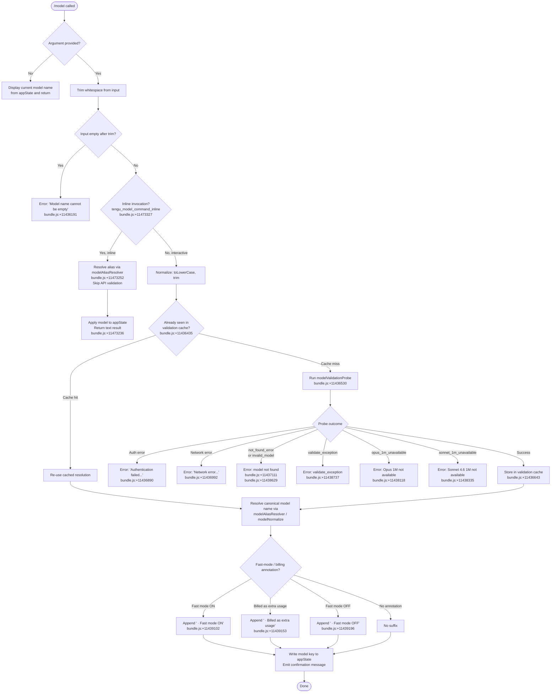

# `/model`

> Analysis basis: CC v2.1.139 bundle.js (AST extraction + Claude interpretation)
> Minimum version: v2.1.139

---

## Overview

The `/model` command allows users to set or display the AI model used by Claude Code for the current session. When called with a model identifier (or a recognized alias), it validates the model against the API via a lightweight probe request, applies the selection to application state, and reports the result. When called with no argument it displays the currently active model. The command supports non-interactive use (e.g., `--model` flag), making it scriptable.

---

## Registration

| Field | Value |
|---|---|
| type | `local` |
| name | `model` |
| description | Set the AI model for Claude Code |
| argumentHint | `<model>` |
| supportsNonInteractive | `true` |
| module_id | `wPq` |
| load_inline | `true` |
| loc_byte | `11480450` |
| loc_byte_end | `11480624` |
| loc_line | `7152` |
| arbor_handler.name | `AT7` |
| arbor_handler.fqn | `claude-2.1.139::AT7` |
| arbor_handler.kind | `AsyncFunction` |
| arbor_handler.resolution_path | `module_id` |
| arbor_handler.n_hits | `0` |

Analysis basis: CC v2.1.139 bundle.js:+11480450

---

## Input Branching

The handler exhibits 4+ distinct branches depending on whether the input is empty, matches an alias, is an inline invocation, or requires full validation with an API probe. A Mermaid flowchart is used.



---

## Behavioral Spec

### Handler Entry — `modelCommandHandler` (`AT7`)

The primary exported handler is the async function `AT7`, resolved via `module_id = wPq` using Arbor's `module_id` resolution path.

Analysis basis: CC v2.1.139 bundle.js:+11473169

```
async function modelCommandHandler(input, context):
    rawArg = input.trim()                          // bundle.js:+11473169

    if rawArg is in allowedModelsList:             // bundle.js:+11473185
        // Inline fast-path (non-interactive or piped)
        appState = context.getAppState()           // bundle.js:+11473208
        result   = modelAliasResolver(rawArg, appState)  // bundle.js:+11473252
        emit telemetry: tengu_model_command_inline  // bundle.js:+11473327
        return { type: "text", value: result }     // bundle.js:+11473236

    if rawArg is in extendedModelList:             // bundle.js:+11473272
        // Pass to full validation flow
        return modelValidationFlow(rawArg, context)

    // Default: pass to full validation flow
    return modelValidationFlow(rawArg, context)
```

### Model Alias Resolution — `modelAliasResolver` (`YJ8` → `sh` → `$16` / `dP`)

Resolves short alias strings to canonical model identifiers. Calls `modelNameNormalizer` (`$16`) and `modelMetadataLoader` (`dP`).

Analysis basis: CC v2.1.139 bundle.js:+11440082

```
function modelAliasResolver(alias, appState):
    normalized = modelNameNormalizer(alias)   // $16 → bundle.js:+11440003
    metadata   = modelMetadataLoader(alias)  // dP  → bundle.js:+11440010

    // Known short aliases
    switch normalized:
        case "sonnet":   return canonicalSonnetId    // bundle.js:+2141291
        case "haiku":    return canonicalHaikuId     // bundle.js:+2141330
        case "opus":     return canonicalOpusId      // bundle.js:+2141369
        case "best":     return canonicalBestId      // bundle.js:+2141406
        case "opusplan": return "Opus in plan mode, else Sonnet"  // bundle.js:+2139825
        case "[1m]" suffix models:
            return extended1MContextVariant          // bundle.js:+2141276

    return normalized
```

### Model Name Normalizer — `modelNameNormalizer` (`$16` → `VJ` / `Kq`)

Performs string normalization: trim, toLower, strip known vendor prefixes, map legacy names. Calls `canonicalIdMapper` (`Kq`).

Analysis basis: CC v2.1.139 bundle.js:+2139865

```
function modelNameNormalizer(raw):
    s = raw.trim().toLowerCase()             // Kq → bundle.js:+2141154, 2141165
    s = applyVendorPrefixStrip(s)            // removes "anthropic." prefix, bundle.js:+2135585
    s = applyVersionAliasMap(s)              // e.g. "claude-" prefix handling, bundle.js:+2135206
    s = applyPlanModeSuffix(s)              // e.g. "[1m]" suffix, bundle.js:+2141276
    return s
```

### Full Validation Flow — `modelValidationFlow` (`DJ8`)

Orchestrates the full interactive model-change path: empty check, cache lookup, API probe, error handling, annotation, and state write.

Analysis basis: CC v2.1.139 bundle.js:+11437940

```
async function modelValidationFlow(modelArg, context):
    trimmed = modelArg.trim()
    if trimmed == "":
        return error("Model name cannot be empty")  // bundle.js:+11436191

    normalized = trimmed.toLowerCase()              // bundle.js:+11436314

    // Check the in-memory validation cache (Vjq Map)
    if validationCache.has(normalized):             // bundle.js:+11436435
        cached = validationCache.get(normalized)
        return buildModelChangeMessage(cached, context)

    // Run ephemeral API probe to validate model existence
    probeResult = await modelValidationProbe(normalized, context)
                                                    // bundle.js:+11436480, +11436530

    switch probeResult.outcome:
        case "auth_error":
            return error("Authentication failed. Please check your API credentials.")
                                                    // bundle.js:+11436890
        case "network_error":
            return error("Network error. Please check your internet connection.")
                                                    // bundle.js:+11436992
        case "not_found_error":                     // bundle.js:+11437111
        case "invalid_model":                       // bundle.js:+11438629
            return error("Model not found: " + normalized)
        case "validate_exception":                  // bundle.js:+11438737
            return error("Validation exception for model: " + normalized)
        case "opus_1m_unavailable":                 // bundle.js:+11438118
            return error("Opus with 1M context is not available for your account. " +
                         "Learn more: https://code.claude.com/docs/en/model-config#extended-context-with-1m")
        case "sonnet_1m_unavailable":               // bundle.js:+11438335
            return error("Sonnet 4.6 with 1M context is not available for your account. " +
                         "Learn more: https://code.claude.com/docs/en/model-config#extended-context-with-1m")
        case "model_switch" / "not_allowed":        // bundle.js:+11437956, +11437971
            return error("Model switch not allowed")
        case "success":
            validationCache.set(normalized, probeResult.canonical)  // bundle.js:+11436643
            return buildModelChangeMessage(probeResult.canonical, context)
```

### Model Validation Probe — `modelValidationProbe` (`zJ8` → `JC`)

Sends a minimal sentinel request to the Anthropic API to confirm the model identifier is reachable. Uses the message "Hi" with cache type "ephemeral".

Analysis basis: CC v2.1.139 bundle.js:+11436154

```
async function modelValidationProbe(modelId, context):
    // Compose a minimal single-turn request
    request = {
        model:    modelId,
        messages: [{ role: "user", content: "Hi" }],  // bundle.js:+11436599
        cache:    "ephemeral",                          // bundle.js:+11436624
        stream:   false
    }
    response = await apiClient(request, context)       // JC → bundle.js:+11436480

    // Classify response into outcome string
    if response.error?.type == "not_found_error":      // bundle.js:+11437111
        return { outcome: "not_found_error" }
    if responseText.includes("model:"):               // bundle.js:+11437193
        return { outcome: "invalid_model" }
    // … further error-type classification …
    return { outcome: "success", canonical: modelId }
```

### Build Model Change Message — `buildModelChangeMessage` (`Ijq`)

Formats the confirmation UI string shown after a successful model switch. Appends billing/fast-mode annotations where applicable.

Analysis basis: CC v2.1.139 bundle.js:+11438557

```
function buildModelChangeMessage(canonicalModel, context):
    appState = context.getAppState()

    // Write the new model into persistent settings
    writeModelToSettings(canonicalModel, context)     // VPH → bundle.js:+11438854

    // Determine annotation suffix
    suffix = ""
    if isFastMode(canonicalModel, appState):
        suffix = " · Fast mode ON"                   // bundle.js:+11439102
    else if isBilledAsExtra(canonicalModel, appState):
        suffix = " · Billed as extra usage"          // bundle.js:+11439153
    else if isFastModeOff(canonicalModel, appState):
        suffix = " · Fast mode OFF"                  // bundle.js:+11439196

    // Construct confirmation output (SH / eq → text renderers)
    label = bold(canonicalModel) + suffix

    // Append settings-path hint via settingsPathFormatter (YG7)
    settingsNote = formatSettingsPath(context)       // bundle.js:+11439228

    return label + "\n" + settingsNote
```

### Settings Path Formatter — `settingsPathFormatter` (`YG7`)

Provides the human-readable path hint for where the model setting is persisted.

Analysis basis: CC v2.1.139 bundle.js:+11439228

```
function settingsPathFormatter(context):
    // Resolves the relevant settings file path
    paths = resolveSettingsPaths()   // ak → bundle.js:+11439297
    // Paths can be:
    //   .claude/settings.json          → "projectSettings"  bundle.js:+1177915
    //   .claude/settings.local.json    → "localSettings"    bundle.js:+1177979

    label = dim(paths.display) + bold(paths.file)
    return label
```

### Model Metadata Loader — `modelMetadataLoader` (`dP`)

Loads contextual metadata about available models: plan tier, subscription type, and provider.

Analysis basis: CC v2.1.139 bundle.js:+2138097

```
function modelMetadataLoader(modelId):
    providerInfo  = resolveProvider(modelId)   // e_ → bundle.js:+2138097
    planTierInfo  = resolvePlanTier(modelId)   // sU → bundle.js:+2138106
    // Plan tiers include: "max", "team", "default_claude_max_5x",
    //                     "enterprise", "enterprise_usage_based"
    //   bundle.js:+2905228, +2905299, +2905314, +2905409, +2905431
    opusPlanFlag  = resolveOpusPlanFlag(modelId)  // C5H → bundle.js:+2138112
    // "Opus Plan" label at bundle.js:+2140116
    extendedCtx   = resolveExtendedContext(modelId)  // hbH → bundle.js:+2138119
    fastModeInfo  = resolveFastMode(modelId)   // tZ  → bundle.js:+2138132
    renderHelper  = buildRenderHelper(modelId) // xj  → bundle.js:+2138138

    return { providerInfo, planTierInfo, opusPlanFlag, extendedCtx, fastModeInfo }
```

### Model List / Availability Check — `modelAvailabilityChecker` (`Po`)

Builds and filters the list of models available to the current user based on provider, prefix rules, and plan.

Analysis basis: CC v2.1.139 bundle.js:+2135432

```
function modelAvailabilityChecker(context):
    baseList   = loadBaseModelList()              // LA  → bundle.js:+2135432
    // Filter rules:
    //  - "anthropic." prefix check               bundle.js:+2135585
    //  - "claude-" prefix required for 1P models bundle.js:+2135206
    //  - startsWith("anthropic.") guard          bundle.js:+2135572
    //  - includes() guard for additional IDs     bundle.js:+2135600
    available  = applyProviderFilter(baseList)    // vbH, HoA, OKL → bundle.js:+2135629–2135779
    normalized = available.map(normalizeEntry)    // Kq  → bundle.js:+2135778
    extended   = applyExtended1MFilter(normalized)  // zKL → bundle.js:+2135934

    return extended
```

### Provider / Backend Resolution — `providerResolver` (`WA` → `SH`)

Resolves which backend provider is active. Provider values found in bundle:

| Literal | Meaning | loc_byte |
|---|---|---|
| `"bedrock"` | AWS Bedrock | 2001281 |
| `"foundry"` | Azure AI Foundry | 2001331 |
| `"mantle"` | Mantle gateway | 2001441 |
| `"vertex"` | Google Vertex AI | 2001489 |
| `"anthropicAws"` | Anthropic-on-AWS | 2001950 |
| `"gateway"` | Cloud gateway | 2001970 |
| `"firstParty"` | Direct Anthropic API | 2140016 |

Analysis basis: CC v2.1.139 bundle.js:+2001241

---

## State & Side Effects

| Item | Detail |
|---|---|
| Telemetry: `tengu_model_command_inline` | Fired when the command takes the inline (non-interactive) fast-path. bundle.js:+11473327 |
| Telemetry: `tengu_feature_ok` | Fired on successful feature flag check. bundle.js:+943635 |
| Telemetry: `tengu_feature_bad` | Fired on failed feature flag check. bundle.js:+943693 |
| Telemetry: `tengu_prompt_cache_1h_config` | Fired when 1-hour prompt-cache configuration is active during probe. bundle.js:+12170323 |
| Telemetry: `tengu_api_success` | Fired on successful API response from probe call. bundle.js:+12208122 |
| Validation cache (`Vjq` Map) | In-memory Map keyed by normalized model ID; set on first successful validation, read on subsequent calls. bundle.js:+11436435, +11436643 |
| appState `model` key | Updated to canonical model string on success. bundle.js:+11438858 |
| Settings file write | Model persisted to `.claude/settings.json` (projectSettings) or `.claude/settings.local.json` (localSettings). bundle.js:+1177915, +1177979 |
| API probe request | One ephemeral single-turn "Hi" message sent to validate the model. bundle.js:+11436599, +11436624 |
| Sound | None detected in depth-2 traversal |
| Hook registration | None detected in depth-2 traversal |

---

## Known Model Aliases

The following short aliases are resolved without an API round-trip:

| Alias | Resolution | loc_byte |
|---|---|---|
| `sonnet` | Current Claude Sonnet release | 2141291 |
| `haiku` | Current Claude Haiku release | 2141330 |
| `opus` | Current Claude Opus release | 2141369 |
| `best` | Best available model for account | 2141406 |
| `opusplan` | Opus in plan mode, else Sonnet | 2139825 |
| `[1m]` suffix | 1M extended-context variant | 2141276 |
| `sonnet[1m]` | Sonnet with 1M context | 11439937 |
| `sonnet-4-6[1m]` | Sonnet 4.6 with 1M context | 11439963 |

Model version identifiers known to the bundle include: `claude-opus-4-0`, `claude-opus-4-1`, `claude-opus-4-5`, `claude-opus-4-6`, `claude-sonnet-4-0`, `claude-sonnet-4-5`, `claude-sonnet-4-6`, `claude-haiku-4-5`, `opus-4-6`, `opus-4-7`, `sonnet-4-5`, `sonnet-4-6`, `opus-4-5`.

Analysis basis: CC v2.1.139 bundle.js:+2878779 – 2879116, +2128197 – 2128227

---

## Known Error Codes

| Code | User-facing message | loc_byte |
|---|---|---|
| `model_switch` / `not_allowed` | Model switch not allowed | 11437956, 11437971 |
| `opus_1m_unavailable` | Opus 1M context not available for account | 11438118 |
| `sonnet_1m_unavailable` | Sonnet 4.6 1M context not available for account | 11438335 |
| `invalid_model` | Model not found | 11438629 |
| `validate_exception` | Validation exception | 11438737 |
| `not_found_error` | Not found (API error type) | 11437111 |
| `opus_4_7` / `opus_4_6` / `opus_4_5` internal keys | Internal version discriminators | 11437484, 11437553, 11437598 |
| `sonnet_4_6` / `sonnet_4_5` internal keys | Internal version discriminators | 11437693, 11437768 |

---

## Version History

| Version | Change |
|---|---|
| v2.1.139 | Initial analysis |

---

## Common Mistakes

1. **Passing an empty string**: after trimming, an empty argument triggers the `"Model name cannot be empty"` error (bundle.js:+11436191). Always supply a non-whitespace model name or alias.
2. **Using a model unavailable on your plan**: if the account lacks the `default_claude_max_5x`, `enterprise`, or `enterprise_usage_based` tier (bundle.js:+2905314, +2905409, +2905431), certain Opus or extended-context variants will be rejected with an `opus_1m_unavailable` or `sonnet_1m_unavailable` error.
3. **Expecting instant switching in non-interactive mode**: the inline fast-path (`tengu_model_command_inline`) skips the API probe, so only pre-validated aliases resolve correctly; unknown model IDs will still require a probe round-trip on next interactive use.
4. **Assuming model persists across `--resume` sessions**: the model is written to the settings file, but overriding via `--model` CLI flag takes precedence; check both sources if the model appears to reset.
5. **Confusing alias names with canonical API IDs**: `opus`, `sonnet`, `haiku`, and `best` are convenience aliases — the canonical IDs sent to the API are resolved dynamically and may change with new Claude releases.

---

## Appendix — Identifier Mapping

> For bundle debugging only. Identifiers change across versions.

| Identifier | Role |
|---|---|
| `AT7` | Main async handler for `/model` command (`modelCommandHandler`) |
| `H` | General utility / timer helper (used in random delay: `Math.random`, `setTimeout`) |
| `_` | App context / state accessor |
| `YJ8` | Model alias resolver entry point |
| `sh` | Alias resolution inner dispatcher |
| `$16` | Model name normalizer |
| `VJ` | Canonical ID mapper (variant A) |
| `Kq` | Canonical ID mapper (variant B — trim/toLowerCase/replace chain) |
| `dP` | Model metadata loader |
| `e_` | Provider resolution helper |
| `sU` | Plan-tier resolver (`max`) |
| `C5H` | Opus-plan flag resolver (`team` / `default_claude_max_5x`) |
| `hbH` | Extended context resolver (`enterprise` / `enterprise_usage_based`) |
| `tZ` | Fast-mode resolver |
| `xj` | Render helper builder |
| `uM` | UI/WA render utility |
| `WA` | Provider backend renderer (bedrock/vertex/gateway etc.) |
| `$M` | Model metadata assembler |
| `eZ` | Extended context assembler |
| `Q` | Feature flag checker |
| `DJ8` | Full validation flow orchestrator |
| `Po` | Model availability checker / list builder |
| `A` | Generic array/list variable (context-dependent) |
| `f` | File/stream handle (context-dependent) |
| `M` | MCP client manager |
| `WIH` | MCP server connection initializer |
| `Niq` | MCP update applicator |
| `L` | MCP client registry / loader |
| `N` | Model name formatter / normalizer (with toUpperCase) |
| `$` | MCP client getter helper |
| `Wa7` | MCP retry / reconnect orchestrator |
| `K` | Model list / array (context-dependent) |
| `q` | MCP server config / file handle |
| `rm6` | Model registry entry builder |
| `m_` | Model registry initializer |
| `vbH` | Provider prefix inclusion check |
| `HoA` | Vendor prefix index finder |
| `OKL` | Provider filter with `O_H` + `Kq` |
| `O_H` | Exclusion list checker (`$_H.includes`) |
| `zKL` | Extended-context filter chain |
| `erA` | `startsWith` guard for model prefix |
| `xH` | Feature flag reader (calls `Q`) |
| `JG7` | Sonnet 1M model validator |
| `Ve` | Billing/fast-mode annotation helper (variant A) |
| `Y_H` | Text style helper (bold/dim wrapper) |
| `Rk1` | Sub-renderer `b6` caller |
| `jG7` | Sonnet 4.6 1M model validator |
| `qqH` | Billing/fast-mode annotation helper (variant B) |
| `wG7` | Exclusion list check + toLower normalizer |
| `Ijq` | Build model-change confirmation message |
| `VPH` | Write model to settings (`mT` flag writer) |
| `mT` | Flag/policy settings writer |
| `v8` | Settings path resolver |
| `kH` | Feature-flag secondary checker (calls `Q`) |
| `eq` | Text renderer (WA + SH chain) |
| `SH` | String coercion wrapper |
| `h5H` | UI helper (unknown detail at depth 2) |
| `SD` | Compound message renderer (`eq` + `dP` + `Kq`) |
| `Bd` | Bold/string wrapper |
| `eDH` | Extra-billing annotation composer |
| `IJ` | Inline model formatter (`Kq` + `dP`) |
| `WG` | Fast-mode OFF annotation helper |
| `YG7` | Settings path formatter (dim/bold label) |
| `ak` | Settings path array joiner (`.claude/settings.json`) |
| `aU` | Alias-display helper (`O_H` + `VJ` + `Kq`) |
| `zJ8` | Model validation probe dispatcher (empty check, cache, API call) |
| `JC` | API client call executor (full request pipeline) |
| `rx` | HTTP request builder (headers, auth, session IDs) |
| `P` | Buffer/stream reader helper |
| `U2H` | Request auth token helper |
| `G` | Request headers collection |
| `DS7` | Role/type finder in request |
| `RB_` | Request hash generator (sha256) |
| `Ln6` | Request metadata builder (variant A) |
| `Kn6` | Request metadata builder (variant B) |
| `uZH` | Prompt-cache config handler (1h, sdk, auto_mode) |
| `iT` | Response type normalizer |
| `v` | Away-summary / session tracker |
| `PVq` | Request payload finalizer |
| `uj` | Response text cleaner (`H.replace`) |
| `xd6` | Temperature / sampling params builder |
| `K2` | Message-map builder |
| `Y3H` | Response error classifier |
| `tLH` | API timing helper |
| `WGH` | Cache-control write helper (variant A) |
| `WF` | Cache-control write helper (variant B) |
| `NtH` | API response finalizer |
| `zG7` | Validation result formatter |
| `DG7` | Internal model version discriminator (`opus_4_7`, `opus_4_6`, `sonnet_4_6`, etc.) |
| `IH` | String-coerce output formatter |