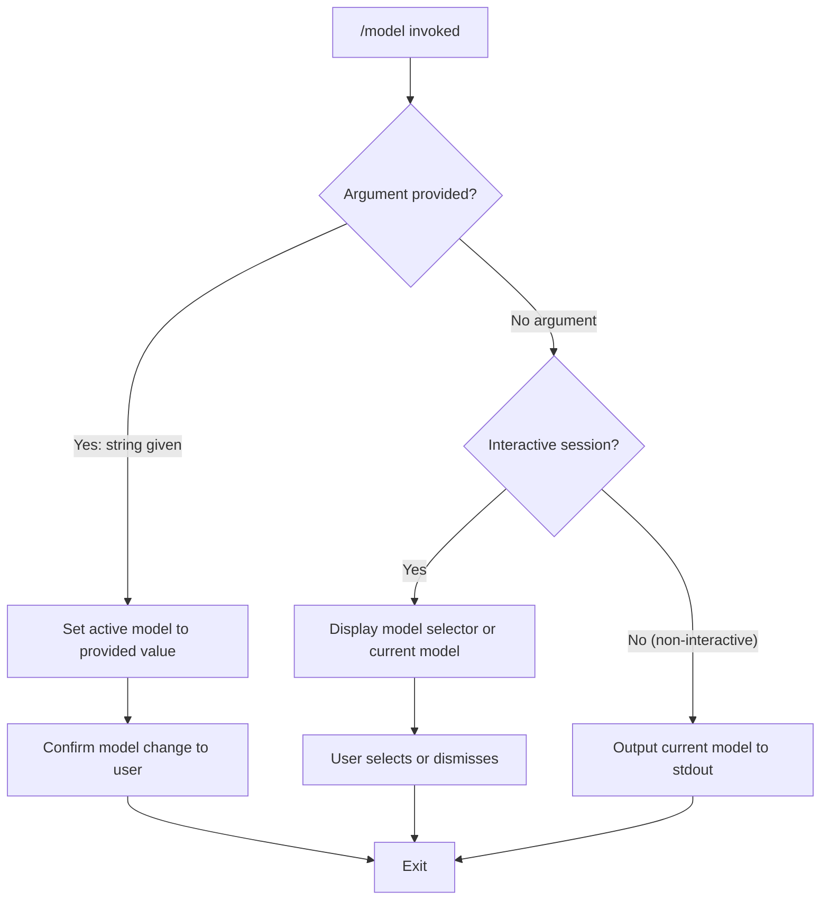

# `/model`

> Analysis basis: CC v2.1.139 bundle.js (AST extraction + Claude interpretation)
> Minimum version: v2.1.139

---

## Overview

The `/model` slash command allows users to view or change the active AI model used by Claude Code during a session. When invoked with an argument, it sets the target model; when invoked without an argument, it is expected to display the currently configured model or present a selection interface. It is registered as a local command that supports non-interactive execution environments.

---

## Registration

| Field | Value |
|---|---|
| type | `local` |
| name | `model` |
| description | `Set the AI model for Claude Code` |
| argumentHint | `<model>` |
| supportsNonInteractive | `true` |
| module_id | `wPq` |

Analysis basis: CC v2.1.139 bundle.js:+11480450

---

## Input Branching

The command accepts an optional positional argument representing the target model name. Based on the registration metadata, two primary execution paths exist:



Analysis basis: CC v2.1.139 bundle.js:+11480450
<!-- TODO: exact branching logic not found in depth-2 traversal; needs --depth 4 -->

---

## Behavioral Spec

### Model Selection

```
function handleModelCommand(args, appState):
    modelArg = args[0] if args is non-empty else null

    if modelArg is not null:
        setActiveModel(appState, modelArg)
        notifyUser("Model set to: " + modelArg)
    else:
        if isInteractiveSession(appState):
            presentModelSelector(appState)
        else:
            currentModel = getActiveModel(appState)
            writeToStdout(currentModel)
```

Analysis basis: CC v2.1.139 bundle.js:+11480450
<!-- TODO: setActiveModel, presentModelSelector, and getActiveModel internals not found in depth-2 traversal; needs --depth 4 -->

### Non-Interactive Mode

When `supportsNonInteractive` is `true`, the command may be driven by CLI flags or piped input without a TTY. In this mode, if no argument is given, the command is expected to emit the current model identifier to standard output and exit cleanly without prompting.

```
function handleNonInteractive(appState):
    model = getActiveModel(appState)
    writeToStdout(model)
    exitClean()
```

Analysis basis: CC v2.1.139 bundle.js:+11480450
<!-- TODO: non-interactive output format (plain string vs JSON) not found in depth-2 traversal; needs --depth 4 -->

---

## State & Side Effects

| Item | Detail |
|---|---|
| Telemetry | <!-- TODO: no telemetry events found in depth-2 traversal; needs --depth 4 --> |
| Hook registration | <!-- TODO: not found in depth-2 traversal; needs --depth 4 --> |
| appState changes | Active model identifier is expected to be updated in application state when a valid model argument is supplied |
| Sound | <!-- TODO: not found in depth-2 traversal; needs --depth 4 --> |

> **Note:** The AST extraction for module `wPq` returned an empty call graph, empty literals array, empty telemetry array, and empty identifiers array. The extractor noted: `"no entry functions found for module 'wPq'"`. All behavioral claims beyond the registration fields are inferred from the registration metadata alone and should be treated as provisional until a deeper traversal (depth ≥ 4) is performed.

Analysis basis: CC v2.1.139 bundle.js:+11480450

---

## Version History

| Version | Change |
|---|---|
| v2.1.139 | Initial analysis. Registration confirmed; implementation internals not yet extracted due to missing entry functions at depth ≤ 2. |

---

## Common Mistakes

1. **Passing an unrecognized model name**: The command accepts whatever string is provided as the `<model>` argument. If the model name does not correspond to a model available on the configured API endpoint, downstream inference calls will fail rather than the `/model` command itself rejecting the value at entry time. <!-- TODO: input validation behavior not confirmed in depth-2 traversal; needs --depth 4 -->
2. **Expecting interactive output in non-interactive mode**: Because `supportsNonInteractive` is `true`, running `/model` inside a script or piped environment will not render an interactive selector. Users expecting a TUI picker must run the command in a TTY session.
3. **Confusing session-scoped changes with persistent configuration**: Model selection via `/model` is expected to affect the current session. Whether the change persists to disk configuration is not confirmed by available data. <!-- TODO: persistence behavior not found in depth-2 traversal; needs --depth 4 -->

---

## Appendix — Identifier Mapping

> For bundle debugging only. Identifiers change across versions.

| Identifier | Role |
|---|---|
| `wPq` | Module ID for the `/model` command implementation |

> **Note:** No obfuscated runtime identifiers were returned by the depth-2 AST traversal for this command. The table above records only the module-level identifier visible in the registration metadata. A traversal at depth ≥ 4 is required to populate function-level identifier mappings.