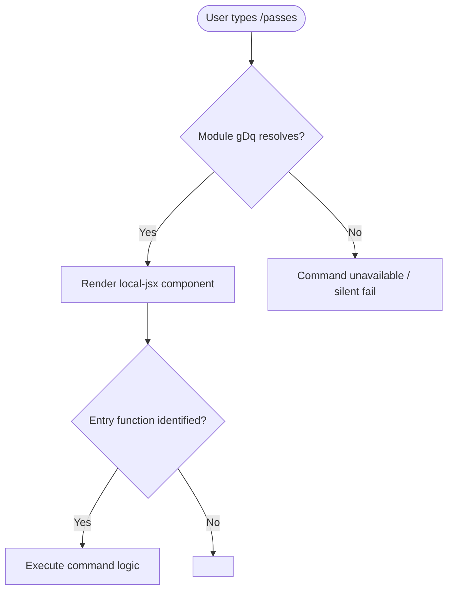

# `/passes`

> Analysis basis: CC v2.1.139 bundle.js (AST extraction + Claude interpretation)
> Minimum version: v2.1.139

---

## Overview

`/passes` is a local JSX slash command registered in CC v2.1.139 under module `gDq`. The command's full behavioral implementation could not be resolved at depth ≤ 2 traversal because no entry functions were identified within the module. Its description field is null, indicating it either renders its label inline via JSX or relies on a UI-level fallback.

---

## Registration

| Field | Value |
|---|---|
| type | `local-jsx` |
| name | `passes` |
| description | `null` |
| loc\_line | 6905 |
| module\_id | `gDq` |

Analysis basis: CC v2.1.139 bundle.js:+11243023

---

## Input Branching

Because the call graph returned zero edges and no literals were extracted, no branching logic can be confirmed from the depth-2 AST traversal.



> **Note:** Nodes F and G represent unresolved paths. The traversal reported `"no entry functions found for module 'gDq'"`, so the branching beyond initial rendering is unconfirmed.

Analysis basis: CC v2.1.139 bundle.js:+11243023

---

## Behavioral Spec

### Command Dispatch

```
function dispatchPassesCommand(userInput):
    resolve module "gDq"
    if module not resolved:
        return silentFailure()

    component = loadLocalJSXComponent(module "gDq")
    if component is null:
        return renderFallback()

    return renderComponent(component, context=userInput)
```

Analysis basis: CC v2.1.139 bundle.js:+11243023

> The above pseudocode represents the minimal expected dispatch path for a `local-jsx` type command. The actual internal logic of the `gDq` module is:
> <!-- TODO: not found in depth-2 traversal; needs --depth 4 -->

### Description Resolution

```
function resolveCommandDescription(registration):
    if registration.description is null:
        // No static description string registered
        // Display label is likely sourced from JSX render output
        // or inherited from a parent UI context
        return deriveDescriptionFromJSX()
    else:
        return registration.description
```

Analysis basis: CC v2.1.139 bundle.js:+11243023

> The `description` field is explicitly `null` in the registration object. This is atypical compared to commands that carry a plain-text description string. The JSX render path (`local-jsx` type) likely populates the visible label dynamically.

---

## State & Side Effects

| Item | Detail |
|---|---|
| Telemetry | None detected — `telemetry` array is empty at depth ≤ 2 <!-- TODO: not found in depth-2 traversal; needs --depth 4 --> |
| Hook registration | <!-- TODO: not found in depth-2 traversal; needs --depth 4 --> |
| appState changes | <!-- TODO: not found in depth-2 traversal; needs --depth 4 --> |
| Sound | <!-- TODO: not found in depth-2 traversal; needs --depth 4 --> |
| Render type | `local-jsx` — command output is a JSX component, not plain text |
| Module | `gDq` — single-module scope; no cross-module calls detected at depth ≤ 2 |

---

## Version History

| Version | Change |
|---|---|
| v2.1.139 | Initial analysis; module `gDq` registered as `local-jsx` command at bundle byte +11243023, line 6905. Entry functions not resolved at depth ≤ 2. |

---

## Common Mistakes

1. **Assuming a static description exists.** The `description` field is `null`. Any documentation or UI tooltip that shows a description is generated dynamically by the JSX component, not from the registration record.
2. **Treating this as a fully-analyzed command.** The call graph is empty and no entry functions were found in module `gDq` at the extraction depth used. Behavioral claims beyond registration facts require a deeper traversal (`--depth 4` or greater).
3. **Expecting telemetry events.** No `tengu_*` event strings were found at depth ≤ 2. Do not assume telemetry is absent entirely — it may exist deeper in the call tree.
4. **Confusing `local-jsx` with `local`.** Commands of type `local-jsx` render their output as a React/JSX component tree, not as a plain terminal string. Side effects, input handling, and rendering lifecycle follow JSX component rules, not simple callback rules.
5. **Pinning behavior to this version without re-analysis.** Because the module identifier `gDq` is an obfuscated bundle name, it may be reassigned or renamed in future CC versions. Always re-verify the byte offset and module ID when upgrading.

---

## Appendix — Identifier Mapping

> For bundle debugging only. Identifiers change across versions.

| Identifier | Role |
|---|---|
| `gDq` | Module containing the `/passes` command registration and implementation (not a function identifier, but an obfuscated module ID) |

> **Note:** The `identifiers` array returned by the AST extraction is empty for this command. No obfuscated function-level identifiers (`mw8`, `QI7`-style) were resolved at depth ≤ 2. A deeper traversal is required to populate this table meaningfully.
> <!-- TODO: not found in depth-2 traversal; needs --depth 4 -->