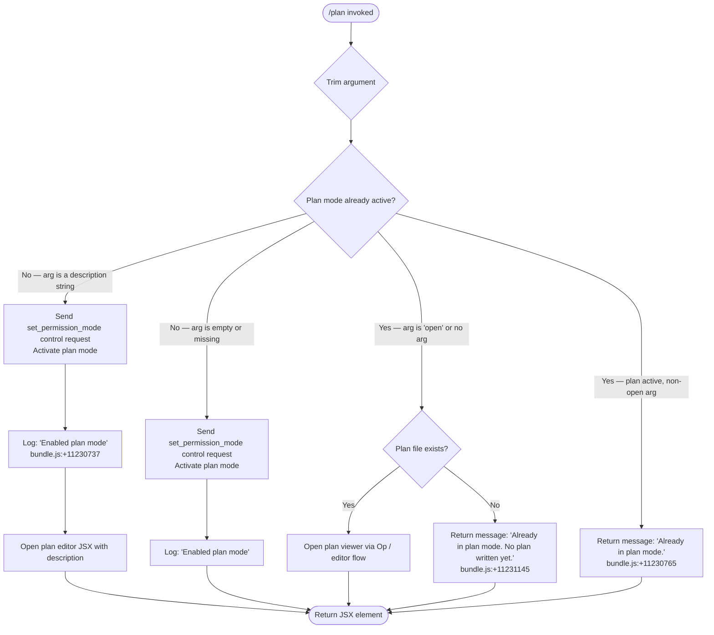

# `/plan`

> Analysis basis: CC v2.1.139 bundle.js (AST extraction + Claude interpretation)
> Minimum version: v2.1.139

---

## Overview

The `/plan` command enables **plan mode** for the current Claude Code session or displays the existing session plan. When invoked with no argument or an argument of `open`, it opens the plan viewer for an already-active plan mode session. When invoked with a description string, it activates plan mode by sending a `set_permission_mode` control request, sets the permission mode state, and then optionally opens a visual plan editor in the terminal using the supplied description.

---

## Registration

| Field | Value |
|---|---|
| type | `local-jsx` |
| name | `plan` |
| description | `Enable plan mode or view the current session plan` |
| argumentHint | `[open\|<description>]` |
| module_id | `NDq` |
| load_inline | `true` |
| loc_byte | `11231587` |
| loc_byte_end | `11231786` |
| loc_line | `6905` |
| arbor_handler.name | `X27` |
| arbor_handler.fqn | `claude-2.1.139::X27` |
| arbor_handler.kind | `AsyncFunction` |
| arbor_handler.resolution_path | `module_id` |
| arbor_handler.n_hits | `0` |

Analysis basis: CC v2.1.139 bundle.js:+11231587

---

## Input Branching

The command has four distinct input paths based on whether plan mode is already active and what argument is supplied. A Mermaid flowchart is used.



Analysis basis: CC v2.1.139 bundle.js:+11230737, +11230765, +11230986, +11231145

---

## Behavioral Spec

### Top-Level Handler (planCommandHandler — `X27`)

The Arbor-resolved handler for `/plan` is the async function `X27` (fqn: `claude-2.1.139::X27`, resolved via `module_id` path).

```
async function planCommandHandler(argument, context):
    trimmedArg = argument.trim()            // bundle.js:+11230967

    currentMode = getPermissionMode(context)  // calls permissionModeReader ($r)
    sessionPlan = getPlanState(context)       // calls planStateReader (K)

    if currentMode is already "plan":
        if trimmedArg == "open" or trimmedArg == "":
            planText = readPlanFile(context)    // calls planFileReader (NFH/O0/gG)
            if planText exists:
                return openPlanEditor(planText, context)  // calls editorOpener (Op)
            else:
                return statusMessage("Already in plan mode. No plan written yet.")
                // bundle.js:+11231145
        else:
            return statusMessage("Already in plan mode.")
            // bundle.js:+11230765
    else:
        // Activate plan mode
        sendControlRequest(context, {           // bundle.js:+11230669
            type: "set_permission_mode"         // bundle.js:+11230699
        })
        updatePermissionModeState(context, "plan")   // calls stateUpdater (Uf/CVH)
        logMessage("Enabled plan mode")              // bundle.js:+11230737

        if trimmedArg != "" and trimmedArg != "open":
            return renderPlanEditorJSX(trimmedArg, context)  // wT.createElement
        else:
            return null
```

Analysis basis: CC v2.1.139 bundle.js:+11230461 – +11231364

---

### Permission Mode Activation (`sendControlRequest` → `M.sendControlRequest`)

When plan mode is not yet active, the handler dispatches a control request to the session manager.

```
function activatePlanMode(context):
    request = {
        type: "set_permission_mode",    // bundle.js:+11230699
        mode: "plan"
    }
    M.sendControlRequest(context, request)   // bundle.js:+11230669
    // M resolves through WIH → Wa7 → Niq chain
```

The downstream `sendControlRequest` implementation (`WIH`, `Wa7`, `Niq`) orchestrates MCP server state updates, reconnection logic, and permission rule reloads.

Analysis basis: CC v2.1.139 bundle.js:+11230669

---

### Permission Mode State Update (`Uf` — permissionModeStateUpdater)

After sending the control request, the handler calls `Uf` to synchronously update the in-process state map so that subsequent commands see the new mode immediately.

```
function permissionModeStateUpdater(context, newMode):
    // Validates mode is not "bypassPermissions" when disableBypassPermissionsMode is set
    // bundle.js:+3933554 — logs: "Ignoring permission update: setMode 'bypassPermissions' rejected…"
    if newMode == "bypassPermissions" and bypassModeNotAvailable(context):
        logWarning("Ignoring permission update…")
        return

    applyModeRules(context, newMode)   // handles addRules / replaceRules / removeRules
    // Rule types: "allow" → alwaysAllowRules, "deny" → alwaysDenyRules,
    //             alwaysAskRules, addDirectories, removeDirectories
    // bundle.js:+3934015, +3934023, +3934055, +3934062, +3934080
    // bundle.js:+3933830, +3934178, +3934835, +3934489, +3935219

    stateMap.set(context.sessionId, newMode)   // bundle.js:+3934748
```

Analysis basis: CC v2.1.139 bundle.js:+3933466 – +3935447

---

### Plan File Reader (`NFH` / `O0` / `gG` — planFileResolver)

When the session is already in plan mode, the handler reads the current plan from disk.

```
function planFileResolver(context):
    planPath = buildPlanPath(context)      // NFH: V6 + H4H path join
    rawContent = readFile(planPath)        // O0 → gG → d$H: q.get / q.set / B6
    if readError is ENOENT:
        return null
    return rawContent
```

Analysis basis: CC v2.1.139 bundle.js:+11231049, +11231096, +11231103

---

### Plan Editor Opener (`Op` — externalEditorOpener)

When the user requests `open` and a plan file exists, or provides a description to seed the plan, the handler invokes `Op` to open an external editor (pausing the Ink UI).

```
function externalEditorOpener(context, content):
    editorBinary = resolveEditor(context)   // q37 → JR_: basename + tM7.find
    if not editorBinary:
        throw Error("Ink instance not found - cannot pause rendering")
        // bundle.js:+10437335

    context.ui.enterAlternateScreen()      // bundle.js:+10437488
    context.ui.pause()                     // bundle.js:+10437518
    context.ui.suspendStdin()              // bundle.js:+10437528

    args = buildEditorArgs(content)        // L.split + f.slice
    result = spawnSync(editorBinary, args, {stdio: "inherit"})
    // bundle.js:+10437610, +10437642

    rawOutput = readFileSync(tempFile)     // bundle.js:+10437912

    context.ui.exitAlternateScreen()       // bundle.js:+10437990
    context.ui.resumeStdin()              // bundle.js:+10438019
    context.ui.resume()                   // bundle.js:+10438035

    return rawOutput
```

Analysis basis: CC v2.1.139 bundle.js:+11231246, +10437287 – +10438035

---

### JSX Rendering (`FW1` / `NdH` — planJsxRenderer)

After activating plan mode with a description, the handler renders a JSX component via `wT.createElement`.

```
function planJsxRenderer(description, context):
    // NdH listens on data events from stdin stream
    // wu → n1_ → Dy9.createElement for inner UI elements
    // SAH provides string helpers (SH, _pH)
    // g5 strips ANSI codes via Bun.stripANSI
    element = wT.createElement(PlanModeComponent, {
        description: description,
        onConfirm: handleConfirm,
        onCancel: handleCancel
    })
    return element
```

Analysis basis: CC v2.1.139 bundle.js:+11231360, +11231364

---

### Telemetry-Adjacent State Logging (`N` / `G3` — debugLogger)

Throughout handler execution, the implementation calls a debug-level logger (`G3` → `uJH`) and a structured event emitter (`N`) that routes to downstream telemetry infrastructure.

```
function debugLog(level, message):
    if level == "debug":        // bundle.js:+197070
        uJH(message)
    else:
        structuredLog(level, message)
```

Analysis basis: CC v2.1.139 bundle.js:+11230461, +11230494

---

## State & Side Effects

| Item | Detail |
|---|---|
| Telemetry — `tengu_mcp_oauth_flow_start` | Emitted by MCP OAuth sub-path reachable from `sendControlRequest` chain (bundle.js:+9493369) |
| Telemetry — `tengu_mcp_oauth_flow_success` | Emitted on successful OAuth token exchange (bundle.js:+9497831) |
| Telemetry — `tengu_mcp_oauth_flow_error` | Emitted on OAuth failure (bundle.js:+9499003) |
| Telemetry — `tengu_bg_spare_enable` | Background spare session management, triggered by daemon layer (bundle.js:+14310004) |
| Telemetry — `tengu_bg_spare_spawn` | Background spare session spawned (bundle.js:+14310364) |
| Telemetry — `tengu_daemon_config_reload` | Config reload event inside daemon control loop (bundle.js:+14324140) |
| Telemetry — `tengu_config_auth_loss_prevented` | Auth-loss safeguard in config save path (bundle.js:+3130177) |
| Telemetry — `tengu_daemon_control` | Daemon control request dispatched (bundle.js:+14345083) |
| Telemetry — `tengu_daemon_yield` | Daemon yields to foreground service (bundle.js:+14328174) |
| Permission mode state | In-process mode map updated to `"plan"` via `Uf` (bundle.js:+3934748) |
| Control request | `set_permission_mode` dispatched to session manager via `M.sendControlRequest` (bundle.js:+11230699) |
| File I/O | Plan file read via `O0`/`gG`/`d$H` chain; external editor writes via `Op`/`k1q.spawnSync` |
| Ink UI | `enterAlternateScreen` / `pause` / `suspendStdin` called when opening external editor; reversed on exit (bundle.js:+10437488 – +10438035) |
| appState changes | Permission rules (`alwaysAllowRules`, `alwaysDenyRules`, `alwaysAskRules`) potentially rewritten by `Uf` rule application logic |
| Sound | <!-- TODO: not found in depth-2 traversal; needs --depth 4 --> |
| Hook registration | <!-- TODO: not found in depth-2 traversal; needs --depth 4 --> |

---

## Version History

| Version | Change |
|---|---|
| v2.1.139 | Initial analysis |

---

## Common Mistakes

1. **Passing `open` when plan mode is not yet active** — the `open` sub-command only opens the plan viewer when plan mode is already enabled. If plan mode is inactive, use `/plan <description>` to activate it first, then `/plan open` to view the plan.
2. **Expecting an immediate plan document** — activating plan mode with a bare `/plan` (no description) enables the mode without writing any plan content. The message "Already in plan mode. No plan written yet." will appear if you then run `/plan open` before any plan has been created (bundle.js:+11231145).
3. **Attempting `/plan` in `bypassPermissions` mode without the flag** — the `bypassPermissions` permission mode cannot be activated unless the session was launched with bypass support; a silent rejection is logged instead (bundle.js:+3933554).
4. **Assuming the external editor is always available** — `Op` requires the Ink UI instance to be present; if it is not, the command throws an internal error (`"Ink instance not found - cannot pause rendering"`, bundle.js:+10437335).
5. **Re-running `/plan <description>` when already in plan mode** — once plan mode is active, providing a description string is a no-op in terms of mode activation; the command returns the "Already in plan mode." message rather than updating the plan (bundle.js:+11230765).

---

## Appendix — Identifier Mapping

> For bundle debugging only. Identifiers change across versions.

| Identifier | Role |
|---|---|
| `X27` | Top-level plan command handler (AsyncFunction, Arbor-resolved) |
| `q` | File unlink helper (calls `Aaq.unlinkSync`) |
| `G3` | Debug logger dispatcher |
| `uJH` | Debug log sink |
| `$r` | Permission mode reader (retrieves current mode from state) |
| `K` | Connection/session map helper (calls `L.map`) |
| `L` | Session set manager (add/delete/finally) |
| `f` | Transport connection object (close/toLowerCase) |
| `A` | State/transport map (set/delete/toLowerCase) |
| `Uf` | Permission mode state updater (handles rule sets) |
| `N` | Structured event logger / telemetry dispatcher |
| `y9K` | Logging sub-system initializer |
| `Xo_` | Log handler setup |
| `H` | General string/buffer variable (context-dependent) |
| `yH` | JSON serializer wrapper |
| `_` | Utility / includes / toUpperCase helper |
| `LM` | Log message formatter |
| `os_` | Log level mapper |
| `QyH` | Log writer dispatcher |
| `ms_` | Log stream writer |
| `R9K` | Log file writer / rotation manager |
| `JyH` | Log queue flusher (setTimeout / setImmediate) |
| `n6H` | Log entry builder |
| `B6` | Path builder utility |
| `IV8` | Log rotation checker |
| `qt_` | Log path resolver |
| `At_` | Log file rename/unlink handler |
| `S9K` | Log append + rotation orchestrator |
| `C9` | Log sink set manager |
| `e4` | String escape / sanitizer |
| `xVK` | String replaceAll helper |
| `CVH` | MCP tool registry / context state builder |
| `Ny_` | Policy settings resolver |
| `yU` | User settings reader |
| `v8` | VS6 settings accessor |
| `ph` | Enabled-tools policy checker |
| `Ey_` | Tool allowance evaluator |
| `DuH` | First-party / AWS provider checker |
| `Tq` | Tool metadata resolver (Xo/Kq/IJ) |
| `bx8` | Settings-based policy override |
| `kk` | MCP tool registry key builder |
| `sqH` | MCP server tool enumerator |
| `dg` | MCP tool descriptor builder |
| `qO` | Tool description sanitizer |
| `mVK` | Description string pre-processor |
| `pT` | Object.hasOwn guard wrapper |
| `pVK` | Description truncator |
| `uVK` | Description replaceAll normalizer |
| `Wy_` | Tool input schema builder |
| `$e1` | Schema type constants (Ye1/we1/Je1) |
| `Xy_` | Tool path relativizer |
| `Xe1` | Allowed tool type checker |
| `We1` | Tool deduplication registry |
| `M` | MCP session manager (sendControlRequest / L.get / L.values) |
| `WIH` | MCP server connection orchestrator |
| `Le` | MCP server loader (Jg/m1H/MzH/Ke/QD6) |
| `m1H` | MCP server instance builder |
| `Ke` | MCP SDK server tool extractor |
| `QD6` | MCP tool cache manager |
| `aV` | Server validation helper |
| `P3` | Server config parser |
| `c2_` | Server credential resolver |
| `M_` | Module loader helper |
| `NP6` | Named server locator |
| `Q_7` | MCP needs-auth cache reader |
| `vk_` | MCP needs-auth file reader |
| `vL8` | MCP tool hash/version manager |
| `wn` | Config schema validator |
| `IL8` | Tool schema normalizer |
| `sJ` | SHA-256 hash builder |
| `A8` | MCP debug log push helper |
| `Kk_` | MCP server connection runner |
| `i87` | MCP transport factory |
| `kU` | Tool ident validator (Vx/nL) |
| `se` | MCP OAuth SSE server / token exchange |
| `KiH` | MCP connection lifecycle tracker |
| `Y` | Background spare session spawner |
| `DO8` | MCP needs-auth cache deleter |
| `Fg` | MCP reconnect orchestrator |
| `Vx` | Tool name validator |
| `D` | Daemon supervisor controller |
| `O7` | MCP error logger |
| `IH` | Error-to-string converter |
| `r87` | MCP race timeout builder |
| `n87` | MCP SSH transport selector |
| `Lk_` | MCP complete-auth flow handler |
| `qiH` | Pending OAuth state reader |
| `LiH` | Active connection state reader |
| `oa1` | MCP needs-auth cache writer |
| `IO8` | Cache file path builder |
| `Ak_` | MCP tool result processor |
| `QK` | MCP schema hasher |
| `B2_` | MCP server inclusion filter |
| `H8` | Global config save guard |
| `J` | Process kill helper (SIGTERM) |
| `v` | Away-summary / background session worker |
| `h` | Transient write buffer |
| `z` | Daemon stop controller |
| `Q` | General promise/queue utility |
| `la1` | JSON stream reader (N3H async iterator) |
| `N3H` | Async iterable mapper |
| `kP6` | Port parseInt (base 10) |
| `Nk_` | Port parseInt (base 20) |
| `Niq` | MCP update applicator (applyMcpUpdate) |
| `vO8` | MCP update JSON serializer |
| `WI` | MCP cleanup dispatcher |
| `DiH` | MCP diagnostic logger |
| `$` | Daemon status writer (NXq) |
| `NXq` | Daemon status file writer |
| `Eo` | Daemon status encoder |
| `RD` | Atomic file writer (randomBytes + rename) |
| `fW6` | Daemon status path builder |
| `Wa7` | MCP remote server retry manager |
| `kL8` | MCP server suppression checker |
| `o8` | Reconnect backoff timer |
| `O` | stdout/stderr writer wrapper |
| `NFH` | Plan file path resolver (H4H + V6) |
| `H4H` | Base plan directory resolver |
| `V6` | Path join utility |
| `O0` | Plan file read orchestrator (gG + B6 + D8 + LH) |
| `gG` | Plan content cache reader/writer (d$H) |
| `d$H` | Plan cache map accessor (q.get/q.set) |
| `R8_` | Plan path splitter |
| `iuH` | Plan ID encoder ($46) |
| `ll6` | Plan path normalizer ($46) |
| `D8` | File stat/read wrapper (w8) |
| `w8` | Low-level file read |
| `LH` | Error logger + log ring buffer manager |
| `q_` | Error string converter |
| `SH` | String coercion helper |
| `S1` | Log entry formatter (G7A) |
| `G7A` | Log timestamp builder |
| `CGK` | Log ring buffer rotate (shift/push) |
| `Op` | External editor opener (spawnSync, alternate screen) |
| `q37` | Editor binary resolver (JR_) |
| `JR_` | Editor path finder (basename + tM7.find) |
| `i1` | String indexOf/slice helper |
| `rJ` | IDE detection + editor path builder |
| `FW1` | Plan JSX component factory (NdH + g5) |
| `NdH` | Stdin data event handler for plan UI |
| `wu` | Plan UI inner element builder (b1_/n1_/SAH) |
| `n1_` | React createElement wrapper (Dy9) |
| `SAH` | Plan UI string renderer (SH + _pH) |
| `g5` | ANSI strip helper (Bun.stripANSI) |