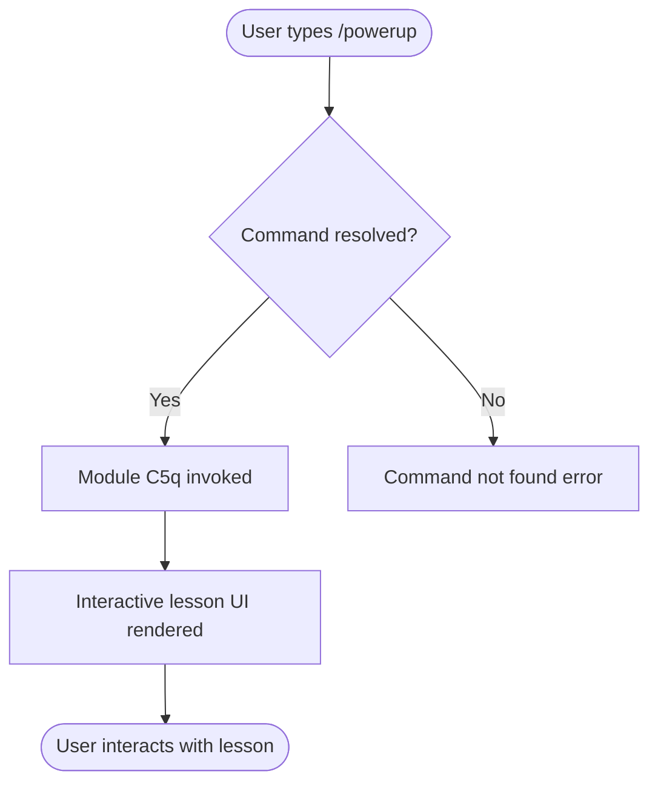

# `/powerup`

> Analysis basis: CC v2.1.139 bundle.js (AST extraction + Claude interpretation)
> Minimum version: v2.1.139

---

## Overview

The `/powerup` command launches quick interactive lessons designed to help users discover and learn Claude Code features. It is registered as a local JSX command, indicating it renders UI elements directly within the CLI context. The core mechanism delivers short, focused feature walkthroughs on demand.

---

## Registration

| Field | Value |
|---|---|
| type | `local-jsx` |
| name | `powerup` |
| description | `Discover Claude Code features through quick interactive lessons` |
| module_id | `C5q` |

Analysis basis: CC v2.1.139 bundle.js:+10866761

---

## Input Branching

The depth-2 AST traversal of module `C5q` returned an empty call graph and no extracted literals. As a result, branching logic beyond command invocation cannot be specified from verified data.

<!-- TODO: not found in depth-2 traversal; needs --depth 4 -->



> **Note:** Internal branching within module `C5q` (e.g., lesson selection, progression logic, exit conditions) could not be determined from the depth-2 traversal. The flowchart above reflects only the confirmed entry path.

Analysis basis: CC v2.1.139 bundle.js:+10866761

---

## Behavioral Spec

### Command Entry

The `/powerup` command is registered as a `local-jsx` type command. This type designation means the command renders its output using JSX components directly in the CLI, rather than emitting plain text or delegating to an external process.

```
function invokePowerup(userInput):
    resolve command name "powerup" from slash-command registry
    if not found:
        return error("command not found")
    load module C5q
    render interactive lesson UI using JSX renderer
    await user interaction events
    on completion or exit:
        return control to CLI shell
```

Analysis basis: CC v2.1.139 bundle.js:+10866761

### Interactive Lesson Delivery

Based on the command description ("Discover Claude Code features through quick interactive lessons"), the command is behaviorally expected to present one or more short lessons. The specific lesson content, ordering logic, lesson count, and navigation controls are:

<!-- TODO: not found in depth-2 traversal; needs --depth 4 -->

```
function renderLessonUI():
    // Internal structure of module C5q not recovered at depth-2
    // Expected: display lesson content as JSX component
    // Expected: handle user navigation (next, previous, exit)
    // Expected: track lesson completion state
    UNKNOWN — see TODO above
```

Analysis basis: CC v2.1.139 bundle.js:+10866761

---

## State & Side Effects

| Item | Detail |
|---|---|
| Telemetry | None detected at depth-2 traversal <!-- TODO: not found in depth-2 traversal; needs --depth 4 --> |
| Hook registration | <!-- TODO: not found in depth-2 traversal; needs --depth 4 --> |
| appState changes | <!-- TODO: not found in depth-2 traversal; needs --depth 4 --> |
| Sound | <!-- TODO: not found in depth-2 traversal; needs --depth 4 --> |
| Render type | JSX (local-jsx), rendered inline in CLI |

> The AST extraction returned empty `telemetry`, `literals`, `callGraph`, and `identifiers` arrays for module `C5q`. No side effects can be confirmed from the available data beyond the fact that the command renders JSX output.

Analysis basis: CC v2.1.139 bundle.js:+10866761

---

## Version History

| Version | Change |
|---|---|
| v2.1.139 | Initial analysis; command registered at bundle.js:+10866761, module `C5q` |

---

## Common Mistakes

1. **Assuming plain-text output**: Because `/powerup` is registered as `local-jsx`, its output is rendered as interactive UI components, not static text. Attempting to pipe or capture its output as plain text may yield unexpected results.
2. **Expecting deeper behavioral data from this spec**: The depth-2 AST traversal found no call graph, literals, or telemetry for module `C5q`. Claims about lesson content, lesson count, navigation controls, or state changes are not verified and should not be relied upon until a deeper traversal (`--depth 4` or greater) is performed.
3. **Confusing `/powerup` with a configuration command**: The command is described as delivering interactive lessons, not as modifying settings, granting permissions, or changing any persistent configuration state — though state changes cannot be fully ruled out without deeper analysis.

---

## Appendix — Identifier Mapping

> For bundle debugging only. Identifiers change across versions.

| Identifier | Role |
|---|---|
| C5q | Module identifier for the `/powerup` command implementation |

> No obfuscated short-form identifiers (e.g., `mw8`, `QI7` style) were returned by the depth-2 traversal. The only non-English identifier present is the module ID `C5q`, listed above for bundle debugging reference.

Analysis basis: CC v2.1.139 bundle.js:+10866761