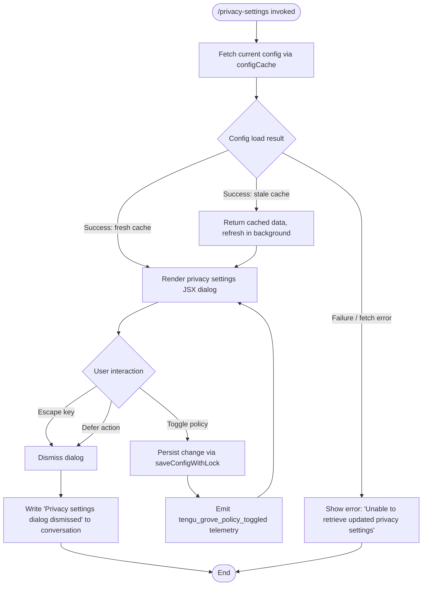

# `/privacy-settings`

> Analysis basis: CC v2.1.139 bundle.js (AST extraction + Claude interpretation)
> Minimum version: v2.1.139

---

## Overview

The `/privacy-settings` command opens an interactive JSX dialog that allows users to view and modify their current privacy configuration. It resolves the current privacy state by loading and caching global configuration, then renders a settings panel where toggle actions persist changes and emit a telemetry event (`tengu_grove_policy_toggled`). On dismissal (via escape or defer), the dialog is closed and a descriptive message is written to the conversation.

---

## Registration

| Field | Value |
|---|---|
| type | `local-jsx` |
| name | `privacy-settings` |
| description | `View and update your privacy settings` |
| loc_byte | `11254404` |
| loc_byte_end | `11254596` |
| loc_line | `6915` |
| module_id | `nDq` |
| load_inline | `true` |
| arbor_handler.name | `C27` |
| arbor_handler.fqn | `claude-2.1.139::C27` |
| arbor_handler.kind | `AsyncFunction` |
| arbor_handler.resolution_path | `module_id` |
| arbor_handler.n_hits | `0` |

Analysis basis: CC v2.1.139 bundle.js:+11254404

---

## Input Branching

The command handler has 3+ distinct paths based on dismissal action, config-load outcome, and policy toggle events.



---

## Behavioral Spec

### Main Handler — `privacySettingsHandler` (bundle identifier: `C27`)

```
async function privacySettingsHandler(context):
    // Step 1: Resolve current configuration
    configData = await Promise.all([
        loadConfigWithCache(),   // tgH — Grove-backed config loader
        resolveAppState()        // H — app-level state accessor
    ])

    // Step 2: Render settings JSX
    settingsElement = createElement(PrivacySettingsPanel, {
        config: configData,
        onToggle: handlePolicyToggle,
        onDismiss: handleDismiss
    })

    render(settingsElement)
```

Analysis basis: CC v2.1.139 bundle.js:+11253408

---

### Config Cache Loader — `groveConfigLoader` (bundle identifier: `tgH`)

Implements a "Grove" cache strategy with three states:

```
function groveConfigLoader():
    cachedEntry = readConfigCache()

    if cachedEntry is missing:
        log("Grove: No cache, fetching config in background (dialog skipped this session)")
        fetchConfigInBackground(saveConfigWithLock)
        return null

    if cacheIsStale(cachedEntry):
        log("Grove: Cache stale, returning cached data and refreshing in background")
        fetchConfigInBackground(saveConfigWithLock)
        return cachedEntry.data

    log("Grove: Using fresh cached config")
    return cachedEntry.data
```

- "Stale" vs "fresh" determined by comparing `Date.now()` against a stored timestamp.
- Background refresh uses `saveConfigWithLock` (bundle identifier: `c8_`) to avoid races.
- Literal log strings observed at bundle.js:+6526500, +6526620, +6526726.

Analysis basis: CC v2.1.139 bundle.js:+6526385

---

### Config Read/Write with Lock — `saveConfigWithLock` (bundle identifier: `c8_`)

```
function saveConfigWithLock(configPath, updateFn):
    ensureDirectoryExists(dirname(configPath))
    acquireLockFile(configPath)

    if lockAcquisitionDelayed:
        warn("Lock acquisition took longer than expected - another Claude instance may be running")
        emit("tengu_config_lock_contention")

    existingConfig = readFileSync(configPath)

    if existingConfig is missing auth fields that cache holds:
        error("saveConfigWithLock: re-read config is missing auth [...] See GH #3117.")
        emit("tengu_config_stale_write")
        releaseLock()
        return

    updatedConfig = updateFn(existingConfig)

    // Rotation: keep up to 5 backups, named with ".backup." prefix + timestamp
    rotateLimitedBackups(configPath, maxBackups=5)

    writeFileSync(configPath, updatedConfig)
    releaseLock()
```

- Lock-contention warning string observed at bundle.js:+3132751.
- Auth-loss guard string observed at bundle.js:+3133167; related event `tengu_config_auth_loss_prevented` at bundle.js:+3133319.
- Backup naming uses `.backup.` prefix (bundle.js:+3133637).
- Maximum backup retention: 5 (bundle.js:+3133770).
- Maximum lock wait before warning: 60 000 ms (bundle.js:+3133521).

Analysis basis: CC v2.1.139 bundle.js:+3132540

---

### Global Config Fallback Writer — `saveGlobalConfig` (bundle identifier: `H8`)

```
function saveGlobalConfig(config):
    if cachedConfig has auth but reReadConfig is missing auth:
        error("saveGlobalConfig fallback: re-read config is missing auth [...] See GH #3117.")
        return

    determineConfigSource(config)   // classifies as: unknown | local | migrated | native | installed | disabled | enabled | no_permissions | global | not_configured
    persistToGlobalConfigFile(config)
```

- Source classification literals observed at bundle.js:+3130502 through +3130708.
- Auth-loss guard string observed at bundle.js:+3130049.

Analysis basis: CC v2.1.139 bundle.js:+3129842

---

### Policy Toggle Handler — `handlePolicyToggle`

```
function handlePolicyToggle(policyKey, newValue):
    updatedConfig = mergePolicy(currentConfig, policyKey, newValue)
    saveConfigWithLock(configPath, () => updatedConfig)
    emit telemetry: "tengu_grove_policy_toggled"
    re-render PrivacySettingsPanel with updatedConfig
```

Telemetry emission observed at bundle.js:+11253944.

---

### Dismiss Handler — `handleDismiss`

```
function handleDismiss(reason):
    // reason is one of: "escape" | "defer"
    closeDialog()
    writeToConversation("Privacy settings dialog dismissed")
```

- Dismiss-reason literals `"escape"` and `"defer"` at bundle.js:+11253571, +11253585.
- Dismiss message literal `"Privacy settings dialog dismissed"` at bundle.js:+11253596.

Analysis basis: CC v2.1.139 bundle.js:+11253571

---

### Error Path

When config retrieval fails, the handler surfaces a human-readable message:

```
function handleConfigError(err):
    writeToConversation("Unable to retrieve updated privacy settings")
    closeDialog()
```

- Error message literal at bundle.js:+11253722.

---

### MCP State Synchronisation (deep call path via `M` / `Wa7` / `WIH`)

The privacy-settings handler indirectly triggers MCP server state reconciliation when it calls into the app-state resolver (`M`). This includes:

- Iterating registered MCP server entries (`WIH`, `Le`, `m1H`).
- Checking for `needs-auth` cached state and skipping connections accordingly (literal at bundle.js:+9564919).
- Reconnect telemetry events: `mcp_reconnect`, `mcp_reconnect_not_connected`, `mcp_reconnect_failed`.
- OAuth flow management (start/success/error) during any reconnect attempt triggered by state refresh.

This is a side effect of loading global app state; the `/privacy-settings` command itself does not initiate MCP operations directly.

Analysis basis: CC v2.1.139 bundle.js:+14045132

---

## State & Side Effects

| Item | Detail |
|---|---|
| Telemetry | `tengu_grove_policy_toggled` (bundle.js:+11253944) — fired on every policy toggle |
| Telemetry | `tengu_config_parse_error` (bundle.js:+3135421) — config file parse failure |
| Telemetry | `tengu_config_lock_contention` (bundle.js:+3132840) — lock held longer than expected |
| Telemetry | `tengu_config_stale_write` (bundle.js:+3132976) — stale-config write attempt detected |
| Telemetry | `tengu_config_auth_loss_prevented` (bundle.js:+3133319) — auth field loss blocked |
| Telemetry | `tengu_mcp_oauth_flow_start` / `_success` / `_error` — indirect, via app-state refresh |
| Telemetry | `tengu_daemon_config_reload` (bundle.js:+14324140) — indirect, via daemon config path |
| Config writes | `saveConfigWithLock` (c8_) writes to global config file; creates up to 5 `.backup.` rotations |
| appState changes | Privacy policy field(s) updated in global config on toggle; changes propagate to Grove cache |
| Dismiss side effect | Writes the string `"Privacy settings dialog dismissed"` to the active conversation on escape/defer |
| Error side effect | Writes `"Unable to retrieve updated privacy settings"` to conversation on config load failure |
| Sound | <!-- TODO: not found in depth-2 traversal; needs --depth 4 --> |

---

## Version History

| Version | Change |
|---|---|
| v2.1.139 | Initial analysis |

---

## Common Mistakes

1. **Running while another Claude instance holds the config lock.** The lock-contention guard will log a warning and may delay or skip the write. Only one Claude process should modify the global config at a time.
2. **Expecting immediate disk persistence after a toggle.** The Grove cache may still serve a slightly stale view until the background `saveConfigWithLock` cycle completes.
3. **Dismissing with escape vs. defer.** Both close the dialog and produce the same dismiss message in the conversation, but they are distinct internal reason codes; integrations that parse conversation output for dismiss reason should not conflate them.
4. **Interpreting an error message as a config reset.** `"Unable to retrieve updated privacy settings"` means the read phase failed; no write occurred and the existing config is unchanged.
5. **Assuming no MCP side effects.** Loading the app state (required to show current settings) can trigger MCP reconnect attempts for any server in a `needs-auth` state.

---

## Appendix — Identifier Mapping

> For bundle debugging only. Identifiers change across versions.

| Identifier | Role |
|---|---|
| `C27` | Main handler (`privacySettingsHandler`) — AsyncFunction, resolved via module_id `nDq` |
| `tgH` | Grove-backed config cache loader |
| `g2H` | Config resolution utility called by Grove loader |
| `o1` | API key / credential resolver |
| `fFA` | Credential field accessor A |
| `LFA` | Credential field accessor B |
| `Pw` | API key helper / environment variable reader (`ANTHROPIC_API_KEY`, `apiKeyHelper`) |
| `e_` | Boolean-coercing config flag reader |
| `lU` | Boolean coercion utility |
| `pWL` | Config policy wrapper |
| `a7` | Config accessor helper |
| `b6` | Config file read-with-watch orchestrator |
| `B6` | Config file path resolver |
| `U8_` | Config schema validator |
| `cfH` | Low-level config file reader (reads, parses, handles ENOENT/EEXIST) |
| `pVL` | File watcher setup/teardown (watchFile / unwatchFile) |
| `N` | Logging / telemetry dispatcher |
| `y9K` | Log-level filter |
| `Xo_` | Log sink router |
| `H` | App-level state / random seed accessor (also setTimeout host) |
| `yH` | JSON serialiser wrapper |
| `_` | General utility / identity helper |
| `LM` | Log message formatter (applies `[REDACTED]` substitution) |
| `os_` | Log field mapper |
| `A` | String utility (toLowerCase, lastIndexOf, slice) |
| `QyH` | Buffered write flusher |
| `ms_` | Raw stream write helper |
| `R9K` | Async file writer with rotation |
| `JyH` | Debounced batch writer |
| `n6H` | Directory-safe append helper |
| `IV8` | Write error classifier (`EISDIR` guard) |
| `qt_` | Temp-file path builder |
| `At_` | Atomic rename helper (`.txt` extension handling) |
| `S9K` | mkdir + appendFile sequence |
| `C9` | Active-write-set tracker |
| `vM1` | Grove cache state machine (stale / fresh / no-cache branches) |
| `H8` | Global config save (fallback, with auth-loss guard) |
| `c8_` | `saveConfigWithLock` — lock-acquiring config writer with backup rotation |
| `suH` | Config lock file utility |
| `E09` | Config entry iterator (`Object.entries`) |
| `tuH` | Timestamp helper (`Date.now`) |
| `w46` | Config merge utility |
| `Q` | Promise/queue utility |
| `d8_` | Config write helper (dirname + fv + yH sequence) |
| `M` | MCP server manager entry point |
| `WIH` | MCP server registry iterator and state reconciler |
| `Le` | MCP server configuration loader |
| `m1H` | MCP server entry processor (enterprise / mcp / user / project scopes) |
| `Ke` | MCP SDK server collector |
| `QD6` | MCP SSE/HTTP server deduplication map builder |
| `aV` | MCP server config accessor |
| `P3` | MCP server config path builder |
| `c2_` | MCP config path helper |
| `K` | Output formatter (padEnd, map) |
| `L` | Promise/set lifecycle manager |
| `f` | Stream lifecycle (close) |
| `M_` | Generic identity/pass-through helper |
| `NP6` | MCP server filter utility |
| `Q_7` | MCP needs-auth cache reader |
| `vk_` | Needs-auth cache file reader (`iqH.readFile`) |
| `vL8` | MCP server hash/identity builder (sha256/hex) |
| `wn` | MCP connection factory |
| `IL8` | Connection key resolver (`QK`) |
| `sJ` | SHA-256 hash builder (`wG1.createHash`) |
| `A8` | MCP debug logger (`Jd.logMCPDebug`) |
| `Kk_` | MCP connection orchestrator (connect / reconnect / OAuth flow) |
| `i87` | MCP transport initialiser |
| `kU` | Transport pair builder (`Vx` + `nL`) |
| `se` | MCP OAuth session manager (OAuth flow, callback server, token exchange) |
| `KiH` | Pending-connection map manager (`KO8`) |
| `Y` | Background spare process controller |
| `DO8` | Needs-auth cache deleter (`iqH.unlink`) |
| `Fg` | MCP reconnect controller |
| `Vx` | Transport send channel |
| `D` | Daemon/supervisor config writer |
| `O7` | MCP error logger (`Jd.logMCPError`) |
| `IH` | Error-to-string converter |
| `r87` | Reconnect retry policy |
| `n87` | SSH transport detector (`J_.isSSH`) |
| `Lk_` | `complete_authentication` tool handler |
| `qiH` | Pending-request map getter (`qO8.get`) |
| `LiH` | Active-connection map getter (`KO8.get`) |
| `oa1` | Needs-auth cache writer (`iqH.writeFile`) |
| `IO8` | Needs-auth cache path builder (`VO8.join`) |
| `Ak_` | MCP tool-call dispatcher |
| `QK` | Connection key hash builder (`HaA`) |
| `B2_` | MCP server config includes-check |
| `J` | Process map (SIGTERM / kill) |
| `v` | Background session process handler |
| `h` | Transient write channel |
| `z` | Daemon stop controller (daemon_stop / daemon_stop_failed) |
| `la1` | MCP port parser / numeric validator (`N3H`) |
| `N3H` | Safe-integer / type validator |
| `kP6` | Port string parser (`parseInt`, radix 10) |
| `Nk_` | Port string parser variant (`parseInt`, radix 20) |
| `Niq` | MCP update applier (`H.applyMcpUpdate`) |
| `vO8` | MCP update serialiser |
| `WI` | MCP cleanup dispatcher (`DiH`, `K.cleanup`) |
| `DiH` | MCP connection disposer |
| `$` | Config persistence queue (`NXq`) |
| `NXq` | Atomic config writer orchestrator |
| `Eo` | Config encoder (`b5H`) |
| `RD` | Atomic file writer (randomBytes temp file + rename) |
| `fW6` | Daemon status file path builder (`daemon.status.json`) |
| `Wa7` | MCP server reconciler (diff + restart logic) |
| `kL8` | MCP server active-set checker (`qh4`, `Kh4`) |
| `q` | Cleanup unlink helper (`Aaq.unlinkSync`) |
| `o8` | Process watchdog (timeout + clearTimeout + unref) |
| `O` | Background session state accessor (`x8`) |

---

Note: index built via Arbor fallback; some signals (telemetry, literals) may be missing — see arbor-fallback.js.