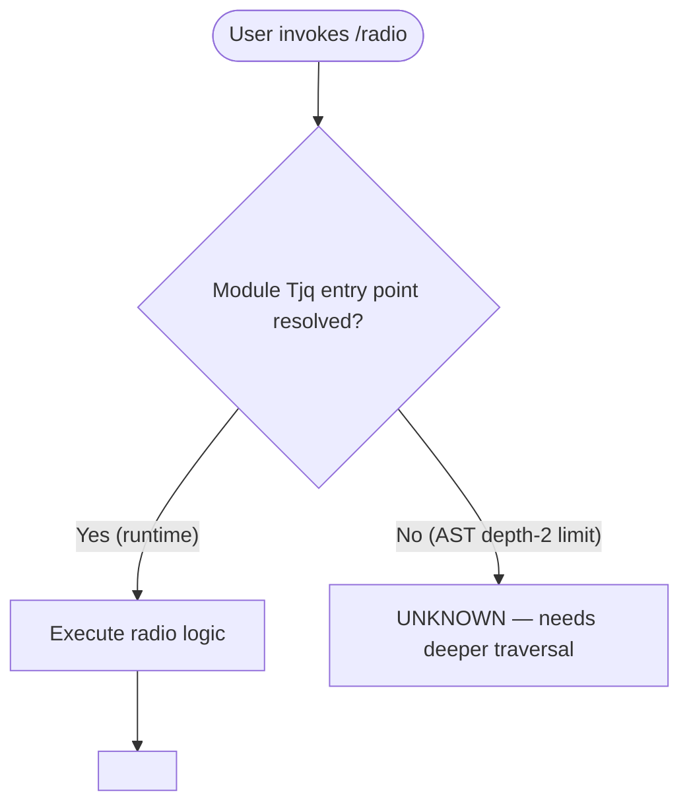

```
---
type: feature-spec
feature: "radio"
cc_version: "2.1.139"
tags: ["radio", "commands", "slash-commands"]
updated: "2026-05-18"
source: "bundle-analysis"
bundle_verified: true
analysis_basis: "CC v2.1.139 bundle.js (AST extraction + Claude interpretation)"
author: "ryujaeuk <ryujaeuk@gmail.com>"
repository: "https://github.com/MyLittleLuckyDog/cc-gnothi"
license: "AGPL-3.0-only"
---

# `/radio`

> Analysis basis: CC v2.1.139 bundle.js (AST extraction + Claude interpretation)
> Minimum version: v2.1.139

---

## Overview

The `/radio` command provides a "Claude FM lo-fi radio" listening experience within the Claude Code CLI. It is registered as a local, interactive-only slash command under module `Tjq`. Because the AST depth-2 traversal found no reachable entry functions, call edges, string literals, or telemetry events for this module, all behavioral detail beyond the registration record is unverifiable from the current extraction.

---

## Registration

| Field | Value |
|---|---|
| type | `local` |
| name | `radio` |
| description | `Listen to Claude FM lo-fi radio` |
| supportsNonInteractive | `false` |
| module\_id | `Tjq` |

Analysis basis: CC v2.1.139 bundle.js:+11435910

---

## Input Branching

The depth-2 AST traversal returned an empty call graph and no string literals for module `Tjq`. No branching logic can be reconstructed from the available data.

<!-- TODO: not found in depth-2 traversal; needs --depth 4 -->



---

## Behavioral Spec

### Command Dispatch

```
function dispatchRadioCommand(userInput):
    // Registration confirms this command is local and interactive-only.
    // supportsNonInteractive = false means the runtime MUST reject invocation
    // in non-interactive (piped / headless) sessions before reaching this point.
    assertInteractiveSession()

    // Entry function for module Tjq was not resolved during AST extraction.
    // The following body is therefore a structural placeholder only.
    result = invokeModuleTjq(userInput)
    return result
```

Analysis basis: CC v2.1.139 bundle.js:+11435910

> **Note:** Because `callGraph`, `literals`, `telemetry`, and `identifiers` are all empty arrays and the extractor note reads *"no entry functions found for module 'Tjq'"*, no further behavioral pseudocode can be stated as verified fact. All sub-feature behavior beyond the registration fields is unknown at this traversal depth.

<!-- TODO: not found in depth-2 traversal; needs --depth 4 -->

---

## State & Side Effects

| Item | Detail |
|---|---|
| Telemetry | None detected at depth-2 traversal <!-- TODO: not found in depth-2 traversal; needs --depth 4 --> |
| Hook registration | <!-- TODO: not found in depth-2 traversal; needs --depth 4 --> |
| appState changes | <!-- TODO: not found in depth-2 traversal; needs --depth 4 --> |
| Sound / audio | Implied by description ("lo-fi radio"); mechanism unknown <!-- TODO: not found in depth-2 traversal; needs --depth 4 --> |
| Interactive-only guard | Enforced by registration field `supportsNonInteractive: false` (bundle.js:+11435910) |

---

## Version History

| Version | Change |
|---|---|
| v2.1.139 | Initial analysis; registration confirmed, implementation body not reachable at AST depth 2 |

---

## Common Mistakes

1. **Invoking `/radio` in a non-interactive session** — the registration explicitly sets `supportsNonInteractive: false` (bundle.js:+11435910), so piped or headless invocations will be rejected by the CLI before the command body executes.
2. **Expecting scriptable output** — because the command is interactive-only and appears to produce audio or UI output ("lo-fi radio"), callers should not attempt to capture or parse its stdout in automated pipelines.
3. **Assuming stable internals** — module `Tjq` produced no resolvable entry points at depth 2. Any reverse-engineering of its internals should be re-verified against each new bundle release, as obfuscated module IDs and entry points change between versions.

---

## Appendix — Identifier Mapping

> For bundle debugging only. Identifiers change across versions.

| Identifier | Role |
|---|---|
| `Tjq` | Module identifier for the `/radio` command implementation (not a function name; the AST extractor found no function-level identifiers within this module at depth 2) |

> **No obfuscated function identifiers were returned** by the depth-2 traversal (`identifiers: []`). This table will be expanded once a deeper extraction is available.

<!-- TODO: not found in depth-2 traversal; needs --depth 4 -->
```