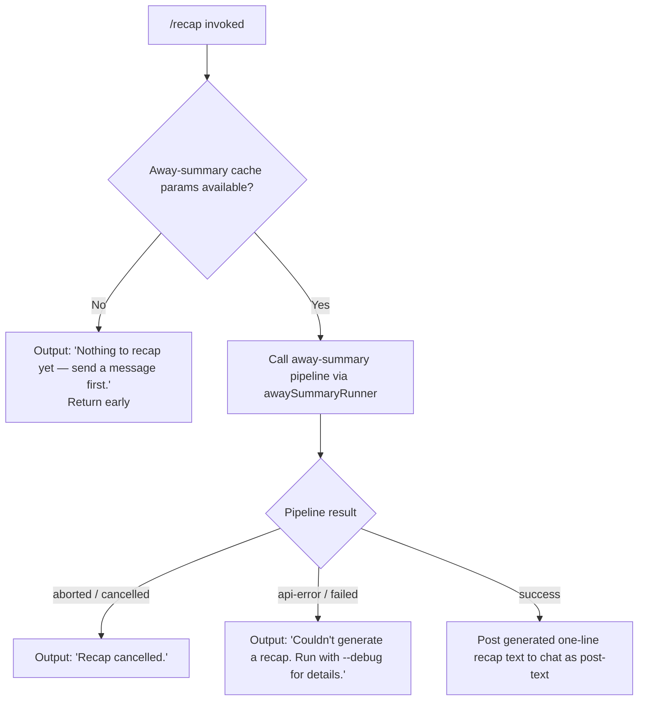

# `/recap`

> Analysis basis: CC v2.1.139 bundle.js (AST extraction + Claude interpretation)
> Minimum version: v2.1.139

---

## Overview

The `/recap` command triggers an immediate, on-demand generation of a one-line session summary (the "away summary") for the current Claude Code session. It invokes the same away-summary pipeline used by the background session-summarizer, but forces it synchronously from the user's request rather than waiting for an automatic trigger. If no conversation turns have occurred yet, or if the away-summary engine cannot produce a result, the command surfaces a descriptive error message instead.

---

## Registration

| Field | Value |
|---|---|
| type | `local` |
| name | `recap` |
| description | `Generate a one-line session recap now` |
| loc_byte | `11744764` |
| loc_byte_end | `11744980` |
| loc_line | `7679` |
| supportsNonInteractive | `false` |
| thinClientDispatch | `post-text` |
| load_inline | `true` |
| load_ident | `uI7` |
| arbor_handler.name | `uI7` |
| arbor_handler.fqn | `claude-2.1.139::uI7` |
| arbor_handler.kind | `AsyncFunction` |
| arbor_handler.resolution_path | `load_ident` |
| arbor_handler.n_hits | `0` |

Analysis basis: CC v2.1.139 bundle.js:+11744764

The handler is inlined via a `load:()=>Promise.resolve({call: uI7})` shape. Arbor resolved it through the `load_ident` path. `uI7` is an `AsyncFunction` and is the command's main entry point.

---

## Input Branching

The command has four distinct outcome branches, so a Mermaid flowchart is used.



Analysis basis: CC v2.1.139 bundle.js:+11744514, +11744606, +11744664, +6548050, +6548568, +6548657, +6548737

---

## Behavioral Spec

### Handler Entry — `recapCommandHandler` (`uI7`)

The handler is an `AsyncFunction` registered inline. Its execution flow:

```
async function recapCommandHandler(context):
    result = await awaySummaryRunner(context)     // calls WA8

    if result is null or no CacheSafeParams saved:
        post "Nothing to recap yet — send a message first."
        return

    if result.status == "aborted":
        post "Recap cancelled."
        return

    if result.status in ["api-error", "failed"]:
        post "Couldn't generate a recap. Run with --debug for details."
        return

    // success path
    post result.summaryText   // dispatched as post-text to chat
```

Analysis basis: CC v2.1.139 bundle.js:+11744372, +11744514, +11744606, +11744664

### Away-Summary Runner — `awaySummaryRunner` (`WA8`)

This function is the shared away-summary orchestrator, also called by the background summarizer. When called from `/recap`, it:

1. Checks whether `CacheSafeParams` are available for the current session. If not, logs `"[awaySummary] no CacheSafeParams saved, skipping"` and returns early (no-turn state).
2. Registers an `abort` event listener on the session's abort controller. If the abort fires during generation, the result is marked `"abort"` / `"no-turn"`.
3. Calls `agentQueryRunner` (`NE`) to invoke the underlying model query with the away-summary prompt.
4. Evaluates the query result and returns a structured outcome (`ok`, `aborted`, `api-error`, `failed`, `other`).

```
async function awaySummaryRunner(context):
    params = getCacheSafeParams(context)           // UTH
    if params == null:
        log "[awaySummary] no CacheSafeParams saved, skipping"
        return { status: "no-turn" }

    abortController = new AbortController()
    context.signal.addEventListener("abort", () => abortController.abort())

    // Build tool-permission context: tools are denied for away summary
    // Denial message: "Away summary cannot use tools"
    permissionCtx = buildPermissionContext(deny="Away summary cannot use tools")

    queryResult = await agentQueryRunner(params, permissionCtx, abortController)

    return classifyResult(queryResult)
    // classifyResult maps internal states to:
    //   "ok" | "aborted" | "api-error" | "failed" | "other" | "away_summary"
```

Analysis basis: CC v2.1.139 bundle.js:+6548029, +6548048, +6548050, +6548108, +6548145, +6548164, +6548341, +6548356, +6548409, +6548424, +6548568, +6548657, +6548737

### Tool Permission Override

The away-summary pipeline explicitly sets tool permission to `"deny"` with the message `"Away summary cannot use tools"` (bundle.js:+6548341, +6548356). No tool calls are permitted during recap generation regardless of the session's normal tool-permission state.

### Agent Query Runner — `agentQueryRunner` (`NE`)

This is the shared agent query engine used throughout CC. When called for recap it:

1. Records `Date.now()` as the query start timestamp.
2. Calls `awaySummaryPipelineCore` (`sz_`) which in turn:
   - Reads app state via `getAppState`
   - Reads tool-permission context via `getToolPermissionContext`
   - Calls `memoryLoader` (`W9H`) and `modelCaller` (`la4`)
   - Applies `setAppState` updates
3. Aggregates streamed model output into the final text.
4. Returns a structured result containing the generated summary text and status.

```
async function agentQueryRunner(params, permCtx, abortController):
    startTime = Date.now()
    modelOutput = await awaySummaryPipelineCore(params, permCtx, abortController)
    return buildQueryResult(modelOutput, startTime)
```

Analysis basis: CC v2.1.139 bundle.js:+5327179, +5327295, +5327516, +5327586, +5327647, +5327827, +5327917, +5327946

### Away-Summary Pipeline Core — `awaySummaryPipelineCore` (`sz_`)

The core pipeline used for generating the summary:

1. Checks session cache age; if unknown, logs `"[awaySummary] skipped: cache age unknown"` and skips.
2. Checks cache freshness threshold (0.9); if stale, logs `"[awaySummary] skipped: cache stale"`.
3. Checks rate-limit status (`"allowed"`); if at or near limit, logs `"[awaySummary] skipped: at or near rate limit"`.
4. Checks for draft input presence; if draft exists, logs `"[awaySummary] skipped: draft input present"`.
5. If all checks pass, calls the model via `modelCaller` (`la4`) with the away-summary prompt.
6. Generates a random session ID using `randomBytes` (8 bytes, hex-encoded).
7. Returns model response or error state.

```
async function awaySummaryPipelineCore(params, permCtx, signal):
    if cacheAge == unknown:
        log "[awaySummary] skipped: cache age unknown"
        return skip()

    if cacheAge / maxAge > 0.9:
        log "[awaySummary] skipped: cache stale"
        return skip()

    if rateLimitStatus != "allowed":
        log "[awaySummary] skipped: at or near rate limit"
        return skip()

    if draftInputPresent:
        log "[awaySummary] skipped: draft input present"
        return skip()

    sessionId = randomBytes(8).toString("hex")
    appState = getAppState()
    toolPermCtx = getToolPermissionContext()
    modelResult = await modelCaller(params, appState, toolPermCtx, sessionId, signal)
    return modelResult
```

Analysis basis: CC v2.1.139 bundle.js:+5324010, +5324113, +5324410, +5324549, +5324848, +5324954, +5325154, +5325180, +5325253, +5326169, +5326704, +5326755, +13148904, +13148973, +13148980, +13149055, +13149068, +13149151

### Session Recap File Writer — `recapFileWriter` (`R9K`)

Part of the call graph reachable from the away-summary pipeline. Handles persistence of the generated recap to disk:

1. Computes the recap directory path using `path.dirname` and `path.join`.
2. Checks whether the buffer byte-length is within limits (`Buffer.byteLength`).
3. Calls `mkdir` (recursive) on the target directory.
4. Appends the recap text via `appendFile`.
5. Calls `recapFileRotator` (`At_`) to manage file rotation: checks `.txt` extension, renames if needed, and unlinks stale files.
6. Updates the in-memory recap index via `recapIndexUpdater` (`C9`).

```
async function recapFileWriter(recapDir, content, sessionId):
    dir = path.join(path.dirname(recapDir), sessionId)
    byteLen = Buffer.byteLength(content)
    await mkdir(dir, { recursive: true })
    await appendFile(path.join(dir, "recap.txt"), content)
    await recapFileRotator(dir)
    recapIndexUpdater(sessionId, content)
```

Analysis basis: CC v2.1.139 bundle.js:+196582, +196607, +196615, +196645, +196660, +196735, +196752, +196784, +196790, +196823, +196840, +196849, +196945

### Recap File Rotator — `recapFileRotator` (`At_`)

```
async function recapFileRotator(dir):
    stat = await fs.stat(targetPath)
    if targetPath.endsWith(".txt"):
        rotatedPath = targetPath.slice(0, -4)   // remove last 4 chars (".txt")
        await fs.rename(targetPath, rotatedPath)
    await D8(rotatedPath)                        // compression/cleanup helper
    await fs.unlink(oldPath)
```

Analysis basis: CC v2.1.139 bundle.js:+195936, +196029, +196040, +196051, +196092, +196120, +196132

### Result Classification — `recapResultClassifier` (`aM1`)

After the pipeline returns, results are classified using `flatMap` over the outcome array. The recognized status strings are: `"ok"`, `"aborted"`, `"api-error"`, `"failed"`, `"other"`, `"away_summary"`, `"generate_failed"`.

Analysis basis: CC v2.1.139 bundle.js:+6548674, +6548884, +13149382, +13149406

---

## State & Side Effects

| Item | Detail |
|---|---|
| Telemetry | See list below |
| Tool permissions | Overridden to `"deny"` for the duration of the recap query; message: `"Away summary cannot use tools"` (bundle.js:+6548356) |
| appState changes | `setAppState` called during pipeline execution (bundle.js:+5325154); fields updated include `tool_use_summary`, `notification`, `set_expanded_view`, `post_turn_summary`, `active_goal`, `set_in_progress_tool_use_ids` (bundle.js:+5327998–5328136) |
| File I/O | Recap text may be appended to a `.txt` file in a session-specific directory; file rotation via rename + unlink (bundle.js:+196395, +196092, +196132) |
| AbortController | A new `AbortController` is created; abort propagates from session signal (bundle.js:+6548145, +6548164) |
| Sound | Not observed in traversal |
| thinClientDispatch | `post-text` — output is posted as text to the chat interface |
| supportsNonInteractive | `false` — the command cannot be used in non-interactive (pipe/CI) mode |

### Telemetry Events

| Event | Location |
|---|---|
| `tengu_auto_compact_rapid_refill_breaker` | bundle.js:+9116514 |
| `tengu_auto_compact_succeeded` | bundle.js:+9116940 |
| `tengu_ptl_surfaced_to_user` | bundle.js:+9118850 |
| `tengu_orphaned_messages_tombstoned` | bundle.js:+9120598 |
| `tengu_model_fallback_triggered` | bundle.js:+9122395 |
| `tengu_query_error` | bundle.js:+9122727 |
| `tengu_malformed_tool_use_response` | bundle.js:+9126405 |
| `tengu_stop_hook_block_count` | bundle.js:+9127357 |
| `tengu_streaming_tool_execution_used` | bundle.js:+9128155 |
| `tengu_streaming_tool_execution_not_used` | bundle.js:+9128258 |
| `tengu_loop_dynamic_wakeup_ends_turn` | bundle.js:+9130386 |
| `tengu_post_autocompact_turn` | bundle.js:+9130552 |
| `tengu_query_before_attachments` | bundle.js:+9130666 |
| `tengu_query_after_attachments` | bundle.js:+9133022 |
| `tengu_mcp_tools_refreshed_mid_turn` | bundle.js:+9133325 |
| `tengu_feature_ok` | bundle.js:+943635 |
| `tengu_feature_bad` | bundle.js:+943693 |
| `tengu_bg_spare_enable` | bundle.js:+14310004 |
| `tengu_bg_low_mem_mb` | bundle.js:+14309754 |
| `tengu_bg_spare_spawn` | bundle.js:+14310364 |
| `tengu_forked_agent_default_turns_exceeded` | bundle.js:+5328801 |
| `tengu_fork_agent_query` | bundle.js:+5329244 |
| `tengu_bg_dispatch_sigkill_escalate` | bundle.js:+14310587 |
| `tengu_bg_dispatch_low_mem` | bundle.js:+14311166 |
| `tengu_bg_spare_claim` | bundle.js:+14311902 |
| `tengu_bg_spare_claim_fail` | bundle.js:+14312165 |

Note: Many of these telemetry events originate from shared infrastructure (`la4`, `w`, `Y`) reachable within the depth-2 call graph, not from the recap-specific handler itself.

---

## Version History

| Version | Change |
|---|---|
| v2.1.139 | Initial analysis |

---

## Common Mistakes

1. **Running `/recap` before any conversation turns**: The command returns `"Nothing to recap yet — send a message first."` immediately. At least one assistant turn must have completed with valid `CacheSafeParams` before a recap can be generated.
2. **Expecting `/recap` to work in non-interactive mode**: `supportsNonInteractive: false` means the command is silently unavailable when CC is piped or run in CI; use the background away-summary mechanism instead.
3. **Assuming tools are available during recap**: The pipeline explicitly denies all tool usage during recap generation. Any session hooks or tool-dependent summarization logic will not fire.
4. **Expecting a multi-line recap**: The command is designed to produce a single-line summary. The underlying prompt and pipeline are tuned for brevity.
5. **Misreading `"Couldn't generate a recap. Run with --debug for details."`**: This surfaces for both `api-error` and `failed` result states. Running with `--debug` will expose the underlying model or network error (bundle.js:+11744664).

---

## Appendix — Identifier Mapping

> For bundle debugging only. Identifiers change across versions.

| Identifier | Role |
|---|---|
| `uI7` | `recapCommandHandler` — async entry point for `/recap`; registered via `load_ident` |
| `WA8` | `awaySummaryRunner` — orchestrates the away-summary pipeline for recap and background use |
| `UTH` | `cacheSafeParamsGetter` — retrieves cached safe parameters for the current session |
| `N` | `recapQueryCore` — core query logic called by the away-summary runner |
| `y9K` | `recapSubQueryDispatcher` — dispatches sub-queries within the recap pipeline |
| `Xo_` | `subQueryHelper` — helper called from the sub-query dispatcher |
| `H` | Shared context/state object (session-level) |
| `yH` | `jsonStringifyHelper` — serializes data via `JSON.stringify` |
| `LM` | `pathNormalizer` — normalizes file system paths; uses `lastIndexOf` and `slice` |
| `os_` | `extensionMapper` — maps file extension variants |
| `A` | Shared utility / string object; uses `toLowerCase`, `lastIndexOf`, `slice` |
| `QyH` | `fileWriteDispatcher` — dispatches file write operations |
| `ms_` | `fileWriteCore` — performs the actual file write via `H.write` |
| `R9K` | `recapFileWriter` — manages recap file creation, append, and rotation |
| `JyH` | `timeoutManager` — manages `clearTimeout`/`setTimeout`/`setImmediate` cycles |
| `n6H` | `recapPathBuilder` — builds the recap file path and calls index helpers |
| `B6` | `dirEnsurer` — ensures the target directory exists |
| `IV8` | `errorCodeChecker` — checks for `EISDIR` error code |
| `qt_` | `pathJoinHelper` — joins path segments and resolves via `V6` |
| `At_` | `recapFileRotator` — rotates recap files: stat, rename, unlink |
| `S9K` | `recapFileAppender` — performs directory creation and file append |
| `C9` | `recapIndexUpdater` — updates the in-memory set tracking recap files |
| `NE` | `agentQueryRunner` — shared agent query engine used for recap model call |
| `sz_` | `awaySummaryPipelineCore` — core pipeline: cache checks, rate-limit, model call |
| `zN` | `modelRequestBuilder` — builds the model API request |
| `W9H` | `memoryLoader` — loads session memory state before model call |
| `i3H` | `contextAssembler` — assembles context for the model |
| `$Q9` | `promptFormatter` — formats the prompt sent to the model |
| `L` | `promiseTracker` — tracks in-flight promises via `add`/`delete` |
| `s88` | `streamResultCollector` — collects streaming model output |
| `qm` | `randomHexGenerator` — generates hex random bytes via `randomBytes` |
| `G` | Global configuration/state accessor |
| `NP6` | `configEntry1` — configuration value accessor |
| `U08` | `configEntry2` — configuration value accessor |
| `wt` | `workerThreadManager` — manages worker thread lifecycle |
| `uL` | `workerThreadCleaner` — cleans up worker thread resources |
| `K06` | `toolFilterDispatcher` — filters tools by type (e.g. `"ant"`) |
| `WC` | `subagentExitHandler` — handles subagent exit events |
| `la4` | `modelCaller` — the main model calling loop (agent loop); extensive branching |
| `M_8` | `subagentStateManager` — manages subagent `"ready"` state via `Ql` map |
| `kH` | `turnEventEmitter` — emits `"turn"` events |
| `xH` | `featureEventEmitter` — emits feature-check events |
| `o88` | `activeSetChecker` — checks `u44` set membership |
| `MOH` | `progressReporter` — reports `"progress"` state |
| `H_8` | `summaryStateUpdater` — updates summary-related app state fields |
| `Y` | `backgroundDaemonManager` — manages background daemon lifecycle |
| `j6` | `daemonSessionCreator` — creates background daemon sessions |
| `$` | `disposableResource` — disposable pattern wrapper |
| `ul_` | `daemonRefillOrchestrator` — orchestrates spare-session refill |
| `hl_` | `spareSessionSpawner` — spawns background spare sessions via `Bun.spawn` |
| `Q` | `featureChecker` — checks feature flags |
| `LH` | `logErrorHelper` — logs errors via `Jd.logError` |
| `B44` | `forkQueryHandler` — handles forked agent query telemetry |
| `$8` | `sessionDispatcher` — dispatches session creation with UUID |
| `j` | `sessionWorkerProxy` — proxies to worker session management |
| `w` | `backgroundSessionWorker` — manages background session worker state |
| `J` | `sessionKillHandler` — kills background sessions |
| `v` | `awaySummaryGatekeeper` — checks cache age, rate limit, draft before triggering summary |
| `q` | `tempFileCleanup` — unlinks temp files via `unlinkSync` |
| `aM1` | `recapResultClassifier` — classifies pipeline results via `flatMap` |

Note: index built via Arbor fallback; some signals (telemetry, literals) may be missing — see arbor-fallback.js.