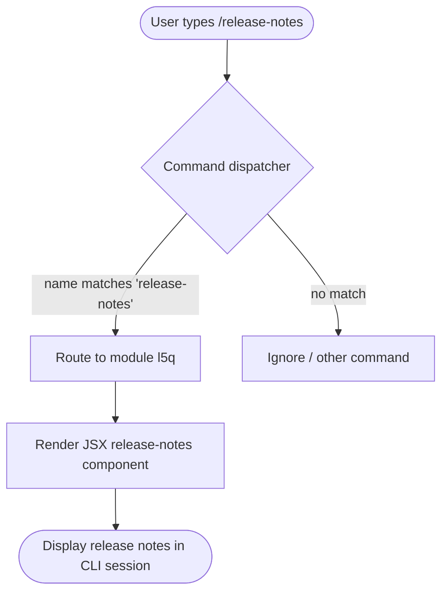

# `/release-notes`

> Analysis basis: CC v2.1.139 bundle.js (AST extraction + Claude interpretation)
> Minimum version: v2.1.139

---

## Overview

The `/release-notes` command is a local slash command that displays release notes for Claude Code directly within the CLI session. It is registered as a `local-jsx` type command, indicating that its output is rendered as a JSX component rather than as plain text. The command takes no arguments and operates as a read-only informational display with no persistent side effects.

---

## Registration

| Field | Value |
|---|---|
| type | `local-jsx` |
| name | `release-notes` |
| description | `View release notes` |
| module_id | `l5q` |
| loc_line | `6540` |

Analysis basis: CC v2.1.139 bundle.js:+10872135

---

## Input Branching

Because the AST depth-2 traversal found no call graph edges, no argument literals, and no conditional branches within the module entry point, the command's input handling cannot be further decomposed from the available data.



> **Note:** The module `l5q` had no resolvable entry functions at AST traversal depth ≤ 2. The flowchart above reflects the generic `local-jsx` dispatch path confirmed by the registration record. Internal branching logic within the JSX component is <!-- TODO: not found in depth-2 traversal; needs --depth 4 -->.

---

## Behavioral Spec

### Command Dispatch

```
function dispatchReleaseNotes(userInput):
    if userInput.slashCommand == "release-notes":
        module = loadModule("l5q")
        component = module.render()
        displayJSXComponent(component)
```

Analysis basis: CC v2.1.139 bundle.js:+10872135

### JSX Rendering

Because the `local-jsx` type is used (rather than `local` or `prompt`), the command output is rendered through the CLI's React/Ink JSX pipeline rather than being emitted as a raw string. The rendered component is expected to display version-specific release note content within the terminal UI.

```
function renderReleaseNotesComponent():
    content = fetchReleaseNotesContent()   // source: module l5q
    return JSXComponent(content)
```

> Internal implementation of `fetchReleaseNotesContent` is <!-- TODO: not found in depth-2 traversal; needs --depth 4 -->.

Analysis basis: CC v2.1.139 bundle.js:+10872135

---

## State & Side Effects

| Item | Detail |
|---|---|
| Telemetry | None detected at traversal depth ≤ 2 |
| Hook registration | <!-- TODO: not found in depth-2 traversal; needs --depth 4 --> |
| appState changes | None detected; command is read-only |
| Sound | None detected |
| Network I/O | <!-- TODO: not found in depth-2 traversal; needs --depth 4 --> |
| File I/O | <!-- TODO: not found in depth-2 traversal; needs --depth 4 --> |

---

## Version History

| Version | Change |
|---|---|
| v2.1.139 | Initial analysis; command registered at bundle.js:+10872135, line 6540, module `l5q` |

---

## Common Mistakes

1. **Expecting argument support.** The registration data contains no argument schema. Passing any text after `/release-notes` may be silently ignored or cause unexpected behavior, as no argument-parsing literals were found in the module.
2. **Assuming plain-text output.** Because the type is `local-jsx`, the output is a rendered JSX component. Piping or redirecting raw CLI output may not capture the intended formatted content.
3. **Confusing this command with a network fetch.** Whether release notes are bundled statically or fetched remotely at runtime is <!-- TODO: not found in depth-2 traversal; needs --depth 4 -->. Do not assume offline availability or network availability without further analysis.
4. **Version mismatch expectations.** The content displayed reflects the release notes bundled with the specific CC version in use. Running `/release-notes` on a different binary version will display different content.

---

## Appendix — Identifier Mapping

> For bundle debugging only. Identifiers change across versions.

| Identifier | Role |
|---|---|
| *(none)* | No obfuscated identifiers were present in the depth-2 AST traversal for module `l5q` |