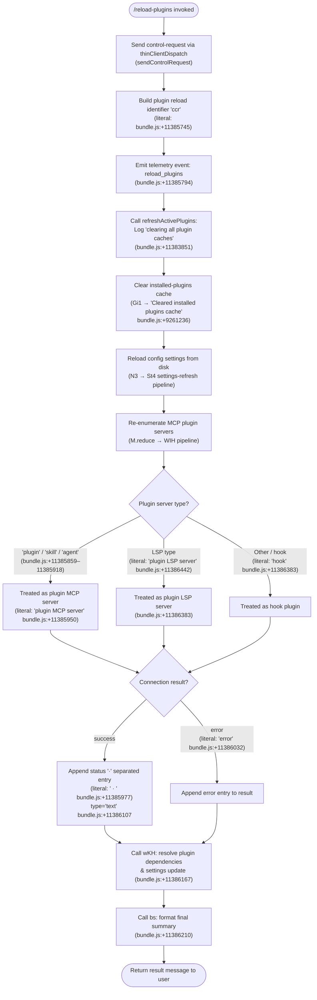

# `/reload-plugins`

> Analysis basis: CC v2.1.139 bundle.js (AST extraction + Claude interpretation)
> Minimum version: v2.1.139

---

## Overview

`/reload-plugins` forces Claude Code to re-scan and reinitialize all active plugins within the current session, clearing every plugin-related cache and restarting the associated MCP servers and LSP processes. It sends a `control-request` dispatch to the daemon, then performs a full plugin-refresh cycle that covers plugin-type MCP servers (`plugin`, `skill`, `agent`) as well as plugin LSP servers, and finally emits a structured result message summarizing each plugin's status.

---

## Registration

| Field | Value |
|---|---|
| type | `local` |
| name | `reload-plugins` |
| description | `Activate pending plugin changes in the current session` |
| supportsNonInteractive | `false` |
| thinClientDispatch | `"control-request"` |
| module_id | `wJq` |
| load_inline | `true` |
| loc_byte | `11386704` |
| loc_byte_end | `11386923` |
| loc_line | `7114` |
| arbor_handler.name | `w07` |
| arbor_handler.fqn | `claude-2.1.139::w07` |
| arbor_handler.kind | `AsyncFunction` |
| arbor_handler.resolution_path | `module_id` |
| arbor_handler.n_hits | `0` |

Analysis basis: CC v2.1.139 bundle.js:+11386704

---

## Input Branching

The command accepts no user-supplied arguments. However, its internal logic branches across five or more distinct paths depending on plugin type, plugin server status, and error/success outcomes. A Mermaid flowchart is used.



---

## Behavioral Spec

### 1. Handler Entry: `w07` (AsyncFunction)

The Arbor-resolved handler is `w07` (FQN: `claude-2.1.139::w07`, resolution via `module_id`).

```
async function reloadPluginsHandler(context):
    // Phase 1: dispatch control request
    loggerInit = initLogger(context)           // G3 → uJH
    sendControlRequest(context)                // A.sendControlRequest (bundle.js:+11385764)

    // Phase 2: emit reload identifier
    emit literal "ccr"                         // bundle.js:+11385745
    recordTelemetry("reload_plugins")          // bundle.js:+11385794

    // Phase 3: full plugin cache refresh
    result = await refreshActivePlugins(context)  // sYH (bundle.js:+11385839, zQ→x8)

    // Phase 4: resolve plugin dependency settings
    await resolvePluginDependencySettings(context)  // wKH (bundle.js:+11386167)

    // Phase 5: build output summary
    summary = buildResultSummary(result)       // bs (bundle.js:+11386210)
    return summary
```

Analysis basis: CC v2.1.139 bundle.js:+11385727

---

### 2. `refreshActivePlugins` — Full Cache Reset and MCP/LSP Restart

```
async function refreshActivePlugins(context):
    log("refreshActivePlugins: clearing all plugin caches")
    // bundle.js:+11383851

    // Step A: clear installed-plugins cache
    clearInstalledPluginsCache()     // Gi1 → N
    // logs "Cleared installed plugins cache" (bundle.js:+9261236)

    // Step B: reload settings from disk
    reloadSettings(context)          // N3 → St4 → (VE, K$8, _68, p88, Rz_, LH, pH8, Sv_, fi1)

    // Step C: clear MCP session state
    clearMCPSessionState()           // QN1
    clearPluginState()               // E2, Eu1

    // Step D: re-enumerate all plugin MCP servers in parallel
    await Promise.all(
        enumerateMCPServers(context) // Promise.all (bundle.js:+11383958)
    )

    // Step E: re-read per-plugin config (KIH, uV, A_)
    reloadPerPluginConfigs()

    // Step F: remap plugin servers to their categories
    //   Strings checked (bundle.js:+11385859, +11385890, +11385918):
    //     "plugin", "skill", "agent" → "plugin MCP server"
    //     "lsp-manager" (bundle.js:+11385296) → "plugin LSP server"
    //     "hook" (bundle.js:+11386383) → hook plugin
    for each pluginEntry in K.map(...):
        classify plugin as: "plugin MCP server" | "plugin LSP server" | hook
        build status string separated by " · " (bundle.js:+11385977)
        on error: tag entry as "error" (bundle.js:+11386032)

    // Step G: collect and reduce results
    results = M.reduce(...)        // bundle.js:+11384374
    results += $.reduce(...)       // bundle.js:+11384399

    // Step H: read LSP config
    lspConfig = readLSPConfig()    // LVH → .lsp.json (bundle.js:+8306532)

    // Step I: emit plugin reload event
    emit("_J8")                    // _J8.emit (bundle.js:+11384891)

    return statusCollection
```

Analysis basis: CC v2.1.139 bundle.js:+11383849

---

### 3. Plugin MCP Server Re-connection: `WIH`

```
async function reconnectMCPServer(serverDef):
    if serverDef.status == "disabled":   // bundle.js:+9564224
        return

    transport = serverDef.transport
    // Supported transports: "stdio" | "sse" | "sse-ide" | "ws-ide"
    // (bundle.js:+9564326, +9564360, +9564425, +9564461)

    if cached status == "needs-auth":    // bundle.js:+9564919
        log("Skipping connection (cached needs-auth)")   // bundle.js:+9564853
        return

    // Connect or reconnect
    connectResult = await connectMCPServer(serverDef)   // Kk_ or Lk_

    if connectResult.status == "connected":   // bundle.js:+9565021
        updateServerState(serverDef, "connected")
    elif connectResult.status == "failed":    // bundle.js:+9565594
        logMCPError(serverDef)                // O7 → Jd.logMCPError
    
    // Apply incremental MCP update (tools/resources delta)
    applyMcpUpdate(serverDef)           // Niq → H.applyMcpUpdate (bundle.js:+14045420)
```

Analysis basis: CC v2.1.139 bundle.js:+9564126

---

### 4. Plugin Dependency Re-resolution: `wKH`

```
async function resolvePluginDependencySettings(context):
    // Step A: read current settings
    currentSettings = readSettings()        // _.get / _.set (bundle.js:+10618943)

    // Step B: add to dependency tracking set
    dependencySet.add(context)              // $.add (bundle.js:+10619001)

    // Step C: call per-plugin capability function UF
    capResult = await resolveCapabilities() // UF → o5 (bundle.js:+9235071)

    // Step D: for each plugin entry, parse policy and capability manifest
    for entry in N$7.map(...):             // bundle.js:+10619112
        policyConfig = parsePolicy(entry)  // PM6
        schemaVersion = validateSchema(entry) // sj → EM6

    // Step E: push resolved entries
    L.push(...)    // bundle.js:+10619212
    f.push(...)    // bundle.js:+10619222

    // Step F: check for dependency-resolution errors
    if hasError("dependency-resolution"):  // bundle.js:+10619891
        log error

    // Step G: update settings with resolved values
    K.push(...)    // bundle.js:+10619983
    updateSettingsState()  // IH (bundle.js:+10620172)
```

Analysis basis: CC v2.1.139 bundle.js:+10618943

---

### 5. Result Summary Builder: `bs`

```
function buildResultSummary(pluginResults):
    // Iterates plugin entries
    // Maximum column width: 5 entries before wrapping (literal: 5, bundle.js:+4474890)
    lines = pluginResults.map(entry =>
        formatEntry(entry)    // nA → parse name/scope
    )
    joined = lines.slice(0, MAX_DISPLAY).join(" · ")   // bundle.js:+4474931/+4474947
    return { type: "text", content: joined }            // bundle.js:+11386107
```

Analysis basis: CC v2.1.139 bundle.js:+4474894

---

### 6. Plugin Type Classification Details

Relevant string literals extracted from the implementation:

| Literal | Location | Meaning |
|---|---|---|
| `"plugin"` | bundle.js:+11385859 | Plugin-type MCP server subtype |
| `"skill"` | bundle.js:+11385890 | Skill-type MCP server subtype |
| `"agent"` | bundle.js:+11385918 | Agent-type MCP server subtype |
| `"plugin MCP server"` | bundle.js:+11385950 | Category label for above three |
| `"lsp-manager"` | bundle.js:+11385296 | LSP manager identifier |
| `"plugin:"` | bundle.js:+11385331 | Plugin-scoped prefix |
| `"plugin LSP server"` | bundle.js:+11386442 | LSP server category label |
| `"hook"` | bundle.js:+11386383 | Hook plugin category |
| `"generic-error"` | bundle.js:+11385443 | Fallback error tag |

---

## State & Side Effects

| Item | Detail |
|---|---|
| Telemetry (direct) | `tengu_daemon_control` (bundle.js:+14345083) — fired via the `thinClientDispatch` control-request path |
| Telemetry (reachable depth-2) | `tengu_daemon_yield`, `tengu_daemon_idle_exit`, `tengu_daemon_config_reload`, `tengu_iron_gate_closed`, `tengu_mcp_elicitation_shown`, `tengu_mcp_elicitation_response`, `tengu_bg_dispatch_sigkill_escalate`, `tengu_bg_dispatch_low_mem`, `tengu_bg_spare_enable`, `tengu_bg_spare_claim`, `tengu_bg_spare_claim_fail`, `tengu_feature_ok`, `tengu_feature_bad`, `tengu_voice_*` (reachable via daemon dispatch paths, not directly fired) |
| Plugin cache clear | Calls installed-plugins cache clear function (`Gi1`); logs `"Cleared installed plugins cache"` (bundle.js:+9261236) |
| Settings reload | Triggers full settings-from-disk reload (`N3 → St4` pipeline); touches `userSettings`, `projectSettings`, `localSettings`, `flagSettings` (bundle.js:+1177707, +1177754, +1177776, +1186519) |
| MCP server state | Stops and reconnects all plugin-category MCP servers (types: `plugin`, `skill`, `agent`); applies incremental `applyMcpUpdate` per server |
| LSP server state | Re-reads `.lsp.json` config (bundle.js:+8306532); restarts plugin LSP processes |
| Hook plugins | Re-registers hook-type plugins |
| Event emission | Emits internal event via `_J8.emit` (bundle.js:+11384891) after reload completes |
| Dependency graph | Re-resolves plugin dependency graph via `wKH`; updates in-memory dependency set |
| appState changes | Settings state is mutated via `_.set` / `IH` calls; plugin registry map is rebuilt |
| Sound | None detected in traversal |
| supportsNonInteractive | `false` — command cannot run in non-interactive mode |

---

## Version History

| Version | Change |
|---|---|
| v2.1.139 | Initial analysis |

---

## Common Mistakes

1. **Running in non-interactive mode**: `supportsNonInteractive` is `false`; calling `/reload-plugins` from a script or headless pipeline will be rejected.
2. **Expecting instant tool availability**: The MCP reconnection pipeline is async and involves `Promise.all` across multiple servers; newly installed plugins may take a moment to appear after the command returns.
3. **Using to fix auth failures**: Servers cached as `"needs-auth"` are explicitly skipped during reload (bundle.js:+9564853, +9564919). The `/reload-plugins` command does not trigger OAuth flows — use a dedicated auth command instead.
4. **Confusing with config reload**: `/reload-plugins` reloads the plugin registry and MCP/LSP servers but is not a general settings reload; settings are reloaded only as a side effect of the plugin cache clear.
5. **Assuming all plugin types are restarted**: Only plugins categorized as `plugin`, `skill`, `agent`, LSP manager, or `hook` are processed. Other MCP server types (e.g. plain `stdio` user-configured servers not marked as plugins) are not restarted by this command.

---

## Appendix — Identifier Mapping

> For bundle debugging only. Identifiers change across versions.

| Identifier | Role |
|---|---|
| `w07` | Main handler — `reloadPluginsHandler` (AsyncFunction, Arbor-resolved) |
| `G3` | Logger / context initializer called at handler entry |
| `uJH` | Logger sub-function called by `G3` |
| `zQ` | Wrapper that resolves the reload-identifier (`"ccr"`) |
| `x8` | Inner helper called by `zQ` |
| `sYH` | `refreshActivePlugins` — full cache-clear and plugin reload orchestrator |
| `N` | Telemetry dispatch / event send helper (shared utility) |
| `y9K` | Sub-step within telemetry dispatch |
| `Xo_` | Further telemetry helper |
| `LM` | Log-message formatter (redacts sensitive values) |
| `os_` | Formats log output segments |
| `QyH` | Write-to-log helper |
| `ms_` | Underlying log write function |
| `R9K` | Structured log entry writer |
| `JyH` | Log batching / buffering component |
| `n6H` | Log entry construction helper |
| `Gi1` | Installed-plugins cache clear function |
| `N3` | Settings reload orchestrator |
| `St4` | Settings aggregate loader |
| `VE` | Per-scope settings loader |
| `K$8` | Settings key/schema definition |
| `_68` | Settings sub-schema helper |
| `p88` | Additional settings scope handler |
| `Rz_` | Plugin-root settings extractor (`"pluginRoot"` literal) |
| `LH` | Error logger (`Jd.logError` caller) |
| `pH8` | Settings post-processor |
| `Sv_` | Settings validator |
| `fi1` | Settings finalizer |
| `le` | Settings leaf-node handler |
| `M1H` | Leaf helper sub-function |
| `Hi1` | Leaf helper sub-function |
| `R$8` | Settings registry reference |
| `S$_` | Settings scope dispatcher |
| `U$_` | Settings update helper |
| `UnH` | MCP session map clear (`s38.clear`) |
| `QN1` | Plugin state reset on reload |
| `Eu1` | Plugin state secondary reset |
| `A_` | Async context / permission helper |
| `K` | Server-entry formatter (`L.map` + `f.padEnd`) |
| `He` | Plugin MCP config reader (reads `.mcp.json`) |
| `N2_` | Per-plugin config file parser |
| `D8` | Error-code classifier (`ENOENT` / `EISDIR` handler) |
| `U6` | JSON parse wrapper |
| `mF` | File extension checker (`.mcpb`, `.dxt`) |
| `Z01` | Plugin config loader from filesystem |
| `E36` | DXT/MCPB archive extractor and manifest parser |
| `IH` | String-coercion / state update utility |
| `LVH` | LSP config reader (reads `.lsp.json`) |
| `q_` | Error string formatter |
| `IB4` | LSP plugin file validator |
| `VB4` | Path-containment checker (relative path guard) |
| `M` | MCP server registry map operator |
| `WIH` | MCP server connection manager / reconnect orchestrator |
| `Le` | MCP server entry builder |
| `aV` | Server capability merger |
| `M_` | Utility function (single-character helper) |
| `NP6` | Server filter/classification helper |
| `Q_7` | Timestamp recorder for server events |
| `vL8` | Server key-list builder |
| `A8` | MCP debug logger (`Jd.logMCPDebug`) |
| `Kk_` | OAuth / `needs-auth` MCP connection handler |
| `Lk_` | OAuth callback MCP connection handler |
| `oa1` | MCP state persistence helper |
| `Ak_` | MCP server health-check helper |
| `B2_` | Transport capability checker |
| `J` | Process kill / cleanup utility |
| `h` | Output stream writer |
| `O7` | MCP error logger (`Jd.logMCPError`) |
| `la1` | Retry/recovery state tracker |
| `kP6` | Integer parser for retry counts |
| `Nk_` | Integer parser for timeout values |
| `Niq` | Incremental MCP update applier (`applyMcpUpdate`) |
| `vO8` | MCP update serializer |
| `WI` | MCP cleanup orchestrator |
| `$` | Ticker / heartbeat utility |
| `NXq` | Heartbeat event emitter |
| `Wa7` | Remote MCP server retry manager |
| `kL8` | Marketplace allow-list checker |
| `o8` | Abort/timeout wrapper |
| `DiH` | MCP state serializer |
| `Y07` | Plugin-filter and tool-map builder |
| `YJq` | Tool-set merger |
| `wKH` | Plugin dependency resolver and settings updater |
| `UF` | Capability manifest resolver |
| `o5` | Known-marketplace config reader |
| `O$8` | Config path resolver (`known_marketplaces.json`) |
| `PM6` | Policy settings parser |
| `v8` | Policy schema validator |
| `VS6` | Policy rule evaluator |
| `fh` | Managed-scope install guard (throws if `"managed"`) |
| `nA` | Plugin name parser (splits on includes/split) |
| `sj` | Plugin schema/capability validator |
| `EM6` | Host/path pattern policy checker |
| `Df_` | Policy definition loader |
| `Kd9` | Host-pattern policy enforcer |
| `Ld9` | Path-pattern policy enforcer |
| `NoL` | Source-type policy router |
| `I9H` | Schema version validator |
| `voL` | File/directory source validator |
| `_TH` | Plugin marketplace config reader |
| `Uj6` | Marketplace path resolver |
| `bv_` | Marketplace JSON safe-parser |
| `w8` | EISDIR/ENOTDIR error handler |
| `M0` | Multi-scope plugin settings merger |
| `E$_` | Per-plugin settings file reader |
| `k$7` | Dependency set membership checker |
| `k36` | Core plugin install/resolve pipeline |
| `PN` | Plugin type discriminator |
| `iH8` | Plugin source name and schema parser |
| `x_6` | Local-path prefix checker (`"./"`) |
| `O` | Server/connection map (background session mgr) |
| `C6` | Async-local-storage context accessor |
| `ry6` | Store getter |
| `FG` | Plugin local-file config reader |
| `uv_` | Plugin config file reader (`readFileSync`) |
| `mv_` | Config entry iterator |
| `X` | MCP connection map (dynamic plugins) |
| `U08` | Dynamic plugin connection helper |
| `pu` | Plugin name extractor |
| `at6` | Semver version checker (`valid`/`coerce`/`satisfies`) |
| `W` | Debounced plugin reload trigger |
| `z` | Background session / daemon stream writer |
| `A3H` | Config-change event emitter |
| `spH` | Plugin-activity checker |
| `rQ9` | Dependency cycle detector |
| `k_` | Full plugin installation pipeline |
| `wf` | Settings file writer |
| `Ix8` | Settings writer with backup |
| `LG` | Settings write lock |
| `Sb8` | Write-timestamp recorder |
| `Zd` | Settings atomic writer |
| `dSH` | Atomic file write (symlink-aware, with fsync) |
| `DD` | Module-cache clear (`lE6.clear`, `DT8.clear`) |
| `Sh6` | Settings file append/write helper |
| `ak` | Settings path builder |
| `Ix` | Settings load-telemetry emitter |
| `rH8` | Source path security checker (startsWith guard) |
| `g` | Permission rule evaluator |
| `I78` | Iron-gate permission checker |
| `Be` | Permission rule set evaluator |
| `c` | MCP server file-cache map |
| `ZX6` | MCP cache file reader |
| `E9q` | MCP cache file deleter |
| `fH` | Plugin tool-call forwarder |
| `ge1` | Tool-call model router |
| `fR` | Tool execution wrapper |
| `m` | Output stream timer / throttle |
| `V6` | Result enqueue helper |
| `l` | Rate-limit / request filter |
| `i` | Voice recording session manager (reached via daemon paths) |
| `JM6` | Semver range compatibility checker |
| `Lf_` | Semver range validator |
| `gH8` | Git-subdir source handler |
| `kt9` | Git subprocess runner |
| `QH8` | NPM / registry source resolver |
| `q94` | NPM registry config reader |
| `O8` | NPM process spawner |
| `w` | Background session process manager |
| `N36` | Plugin download and extraction orchestrator |
| `y36` | Plugin archive installer |
| `aH8` | Plugin config directory helper |
| `Ut9` | Plugin unpack helper |
| `p9H` | Plugin hash verifier |
| `Vl` | Plugin path resolver |
| `P` | Network response buffer parser |
| `tt6` | Plugin directory scanner |
| `pF` | Plugin filter function |
| `PFH` | Plugin post-filter helper |
| `nH8` | Stale plugin cleanup handler |
| `W$_` | Plugin registry updater (logs `"Updated"` / `"Added"`) |
| `S` | Away-summary trigger (focus/blur monitor) |
| `yB` | Away-summary state machine |
| `v` | Away-summary rate-limit checker |
| `Z` | Away-summary cache |
| `SUq` | Away-summary API caller |
| `qH` | MCP elicitation dispatcher |
| `HH` | Elicitation session tracker |
| `Q` | Render/output helper |
| `jP6` | Elicitation request builder |
| `Ooq` | Elicitation response formatter |
| `PP6` | Elicitation schema builder |
| `Xg` | Notification emitter |
| `a` | Voice session manager (finishRecording / processing) |
| `T` | Remote-control startup handler |
| `MH` | Voice session state ("done") |
| `okH` | Platform locale checker |
| `m_` | Settings loader (for voice module) |
| `Md_` | Voice transcript processor |
| `Xj8` | Voice-stream WebSocket manager |
| `hH` | Voice message writer |
| `vH` | Voice output forwarder |
| `dH` | Voice audio chunker |
| `ZH` | Voice buffer slicer |
| `kH` | `tengu_feature_ok` emitter |
| `xH` | `tengu_feature_bad` emitter |
| `D` | Daemon config-reload handler |
| `C` | Output render wrapper |
| `R` | Output stream write helper |
| `_H` | Focus-silence timeout handler |
| `G` | MCP connection registry reference |
| `L94` | Plugin install dependency chain resolver |
| `u` | Process / subprocess reference |
| `jN` | Package name case-normalizer |
| `YM` | String-type helper |
| `SH` | String coercer |
| `HL` | OTEL metrics attribute builder |
| `AE8` | OTEL attribute key builder |
| `wBH` | OTEL metrics event emitter |
| `ctH` | OTEL context helper |
| `bs` | Result summary formatter (final output builder) |

---

Note: index built via Arbor fallback; some signals (telemetry, literals) may be missing — see arbor-fallback.js.