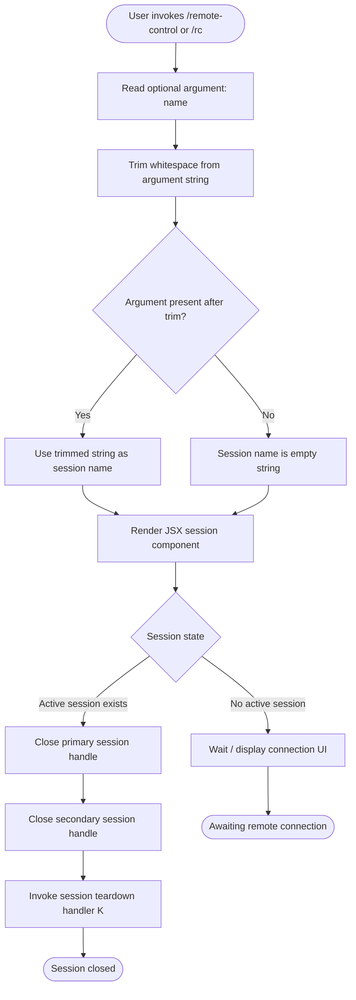

# `/remote-control`

> Analysis basis: CC v2.1.133 bundle.js (AST extraction + Claude interpretation)
> Minimum version: v2.1.133

---

## Overview

The `/remote-control` command (alias `/rc`) registers the current terminal as a named endpoint for remote-control sessions. It accepts an optional session name argument, trims and normalizes whitespace from the input, and renders a JSX component that manages the connection lifecycle — including opening and closing the remote session channel.

---

## Registration

| Field | Value |
|---|---|
| type | `local-jsx` |
| name | `remote-control` |
| description | `Connect this terminal for remote-control sessions` |
| argumentHint | `[name]` |
| immediate | `true` |
| aliases | `["rc"]` |
| module\_id | `zDq` |

Analysis basis: CC v2.1.133 bundle.js:+11406694

---

## Input Branching

The command entry point trims the raw argument string, then delegates to the JSX component for all further logic.



Analysis basis: CC v2.1.133 bundle.js:+11406365, +11406389, +14167101, +14167103, +14167113, +14167253

---

## Behavioral Spec

### Argument Normalization

The command handler extracts the raw user-supplied argument and applies whitespace trimming before any further processing.

```
function normalizeSessionName(rawArgument):
    trimmed = trim(rawArgument)          // removes leading and trailing whitespace
    return trimmed                        // may be empty string if no argument given
```

Analysis basis: CC v2.1.133 bundle.js:+11406365

### JSX Component Rendering

After normalization, the command renders a JSX element that manages the remote-control session UI and state. The rendering call uses `createElement` from the React-compatible renderer bundled with CC.

```
function renderRemoteControlComponent(sessionName):
    element = createElement(RemoteControlComponent, { name: sessionName })
    return element
```

Analysis basis: CC v2.1.133 bundle.js:+11406389

### Name Lowercasing

Within the session component, the session name is converted to lowercase before being used as a connection identifier. This ensures that session names are case-insensitive from the perspective of the remote-control subsystem.

```
function normalizeSessionKey(name):
    return name.toLowerCase()
```

Analysis basis: CC v2.1.133 bundle.js:+14181260

### Session Teardown Sequence

When the user or the system terminates a remote-control session, the component executes a three-step teardown in order:

1. Close the primary session handle (index `0`).
2. Close the secondary session handle.
3. Invoke the registered teardown callback to clean up any remaining state.

```
function teardownSession(primaryHandle, secondaryHandle, teardownCallback):
    primaryHandle.close(0)       // closes primary channel; argument 0 signals normal closure
    secondaryHandle.close()      // closes secondary channel
    teardownCallback()           // fires registered teardown handler
```

Analysis basis: CC v2.1.133 bundle.js:+14167101, +14167103, +14167113, +14167253

### Numeric Constant — Limit or Timeout

A numeric literal `40` appears within the session component logic near the lowercasing operation. Based on its position adjacent to string processing, it likely represents a maximum length cap applied to the normalized session name before it is used as a key.

Maximum session name operative length: **40 characters** (Analysis basis: CC v2.1.133 bundle.js:+14181334)

```
function applyNameLengthLimit(name):
    normalized = name.toLowerCase()
    if length(normalized) > 40:
        normalized = substring(normalized, 0, 40)
    return normalized
```

> <!-- TODO: the exact role of the literal `40` (truncation vs. validation vs. display) is not fully resolvable at depth-2 traversal; needs --depth 4 -->

---

## State & Side Effects

| Item | Detail |
|---|---|
| Telemetry | None detected at depth-2 traversal (telemetry array is empty) |
| Hook registration | The `immediate: true` flag causes the command to execute without waiting for user confirmation or a follow-up prompt submission |
| Session handles | Two session handles (primary and secondary) are opened on activation and explicitly closed via `.close()` calls on teardown |
| Teardown callback | A teardown handler (`K` in bundle scope) is invoked after both handles are closed; its full behavior is beyond depth-2 resolution |
| appState changes | <!-- TODO: not found in depth-2 traversal; needs --depth 4 --> |
| Sound | <!-- TODO: not found in depth-2 traversal; needs --depth 4 --> |
| Alias | `/rc` is a registered alias and behaves identically to `/remote-control` |

---

## Version History

| Version | Change |
|---|---|
| v2.1.133 | Initial analysis — command registered as `local-jsx`, alias `rc`, with argument normalization and dual-handle teardown |

---

## Common Mistakes

1. **Providing a mixed-case session name and expecting it to be case-sensitive.** The session component lowercases the name before using it as a connection key. `/rc MySession` and `/rc mysession` resolve to the same session.
2. **Expecting a confirmation prompt before the session starts.** The `immediate: true` flag means the command executes as soon as it is submitted; there is no secondary confirmation step.
3. **Assuming `/rc` and `/remote-control` have separate state.** They share the same underlying module (`zDq`) and component; they are strictly equivalent.
4. **Providing a very long session name and expecting full fidelity.** The literal `40` near the lowercasing operation suggests a name length limit of 40 characters; names longer than this may be silently truncated.
5. **Manually closing only one of the two session handles during scripted teardown.** The teardown sequence closes both a primary and a secondary handle; skipping one may leave a dangling connection.

---

## Appendix — Identifier Mapping

> For bundle debugging only. Identifiers change across versions.

| Identifier | Role |
|---|---|
| `LX7` | Command handler entry point — normalizes the argument and renders the JSX session component |
| `_` | Session component — manages connection state, lowercases the session name, and orchestrates teardown |
| `f` | Session teardown function — closes both session handles and invokes the teardown callback `K` |