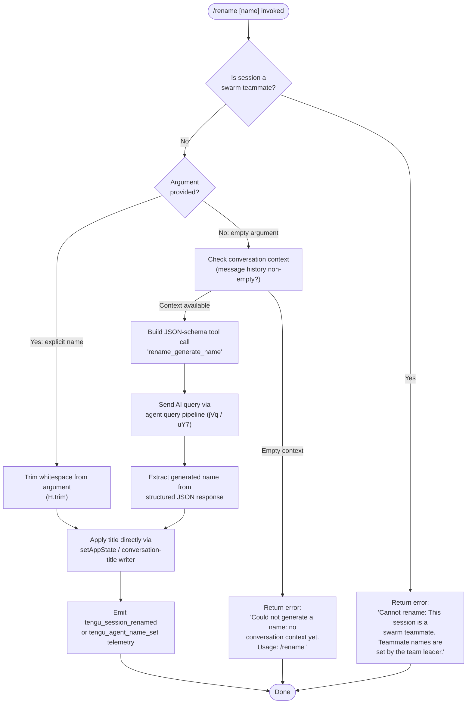

# `/rename`

> Analysis basis: CC v2.1.139 bundle.js (AST extraction + Claude interpretation)
> Minimum version: v2.1.139

---

## Overview

The `/rename` command sets a human-readable title for the current Claude Code conversation session. When invoked with an explicit name argument the title is applied immediately; when invoked without an argument the command queries the AI to generate a name from the current conversation context. The command is also aliased as `/name`.

---

## Registration

| Field | Value |
|---|---|
| type | `local-jsx` |
| name | `rename` |
| description | `Rename the current conversation` |
| argumentHint | `[name]` |
| immediate | `true` |
| aliases | `["name"]` |
| module_id | `s5q` |
| load_inline | `true` |
| loc_byte | `10876370` |
| loc_byte_end | `10876569` |
| loc_line | `6553` |
| arbor_handler.name | `uY7` |
| arbor_handler.fqn | `claude-2.1.139::uY7` |
| arbor_handler.kind | `AsyncFunction` |
| arbor_handler.resolution_path | `module_id` |
| arbor_handler.n_hits | `0` |

Analysis basis: CC v2.1.139 bundle.js:+10876370

---

## Input Branching

Three distinct execution paths exist depending on the combination of argument presence and session type, so a flowchart is used.



Analysis basis: CC v2.1.139 bundle.js:+10875393, +10875511, +10875531, +10875636, +10875732, +10875839, +10875871

---

## Behavioral Spec

### Top-level handler dispatch (`uY7`)

The Arbor-resolved async handler (`uY7`) is the entry point. It receives the command context and the raw argument string, then fans out to one of two sub-handlers depending on the resolved flow.

```
async function renameCommandHandler(context, rawArgument):
    sessionType = getSessionType(context)          // GY8 → r2
    trimmedArg  = rawArgument.trim()               // H.trim (loc +10875636)

    if isSwarmTeammate(sessionType):               // loc +10875531
        return errorMessage(
          "Cannot rename: This session is a swarm teammate. ..."
        )

    if trimmedArg is non-empty:
        applyRename(context, trimmedArg)           // TY8 path
    else:
        generateAndApplyRename(context)            // AI-generation path
```

Analysis basis: CC v2.1.139 bundle.js:+10876061, +10876077, +10876119

---

### Swarm-teammate guard (`TY8` / `GY8`)

Before any rename action the handler checks whether the current session is a swarm teammate. If so it returns the hard-coded error string and takes no further action.

```
function checkSwarmGuard(sessionContext):
    role = getSessionRole(sessionContext)   // r2 call, loc +10875393
    if role indicates teammate:
        return SWARM_TEAMMATE_ERROR         // literal loc +10875531
    return null
```

Error literal: `"Cannot rename: This session is a swarm teammate. Teammate names are set by the team leader."` (bundle.js:+10875531)

Analysis basis: CC v2.1.139 bundle.js:+10875393, +10875511

---

### Explicit-name path (`TY8`)

When the user supplies a non-empty argument string the command trims whitespace and immediately writes the new title.

```
async function applyExplicitRename(context, name):
    trimmed = name.trim()                  // loc +10875636
    updateConversationTitle(context, trimmed)  // _.setAppState  loc +10875871
    persistTitleToLog(context, trimmed)    // iVH pipeline  loc +10875857
    emitTelemetry("tengu_session_renamed") // loc +11951246
```

The `iVH` pipeline writes the title tag `"custom-title"` (literal loc +11951154) to the conversation log via the append-file writer (`dvH`).

Analysis basis: CC v2.1.139 bundle.js:+10875636, +10875839, +10875857, +10875871

---

### AI-generation path (`brH` + `MN` + agent query)

When no argument is supplied the command inspects the existing message history. If no messages are present it returns the no-context error; otherwise it builds a structured tool-call schema named `"rename_generate_name"` and sends it through the full agent query pipeline.

```
async function generateAndApplyRename(context):
    messages = getFilteredMessages(context)   // XY8 path, loc +10874429
    if messages is empty:
        return errorMessage(
          "Could not generate a name: no conversation context yet. ..."
        )  // literal loc +10875732

    schema = buildJsonSchema(
        toolName = "rename_generate_name",    // literal loc +10874935
        outputField = "name"                  // literal loc +10874871
    )  // loc +10874791

    result = await runAgentQuery(context, schema, messages)
    // runs through MN → hvH → jVq pipeline  loc +10874429–10875173

    if result contains generated name:
        applyExplicitRename(context, result.name)
        emitTelemetry("tengu_session_renamed")
    else:
        // No assistant message found — silent no-op or prior error path
```

The literal `"json_schema"` (loc +10874791) and `"rename_generate_name"` (loc +10874935) are the tool-schema type and name used when constructing the AI request. Message history is filtered to include only `"user"` and `"assistant"` role entries (literals at loc +10872419, +10872436) that are not meta messages (literal `"isMeta"` at loc +10872460) and whose origin is not `"human"` ephemeral type (literals at loc +10872495, +10872535).

Analysis basis: CC v2.1.139 bundle.js:+10874429, +10874470, +10874791, +10874871, +10874935, +10875037, +10875061, +10875173

---

### Conversation-log title persistence (`iVH` / `fb` / `RqH`)

The title write is handled through the logging pipeline.

```
function persistTitle(context, title, titleKind):
    // titleKind is "custom-title" for user-supplied names  (loc +11951154)
    // titleKind is "ai-title"     for AI-generated names   (loc +11951318)
    entry = buildLogEntry(titleKind, title)
    appendToLog(context.logPath, entry)       // dvH → A.appendFileSync
    emitEvent("FU_.emit")                     // RqH path, loc +11953470
    if context is agent/subagent:
        emitTelemetry("tengu_agent_name_set") // loc +11953483
    else:
        emitTelemetry("tengu_session_renamed")// loc +11951246
```

The two tag literals distinguish a user-chosen name from an AI-generated one in the persisted log record.

Analysis basis: CC v2.1.139 bundle.js:+11951133, +11951154, +11951233, +11951246, +11951318, +11953364, +11953470, +11953483

---

### No-context guard (message-history check)

```
function checkContextAvailable(messages):
    if messages.length == 0:
        return "Could not generate a name: no conversation context yet. Usage: /rename <name>"
        // literal loc +10875732
    return null
```

Analysis basis: CC v2.1.139 bundle.js:+10875732

---

## State & Side Effects

| Item | Detail |
|---|---|
| Telemetry | `tengu_session_renamed` (loc +11951246) — fired after any successful rename; `tengu_agent_name_set` (loc +11953483) — fired when renaming an agent/subagent session; `tengu_chair_sermon` (loc +9807538) — fired inside the message-normalization path used by the AI-generation query; various API/streaming telemetry events fired when the AI-generation path executes a full query (see full list in telemetry array). |
| App state changes | `_.setAppState` is called to update the in-memory conversation title (loc +10875871); `Yz8` is called to enumerate the resulting state keys (loc +10875890). |
| Log persistence | Title entry is appended to the conversation log file via `A.appendFileSync` (loc +11950201); directory is created if absent via `A.mkdirSync` (loc +11950240). |
| Event emission | `FU_.emit` fires a session-renamed event observable by other subsystems (loc +11953470). |
| Hook registration | <!-- TODO: not found in depth-2 traversal; needs --depth 4 --> |
| Sound | <!-- TODO: not found in depth-2 traversal; needs --depth 4 --> |

---

## Version History

| Version | Change |
|---|---|
| v2.1.139 | Initial analysis |

---

## Common Mistakes

1. **Invoking `/rename` with no argument in a fresh session** — if the conversation has no messages yet the command cannot generate a name automatically and returns: `"Could not generate a name: no conversation context yet. Usage: /rename <name>"`. Supply an explicit name instead.
2. **Attempting to rename a swarm teammate session** — Claude Code blocks the rename and returns the swarm-guard error. Only the team-leader session can set teammate names.
3. **Assuming the rename is instantaneous during AI generation** — when no argument is provided the command runs a full AI query (through the `MN` / `jVq` agent pipeline) which may take several seconds. The `immediate: true` registration flag only controls UI rendering, not query latency.
4. **Expecting the alias `/name` to behave differently** — `/name` is a registered alias (loc +10876370) and is fully equivalent to `/rename`.
5. **Confusing `"custom-title"` and `"ai-title"` log tags** — the persisted log record uses different tag values depending on whether the name was user-supplied or AI-generated; tools that parse conversation logs should handle both.

---

## Appendix — Identifier Mapping

> For bundle debugging only. Identifiers change across versions.

| Identifier | Role |
|---|---|
| `uY7` | Top-level async rename command handler (Arbor-resolved entry point) |
| `TY8` | Inner handler function: routes between explicit-name and AI-generation paths |
| `GY8` | Session-role/type accessor (reads session metadata for swarm-guard) |
| `brH` | AI-generation orchestrator: filters messages and invokes query pipeline |
| `XY8` | Message-history filter / context builder for AI name generation |
| `MN` | Agent query launcher: sets up conversation and runs name-generation query |
| `hvH` | Query execution wrapper that calls into `jVq` |
| `jVq` | Core agent query pipeline (streaming API client loop) |
| `iVH` | Conversation-log pipeline dispatcher (fan-out to `fb`, `ge`, `RqH`) |
| `fb` | Log-entry writer for custom-title events |
| `RqH` | Log-entry writer for agent-name-set events; emits `FU_.emit` |
| `dvH` | Low-level file-append writer; creates directories as needed |
| `tN` | Log-entry builder for title records |
| `NK` | Message-filter helper used in context check |
| `N` | String normalization / output formatter helper |
| `IH` | String conversion utility |
| `SH` | String coercion helper |
| `yH` | JSON serialization helper (`JSON.stringify` wrapper) |
| `U6` | JSON deserialization helper (`JSON.parse` wrapper) |
| `r2` | Session-role reader (used by swarm-guard check) |
| `i7` | App-store accessor helper |
| `M2` | App-store getter (calls `hl8.getStore`) |
| `sMH` | File-system conversation-store manager |
| `pf` | Atomic file writer (uses random-bytes temp file + rename) |
| `RD` | Core atomic write implementation (`writeFile` → `rename`) |
| `Q1` | Conversation cache/stat loader |
| `LH` | Logging / error-reporting helper |
| `S1` | Log-queue flusher |
| `G7A` | Log-entry formatter |
| `CGK` | Log-queue rotation helper |
| `Yz8` | App-state key enumerator (`Object.keys` wrapper) |
| `WK` | Conversation-directory path builder |
| `rW` | Relative-path joiner utility |
| `oW` | Basename extractor for conversation paths |
| `D8` | Error-code classifier helper |
| `j2` | Cache-entry eviction helper |
| `cG` | Message-normalization / context-window builder |
| `o$8` | Conversation-file loader (reads, hashes, caches) |
| `dN_` | Conversation-history loader helper |
| `q87` | Attachment/image content mapper |
| `C6` | Path-resolution helper for conversation files |
| `ho1` | Content-hash deduplication helper |
| `w8` | File-system error classifier |
| `B6` | Base directory resolver |
| `IV8` | File-error handler |
| `qt_` | Path-join-and-validate utility |
| `At_` | File rotate/rename helper (handles `.txt` extension) |
| `S9K` | Append-file session writer |
| `R9K` | Session transcript writer (coordinates file operations) |
| `JyH` | Buffered terminal output writer |
| `n6H` | Output-pipeline helper |
| `QyH` | Terminal write dispatcher |
| `ms_` | Raw terminal write helper |
| `LM` | String sanitizer / path-cleaner |
| `os_` | Control-character map builder |
| `y9K` | Terminal escape-sequence helper |
| `Xo_` | ANSI-code utility |
| `M_` | Lodash/utility wrapper |
| `NP6` | MCP server list helper |
| `Q_7` | Timestamp/debounce utility |
| `vL8` | MCP transport connector |
| `A8` | MCP debug-log emitter |
| `Kk_` | MCP tool-call executor |
| `Lk_` | MCP OAuth flow handler |
| `oa1` | MCP tool-result writer |
| `Ak_` | MCP server-status checker |
| `B2_` | MCP capability filter |
| `O7` | MCP error-log emitter |
| `la1` | MCP session record helper |
| `kP6` | Integer parser (MCP context) |
| `Nk_` | Integer parser variant |
| `Niq` | MCP update applier |
| `vO8` | MCP state serializer |
| `WI` | MCP client cleanup helper |
| `NXq` | Conversation-metadata snapshot helper |
| `Wa7` | MCP server-list refresh orchestrator |
| `kL8` | MCP allow/deny list checker |
| `o8` | IPC/socket timeout manager |
| `DiH` | MCP state-serialization helper |
| `me` | Logging context accessor |
| `HB` | Conversation-header reader/writer |
| `w16` | Conversation-header file I/O helper |
| `G3` | Sub-process / agent launcher helper |
| `uJH` | Agent spawn utility |
| `nm` | Agent-name accessor |
| `Tf` | Agent-info formatter |
| `pQ` | Agent prompt builder |
| `A_` | Agent argument encoder |
| `ge` | Agent-title log-entry writer (emits `"ai-title"` tag) |
| `wI` | Workspace-info accessor |
| `xn` | Context accessor for agent runs |
| `pw` | Progress/spinner display helper |
| `mj` | Keybinding / event-loop helper |
| `kbH` | Input-event dispatcher |
| `QW` | UI component render helper |
| `cq` | React / JSX renderer helper |
| `$8` | Unique-ID generator (uses `aE.randomUUID`) |
| `j` | Process-handle accessor |
| `J` | Worker-process set manager |
| `NK` | Message-filter helper (filters by role/type) |
| `Y1` | Conversation-context validator |
| `V6` | Current-working-directory accessor |
| `C9` | Terminal-size watcher |
| `uL` | Logging-context builder |
| `Q` | Promise / async-utility helper |

---

Note: index built via Arbor fallback; some signals (telemetry, literals) may be missing — see arbor-fallback.js.