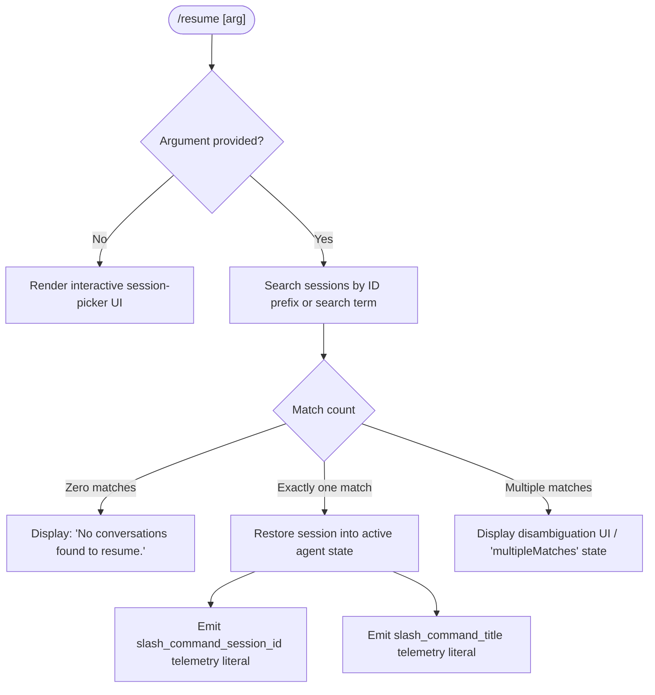

# `/resume`

> Analysis basis: CC v2.1.139 bundle.js (AST extraction + Claude interpretation)
> Minimum version: v2.1.139

---

## Overview

`/resume` (aliased as `/continue`) allows the user to pick up a previous conversation from Claude Code's local session transcript store. It accepts an optional conversation ID or search term, enumerates matching sessions from disk, and restores the identified session's context into the active agent state. When no argument is provided the command renders an interactive session-picker UI component.

---

## Registration

| Field | Value |
|---|---|
| type | `local-jsx` |
| name | `resume` |
| description | `Resume a previous conversation` |
| aliases | `["continue"]` |
| argumentHint | `[conversation id or search term]` |
| module_id | `A$q` |
| load_inline | `true` |
| loc_byte | `11036400` |
| loc_byte_end | `11036597` |
| loc_line | `6592` |
| arbor_handler.name | `gj7` |
| arbor_handler.fqn | `claude-2.1.139::gj7` |
| arbor_handler.kind | `AsyncFunction` |
| arbor_handler.resolution_path | `module_id` |
| arbor_handler.n_hits | `0` |

Analysis basis: CC v2.1.139 bundle.js:+11036400

---

## Input Branching

The command has four distinguishable paths based on the user-supplied argument and the results of the session-lookup:



Analysis basis: CC v2.1.139 bundle.js:+11035193 (handler entry `gj7`), +11035443 (zero-match literal), +11032637 (`sessionNotFound`), +11032708 (`multipleMatches`)

---

## Behavioral Spec

### 1. Handler Entry (`gj7`)

The Arbor-resolved handler is the async function `gj7` (see Appendix).

```
async function resumeCommandHandler(args, appState):
    rawArg = args.trim()

    // Step 1 — load all stored sessions
    sessionList = await loadAllSessions(appState)          // calls worktreeResolver + sessionEnumerator
    filteredSessions = sessionList.filter(isValidSession)  // callGraph: _$q → H.filter (+11035070)

    // Step 2 — apply search term if provided
    if rawArg is empty:
        return renderSessionPickerComponent(filteredSessions, appState)

    matches = matchSessions(filteredSessions, rawArg)      // vvH (+11035365)

    // Step 3 — branch on match count
    if matches.length == 0:
        return displayMessage("No conversations found to resume.")  // literal (+11035443)

    if matches.length > 1:
        return renderDisambiguationUI(matches, "multipleMatches")   // literal (+11032708)

    // Step 4 — single match: restore session
    selectedSession = matches[0]
    timestamp = Date.now()                                          // +11035320
    sessionElement = createElement(selectedSession, timestamp)      // oD.createElement (+11035294)

    storeSlashCommandSessionId(selectedSession.id)                  // literal "slash_command_session_id" (+11035704)
    storeSlashCommandTitle(selectedSession.title)                   // literal "slash_command_title" (+11035928)

    await restoreSessionContext(selectedSession, appState)          // c1H (+11035682), gY6 (+11035749)
    return sessionElement
```

Analysis basis: CC v2.1.139 bundle.js:+11035193

---

### 2. Session Enumeration and Worktree Detection (`vvH`)

```
function enumerateAndFilterSessions(appState):
    // Run git worktree list --porcelain to detect worktrees
    // literals: "worktree", "list", "--porcelain" (+11032004, +11032011)
    worktreeOutput = runGitWorktreeList()
    emit telemetry("tengu_worktree_detection")              // +11032093

    allSessions = loadRawSessions()                         // $_  (+11031984)

    // Parse worktree prefix from output lines
    // Lines beginning with "worktree " (literal +11032212) have 9-char prefix stripped (+11032243)
    // NFC normalization applied to paths (+11032256)
    worktrees = parseWorktreeLines(worktreeOutput)

    // Filter and rank sessions
    result = allSessions
        .filter(s => s.path.startsWith(relevantRoot))     // H.startsWith (+11032370)
        .filter(matchesWorktree)                           // L.filter (+11032397)
        .sort((a, b) => a.localeCompare(b))               // $.localeCompare (+11032430)
    return result
```

Analysis basis: CC v2.1.139 bundle.js:+11031949

---

### 3. Session Context Restoration (`c1H` + `gY6`)

```
function restoreSessionContext(session, appState):
    // Load transcript chain from disk via Xe (transcript-store reader)
    transcript = transcriptStoreLoader(session.id)         // Xe (+11035682 → c1H → Xe)

    // Rebuild message chain using parent-UUID linkage
    chain = buildMessageChain(transcript)                  // d1H (+11955406)
    // Handles phantom-parent guard (telemetry: tengu_transcript_phantom_parent +11961119)
    // Handles parent-cycle guard (telemetry: tengu_transcript_parent_cycle +11964537)
    // Handles chain timestamp fallback (telemetry: tengu_chain_timestamp_fallback +11944406)

    // Restore conversation store slots
    for each slotKey in SESSION_METADATA_KEYS:
        appState.set(slotKey, session[slotKey])
    // Known metadata key literals found in traversal:
    //   "summary", "last-prompt", "custom-title", "ai-title", "tag",
    //   "agent-name", "agent-color", "agent-setting", "mode",
    //   "permission-mode", "isolation-latch", "worktree-state", "pr-link",
    //   "file-history-snapshot", "attribution-snapshot", "content-replacement",
    //   "fork-context-ref", "marble-origami-commit", "marble-origami-snapshot"

    // Rebuild session-level state map (gY6)
    sessionState = buildSessionStateMap(chain)             // gY6 (+11035749)
    applyStateToAgent(appState, sessionState)

    return chain
```

Analysis basis: CC v2.1.139 bundle.js:+11035682, +11035749, +11955274

---

### 4. Transcript File Format Parser (`Xe` / `Qk7`)

The transcript-store loader (`Xe`) calls the low-level file parser (`Qk7`) which:

```
function parseTranscriptFile(filePath):
    fd = fs.openSync(filePath)
    buf = Buffer.allocUnsafe(1048576)                      // 1 MiB cap literal (+11959020)
    bytesRead = fs.readSync(fd, buf)
    fs.closeSync(fd)

    // Scan for JSONL record boundaries using byte sentinels
    // sentinel bytes: 92 (\), 34 ("), 123 ({), 125 (}) (+11957348, +11957368, +11957408, +11957428)
    records = []
    for each delimited region in buf[0..bytesRead]:
        if region starts with '{"type":"attribution-snapshot"':   // literal (+11958695)
            records.push(parseAttributionSnapshot(region))
        else if region contains '"type":"last-prompt"':           // literal (+11958937)
            records.push(parseLastPrompt(region))
        else:
            records.push(parseGenericRecord(region))

    // Chunk size for read loop: 65536 bytes (+11960273)
    return records
```

Analysis basis: CC v2.1.139 bundle.js:+11963869

---

### 5. Session Search / Matching (`ig`)

```
function matchSessions(sessionList, query):
    queryLower = query.toLowerCase()                       // ig → H.toLowerCase (+11956551)

    // Try exact UUID prefix match first
    exactMatches = sessionList.filter(s => s.id.startsWith(query))

    if exactMatches.length > 0:
        return exactMatches

    // Fall back to fuzzy content/title match
    fuzzyMatches = sessionList
        .filter(s => scoreMatch(s, queryLower) > 0)        // f.filter (+11956576)
        .sort(byDescendingScore)                            // z.sort (+11956824)
        .slice(0, MAX_RESULTS)                              // z.slice (+11956890)

    return fuzzyMatches
```

Analysis basis: CC v2.1.139 bundle.js:+11035829 (`ig`)

---

### 6. Error / Empty State (`lM`)

```
function handleEmptyOrError(reason, appState):
    // reason ∈ { "sessionNotFound" (+11032637), "multipleMatches" (+11032708) }
    if reason == "sessionNotFound":
        renderBoldMessage("No conversations found to resume.")   // e3q → f6.bold (+11032672)
        return
    if reason == "multipleMatches":
        renderDisambiguationList(candidates)
        return
```

Analysis basis: CC v2.1.139 bundle.js:+11035100 (`lM`), +11035576 (`lM`)

---

## State & Side Effects

| Item | Detail |
|---|---|
| Telemetry — `tengu_worktree_detection` | Fired during git worktree enumeration (bundle.js:+11032093) |
| Telemetry — `tengu_transcript_phantom_parent` | Fired when a message references a non-existent parent UUID (bundle.js:+11961119) |
| Telemetry — `tengu_transcript_parent_cycle` | Fired when a circular parent-UUID chain is detected (bundle.js:+11964537) |
| Telemetry — `tengu_chain_parent_cycle` | Fired at chain-build level on parent cycle (bundle.js:+11944257) |
| Telemetry — `tengu_chain_timestamp_fallback` | Fired when message timestamp must be inferred (bundle.js:+11944406) |
| Telemetry — `tengu_chain_parallel_tr_recovered` | Fired when parallel transcript branches are reconciled (bundle.js:+11946272) |
| Telemetry — `tengu_relink_walk_broken` | Fired when transcript re-link walk cannot be completed (bundle.js:+11943241) |
| appState writes | Session metadata keys written on restore: `summary`, `last-prompt`, `custom-title`, `ai-title`, `tag`, `agent-name`, `agent-color`, `agent-setting`, `mode`, `permission-mode`, `isolation-latch`, `worktree-state`, `pr-link`, `file-history-snapshot`, `attribution-snapshot`, `content-replacement`, `fork-context-ref`, `marble-origami-commit`, `marble-origami-snapshot` |
| Literal keys stored | `slash_command_session_id` (+11035704), `slash_command_title` (+11035928) |
| File I/O | Reads session transcript files synchronously via `fs.openSync` / `fs.readSync` / `fs.closeSync`; max single-read buffer: 1 MiB (1048576 bytes, +11959020); chunk size during scanning: 65536 bytes (+11960273) |
| JSX rendering | Returns a React element (`oD.createElement`, +11035294) for the session picker UI when no argument is given, or a restored session element when a single match is found |
| Hook registration | None observed in depth-2 traversal |
| Sound | None observed |

---

## Version History

| Version | Change |
|---|---|
| v2.1.139 | Initial analysis |

---

## Common Mistakes

1. **Passing a partial title instead of a UUID prefix**: The matcher tries UUID-prefix first; if your search term partially overlaps multiple session IDs, you will get a `multipleMatches` disambiguation screen instead of a direct resume.
2. **Invoking `/resume` in a fresh worktree with no inherited sessions**: Worktree detection scopes the session list to the current root; sessions created under a different worktree path will not appear unless git reports that worktree as active.
3. **Expecting immediate state restore with a very large transcript**: The parser allocates a fixed 1 MiB buffer per file read. Transcripts larger than 1 MiB are chunked in 65536-byte segments; this is transparent but adds latency on the first resume.
4. **Using `/resume` and `/continue` interchangeably assuming different behavior**: Both aliases map to the identical handler (`gj7`); there is no behavioral difference between them.
5. **Assuming the command is synchronous**: The handler is declared `async` and awaits both session enumeration and context restoration; do not rely on side-effects being committed synchronously after the slash command returns.

---

## Appendix — Identifier Mapping

> For bundle debugging only. Identifiers change across versions.

| Identifier | Role |
|---|---|
| `gj7` | Main async handler for `/resume` (Arbor-resolved, `AsyncFunction`) |
| `_$q` | Module wrapper / loader shim for the resume command registration |
| `lM` | Empty/error state renderer (no-results and multi-match display) |
| `LH` | Logging/error-reporting helper called by the handler |
| `q_` | Low-level error constructor utility |
| `SH` | String coercion helper |
| `S1` | Secondary string utility |
| `G7A` | String helper calling `SH` |
| `CGK` | Queue management utility (shift/push operations) |
| `IH` | String conversion helper used inside handler |
| `vvH` | Session enumeration and worktree-detection function |
| `$_` | Session-store accessor (wraps `$PH` and related storage helpers) |
| `$PH` | Core process/child-process management class |
| `hMA` | Process spawn helper |
| `Y` | Background session / daemon manager |
| `ul_` | Platform detection and background session helper |
| `hl_` | Background PTY host spawn function |
| `_ZK` | String serialization utility |
| `A_` | Path resolution helper (used widely across transcript loading) |
| `Kw8` | Intermediate dispatcher calling `q06` |
| `q06` | Session listing aggregator (calls `OEq`, `cvH`, path joins) |
| `N` | API/model call helper used within transcript loading |
| `y9K` | Sub-utility of `N` for model configuration |
| `LM` | Path component manipulation (lastIndexOf / slice) |
| `QyH` | Metadata formatting helper |
| `R9K` | Token/buffer budget management for transcripts |
| `OEq` | Session file enumerator (reads project dirs, resolves paths) |
| `sg` | Projects-path builder |
| `W` | Debounce/event-emitter utility |
| `K` | Column formatter (padEnd) |
| `DwH` | Session record builder (slice, push, forEach) |
| `kU_` | Recursive directory scanner for session files |
| `rW6` | Session metadata get/set cache |
| `pO` | Path normalizer / replacer |
| `T` | UI event handler / key-event interceptor |
| `D` | Supervisor/daemon write manager |
| `J` | Process value iterator |
| `P` | Buffer stream handler |
| `X` | MCP/SDK connection handler |
| `j` | Flat-map helper wrapping `w` |
| `G` | MCP connection group handler |
| `cvH` | Transcript binary record decoder |
| `tk7` | Low-level record type tagger |
| `Ul` | Regex test utility (`m44.test`) |
| `Pn` | Prompt/context builder called during restore |
| `c1H` | Full session-context restore orchestrator |
| `Xe` | Transcript-store reader (central Map-based store) |
| `Xk7` | Store initialisation helper called from `Xe` |
| `C` | Map wrapper used by transcript store |
| `R` | Write-stream helper |
| `Zm` | Utility called during store set operations |
| `Qs_` | JSON-path traversal helper for message objects |
| `Bs_` | Regex test helper for path segments |
| `Fs_` | Path segment string replacer |
| `fP` | Store flush/persistence helper |
| `M` | MCP state manager (top-level) |
| `WIH` | MCP server connection worker |
| `Niq` | MCP update applicator |
| `Wa7` | MCP roster rebuild function |
| `O` | Background session object |
| `x8` | OS-level utility |
| `w` | Background session manager |
| `S` | Throttle/rate-limiter |
| `xH` | Feature-ok telemetry emitter |
| `kH` | Feature-bad telemetry emitter |
| `b` | Write-timeout manager |
| `Sl_` | PTY socket connect handler |
| `ml_` | Session lifecycle state machine |
| `w8` | Claim/socket message helper |
| `u` | Disposable resource wrapper |
| `z` | Daemon stop/control manager |
| `NR` | First-party flag router |
| `Cb` | Graceful-exit race handler |
| `F` | Plugin-list filter |
| `bH` | Plugin-list backing data |
| `DH` | Orphaned-permission tracker |
| `Z` | Generic push accumulator |
| `Qk7` | Transcript JSONL binary file parser |
| `t` | Silence-timeout ref wrapper (voice) |
| `MEq` | Array `.at()` wrapper for record indexing |
| `$H` | Notification / compare buffer helper |
| `U6` | `JSON.parse` wrapper |
| `h` | Write-buffer accumulator |
| `Fk7` | Buffer compare helper |
| `l` | Filter wrapper |
| `v` | Away-summary rate-limit checker |
| `AH` | Max-duration ref wrapper (voice) |
| `_H` | Focus-silence ref wrapper (voice) |
| `e` | Form validation helper |
| `fH` | Enqueue helper for streaming output |
| `i` | Voice recording session controller |
| `dk7` | Synchronous transcript header reader |
| `gTq` | Transcript relink-walk manager |
| `gk7` | Transcript JSONL text-mode parser |
| `jPH` | BOM/encoding detection wrapper |
| `mZK` | BOM detection sub-helper |
| `pZK` | UTF encoding resolver |
| `BZK` | Substring / `JSON.parse` parser helper |
| `UZK` | `indexOf`/`toString` parser helper |
| `T1` | Socket message type helper |
| `y` | Generic utility called in store set path |
| `c` | Conversation-file read/unlink manager |
| `ZX6` | File-read + metadata handler |
| `E9q` | File-unlink + metadata handler |
| `d` | Permission `allow`/`deny` router |
| `HP8` | Date.parse wrapper for session sorting |
| `d1H` | Message-chain builder (parent-UUID traversal) |
| `Sk7` | NaN-guarded value reader for chain |
| `Rk7` | Chain message sorter and deduplicator |
| `yk7` | Chain shift/push accumulator |
| `KEq` | Chain metadata map builder |
| `ZcH` | Session list `.map()` transformer |
| `pU_` | Compact-summary content processor |
| `h26` | Message content array builder |
| `Xq` | Markdown / block-quote parser |
| `BU_` | Attachment type guard (image/document) |
| `Ck7` | Array `.some()` content-type checker |
| `bk7` | Secondary `.some()` content-type checker |
| `_P8` | Slot get/set helper for session state |
| `AP8` | Array.from wrapper over store values |
| `gY6` | Session state-map builder (top-level restore entry for state slots) |
| `$Eq` | Store initializer calling `Xe` + `Object.assign` |
| `ck7` | Session path builder (joins project dir + stat check) |
| `pQ` | Path query helper |
| `fG` | Directory reader for session files |
| `vU_` | Variant content-format handler (calls `pU_`, `ZcH`, `BU_`) |
| `VKH` | UI component helper called near end of handler |
| `ig` | Session search / fuzzy-match function |
| `e3q` | Bold-text renderer for empty-state message |

---

Note: index built via Arbor fallback; some signals (telemetry, literals) may be missing — see arbor-fallback.js.