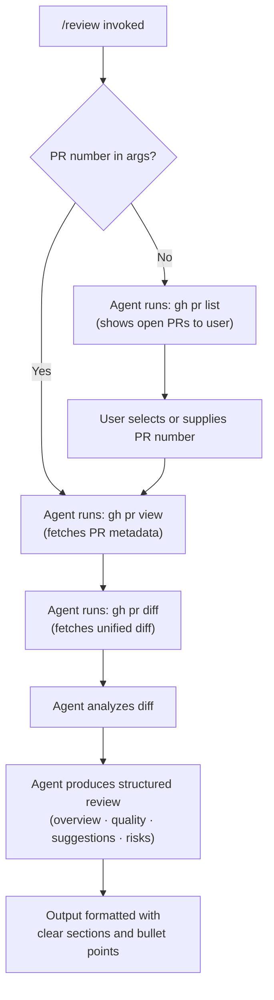

# `/review`

> Analysis basis: CC v2.1.132 bundle.js (AST extraction + Claude interpretation)
> Minimum version: v2.1.132

---

## Overview

The `/review` command invokes Claude Code as an expert code reviewer for GitHub pull requests. When triggered, it builds a structured prompt via `getPromptForCommand` and dispatches it to the agent, which then uses the `gh` CLI to inspect PR metadata and diffs before producing a multi-section review. The command supports an optional PR number argument; without one, it falls back to listing open PRs interactively.

---

## Registration

| Field | Value |
|---|---|
| type | `prompt` |
| name | `review` |
| description | `Review a pull request` |
| handler_method | `getPromptForCommand` |
| handler_method_start (byte) | `10959142` |
| handler_method_end (byte) | `10959205` |
| prompt_body length | `831 characters` |
| prompt_body trace | `call→formatPromptText (1 literal)` |
| loc_byte | `10959003` |
| loc_byte_end | `10959206` |
| `handler_method_start` | `10959142` |
| `handler_method_end` | `10959205` |
| `prompt_body.length` | `831` chars |
| `prompt_body.trace` | `call→rM7(...) (1 literals)` |
| `arbor_handler.name` | `getPromptForCommand` |
| `arbor_handler.kind` | `Method` |
| `arbor_handler.resolution_path` | `direct` |
| `arbor_handler.fqn` | `claude-2.1.132::getPromptForCommand` |
| `arbor_handler.n_hits` | `1` |

Analysis basis: CC v2.1.132 bundle.js:+10959003

---

## Input Branching

The command's prompt logic branches on whether a PR number is present in the user-supplied arguments.



Analysis basis: CC v2.1.132 bundle.js:+10959142 (handler entry), +10959196 (prompt construction call)

---

## Behavioral Spec

### Prompt Construction

The handler method `getPromptForCommand` (resolved directly within the registration object byte range `10959003–10959206`) constructs the agent prompt by calling the string-formatting helper (see Appendix: `rM7`) with a `"text"` kind literal and the command's argument string appended as the PR number field.

```
function buildReviewPrompt(args):
    prNumber = args.trim()   // may be empty string
    body = formatPromptText(
        kind   = "text",
        content = REVIEW_PROMPT_TEMPLATE,
        prArg  = prNumber
    )
    return body
```

Analysis basis: CC v2.1.132 bundle.js:+10959148 (call to `getPromptForCommand`), +10959196 (call to prompt-formatting helper), +10959184 (`"text"` literal)

---

### Agent Execution Sequence

Once the prompt is delivered to the agent, the agent follows a deterministic four-step sequence encoded in the prompt body:

```
procedure agentReviewSequence(prNumber):

    // Step 1 — Discovery (only when no PR number supplied)
    if prNumber is empty:
        output = shell("gh pr list")
        present output to user
        prNumber = awaitUserSelection()

    // Step 2 — PR metadata
    details = shell("gh pr view " + prNumber)

    // Step 3 — Diff retrieval
    diff = shell("gh pr diff " + prNumber)

    // Step 4 — Analysis and structured review
    review = analyze(details, diff, focusAreas = [
        "code correctness",
        "project conventions",
        "performance implications",
        "test coverage",
        "security considerations"
    ])

    return formatReview(review, style = "sections + bullet points")
```

Analysis basis: CC v2.1.132 bundle.js:+10959003 (prompt_body, length 831)

---

### Review Output Structure

The agent is instructed to produce a review divided into the following logical sections:

| Section | Content |
|---|---|
| Overview | Summary of what the PR accomplishes |
| Code quality & style | Assessment of readability, idioms, and style conformance |
| Improvement suggestions | Specific, actionable recommendations |
| Potential issues / risks | Bugs, regressions, security or performance hazards |

The output format is constrained to clear section headings with bullet-point sub-items. Verbosity is bounded by the instruction to keep the review "concise but thorough."

Analysis basis: CC v2.1.132 bundle.js:+10959003

---

## State & Side Effects

| Item | Detail |
|---|---|
| Telemetry | None detected in depth-2 traversal |
| Hook registration | None detected in depth-2 traversal |
| appState changes | None detected in depth-2 traversal |
| Sound | None detected in depth-2 traversal |
| External process invocations | `gh pr list`, `gh pr view <n>`, `gh pr diff <n>` — executed by the agent as shell commands, not directly by the command handler |
| Argument forwarding | Raw argument string appended to prompt as the PR number field; no validation or coercion observed at handler level |

---

## Version History

| Version | Change |
|---|---|
| v2.1.132 | Initial analysis — `prompt`-type registration, `getPromptForCommand` handler, 831-character prompt body, `gh`-CLI-based review flow |

---

## Common Mistakes

1. **Omitting the PR number and expecting an automatic selection** — without a number, the agent will run `gh pr list` and present results, but it requires the user to follow up with a number; the agent does not auto-select.
2. **Using `/review` without `gh` CLI authenticated** — all three shell commands (`gh pr list`, `gh pr view`, `gh pr diff`) depend on the `gh` CLI being installed and authenticated against the correct GitHub host; missing authentication causes all three calls to fail at runtime.
3. **Expecting the handler to validate the PR number** — the handler appends the raw argument string directly to the prompt without numeric validation; passing non-numeric or malformed strings will propagate to the `gh` CLI invocations where errors will surface.
4. **Assuming telemetry is emitted** — no `tengu_*` telemetry events were found in the depth-2 traversal; any observability tooling that listens for a review-specific event will receive nothing from this command.
5. **Confusing `/review` with a diff-only command** — the command retrieves both PR metadata (`gh pr view`) and the diff (`gh pr diff`); reviewers expecting only raw diff output will receive a fully analyzed, multi-section narrative review.

---

## Appendix — Identifier Mapping

> For bundle debugging only. Identifiers change across versions.

| Identifier | Role |
|---|---|
| `rM7` | Prompt-text formatting helper; called by `getPromptForCommand` to assemble the final prompt string from the template body and the `"text"` kind literal (Analysis basis: CC v2.1.132 bundle.js:+10959196) |
| `__handler_review` | Synthetic BFS entry point representing the inline `getPromptForCommand` ObjectMethod on the `/review` registration object; not a real exported function in the bundle — use `getPromptForCommand` (resolved via `direct` path) as the authoritative handler name |