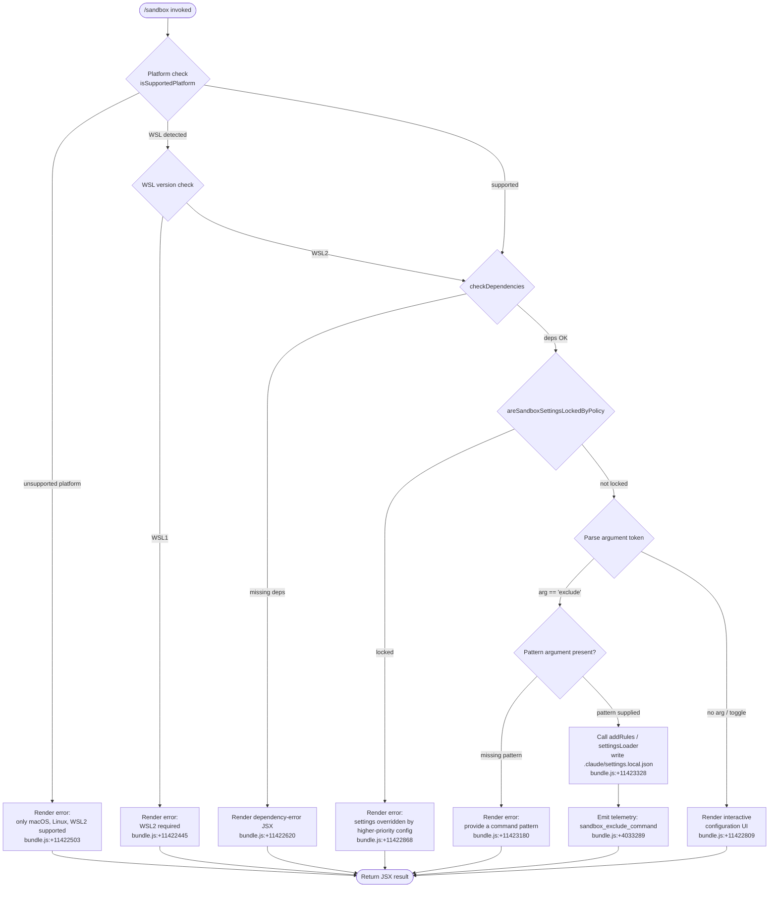

# `/sandbox`

> Analysis basis: CC v2.1.139 bundle.js (AST extraction + Claude interpretation)
> Minimum version: v2.1.139

---

## Overview

The `/sandbox` command configures the sandboxing behaviour of Claude Code's tool execution environment. It allows the user to toggle sandbox mode on or off and to add shell-command patterns that should be excluded from sandboxed execution. The command writes its results to `.claude/settings.local.json` and enforces platform eligibility and enterprise-policy checks before applying any change.

---

## Registration

| Field | Value |
|---|---|
| type | `local-jsx` |
| name | `sandbox` |
| description | ` ...   ...  (⏎ to configure)` |
| argumentHint | `exclude "command pattern"` |
| immediate | `true` |
| isHidden | `null` |
| module_id | `Hjq` |
| load_inline | `true` |
| loc_byte | `11423753` |
| loc_byte_end | `11424402` |
| loc_line | `7132` |
| arbor_handler.name | `F07` |
| arbor_handler.fqn | `claude-2.1.139::F07` |
| arbor_handler.kind | `AsyncFunction` |
| arbor_handler.resolution_path | `module_id` |
| arbor_handler.n_hits | `2` |

Analysis basis: CC v2.1.139 bundle.js:+11423753

---

## Input Branching

The handler follows five distinct branches depending on platform, policy, and argument content, requiring a Mermaid flowchart.



---

## Behavioral Spec

### Platform and WSL Eligibility Check

```
async function checkPlatformEligibility(platformInfo):
    if not platformInfo.isSupportedPlatform():
        if platformInfo.type == "wsl":
            return errorResult("Error: Sandboxing requires WSL2. WSL1 is not supported.")
        else:
            return errorResult("Error: Sandboxing is currently only supported on macOS, Linux, and WSL2.")
    return OK
```

Analysis basis: CC v2.1.139 bundle.js:+11422403, +11422439, +11422445, +11422503

The platform check delegates to `p_.isSupportedPlatform` (analysis basis: +11422403). When the platform is identified as `"wsl"` (literal at +11422439), the handler additionally distinguishes WSL1 from WSL2, returning a specific error string for WSL1 (+11422445). Non-WSL unsupported platforms receive the generic platform error (+11422503).

---

### Dependency Check

```
async function checkSandboxDependencies():
    result = await dependencyChecker.checkDependencies()
    if result has errors:
        return renderDependencyErrorUI(result)
    return OK
```

Analysis basis: CC v2.1.139 bundle.js:+11422620

Calls `p_.checkDependencies` (+11422620) before proceeding. If required sandbox binaries or kernel features are absent, a JSX error panel is rendered and the command exits early.

---

### Policy Lock Check

```
function checkPolicyLock():
    if policySettings.areSandboxSettingsLockedByPolicy():
        return errorResult(
            "Error: Sandbox settings are overridden by a higher-priority configuration and cannot be changed locally."
        )
    return OK
```

Analysis basis: CC v2.1.139 bundle.js:+11422809, +11422868

`p_.areSandboxSettingsLockedByPolicy` (+11422809) is called after dependency resolution. When enterprise policy overrides local settings the user-facing error literal is returned (+11422868). No settings file is written in this path.

---

### Argument Parsing and Subcommand Dispatch

```
async function dispatchSandboxCommand(rawArg):
    tokens = rawArg.split(" ")           // M.split — +11423095
    subcommand = tokens[0]               // first token

    if subcommand == "exclude":          // literal "exclude" at +11423118
        pattern = tokens.slice(8)        // offset constant 8 at +11423143
        if pattern is empty:
            return errorResult(
                "Error: Please provide a command pattern to exclude (e.g., /sandbox exclude \"npm run test:*\")"
            )                            // +11423180
        sanitizedPattern = pattern.replace(...)   // z.replace — +11423299
        applyExcludeRule(sanitizedPattern)
    else:
        renderInteractiveConfigurationUI()
```

Analysis basis: CC v2.1.139 bundle.js:+11423095, +11423118, +11423135, +11423143, +11423180, +11423299

The raw argument string is split (M.split at +11423095), and the first token is compared against the literal `"exclude"` (+11423118). A slice offset of `8` (+11423143) is used to extract the pattern portion after the subcommand token. When the pattern is absent, the descriptive error message (+11423180) is returned without writing any file.

---

### Exclude-Rule Application

```
async function applyExcludeRule(pattern):
    localSettingsData = loadSettingsLayer("localSettings")   // RL_ — +11423328
    filteredRules = localSettingsData.filter(...)            // _.filter — +4032980
    matchResult  = patternMatcher(pattern)                   // fQL — +4033154, H.match — +4025797
    if pattern already included:
        return noOp
    settingsLoader = loadSettingsFile(
        ".claude/settings.local.json"                        // literal at +11423386
    )
    writeUpdatedSettings(settingsLoader, newRule)
    emitTelemetry("sandbox_exclude_command")                 // kH — +4033286, literal at +4033289
    loadWorkspaceSettings(wf)                                // wf — +11423341
    computeRelativePath(tJq.relative)                        // +11423365
    renderConfirmationUI(UQ)                                 // +11423378
```

Analysis basis: CC v2.1.139 bundle.js:+11423328, +11423341, +11423365, +11423378, +11423386, +4032980, +4033154, +4033286, +4033289

The function `settingsLoader` (mapped to `RL_` in the bundle, which calls into `v8` → `VS6`) reads and merges settings layers. After filtering existing rules and matching the incoming pattern, the new exclude rule is appended and the settings are persisted to `.claude/settings.local.json`. The `"addRules"` literal (+4033003) and `"localSettings"` literal (+4032912) indicate the settings layer and mutation type. A `sandbox_exclude_command` telemetry event is fired on success.

---

### Interactive Configuration UI

```
async function renderInteractiveConfigurationUI():
    isPlatformEnabled = p_.isPlatformInEnabledList()   // +11422647
    currentConfig    = readCurrentSandboxConfig()
    return renderJSXConfigPanel(
        isPlatformEnabled,
        currentConfig,
        onToggle = handleToggle,
        onExcludeAdd = handleExcludeAdd
    )
```

Analysis basis: CC v2.1.139 bundle.js:+11422647

When no recognized subcommand is supplied the handler opens an interactive (JSX-rendered) panel that reflects the current sandbox state. `p_.isPlatformInEnabledList` (+11422647) determines whether the toggle should be presented as active. The panel also surfaces the current list of excluded command patterns.

---

### Settings Layer Loading (background)

```
async function loadAllSettingsLayers():
    layers = [
        loadLayer("policySettings"),      // "policySettings" at +1181683
        loadLayer("flagSettings"),         // "flagSettings"   at +1181782
        loadLayer("userSettings"),         // "userSettings"   at +1177344
        loadLayer("projectSettings"),      // "projectSettings" at +1177408
        loadLayer("localSettings"),        // "localSettings"  at +4032912
    ]
    merged = Object.assign({}, ...layers)
    return merged
```

Analysis basis: CC v2.1.139 bundle.js:+1181683, +1181782, +1177344, +1177408, +4032912

The settings infrastructure (reached via `wf` → `Zd`, `wIK`, `YIK`) loads five named layers: policy, flag, user, project, and local. File paths involved include `settings.json` (+1177662), `settings.local.json` (+1178020), `cowork_settings.json` (+1177633), and `managed-settings.json` (+1174580).

---

## State & Side Effects

| Item | Detail |
|---|---|
| Telemetry | `tengu_feature_ok` (bundle.js:+943635); `sandbox_exclude_command` event string (bundle.js:+4033289) |
| File write | `.claude/settings.local.json` updated when an exclude rule is added (bundle.js:+11423386) |
| Settings reload | `wf` (workspace settings loader) re-invoked after writing, triggering `loadSettingsFromDisk_start` / `loadSettingsFromDisk_end` spans (bundle.js:+1185200, +1185254) |
| Telemetry spans | `settings_load_started` / `settings_load_completed` emitted during settings reload (bundle.js:+1182055, +1182729) |
| Hook registration | No dedicated hook registration found in depth-2 traversal |
| appState changes | Sandbox enabled/disabled state change reflected in the interactive UI; no direct appState mutation observed at depth ≤ 2 |
| Sound | <!-- TODO: not found in depth-2 traversal; needs --depth 4 --> |
| MCP side channel | `Jd.logMCPDebug` / `Jd.logMCPError` reached indirectly through the settings layer (bundle.js:+949387, +949266) — not directly triggered by `/sandbox` in normal flow |

---

## Version History

| Version | Change |
|---|---|
| v2.1.139 | Initial analysis |

---

## Common Mistakes

1. **Invoking `/sandbox exclude` without quoting patterns that contain spaces or wildcards.** The argument hint (`exclude "command pattern"`) signals that the pattern must be a single quoted token; failing to quote results in incorrect tokenisation and the "please provide a command pattern" error.
2. **Running `/sandbox` on WSL1.** The command explicitly checks for WSL version and exits with an error if WSL1 is detected. Users must upgrade to WSL2.
3. **Expecting `/sandbox` to work on Windows (native).** The supported platform list is macOS, Linux, and WSL2 only. Native Windows is not supported and yields an error.
4. **Attempting to change sandbox settings under enterprise policy lock.** When an administrator has locked sandbox settings via a higher-priority configuration layer (managed-settings or policy layer), the command will refuse to write any changes regardless of the subcommand used.
5. **Assuming the exclude rule is written to the project `settings.json`.** The command writes exclusively to `.claude/settings.local.json`, which is the local (per-checkout, typically gitignored) settings layer.

---

## Appendix — Identifier Mapping

> For bundle debugging only. Identifiers change across versions.

| Identifier | Role |
|---|---|
| `F07` | Main handler (AsyncFunction) for `/sandbox` command |
| `fA` | Terminal colour / foreground display helper |
| `qMH` | ANSI colour-code mapper (maps colour names to chalk calls) |
| `kB` | Colour utility helper called by `fA` |
| `M` | MCP server/settings orchestrator (split, slice operations on config) |
| `WIH` | MCP connection manager (initialises and tracks server connections) |
| `Le` | Settings layer combiner |
| `m1H` | MCP bundle/plugin settings loader |
| `Ke` | SDK-type MCP server entry collector |
| `QD6` | SSE/HTTP MCP server entry builder |
| `aV` | Settings accessor utility |
| `P3` | Sub-settings resolver |
| `c2_` | Settings cache helper |
| `K` | Connection tracker (map/padEnd for display) |
| `L` | Async task queue (add/delete/finally tracking) |
| `f` | Stream or connection object (close/write) |
| `M_` | Utility wrapper function |
| `NP6` | Connection filter helper |
| `Q_7` | Needs-auth cache reader |
| `vk_` | File-based cache read utility (reads `mcp-needs-auth-cache.json`) |
| `vL8` | Settings validation and hash computation |
| `wn` | Settings file watcher |
| `IL8` | Settings key normaliser |
| `sJ` | SHA-256 hash helper for settings content |
| `A8` | MCP debug logger |
| `Kk_` | MCP server connection initiator |
| `i87` | MCP connection pre-flight check |
| `kU` | Transport channel constructor |
| `se` | OAuth MCP server session handler |
| `KiH` | OAuth pending-connection registry |
| `Y` | Background spare session spawner |
| `DO8` | Needs-auth cache file deleter |
| `Fg` | MCP reconnect orchestrator |
| `Vx` | Transport utility (calls `nL`) |
| `D` | Daemon config reloader |
| `O7` | MCP error logger |
| `IH` | String coercion helper |
| `r87` | MCP connection race helper |
| `n87` | SSH-aware MCP transport selector |
| `Lk_` | OAuth complete-authentication tool handler |
| `qiH` | OAuth pending-request getter |
| `LiH` | OAuth connection state getter |
| `oa1` | Needs-auth cache writer |
| `IO8` | Cache file path builder |
| `yH` | JSON serialiser helper |
| `Ak_` | MCP tool schema builder |
| `QK` | Settings schema validator |
| `B2_` | MCP server type inclusion checker |
| `H8` | Global config save helper |
| `A` | Lowercase string / array helper |
| `J` | Process kill helper (sends SIGTERM) |
| `v` | Away-summary cache / rate-limit guard |
| `h` | Background worker yield notifier |
| `z` | Daemon stop controller |
| `Q` | General async queue / promise helper |
| `la1` | Port-parsing orchestrator |
| `N3H` | Async iterable / event-driven combinator |
| `kP6` | First port parser (`parseInt`, radix 10) |
| `Nk_` | Second port parser (`parseInt`, radix 20) |
| `Niq` | MCP update applicator |
| `vO8` | MCP state serialiser |
| `WI` | MCP server cleanup helper |
| `DiH` | MCP server state serialiser |
| `N` | Process environment / platform query utility |
| `y9K` | Platform detection helper |
| `Xo_` | Platform string resolver |
| `LM` | Command-line argument redactor |
| `os_` | Argument map builder |
| `QyH` | Stdout write helper |
| `ms_` | Raw write wrapper |
| `R9K` | File logging infrastructure (append/rotate) |
| `JyH` | Buffered log writer with flush timer |
| `n6H` | Log line formatter |
| `B6` | File-existence checker |
| `IV8` | Directory-existence / EISDIR guard |
| `qt_` | Log file path constructor |
| `At_` | Log file rotation helper (.txt rename) |
| `S9K` | Log file append-with-rotation |
| `C9` | Active-file-set tracker |
| `$` | Daemon status file writer |
| `NXq` | Daemon status serialiser |
| `Eo` | Timestamp helper |
| `RD` | Atomic file write helper (randomBytes + rename) |
| `fW6` | Daemon status path builder |
| `Wa7` | MCP server restart/retry orchestrator |
| `kL8` | MCP tool registry duplicate checker |
| `q` | Unix socket unlink helper |
| `o8` | Subprocess spawn/timeout wrapper |
| `O` | Terminal stream reference |
| `RL_` | Local settings loader (reads `localSettings` layer, entry for exclude rule writes) |
| `v8` | Settings file resolver |
| `VS6` | Cached settings file reader |
| `nr_` | Settings cache getter |
| `Ix8` | Settings file parser (JSON + schema) |
| `ir_` | Settings cache setter |
| `fQL` | Pattern match helper (H.match for glob patterns) |
| `k_` | Workspace settings full loader (multi-layer merge) |
| `wf` | Workspace settings loader (primary entry) |
| `Zd` | Settings file path resolver |
| `wIK` | Settings watcher initialiser |
| `ak` | `.claude` directory path builder |
| `YIK` | Managed-settings path builder |
| `Kr` | Settings validation runner |
| `LG` | Settings file read helper |
| `ZU` | Raw settings file reader (readFileSync, slice, replaceAll) |
| `D8` | Error-code normaliser (ENOENT guard) |
| `w8` | Generic error wrapper |
| `Sb8` | Settings last-read timestamp recorder |
| `dSH` | Atomic file write helper (symlink-safe, fchmod, fsync) |
| `DD` | Settings cache clearer |
| `Sh6` | User config file read/write helper |
| `C6` | Config directory resolver |
| `jb8` | Git check-ignore runner |
| `Gb8` | Gitignore-status checker |
| `kZK` | `~/.config` path builder |
| `LH` | Structured error logger (logError, RSH.push) |
| `A_` | Config path utility |
| `Ix` | Settings load orchestrator (span emitter) |
| `NS` | Telemetry span helper |
| `P1` | Memory-usage telemetry sampler |
| `vx8` | Settings load instrumented runner |
| `nE6` | Post-load settings callback |
| `kH` | Telemetry event emitter (calls `Q`) |
| `UQ` | Confirmation / result UI renderer |

---

Note: index built via Arbor fallback; some signals (telemetry, literals) may be missing — see arbor-fallback.js.