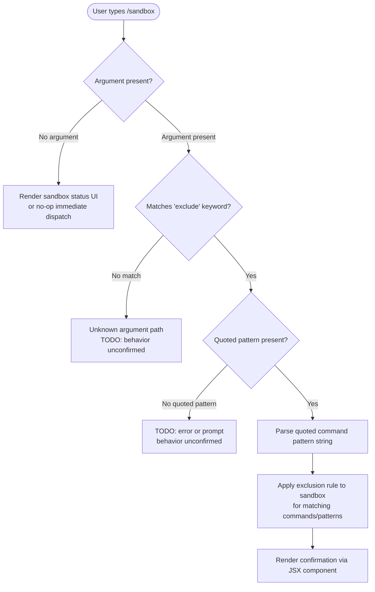

# `/sandbox`

> Analysis basis: CC v2.1.139 bundle.js (AST extraction + Claude interpretation)
> Minimum version: v2.1.139

---

## Overview

The `/sandbox` command is a local JSX slash command that allows users to exclude specific commands or patterns from the active sandbox environment. It processes an argument string in the form `exclude "command pattern"` to suppress or bypass sandbox restrictions for matching operations.

---

## Registration

| Field | Value |
|---|---|
| type | `local-jsx` |
| name | `sandbox` |
| description | *(null — no description registered)* |
| argumentHint | `exclude "command pattern"` |
| immediate | `true` |
| module\_id | `Hjq` |

Analysis basis: CC v2.1.139 bundle.js:+11423753

**Notes on registration fields:**

- **type `local-jsx`**: The command renders its UI or response via a JSX component evaluated locally, without invoking a remote API round-trip for the command itself.
- **`immediate: true`**: The command is dispatched and begins execution immediately upon recognition, without waiting for additional confirmation keystrokes.
- **`description: null`**: No help-text description is surfaced in the slash command picker for this entry. It will appear in the command list with a blank description field.
- **`argumentHint`**: The string `exclude "command pattern"` is displayed as an inline placeholder/hint in the input field once `/sandbox` is typed, guiding the user toward the expected argument syntax.

---

## Input Branching

> **⚠ Extraction notice:** The depth-2 AST traversal recovered no call-graph edges, literals, or telemetry for module `Hjq`. The flowchart below is derived exclusively from the registered `argumentHint` value and the `immediate` flag; it represents the structurally inferable branching, not decompiled logic.



Analysis basis: CC v2.1.139 bundle.js:+11423753 (argumentHint field; no call-graph data available at depth ≤ 2)

---

## Behavioral Spec

> **⚠ Traversal limit reached:** The AST extraction note states `"no entry functions found for module 'Hjq'"`. As a result, no pseudocode can be verified from the call graph. The pseudocode below is structurally inferred from the registration object only. All sub-sections requiring deeper traversal are marked with TODO.

### Command Dispatch (Immediate Mode)

Because `immediate` is `true`, the command handler fires as soon as the slash command is confirmed, without a secondary dispatch gate.

```
function dispatchSandboxCommand(rawInput):
    argument = stripLeadingCommand(rawInput, "/sandbox")
    argument = trim(argument)

    if argument is empty:
        return renderSandboxDefaultView()

    if argument starts with "exclude":
        pattern = extractQuotedString(argument)
        if pattern is null:
            return renderArgumentError("Missing quoted pattern")
        return applySandboxExclusion(pattern)
    else:
        return renderArgumentError("Unrecognized argument")
```

Analysis basis: CC v2.1.139 bundle.js:+11423753 (inferred from `argumentHint` and `immediate` fields; not confirmed by call-graph traversal)

### Pattern Exclusion Application

<!-- TODO: not found in depth-2 traversal; needs --depth 4 -->

```
function applySandboxExclusion(pattern):
    # Exact matching logic not recoverable at depth ≤ 2
    # Register pattern as an exclusion rule in sandbox state
    addExclusionRule(sandboxState, pattern)
    return renderExclusionConfirmation(pattern)
```

Analysis basis: <!-- TODO: not found in depth-2 traversal; needs --depth 4 -->

### JSX Render Output

Because the command type is `local-jsx`, the confirmation or status response is rendered as a React/JSX component inline in the Claude Code terminal UI rather than as plain text streamed output.

```
function renderExclusionConfirmation(pattern):
    # Returns a JSX element; exact component unknown
    return <SandboxExclusionResult pattern={pattern} />
```

Analysis basis: CC v2.1.139 bundle.js:+11423753 (type field `local-jsx`)

---

## State & Side Effects

| Item | Detail |
|---|---|
| Telemetry | *(none detected — telemetry array is empty at depth ≤ 2)* |
| Hook registration | <!-- TODO: not found in depth-2 traversal; needs --depth 4 --> |
| appState changes | <!-- TODO: not found in depth-2 traversal; needs --depth 4 --> |
| Sound | <!-- TODO: not found in depth-2 traversal; needs --depth 4 --> |
| Dispatch mode | Immediate (`immediate: true`) — no deferred confirmation step |
| Render mode | Local JSX component (no remote API call for command rendering) |

---

## Version History

| Version | Change |
|---|---|
| v2.1.139 | Initial analysis — registration confirmed; call-graph traversal returned no entry functions for module `Hjq` |

---

## Common Mistakes

1. **Omitting quotes around the pattern**: The `argumentHint` explicitly shows `exclude "command pattern"` with double quotes. Providing an unquoted pattern string may result in a parse failure or unexpected behavior, since the extraction logic likely delimits the pattern by quotation marks.

2. **Expecting a description in the command picker**: The `description` field is `null`. Users browsing the slash command list will see no explanatory text next to `/sandbox`; they must already know its purpose or consult external documentation.

3. **Assuming a confirmation prompt**: Because `immediate` is `true`, the command executes the moment it is submitted. There is no secondary "are you sure?" gate before the exclusion rule is applied.

4. **Treating exclusions as permanent across sessions**: Whether sandbox exclusion rules persist beyond the current session is <!-- TODO: not found in depth-2 traversal; needs --depth 4 -->.

5. **Invoking `/sandbox` without Claude Code v2.1.139 or later**: This registration was first confirmed at v2.1.139; behavior on earlier versions is undefined.

---

## Appendix — Identifier Mapping

> For bundle debugging only. Identifiers change across versions.

| Identifier | Role |
|---|---|
| `Hjq` | Module identifier for the `/sandbox` command implementation (not an obfuscated function name, but the webpack/bundle module ID under which the command is registered) |

> **Note:** The AST extraction returned an empty `identifiers` array for this command. No additional obfuscated function-level identifiers were recovered at traversal depth ≤ 2. A `--depth 4` re-traversal of module `Hjq` is required to populate this table with meaningful entries.