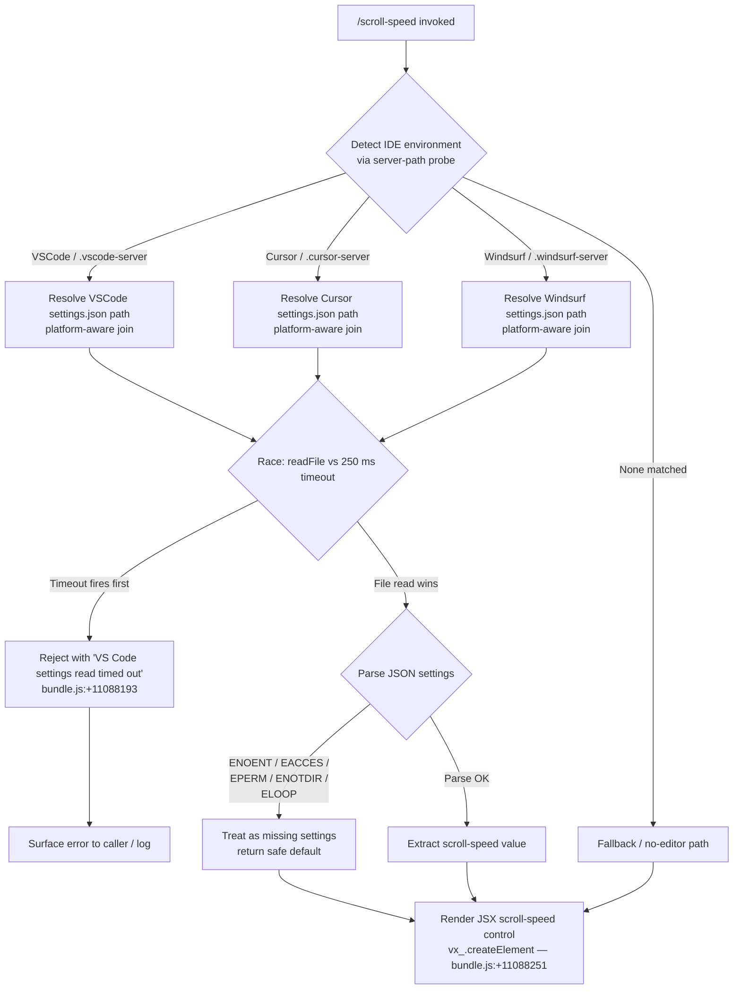

```markdown
---
type: feature-spec
feature: "scroll-speed"
cc_version: "2.1.139"
updated: "2026-05-31"
tags: ["scroll-speed", "commands", "slash-commands"]
source: "bundle-analysis"
bundle_verified: true
analysis_basis: "CC v2.1.139 bundle.js (AST extraction + Claude interpretation)"
author: "ryujaeuk <ryujaeuk@gmail.com>"
repository: "https://github.com/MyLittleLuckyDog/cc-gnothi"
license: "AGPL-3.0-only"
---

# `/scroll-speed`

> Analysis basis: CC v2.1.139 bundle.js (AST extraction + Claude interpretation)
> Minimum version: v2.1.139

---

## Overview

`/scroll-speed` is a local JSX command that lets the user adjust the mouse wheel scroll speed within the Claude Code terminal UI. When invoked, the handler reads the active VS Code–family editor's `settings.json` file (with a 250 ms timeout guard) and renders a JSX control component that reflects and modifies the scroll-speed preference.

---

## Registration

| Field | Value |
|---|---|
| type | `local-jsx` |
| name | `scroll-speed` |
| description | `Adjust mouse wheel scroll speed` |
| module_id | `AOq` |
| load_inline | `true` |
| loc_byte | `11088417` |
| loc_byte_end | `11088665` |
| loc_line | `6709` |
| **arbor_handler.name** | `dP7` |
| **arbor_handler.fqn** | `claude-2.1.139::dP7` |
| **arbor_handler.kind** | `AsyncFunction` |
| **arbor_handler.resolution_path** | `module_id` |
| **arbor_handler.n_hits** | `0` |
| `arbor_handler.name` | `dP7` |
| `arbor_handler.kind` | `AsyncFunction` |
| `arbor_handler.resolution_path` | `module_id` |
| `arbor_handler.fqn` | `claude-2.1.139::dP7` |
| `arbor_handler.n_hits` | `0` |

Analysis basis: CC v2.1.139 bundle.js:+11088417

---

## Input Branching

The handler exhibits four distinct paths depending on: (1) which IDE environment is detected, (2) whether the settings file read times out, (3) whether the file is absent or unreadable, and (4) the normal success path. A Mermaid flowchart is used below.



---

## Behavioral Spec

### 1. Top-level handler (`dP7` — `scrollSpeedCommandHandler`)

```
async function scrollSpeedCommandHandler(context):
    # Step 1: read VS Code–family settings with timeout guard
    settingsResult = await readEditorSettingsWithTimeout(250)

    # Step 2: resolve and parse settings
    scrollValue = extractScrollSpeedFromSettings(settingsResult)

    # Step 3: render the JSX control element
    return createElement(ScrollSpeedControl, { value: scrollValue, ...context })
```

Analysis basis: CC v2.1.139 bundle.js:+11088180 – +11088251

---

### 2. Timed settings read (`p5` — `withTimeout`)

```
function withTimeout(asyncOperation, ms):
    return Promise.race([
        asyncOperation(),
        new Promise((_, reject) =>
            id = setTimeout(() => reject(new Error(timeoutMessage)), ms)
        )
    ]).finally(() => clearTimeout(id))
```

- Timeout duration: **250 ms** (bundle.js:+11088189)
- Timeout rejection message: `"VS Code settings read timed out"` (bundle.js:+11088193)
- Uses `Promise.race` (bundle.js:+2183716), `setTimeout` (bundle.js:+2183653), and `clearTimeout` (bundle.js:+2183763).

Analysis basis: CC v2.1.139 bundle.js:+2183653

---

### 3. IDE detection (`LK_` — `resolveEditorSettingsPath`)

```
async function resolveEditorSettingsPath():
    environment = detectIDEEnvironment()   # calls HK_ / _BL

    if environment is "VSCode" or "vscode":
        base = platformSettingsBase("Code")
    elif environment is "Cursor" or "cursor":
        base = platformSettingsBase("Cursor")
    elif environment is "Windsurf" or "windsurf":
        base = platformSettingsBase("Windsurf")
    else:
        return null

    fullPath = pathJoin(base, "settings.json")   # bundle.js:+3808228 / +3808243
    raw = await filesystem.readFile(fullPath, "utf-8")   # bundle.js:+3808216 / +3808270
    return parseJSON(raw)                        # calls mh6 / LH pipeline
```

Analysis basis: CC v2.1.139 bundle.js:+3808169

---

### 4. IDE environment probe (`HK_` — `detectIDEByServerPath`)

```
function detectIDEByServerPath(homePath):
    if homePath.includes(".vscode-server"):    # bundle.js:+3804280
        return "VSCode"
    if homePath.includes(".cursor-server"):    # bundle.js:+3804310
        return "Cursor"
    if homePath.includes(".windsurf-server"):  # bundle.js:+3804340
        return "Windsurf"
    return null
```

- Uses `H.includes` (bundle.js:+3804269) and `_.includes` (bundle.js:+3804361).

Analysis basis: CC v2.1.139 bundle.js:+3804269

---

### 5. Platform-aware path resolution (`fK_` — `platformSettingsBase`)

```
function platformSettingsBase(appName):
    home = os.homedir()          # bundle.js:+3808698
    platform = os.platform()     # bundle.js:+3808711

    if platform == "win32":      # bundle.js:+3808727
        return path.join(home, "AppData", "Roaming", appName, "User")
        # literals: bundle.js:+3808743, +3808753, +3808765

    if platform == "darwin":     # bundle.js:+3808789
        return path.join(home, "Library", "Application Support", appName, "User")
        # literals: bundle.js:+3808806, +3808816

    # Linux / other
    return path.join(home, ".config", appName, "User")
    # literal ".config": bundle.js:+3808856
```

Analysis basis: CC v2.1.139 bundle.js:+3808690

---

### 6. Settings JSON parsing pipeline (`mh6` / `LH` — `parseAndValidateSettings`)

```
function parseAndValidateSettings(raw):
    sanitized = stripBOM(raw)           # cS: removes leading BOM / prefix
    parsed    = jsonParse(sanitized)    # LH → q_ (error construction) / SH
    queued    = enqueueResult(parsed)   # CGK: shift/push ring buffer
    logged    = maybeLogError(queued)   # LH → Jd.logError on error path
    return parsed
```

- `cS` strips a leading prefix via `H.startsWith` / `H.slice` (bundle.js:+1066059, +1066082).
- `q_` constructs errors using `Error` and `String` (bundle.js:+168122, +168128).
- `SH` coerces values with `String` (bundle.js:+25188).
- `CGK` maintains a FIFO ring buffer via `Qy6.shift` / `Qy6.push` (bundle.js:+948402, +948414).
- Error log level: `"error"` (bundle.js:+949097).
- Traffic class for essential errors: `"essential-traffic"` (bundle.js:+947819).

Analysis basis: CC v2.1.139 bundle.js:+1066235

---

### 7. File-system error classification (`T1` / `w8` — `classifyFsError`)

```
function classifyFsError(err):
    code = err.code    # literal "code": bundle.js:+168242
    if code in ["ENOENT", "EACCES", "EPERM", "ENOTDIR", "ELOOP"]:
        # literals: bundle.js:+168771, +168785, +168799, +168812, +168827
        return SAFE_DEFAULT   # treat as missing settings
    raise err             # unexpected error — propagate
```

Analysis basis: CC v2.1.139 bundle.js:+168754

---

### 8. JSX rendering

```
function renderScrollSpeedUI(scrollValue, context):
    return vx_.createElement(ScrollSpeedControl, {
        currentValue: scrollValue,
        ...context
    })
```

Analysis basis: CC v2.1.139 bundle.js:+11088251

---

## State & Side Effects

| Item | Detail |
|---|---|
| Telemetry | None detected in depth-2 traversal |
| Hook registration | None detected in depth-2 traversal |
| appState changes | Scroll-speed preference updated when the user interacts with the rendered JSX control |
| File I/O | Reads `settings.json` from the active VS Code–family editor's user config directory (platform-aware path) |
| Timeout guard | 250 ms `Promise.race` around the file read; rejects with `"VS Code settings read timed out"` on breach |
| Error logging | File-system errors outside the safe set (`ENOENT`, `EACCES`, `EPERM`, `ENOTDIR`, `ELOOP`) are logged at level `"error"` via `Jd.logError` |
| Ring buffer | A FIFO queue (`CGK`) is updated on every settings read (shift + push) |

---

## Version History

| Version | Change |
|---|---|
| v2.1.139 | Initial analysis |

---

## Common Mistakes

1. **Invoking in a non-VS Code–family environment** — If the home directory path does not contain `.vscode-server`, `.cursor-server`, or `.windsurf-server`, the handler falls back gracefully, but no scroll-speed value from `settings.json` will be applied.
2. **Slow disk / network home directories** — The file read has a hard 250 ms timeout. On networked or slow file systems the read will time out and the command will report a failure rather than a stale value.
3. **Manually editing `settings.json` while the command is active** — The file is read once per invocation; changes made after invocation are not reflected until the command is run again.
4. **Permission errors outside the safe set** — Only `ENOENT`, `EACCES`, `EPERM`, `ENOTDIR`, and `ELOOP` are silently treated as missing settings. Other `fs` errors propagate and will surface as unhandled exceptions.
5. **Windows path assumptions** — On `win32` the path resolves through `AppData\Roaming`; placing settings elsewhere (e.g. portable-mode VS Code) will cause the command to miss the file.

---

## Appendix — Identifier Mapping

> For bundle debugging only. Identifiers change across versions.

| Identifier | Role |
|---|---|
| `dP7` | Top-level async command handler (`scrollSpeedCommandHandler`) |
| `p5` | Promise-race timeout wrapper (`withTimeout`) |
| `LK_` | Editor settings path resolver (`resolveEditorSettingsPath`) |
| `_BL` | Auxiliary environment bootstrap called by `LK_` |
| `HK_` | IDE detection via server-path string probe (`detectIDEByServerPath`) |
| `H` | Random-delay utility with `Math.random` / `setTimeout` (internal scheduling) |
| `_` | Lodash-style utility providing `.includes` |
| `fK_` | Platform-aware settings base-path builder (`platformSettingsBase`) |
| `mh6` | Settings JSON parse entry point (`parseAndValidateSettings`) |
| `cS` | BOM / prefix stripper (`stripBOM`) |
| `LH` | Core JSON parser + error handler pipeline |
| `q_` | Error object constructor helper |
| `SH` | String coercion helper |
| `S1` | Essential-traffic classifier |
| `CGK` | FIFO ring-buffer enqueue/dequeue (`enqueueResult`) |
| `T1` | File-system error classifier (`classifyFsError`) |
| `w8` | Inner error-code matcher used by `T1` |
```