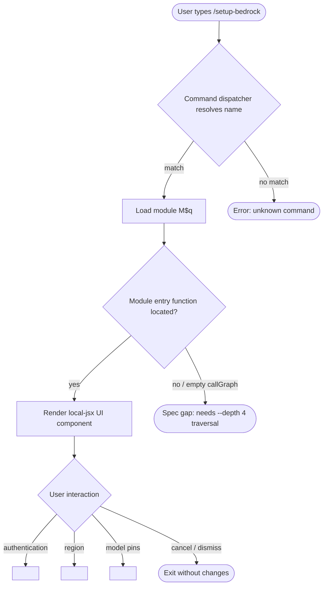

# `/setup-bedrock`

> Analysis basis: CC v2.1.139 bundle.js (AST extraction + Claude interpretation)
> Minimum version: v2.1.139

---

## Overview

The `/setup-bedrock` slash command allows users to reconfigure their Amazon Bedrock integration within Claude Code, covering authentication credentials, AWS region selection, and model pin assignments. It is registered as a `local-jsx` command, meaning it renders an interactive JSX UI component directly in the CLI rather than producing plain text output. The command is designed to be re-entrant — it can be invoked at any time to amend a previously completed Bedrock setup without requiring a full session restart.

---

## Registration

| Field | Value |
|---|---|
| type | `local-jsx` |
| name | `setup-bedrock` |
| description | `Reconfigure Amazon Bedrock authentication, region, or model pins` |
| loc\_line | 6592 |
| module\_id | `M$q` |

Analysis basis: CC v2.1.139 bundle.js:+11037394

---

## Input Branching

The depth-2 AST traversal for module `M$q` returned an empty call graph, empty literals list, and empty telemetry list. Consequently, no branching logic could be extracted deterministically from the bundle at this traversal depth.

<!-- TODO: not found in depth-2 traversal; needs --depth 4 -->

The flowchart below represents the minimal structural skeleton that can be inferred solely from the registration record (command type `local-jsx` and description text). All internal branching paths — authentication method selection, region picker, model-pin assignment, error handling, and confirmation screens — require deeper traversal to document precisely.



---

## Behavioral Spec

### Command Dispatch and Module Loading

```
function dispatchSetupBedrock(slashInput):
    commandName = parseCommandName(slashInput)   // expected value: "setup-bedrock"
    registration = lookupCommand(commandName)

    if registration is null:
        raise UnknownCommandError(commandName)

    assert registration.type == "local-jsx"

    uiComponent = loadModule(registration.module_id)  // module_id: "M$q"

    if uiComponent is null:
        raise ModuleLoadError(registration.module_id)

    renderInline(uiComponent)
```

Analysis basis: CC v2.1.139 bundle.js:+11037394

---

### JSX Rendering Contract

Because the registration type is `local-jsx`, the command does not write plain text to stdout. Instead, it hands a React-compatible component tree to the CLI's inline renderer. The rendered component is responsible for all subsequent user interaction (form fields, navigation, confirmation prompts).

```
function renderInline(component):
    // The CLI host mounts the component into the active terminal viewport.
    // Keyboard events are forwarded to the component until it signals completion.
    host.mount(component)
    host.waitForUnmount()
    // On unmount, control returns to the normal prompt.
```

<!-- TODO: not found in depth-2 traversal; needs --depth 4 -->

---

### Reconfiguration Targets (inferred from description)

The command description names three distinct configuration concerns. Their exact implementation flow, validation rules, and persistence mechanisms are not available at depth-2 traversal.

```
// High-level intent — exact implementation path requires --depth 4

function setupBedrockUI():
    choice = promptUserForTarget([
        "authentication",   // AWS credentials / IAM role / SSO
        "region",           // AWS region string, e.g. "us-east-1"
        "model pins"        // Bedrock model IDs pinned for use
    ])

    match choice:
        case "authentication":
            // <!-- TODO: not found in depth-2 traversal; needs --depth 4 -->
        case "region":
            // <!-- TODO: not found in depth-2 traversal; needs --depth 4 -->
        case "model pins":
            // <!-- TODO: not found in depth-2 traversal; needs --depth 4 -->

    persistConfiguration()
    signalCompletion()
```

Analysis basis: CC v2.1.139 bundle.js:+11037394 (description field)

---

## State & Side Effects

| Item | Detail |
|---|---|
| Telemetry | None detected at depth-2 traversal. <!-- TODO: not found in depth-2 traversal; needs --depth 4 --> |
| Hook registration | <!-- TODO: not found in depth-2 traversal; needs --depth 4 --> |
| appState changes | <!-- TODO: not found in depth-2 traversal; needs --depth 4 --> |
| Sound | <!-- TODO: not found in depth-2 traversal; needs --depth 4 --> |
| Persistence target | Likely writes to the Claude Code configuration store (path and format not confirmed at depth-2 traversal) |
| Session impact | Re-entrant; does not require session restart based on command description wording ("Reconfigure") |

---

## Version History

| Version | Change |
|---|---|
| v2.1.139 | Initial analysis. Command registered as `local-jsx` under module `M$q`. Internal call graph, literals, and telemetry require deeper traversal. |

---

## Common Mistakes

1. **Expecting plain-text output.** Because the command type is `local-jsx`, it renders an interactive UI component. Piping or scripting `/setup-bedrock` output as plain text will not capture configuration data.
2. **Assuming a single reconfiguration target.** The description explicitly lists three independent concerns (authentication, region, model pins); all three may be reachable from the same command invocation.
3. **Running in non-interactive terminals.** A `local-jsx` command requires an interactive TTY to mount its component; running inside a non-interactive shell (CI pipelines, `--print` mode) may fail or produce no output.
4. **Treating the command as destructive on cancel.** Based on the re-entrant framing of the description, cancelling mid-flow should leave the previous configuration intact — but this cannot be confirmed without depth-4 traversal.
5. **Confusing `/setup-bedrock` with initial setup.** The word "Reconfigure" in the description implies a prior Bedrock setup must exist. Invoking the command before any Bedrock configuration has been established may trigger a different code path than expected.

---

## Appendix — Identifier Mapping

> For bundle debugging only. Identifiers change across versions.

| Identifier | Role |
|---|---|
| `M$q` | Module containing the `/setup-bedrock` command implementation (not an obfuscated function name; this is the module ID as recorded in the registration object) |

> **Note:** The depth-2 AST traversal returned an empty `identifiers` array for module `M$q`. No obfuscated function-level identifiers were extracted. A `--depth 4` traversal is required to populate this table with meaningful entries.