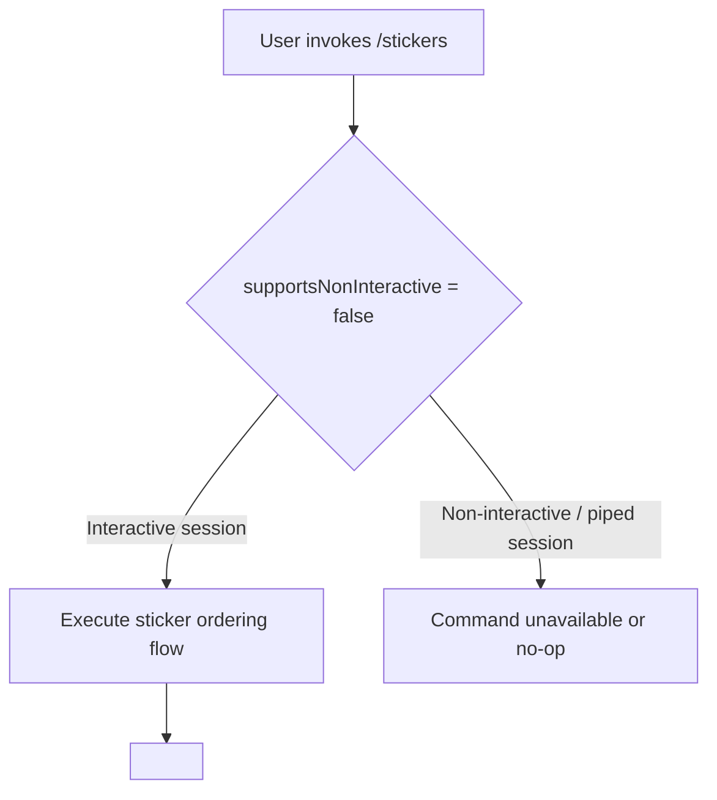

# `/stickers`

> Analysis basis: CC v2.1.139 bundle.js (AST extraction + Claude interpretation)
> Minimum version: v2.1.139

---

## Overview

The `/stickers` command is a local slash command that allows users to order physical Claude Code stickers. It is registered as a non-interactive command and presents the user with a sticker ordering flow entirely within the CLI session.

---

## Registration

| Field | Value |
|---|---|
| type | `local` |
| name | `stickers` |
| description | `Order Claude Code stickers` |
| supportsNonInteractive | `false` |
| module_id | `Xjq` |

Analysis basis: CC v2.1.139 bundle.js:+11435395

---

## Input Branching

The AST traversal at depth ≤ 2 did not resolve any entry functions for module `Xjq`. Therefore, no call graph edges, literals, or branching paths could be extracted.

<!-- TODO: not found in depth-2 traversal; needs --depth 4 -->



---

## Behavioral Spec

### Command Dispatch

```
function handleStickersCommand(session):
    if session.isInteractive == false:
        return  // command requires interactive terminal
    executeOrderFlow(session)
    // inner implementation: <!-- TODO: not found in depth-2 traversal; needs --depth 4 -->
```

Analysis basis: CC v2.1.139 bundle.js:+11435395

### Order Flow

```
function executeOrderFlow(session):
    // Specific sub-steps (URL display, form, confirmation, etc.)
    // <!-- TODO: not found in depth-2 traversal; needs --depth 4 -->
```

<!-- TODO: not found in depth-2 traversal; needs --depth 4 -->

---

## State & Side Effects

| Item | Detail |
|---|---|
| Telemetry | None detected at depth ≤ 2 <!-- TODO: not found in depth-2 traversal; needs --depth 4 --> |
| Hook registration | <!-- TODO: not found in depth-2 traversal; needs --depth 4 --> |
| appState changes | <!-- TODO: not found in depth-2 traversal; needs --depth 4 --> |
| Sound | <!-- TODO: not found in depth-2 traversal; needs --depth 4 --> |
| supportsNonInteractive | `false` — command cannot execute in piped/headless mode |

Analysis basis: CC v2.1.139 bundle.js:+11435395

---

## Version History

| Version | Change |
|---|---|
| v2.1.139 | Initial analysis |

---

## Common Mistakes

1. **Running in non-interactive mode**: Because `supportsNonInteractive` is `false`, invoking `/stickers` in a piped or headless shell session will not produce the expected ordering flow. Always invoke from an interactive terminal session.
2. **Expecting programmatic output**: This command is designed for human interaction; its output should not be parsed by scripts or automation pipelines.
3. **Assuming deep call graph coverage**: The module `Xjq` had no entry functions resolved at AST traversal depth ≤ 2. Any assumptions about sub-steps, URLs, or state mutations beyond what is registered require a deeper traversal.

---

## Appendix — Identifier Mapping

> For bundle debugging only. Identifiers change across versions.

| Identifier | Role |
|---|---|
| `Xjq` | Module ID for the `/stickers` command implementation |

> No additional obfuscated identifiers were returned by the depth-≤-2 traversal. Further entries require `--depth 4` re-extraction.