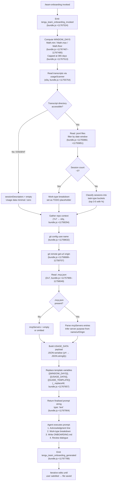

# `/team-onboarding`

> Analysis basis: CC v2.1.139 bundle.js (AST extraction + Claude interpretation)
> Minimum version: v2.1.139

---

## Overview

`/team-onboarding` is a `prompt`-type slash command that analyzes the invoking user's local Claude Code session transcripts (up to the last 365 days) and co-authors a personalized `ONBOARDING.md` guide suitable for teammates new to Claude Code. The command gathers usage statistics, classifies sessions by work type, reads the local `.mcp.json` for MCP server context, queries `git config user.name` and `git remote get-url origin` for identity and repo information, then submits a structured prompt to the agent which produces a draft guide immediately and iterates via a built-in review dialogue.

---

## Registration

| Field | Value |
|---|---|
| type | `prompt` |
| name | `team-onboarding` |
| description | `Help teammates ramp on Claude Code with a guide from your usage` |
| isHidden | `false` |
| handler_method | `getPromptForCommand` |
| handler_method_start (byte) | `11767264` |
| handler_method_end (byte) | `11767920` |
| loc_byte | `11766926` |
| loc_byte_end | `11767921` |
| loc_line | `7821` |
| prompt_body.length | `4539` characters |
| prompt_body.trace | `identifier→$ (local→1 ext vars)` |
| arbor_handler.name | `getPromptForCommand` |
| arbor_handler.kind | `Method` |
| arbor_handler.fqn | `claude-2.1.139::getPromptForCommand` |
| arbor_handler.resolution_path | `direct` |
| arbor_handler.n_hits | `2` |
| `handler_method_start` | `11767264` |
| `handler_method_end` | `11767920` |

Analysis basis: CC v2.1.139 bundle.js:+11766926

---

## Input Branching

The handler has more than three distinct execution paths depending on transcript availability, git context, MCP config presence, and session count. A Mermaid flowchart is used.



---

## Behavioral Spec

### 1. Handler Entry — `getPromptForCommand`

The Arbor-resolved handler is `getPromptForCommand` (Method, `direct` resolution, `claude-2.1.139::getPromptForCommand`, bundle.js:+11767264). The synthetic call-graph entry `__handler_team-onboarding` is BFS bookkeeping; `getPromptForCommand` is the authoritative handler name.

```
function getPromptForCommand(context):
    emit telemetry("tengu_flint_harbor_prompt")     // bundle.js:+11767301
    emit telemetry("tengu_team_onboarding_invoked") // bundle.js:+11767524

    windowDays = Math.floor(
                     Math.max(1,
                         Math.min(365, derivedWindow(context))
                     )
                 )                                   // bundle.js:+11767467–11767485, +11767513

    usageData   = collectUsageData(windowDays)       // calls usageScanner (s0q)
    repoContext = collectRepoContext()               // calls repoCollector (Yv7)
    mcpConfig   = readMcpConfig()                   // calls mcpReader (Dv7)

    prompt = buildPromptBody(usageData, repoContext, mcpConfig, windowDays)
    emit telemetry("tengu_team_onboarding_generated")  // bundle.js:+11767789

    return { type: "text", content: prompt }         // bundle.js:+11767904
```

Analysis basis: CC v2.1.139 bundle.js:+11767264

---

### 2. Usage Data Collection — `usageScanner` (`s0q`)

Scans the user's local Claude Code transcript directory for `.jsonl` files within the configured time window.

```
async function usageScanner(windowDays):
    cutoffMs = Date.now() - windowDays * 24 * 60 * 1000  // bundle.js:+11755754–11755776
    files    = await fs.readdir(transcriptsDir)           // bundle.js:+11755795
    jsonlFiles = files.filter(f => extname(f) == ".jsonl")// bundle.js:+11755865, +11755882

    sessions = await Promise.all(
        jsonlFiles.map(async file =>
            stat = await fs.stat(join(transcriptsDir, file))
            if not stat.isFile(): return null            // bundle.js:+11755982
            raw  = await fs.readFile(...)               // bundle.js:+11756138
            lines = raw.split("\n")                     // bundle.js:+11756252
            // Filter lines newer than cutoff           // bundle.js:+11756293
            // Extract session descriptors:
            //   - title via regex fv7                  // bundle.js:+11756602
            //   - prNumbers via regex Mv7              // bundle.js:+11756658
            //   - firstUserMessage via regex $v7       // bundle.js:+11756833
            //   - tool counts, MCP counts
            //   - detect MCP tool names via
            //     substring '"name":"mcp__'            // bundle.js:+11756461
            //   - detect content arrays via
            //     substring '"content":['              // bundle.js:+11756811
            //   - keep up to 3 lines context           // bundle.js:+11756914
            return sessionDescriptor
        )
    )
    return sessions.filter(notNull)
```

The time window computation uses constants `24`, `60`, and `1000` representing hours-per-day, minutes-per-hour, and milliseconds-per-second respectively (bundle.js:+11755767–11755776).
The file-extension filter targets `.jsonl` exclusively (bundle.js:+11755882).

Analysis basis: CC v2.1.139 bundle.js:+11755754

---

### 3. Repo Context Collection — `repoCollector` (`Yv7`)

Assembles repository and git identity information to embed in the guide.

```
async function repoCollector():
    currentRepo = resolveCurrentRepo()          // A_ (bundle.js:+11758294)
    allRepos    = discoverSiblingRepos(currentRepo) // MG, mZ (bundle.js:+11758301)
    // MG walks the projects directory (literal "projects", bundle.js:+978864)

    gitUserName = await runGitCommand(
                      ["config", "user.name"]   // bundle.js:+11758623, +11758632
                  )
    remoteOrigin = await runGitCommand(
                       ["remote", "get-url", "origin"] // bundle.js:+11758688–11758707
                   )
    return { currentRepo, allRepos, generatedBy: gitUserName, remoteOrigin }
```

Git commands are executed via the shell runner (`$_`, `$PH`) which uses `git` as the executable (bundle.js:+11758616). The `user.name` value becomes the `generatedBy` field in the rendered guide; if absent the name is omitted.

Analysis basis: CC v2.1.139 bundle.js:+11758294

---

### 4. MCP Config Reader — `mcpReader` (`Dv7`)

Reads the workspace-local `.mcp.json` to enumerate MCP server entries.

```
async function mcpReader(workspaceRoot):
    filePath = join(workspaceRoot, ".mcp.json")  // bundle.js:+11757982, +11757993
    try:
        raw     = await fs.readFile(filePath, "utf8")  // bundle.js:+11757969, +11758006
        parsed  = JSON.parse(raw)                      // U6, bundle.js:+11758016
        servers = parsed["mcpServers"] ?? {}           // bundle.js:+11758049
        // For each server entry: use name + urlOrigin
        // to infer purpose and access instructions
        return serversArray
    catch (e):
        return []   // .mcp.json absent or unparseable
```

Analysis basis: CC v2.1.139 bundle.js:+11757969

---

### 5. Prompt Assembly and Template Variable Substitution

After all data is collected the handler assembles the final prompt string by replacing three template placeholders:

```
function buildPromptBody(usageData, repoContext, mcpConfig, windowDays):
    base = PROMPT_TEMPLATE   // 4539-char body, bundle.js:+11766926

    // Replace placeholders (_.replaceAll, bundle.js:+11767657):
    base = base.replaceAll("{{WINDOW_DAYS}}", String(windowDays))  // bundle.js:+11767670
    base = base.replaceAll("{{GUIDE_TEMPLATE}}", guideTemplate())  // bundle.js:+11767710
    base = base.replaceAll("{{USAGE_DATA}}",
                           JSON.stringify(usageData))              // bundle.js:+11767745

    return base
```

The `String()` coercion converts the numeric `windowDays` to text (bundle.js:+11767688). The window is bounded to a maximum of **365 days** (bundle.js:+11767513).

Analysis basis: CC v2.1.139 bundle.js:+11767657

---

### 6. Agent Execution Model (Prompt Body Semantics)

The 4539-character prompt body instructs the agent to follow a strict five-step sequence. No verbatim reproduction is given here; the following pseudocode captures the logic as grounded in the prompt body (`prompt_body.trace: identifier→$ (local→1 ext vars)`, length 4539):

```
agent_steps():

  // Step 1 — Immediate acknowledgment (mandatory first output)
  print("> Looking at how you've used Claude over the last N days …")
  // No tool calls, no thinking, no classification before this line.

  // Step 2 — Work-type breakdown
  for each session in sessionDescriptors:
      classify(session) into one of:
          BUILD_FEATURE | DEBUG_FIX | IMPROVE_QUALITY |
          ANALYZE_DATA  | PLAN_DESIGN | PROTOTYPE | WRITE_DOCS
      // Fallback signal: tool/MCP counts when first messages are uninformative
  pick top 3-5 categories with approximate percentages
  // Display with title case and spaces in rendered output

  // Step 3 — Gather remaining pieces
  repos     = [currentRepo] + sibling dirs in workspace
  mcpSetup  = infer access instructions from name + urlOrigin per server
  // Team Tips and Get Started remain as TODO placeholders at this stage

  // Step 4 — Write ONBOARDING.md
  fill guideTemplate with real numbers (not placeholder text)
  asciiBarChart(value, max, width=20)  // █ filled, ░ empty
  generatedBy = usageData.generatedBy  // omit if missing

  // Step 5 — Review dialogue (same turn)
  render guide inside fenced code block
  emit "---" + "**Review**" heading
  ask three numbered questions:
      Q1: confirm team name (or ask if unknown)
      Q2: starter task link (optional)
      Q3: team tips not already in CLAUDE.md

  // Post-review update
  on_user_reply():
      update ONBOARDING.md with team name, tips, starter task
      print exact closing line:
          "Saved to `ONBOARDING.md`. Drop it in your team docs …"
      apply any further edits on request
```

The ASCII bar chart uses `█` (filled) and `░` (empty) characters, 20 characters wide. The prompt body explicitly instructs the agent that classification is **step 2**, not step 1 — the acknowledgment line must appear before any reasoning.

Analysis basis: CC v2.1.139 bundle.js:+11766926 (prompt body, length 4539)

---

### 7. Work-Type Classification Rules

| Task Type | Signals |
|---|---|
| `build_feature` | New functionality, scripts, tools, config/CI/env setup |
| `debug_fix` | Bug investigation and resolution |
| `improve_quality` | Refactoring, tests, cleanup, code review |
| `analyze_data` | Queries, metrics, numerical analysis |
| `plan_design` | Architecture, strategy, unfamiliar-code exploration, design review |
| `prototype` | Spikes, POCs, throwaway exploration |
| `write_docs` | PRDs, RFCs, READMEs, design docs, copy/doc review |

Classification priority: first user message → session title → PR link type → tool/MCP counts (weak signal only). Review sessions are classified by the artifact reviewed (code review → `improve_quality`, doc review → `write_docs`, design review → `plan_design`). A new category may be invented only if the session is genuinely a different type of task.

Analysis basis: CC v2.1.139 bundle.js:+11766926

---

### 8. Deduplication and Caching Layer (`Ql6`, `k8_`)

The call graph shows a deduplication/caching subsystem reached from the usage-scanner path. It gates on set membership before issuing expensive work:

```
function deduplicatedFetch(key, cache, seenSet):
    if seenSet.has(key):       // T8_.has, bundle.js:+3110202
        return cache.get(key)  // gfH.get, bundle.js:+3110226
    seenSet.add(key)           // T8_.add, bundle.js:+3110242
    result = heavyOperation(key)  // G8_
    return result
```

The heavy operation (`G8_`) internally calls the experiment/feature-flag subsystem (`zWH` → `vR`) and emits a `growthbook_experiment` event (literal, bundle.js:+3106693), suggesting usage-data collection may be gated behind a feature flag checked at runtime.

Analysis basis: CC v2.1.139 bundle.js:+3110202

---

### 9. Share / Flint Harbor Integration (`j38`)

A secondary call from `__handler_team-onboarding` reaches `j38`, which invokes `j6` (the session-dispatch subsystem) and emits `tengu_flint_harbor_share` (bundle.js:+8960159). This suggests the generated `ONBOARDING.md` may optionally be shared via an internal sharing facility ("Flint Harbor") in addition to local file write.

```
function flintHarborShare(payload):
    prepareSharePayload(payload)   // S1, kA (bundle.js:+8960104, +8960122)
    dispatchSession(payload)       // j6 (bundle.js:+8960156)
    // emits tengu_flint_harbor_share
```

Analysis basis: CC v2.1.139 bundle.js:+8960159

---

## State & Side Effects

| Item | Detail |
|---|---|
| Telemetry — `tengu_flint_harbor_prompt` | Fired at prompt-handler entry (bundle.js:+11767301) |
| Telemetry — `tengu_team_onboarding_invoked` | Fired immediately after invocation (bundle.js:+11767524) |
| Telemetry — `tengu_team_onboarding_generated` | Fired after prompt string is assembled (bundle.js:+11767789) |
| Telemetry — `tengu_flint_harbor_share` | Fired if share dispatch is triggered (bundle.js:+8960159) |
| Telemetry — `tengu_config_parse_error` | Fired if config read fails (bundle.js:+3135421) |
| Telemetry — `tengu_feature_ok` / `tengu_feature_bad` | Feature-flag check results (bundle.js:+943635, +943693) |
| Telemetry — `tengu_flint_harbor_prompt` | Also covers general harbor prompt path (bundle.js:+11767301) |
| File write | `ONBOARDING.md` written to workspace root by the agent (not by the handler itself) |
| Git subprocess | `git config user.name` and `git remote get-url origin` executed at invocation time |
| Filesystem reads | `~/.claude/projects/*/` JSONL transcripts; workspace `.mcp.json` |
| appState changes | Session dispatch via `j6` may register a new background session entry |
| Window cap | Maximum transcript look-back: **365 days** (bundle.js:+11767513) |
| Template placeholders resolved | `{{WINDOW_DAYS}}`, `{{USAGE_DATA}}`, `{{GUIDE_TEMPLATE}}` (bundle.js:+11767670, +11767710, +11767745) |

---

## Version History

| Version | Change |
|---|---|
| v2.1.139 | Initial analysis — command first observed in bundle at loc_byte 11766926 |

---

## Common Mistakes

1. **Running the command in a directory with no Claude Code transcripts.** If the projects directory is empty or the date window excludes all sessions, `sessionDescriptors` will be empty and the work-type breakdown section of the guide will be left as a TODO. Run `/team-onboarding` from a machine that has been actively used with Claude Code.

2. **Expecting an interactive Q&A before a draft.** The prompt body explicitly instructs the agent to generate a complete draft first and ask questions afterward. Users who respond to the initial questions before reading the draft will cause the agent to update the file with incomplete information.

3. **Missing `git remote origin`.** If the workspace has no `origin` remote, `remoteOrigin` will be empty and the guide's repository section will be sparse. Ensure `git remote add origin <url>` is set before invoking the command.

4. **Stale or missing `.mcp.json`.** The MCP server setup section of the guide is derived exclusively from the workspace `.mcp.json`. If that file is absent or does not reflect the team's actual MCP configuration, the generated guide will omit MCP instructions.

5. **Editing `ONBOARDING.md` manually before the review dialogue completes.** The agent will overwrite the file when it applies review answers. Complete the review dialogue first, then make manual edits.

6. **Assuming the window is unlimited.** The look-back is capped at **365 days** regardless of what is passed. Sessions older than the cap are silently excluded (bundle.js:+11767513).

---

## Appendix — Identifier Mapping

> For bundle debugging only. Identifiers change across versions.

| Identifier | Role |
|---|---|
| `__handler_team-onboarding` | Synthetic BFS entry for the command handler (not a real bundle symbol) |
| `j6` | Session dispatch / background session manager |
| `L46` | Session dispatch sub-helper A |
| `M46` | Session dispatch sub-helper B |
| `Ya` | Session dispatch sub-helper C |
| `SH` | String coercion / formatting utility |
| `Da` | Config/context accessor |
| `ex` | External config reader |
| `Ql6` | Deduplication / caching gate |
| `G8_` | Heavy fetch operation within cache gate; emits growthbook event |
| `zWH` | Feature-flag / experiment evaluator |
| `tx` | Random-bytes token generator |
| `yH` | JSON serialiser wrapper |
| `DVL` | Event emitter helper |
| `k8_` | Secondary dedup sub-handler |
| `k$9` | Sub-helper inside k8_ |
| `m_` | Indexing/mapping helper |
| `$09` | Unknown sub-helper (depth-2 boundary) |
| `TSH` | Feature-flag set checker |
| `b6` | File-backed session store |
| `B6` | Path resolver utility |
| `U8_` | Unknown utility in session store |
| `cfH` | Config file reader / backup manager |
| `q` | Filesystem module reference |
| `U6` | JSON.parse wrapper |
| `cS` | String prefix-stripper |
| `_` | Generic utility / filesystem reference |
| `w8` | Logging / warning utility |
| `Z09` | Directory scanner for config backups |
| `N` | Log message formatter |
| `LH` | CLAUDE.md / context file loader |
| `Q` | App-state accessor |
| `l8_` | Path join helper with base resolution |
| `w` | Daemon / background-process manager |
| `pVL` | File watcher setup |
| `Xc` | Unknown watcher helper |
| `C9` | Reactive state / observable helper |
| `Yv7` | Repo context collector (calls s0q, Dv7, $_) |
| `A_` | Current-repo resolver |
| `MG` | All-repos enumerator |
| `mZ` | Projects directory path builder |
| `pO` | Path normaliser / slug generator |
| `H` | Generic string/process handle |
| `DTK` | Absolute-value / hash helper |
| `s0q` | Usage / transcript scanner (main data collector) |
| `T1` | Unknown file-read helper |
| `K` | Array map/filter helper |
| `L` | Async task wrapper with add/delete tracking |
| `f` | Stream / channel handle |
| `O` | File-stat result wrapper |
| `x8` | Unknown stat helper |
| `$` | Transcript line parser / split helper |
| `NXq` | Transcript record parser |
| `z` | Daemon state accessor |
| `kH` | Daemon stop handler |
| `xH` | Daemon stop-failed handler |
| `NR` | Daemon control helper |
| `Cb` | Process-exit race handler |
| `Y` | Background-process lifecycle manager |
| `ul_` | OS-specific (macOS) memory / process helper |
| `hl_` | Background spare process spawner |
| `Dv7` | MCP config reader (reads .mcp.json) |
| `D8` | Unknown read helper inside Dv7 |
| `zv7` | Unknown helper (depth-2 boundary, called from Yv7) |
| `$_` | Shell command runner (wraps $PH) |
| `$PH` | Core subprocess execution engine |
| `hMA` | Subprocess arg builder |
| `QC8` | Subprocess stdout handler |
| `dC8` | Subprocess stderr handler |
| `lC8` | Subprocess line-stream handler |
| `pfA` | Numeric validation for subprocess options |
| `K_6` | Subprocess error wrapper |
| `gC8` | Reflect.apply / property-define helper |
| `wMA` | Process exit-event listener |
| `mfA` | Subprocess timeout handler |
| `UfA` | Subprocess kill-on-signal handler |
| `xfA` | Subprocess stdout data handler |
| `ufA` | Subprocess SIGKILL escalator |
| `DMA` | Parallel subprocess promise combiner |
| `$_6` | Subprocess error-code extractor |
| `OMA` | Subprocess pipe setup |
| `zMA` | Subprocess stream registration |
| `QfA` | Subprocess stdout bind helper |
| `_ZK` | String coercion helper inside shell runner |
| `YPH` | Git URL parser (extracts host, path from remote URL) |
| `NZK` | Git URL normaliser |
| `i1` | String index/slice helper |
| `j38` | Flint Harbor share dispatcher |
| `S1` | Share payload preparer |
| `G7A` | Share sub-helper |

---

*Note: index built via Arbor fallback; some signals (telemetry, literals) may be missing — see arbor-fallback.js.*