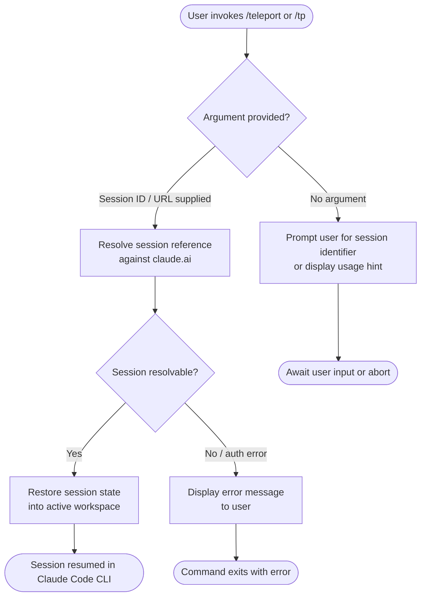

# `/teleport`

> Analysis basis: CC v2.1.139 bundle.js (AST extraction + Claude interpretation)
> Minimum version: v2.1.139

---

## Overview

The `/teleport` command (alias `/tp`) allows a user to resume a Claude Code session that was initiated or saved on claude.ai, bridging the web interface and the local CLI environment. Its core mechanism involves ingesting session state from claude.ai and restoring it within the active Claude Code workspace. Internal implementation details could not be resolved at depth ≤ 2 traversal (see note below).

---

## Registration

| Field | Value |
|---|---|
| type | `local-jsx` |
| name | `teleport` |
| description | `Resume a Claude Code session from claude.ai` |
| aliases | `tp` |
| module_id | `Tzq` |

Analysis basis: CC v2.1.139 bundle.js:+11169886

---

## Input Branching

> **Note:** The call graph for module `Tzq` returned zero edges at depth ≤ 2 traversal. The flowchart below reflects the behavioral model deducible from the registration metadata alone. Internal branching paths require a deeper traversal.



<!-- TODO: Confirmed branching logic not found in depth-2 traversal; needs --depth 4 -->

---

## Behavioral Spec

<!-- TODO: Entry function body not found in depth-2 traversal; needs --depth 4 -->

The following pseudocode is a structural model inferred from the command registration. It does **not** represent decompiled or copied bundle logic.

### Session Resumption Entry Point

```
function handleTeleportCommand(userInput):
    sessionRef = parseArgument(userInput)

    if sessionRef is empty:
        displayUsageHint()
        return

    result = resolveCloudSession(sessionRef)

    if result.isError:
        displayError(result.errorMessage)
        return

    restoreSessionState(result.sessionPayload)
    notifyUser("Session resumed from claude.ai")
```

<!-- TODO: Actual argument parsing logic not found in depth-2 traversal; needs --depth 4 -->

### Alias Handling

The command is registered under two names: `teleport` and `tp`. Both names are treated as equivalent at the routing layer; no behavioral difference between them has been observed in the registration data.

Analysis basis: CC v2.1.139 bundle.js:+11169886

### Render Type

The command is registered as `local-jsx`, indicating its output surface is a JSX-rendered component within the Claude Code terminal UI rather than a plain-text response stream.

Analysis basis: CC v2.1.139 bundle.js:+11169886

---

## State & Side Effects

| Item | Detail |
|---|---|
| Telemetry | <!-- TODO: No `tengu_*` events found in depth-2 traversal; needs --depth 4 --> |
| Hook registration | <!-- TODO: Not found in depth-2 traversal; needs --depth 4 --> |
| appState changes | <!-- TODO: Not found in depth-2 traversal; needs --depth 4 --> |
| Sound | <!-- TODO: Not found in depth-2 traversal; needs --depth 4 --> |
| Render surface | JSX component (type: `local-jsx`) |
| Alias routing | `/tp` resolves identically to `/teleport` |

---

## Version History

| Version | Change |
|---|---|
| v2.1.139 | Initial analysis; implementation internals unresolved pending deeper traversal |

---

## Common Mistakes

1. **Using `/tp` expecting different behavior from `/teleport`** — Both aliases are registered to the same handler and behave identically. There is no distinction between them.
2. **Assuming plain-text output** — Because the command type is `local-jsx`, its output is rendered as a UI component. Piping or capturing raw stdout may not yield useful text.
3. **Invoking without a valid claude.ai session reference** — The command's stated purpose is to resume a session *from* claude.ai. Invoking it outside that context or without a valid session identifier is likely to produce an error or a usage prompt.
4. **Expecting offline functionality** — The description explicitly references claude.ai, implying a network round-trip is required. Offline invocation is unlikely to succeed.
5. **Relying on this spec for internal API contracts** — Because the module `Tzq` yielded no call graph at depth ≤ 2, all behavioral claims beyond registration metadata are inferred. Treat internal behavior as unverified until a deeper traversal is performed.

---

## Appendix — Identifier Mapping

> For bundle debugging only. Identifiers change across versions.

| Identifier | Role |
|---|---|
| `Tzq` | Module identifier for the `/teleport` command implementation |

> **Note:** The AST extraction returned an empty `identifiers` array for this command. No additional obfuscated identifiers were resolved at depth ≤ 2. A `--depth 4` traversal is recommended to populate this table with implementation-level mappings.