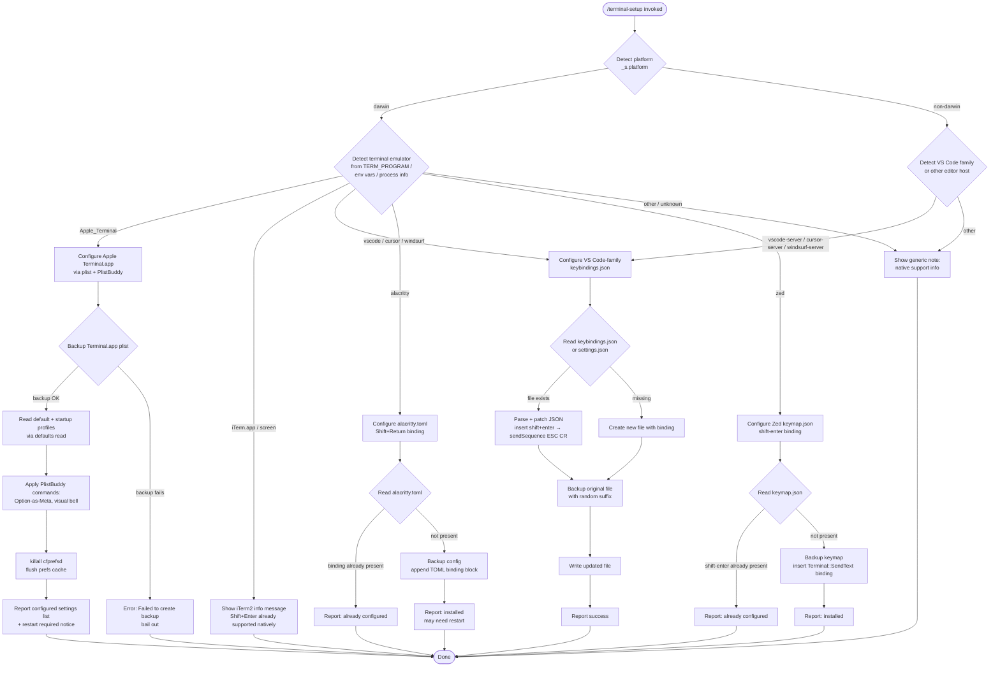

# `/terminal-setup`

> Analysis basis: CC v2.1.139 bundle.js (AST extraction + Claude interpretation)
> Minimum version: v2.1.139

---

## Overview

`/terminal-setup` installs a Shift+Enter key binding so that pressing Shift+Enter in supported terminals sends a newline character instead of submitting input. The command detects the current terminal emulator or editor host, applies the appropriate configuration change (modifying plist files, JSON keybinding files, or TOML config files), and reports the result to the user. It is a one-shot local command with no agent turn — its handler runs entirely in the CLI process.

---

## Registration

| Field | Value |
|---|---|
| type | `local-jsx` |
| name | `terminal-setup` |
| description | Install Shift+Enter key binding for newlines |
| loc_byte | `11182392` |
| loc_byte_end | `11183024` |
| loc_line | `6900` |
| module_id | `lR9` |
| load_inline | `true` |
| arbor_handler.name | `HBL` |
| arbor_handler.fqn | `claude-2.1.139::HBL` |
| arbor_handler.kind | `AsyncFunction` |
| arbor_handler.resolution_path | `module_id` |
| arbor_handler.n_hits | `1` |

Analysis basis: CC v2.1.139 bundle.js:+11182392 – +11183024

---

## Input Branching

The handler detects the terminal environment through several distinct paths (7+ branches covering different terminal emulators and host environments), so a Mermaid flowchart is used.



---

## Behavioral Spec

### Top-Level Handler (`HBL`)

The primary entry point is the async function `HBL` (Arbor-resolved handler, `resolution_path: module_id`).

```
async function terminalSetupHandler(context):
    platform = os.platform()                        // _s.platform

    // Step 1: Detect terminal environment
    terminalType = detectTerminal(platform)         // cR9

    // Step 2: Branch on detected terminal
    if terminalType == "Apple_Terminal":
        result = await configureAppleTerminal()     // ABL
    else if terminalType in ["vscode","cursor","windsurf"]:
        result = await configureVSCodeFamily()      // eq_ or tq_
    else if terminalType == "alacritty":
        result = await configureAlacritty()         // qBL
    else if terminalType == "zed":
        result = await configureZed()              // KBL
    else if terminalType in ["iTerm.app","screen"]:
        displayNativeSupport()                      // Mo6 / informational
    else:
        displayGenericNote()

    renderOutput(result)
```

Analysis basis: CC v2.1.139 bundle.js:+3806628

---

### Terminal Detection (`cR9`)

```
function detectTerminal(platform):
    // Check TERM_PROGRAM, process title, home-dir server dirs
    envTermProgram = process.env["TERM_PROGRAM"]

    // Remote server dir detection (HK_)
    homedir = os.homedir()
    if exists(homedir + "/.vscode-server"):   return "vscode"
    if exists(homedir + "/.cursor-server"):   return "cursor"
    if exists(homedir + "/.windsurf-server"): return "windsurf"

    if envTermProgram == "Apple_Terminal":    return "Apple_Terminal"
    if envTermProgram == "vscode":            return "vscode"
    if envTermProgram == "cursor":            return "cursor"
    if envTermProgram == "windsurf":          return "windsurf"
    if envTermProgram == "alacritty":         return "alacritty"
    if envTermProgram == "zed":               return "zed"
    if process title contains "iTerm.app" or "screen":
        return "iterm_or_screen"
    return "unknown"
```

Analysis basis: CC v2.1.139 bundle.js:+3805663, +3804269, +3804310, +3804340

---

### Apple Terminal Configuration (`ABL`)

```
async function configureAppleTerminal():
    prefsPath = path.join(os.homedir(),
                    "Library", "Preferences",
                    "com.apple.Terminal.plist")
    // plist constants at bundle.js:+3801499–+3801523

    // 1. Backup plist (pR9 → upH + O8)
    backupOk = await backupTerminalPlist(prefsPath)
    if not backupOk:
        throw Error("Failed to create backup of Terminal.app preferences, bailing out")
        // bundle.js:+3812669

    // 2. Read default profile name
    defaultProfile = runCommand("defaults", "read", "com.apple.Terminal",
                                "Default Window Settings")
    // bundle.js:+3812779, +3812807
    if not defaultProfile:
        throw Error("Failed to read default Terminal.app profile")
        // bundle.js:+3812867

    // 3. Read startup profile name
    startupProfile = runCommand("defaults", "read", "com.apple.Terminal",
                                "Startup Window Settings")
    // bundle.js:+3812984
    if not startupProfile:
        throw Error("Failed to read startup Terminal.app profile")
        // bundle.js:+3813044

    // 4. Apply settings to each profile (FR9, gR9)
    //    Uses /usr/libexec/PlistBuddy -c <command>
    //    bundle.js:+3811912
    profiles = unique([defaultProfile, startupProfile])
    successCount = 0
    for profile in profiles:
        ok = applyPlistBuddySettings(profile)  // FR9 + gR9
        if ok: successCount++

    if successCount == 0:
        throw Error("Failed to enable Option as Meta key or disable audio bell for any Terminal.app profile")
        // bundle.js:+3813254

    // 5. Flush prefs daemon (xpH)
    runCommand("killall", "cfprefsd")
    // bundle.js:+3813353, +3813364

    // 6. Build result lines (fA + Y.push)
    lines = []
    lines.push("- Enabled \"Use Option as Meta key\"")   // bundle.js:+3813473
    lines.push("- Switched to visual bell")              // bundle.js:+3813535
    lines.push("Shift+Return will now enter a newline.") // bundle.js:+3813580

    display("success", "Configured Terminal.app settings:", lines)
    display("You must restart Terminal.app for changes to take effect.")
    // bundle.js:+3813714
```

Analysis basis: CC v2.1.139 bundle.js:+3812623, +3812651, +3813139

---

### Backup Helper (`pR9`)

```
async function backupTerminalPlist(prefsPath):
    // upH: resolve plist path from homedir + path.join
    // O8: run shell command (defaults export com.apple.Terminal …)
    // bundle.js:+3801622–+3801643
    exportCmd = ["defaults", "export", "com.apple.Terminal", prefsPath]
    exitCode = await runShellCommand(exportCmd)   // O8 → $_ → C6

    // sUL → H8: write backup via config write utilities
    if exitCode != 0:
        return false

    stat(prefsPath)                               // nq_.stat
    writeBackup(prefsPath)                        // sUL → H8
    return true
```

Analysis basis: CC v2.1.139 bundle.js:+3801578, +3801699, +3801791

---

### VS Code-Family Configuration (`eq_` / `tq_`)

Two closely related functions handle fresh install (`eq_`) and update-existing (`tq_`). Both share the same logical flow:

```
async function configureVSCodeFamily(editorName):
    // fK_: resolve keybindings file path
    //   win32  → AppData/Roaming/Code/User/keybindings.json
    //   darwin → ~/Library/Application Support/Code/User/keybindings.json
    //   linux  → ~/.config/Code/User/keybindings.json
    // bundle.js:+3808674–+3808856

    keybindingsPath = resolveKeybindingsPath(editorName)
    // bundle.js:+3810689

    // Ensure parent directory exists
    await fs.mkdir(dirname(keybindingsPath), {recursive:true})
    // bundle.js:+3810719

    // Read existing file (default "[]" if missing)
    existing = await fs.readFile(keybindingsPath, "utf-8") ?? "[]"
    // bundle.js:+3810779, +3810752, +3810803

    // Parse using mh6 (JSONC-aware parser)
    bindings = parseJsonc(existing)

    // Check for T1 error (parse failure)
    if parseError: handle gracefully

    // Desired binding object:
    // { key: "shift+enter",
    //   command: "workbench.action.terminal.sendSequence",
    //   args: { text: "\u001b\r" },
    //   when: "terminalFocus" }
    // bundle.js:+3811138, +3811160, +3811212, +3811227

    // uR: check if binding already present (Y2 → vZ)
    if bindingAlreadyPresent(bindings):
        display("already configured")
        return

    // Backup existing file with random suffix (n76.randomBytes)
    // bundle.js:+3810870
    await backupFile(keybindingsPath)

    // Insert binding via JSON AST edit (P3A / j3A)
    updatedContent = insertBinding(existing, desiredBinding)

    // Write updated file
    await fs.writeFile(keybindingsPath, updatedContent)
    // bundle.js:+3811638

    display("success", configuredMessage)
```

Analysis basis: CC v2.1.139 bundle.js:+3810018, +3810820, +3810844, +3811246

---

### Alacritty Configuration (`qBL`)

```
async function configureAlacritty():
    // Resolve config path candidates
    // bundle.js:+3814252, +3814313, +3814370
    candidates = resolveAlacrittyConfigPaths()

    configPath = candidates.find(p => exists(p))   // "alacritty.toml"
    // bundle.js:+3814274

    if not configPath:
        throw Error("No valid config path found for Alacritty")
        // bundle.js:+3814635

    content = await fs.readFile(configPath, "utf-8")

    // Check if already configured
    if content.includes("mods = \"Shift\"") and content.includes("key = \"Return\""):
        // bundle.js:+3814703, +3814733
        display("Alacritty Shift+Enter key binding already configured")
        // bundle.js:+3814776
        return

    // Backup existing file (n76.randomBytes, nW.copyFile)
    // bundle.js:+3814875, +3814938
    backupOk = await backupFile(configPath)
    if not backupOk:
        throw Error("Error backing up existing Alacritty config. Bailing out.")
        // bundle.js:+3814986

    // Ensure parent directory exists
    await fs.mkdir(dirname(configPath), {recursive:true})

    // Append TOML binding block
    if not content.endsWith("\n"): content += "\n"
    content += TOML_BINDING_BLOCK   // bundle.js:+3815188, +3815304

    await fs.writeFile(configPath, content)

    display("Installed Alacritty Shift+Enter key binding")     // bundle.js:+3815360
    display("You may need to restart Alacritty for changes to take effect")
    // bundle.js:+3815430
```

Analysis basis: CC v2.1.139 bundle.js:+3814245, +3815546

---

### Zed Configuration (`KBL`)

```
async function configureZed():
    keymapPath = path.join(os.homedir(), ..., "keymap.json")
    // bundle.js:+3815642, +3815650, +3815692

    await fs.mkdir(dirname(keymapPath), {recursive:true})
    // bundle.js:+3815717

    content = await fs.readFile(keymapPath, "utf-8") ?? "[]"
    // bundle.js:+3815772

    // T1: parse with error handling
    parsed = safeJsonParse(content)

    if not Array.isArray(parsed): parsed = []

    // Check if shift-enter already configured
    if contentIncludesShiftEnter(content):
        // bundle.js:+3815847, +3815858
        display("Zed Shift+Enter key binding already configured")
        // bundle.js:+3815898
        return

    // Backup file (n76.randomBytes, nW.copyFile)
    // bundle.js:+3815991, +3816054
    backupOk = await backupFile(keymapPath)
    if not backupOk:
        throw Error("Error backing up existing Zed keymap. Bailing out.")
        // bundle.js:+3816102

    // Build binding entry
    entry = {
        context: "Terminal",                     // bundle.js:+3816311
        bindings: { "shift-enter": "terminal::SendText" }
        // bundle.js:+3816347
    }
    parsed.push(entry)                           // bundle.js:+3816295

    // Serialize and write
    await fs.writeFile(keymapPath, JSON.stringify(parsed, null, 2))
    // bundle.js:+3816387, +3816402

    display("Installed Zed Shift+Enter key binding")
    // bundle.js:+3816458
```

Analysis basis: CC v2.1.139 bundle.js:+3815642, +3816551

---

### Shell Command Runner (`O8` / `$_` / `C6`)

Used by the Apple Terminal path to execute `defaults` and `killall` subprocesses:

```
async function runShellCommand(args):
    // C6 → ry6 + A_: spawn process, collect stdout/stderr
    // $_: process output lines, handle exit codes
    // Concurrency limit: 10 in-flight (bundle.js:+1023482)
    // Max output size: 1,000,000 bytes (bundle.js:+1024004)
    process = spawn(args[0], args.slice(1))
    output = await collectOutput(process, maxBytes=1_000_000)
    return { exitCode: process.exitCode, stdout: output }
```

Analysis basis: CC v2.1.139 bundle.js:+1023537, +1024004

---

### File Backup Utility (`fo6` / `tUL`)

```
async function backupAndImport(filePath):
    // tUL → b6: determine backup path
    backupPath = filePath + ".backup." + randomSuffix
    // "no_backup" sentinel used if stat fails (bundle.js:+3801906)

    stat = await fs.stat(filePath)
    if stat.ok:
        await fs.copyFile(filePath, backupPath)
        // O8: run import command to verify roundtrip
        result = await runCommand("defaults", "import", ...)
        // bundle.js:+3802058
        if result.failed:
            // restore from backup (bundle.js:+3802115, +3802192)
            await fs.copyFile(backupPath, filePath)
            return { status: "restored" }
        return { status: "ok" }
    return { status: "no_backup" }
```

Analysis basis: CC v2.1.139 bundle.js:+3801880, +3801906, +3802043

---

### JSON TOML / JSONC Edit Engine (`P3A`, `j3A`, `M3A`, `yb8`)

Used to surgically patch keybinding files without reformatting the entire document:

```
function insertKeyBinding(sourceText, bindingObject):
    // Parse source to AST (mh6 / T1)
    ast = parseJsonc(sourceText)

    // Find insertion index for the new entry (M3A → q.getInsertionIndex)
    // bundle.js:+1061663
    insertionIdx = ast.getInsertionIndex()

    // Build text patch: insert serialized binding at insertionIdx
    patch = buildInsertPatch(insertionIdx, bindingObject)
    // yb8 / xh6: apply overlapping-edit-safe patch
    // bundle.js:+1064163

    return applyPatch(sourceText, patch)
```

Analysis basis: CC v2.1.139 bundle.js:+1060772, +1067841

---

## State & Side Effects

| Item | Detail |
|---|---|
| Telemetry | `tengu_config_auth_loss_prevented` (bundle.js:+3130177), `tengu_config_lock_contention` (bundle.js:+3132840), `tengu_config_stale_write` (bundle.js:+3132976), `tengu_config_parse_error` (bundle.js:+3135421), `tengu_feature_ok` (bundle.js:+943635), `tengu_bg_spare_enable` (bundle.js:+14310004), `tengu_bg_low_mem_mb` (bundle.js:+14309754), `tengu_bg_spare_spawn` (bundle.js:+14310364) |
| File writes | Writes or patches `keybindings.json` (VS Code/Cursor/Windsurf), `settings.json` (VS Code update path), `alacritty.toml`, `keymap.json` (Zed); modifies `com.apple.Terminal.plist` via `defaults export/import` and `/usr/libexec/PlistBuddy` |
| File backups | Creates a backup copy of the target config file using `crypto.randomBytes` as suffix before any write; suffix format: `.backup.<hexRandom>` |
| Process spawning | Spawns `defaults`, `killall cfprefsd`, `/usr/libexec/PlistBuddy` as child processes on macOS |
| appState changes | None detected in depth-2 traversal |
| Sound | None detected |
| Hook registration | None detected |
| Config lock | Uses global config write lock (`c8_` / `cfH`); emits `tengu_config_lock_contention` if lock acquisition exceeds expected duration (100 ms threshold, bundle.js:+3132745) |

---

## Version History

| Version | Change |
|---|---|
| v2.1.139 | Initial analysis |

---

## Common Mistakes

1. **Running on an unsupported terminal**: If the terminal emulator is not one of Apple Terminal, VS Code-family, Alacritty, or Zed, the command displays an informational note rather than making any configuration change. No error is raised, which can be mistaken for a silent success.

2. **Not restarting the terminal after setup**: Apple Terminal requires a full restart for plist changes to take effect. Alacritty may also need a restart. The command displays explicit notices, but users sometimes skip them.

3. **Multiple Claude instances conflicting on config writes**: The config lock contention telemetry event (`tengu_config_lock_contention`) indicates that concurrent Claude processes may interfere with each other's file writes during the backup/write sequence.

4. **Running on Linux without a detected editor host**: On Linux without a `TERM_PROGRAM` env var pointing to a supported editor, the command falls through to the generic informational branch and installs nothing.

5. **Backup directory permissions**: If the directory containing the target config file is not writable, the backup step fails and the command bails out without making any changes. This is intentional to prevent data loss, but can confuse users who see no output change.

6. **Assuming Option+Enter and Shift+Enter are both always configured**: On Apple Terminal, the command installs both Shift+Return and Option+Enter behavior via the Meta key setting. On VS Code-family, only `shift+enter` is bound. Users expecting Option+Enter on VS Code will not get it from this command.

---

## Appendix — Identifier Mapping

> For bundle debugging only. Identifiers change across versions.

| Identifier | Role |
|---|---|
| `HBL` | Top-level async handler for `/terminal-setup` (Arbor-resolved) |
| `w0H` | Platform + terminal environment detector wrapper |
| `Oo6` | Dispatcher routing to per-terminal config functions |
| `cR9` | Terminal type detection function (reads TERM_PROGRAM, checks server dirs) |
| `ABL` | Apple Terminal configuration orchestrator |
| `pR9` | Apple Terminal plist backup helper |
| `upH` | Plist file path resolver (homedir + Library/Preferences) |
| `O8` | Shell subprocess runner (wraps `$_` / `C6`) |
| `$_` | Shell output collector and line processor |
| `C6` | Low-level process spawn wrapper |
| `sUL` | Plist backup writer (delegates to `H8`) |
| `H8` | Global config write utility (used for plist backup persistence) |
| `LH` | Async log/error emitter used across multiple paths |
| `q_` | Error formatter (wraps Error + String) |
| `SH` | String sanitizer |
| `S1` | Selective traffic logger |
| `CGK` | Queue manager (shift/push operations) |
| `FR9` | PlistBuddy command runner for default Terminal profile |
| `gR9` | PlistBuddy command runner for startup Terminal profile |
| `xpH` | `killall cfprefsd` executor |
| `fA` | Output formatter / colorizer entry point |
| `qMH` | ANSI color code mapper (chalk-like, 16 colors + hex + ansi256 + rgb) |
| `kB` | Fallback color renderer |
| `Y` | Background spare process manager (used via `Y.push`) |
| `j6` | Spare process lifecycle handler |
| `Ql6` | Spare process registry lookup |
| `b6` | Process record builder |
| `NXq` | Process disposal handler |
| `ul_` | Spare process low-memory handler |
| `hl_` | Spare process spawner (Bun.spawn) |
| `x1` | Process metadata builder |
| `R9q` | Spare socket path resolver |
| `C9q` | Spare control path resolver |
| `HQ` | Generic path join helper |
| `Zt7` | Spare process cleanup helper |
| `Wt7` | Spare spawn argument builder |
| `Hk` | Spare process log path builder |
| `fo6` | Backup-and-import orchestrator for Apple Terminal plist |
| `tUL` | Backup path builder |
| `eq_` | VS Code-family keybindings fresh-install handler |
| `tq_` | VS Code-family keybindings update-existing handler |
| `HK_` | Remote server directory existence checker (.vscode-server etc.) |
| `fK_` | Keybindings/settings file path resolver per OS |
| `mh6` | JSONC parser entry point |
| `cS` | JSONC comment stripper |
| `T1` | JSON parse-error handler |
| `w8` | Generic error wrapper |
| `uR` | Keybinding presence checker |
| `Y2` | Hyperlink / terminal capability detector |
| `vZ` | Terminal color/hyperlink capability probe |
| `P3A` | JSON AST insert-binding patch builder (for keybindings.json) |
| `yH` | JSON serializer wrapper |
| `kb8` | JSON AST edit engine dispatcher |
| `M3A` | JSON AST node insert operation |
| `yb8` | JSON AST text patch applier |
| `xh6` | JSON substring extractor for patch |
| `j3A` | JSON AST update-binding patch builder (for settings.json) |
| `qBL` | Alacritty TOML configuration handler |
| `KBL` | Zed keymap.json configuration handler |
| `U6` | JSON.parse wrapper |
| `bpH` | Onboarding / workspace init helper (sidebar display) |
| `P3` | CLAUDE.md workspace card builder |
| `CR9` | Workspace card renderer |
| `lq_` | CLAUDE.md path + content resolver |
| `B6` | File existence checker |
| `Mh6` | CLAUDE.md content loader |
| `b$` | Project config writer |
| `c8_` | Global config save-with-lock implementation |
| `ioA` | Config object merger |
| `N` | Log level / message formatter |
| `cfH` | Config file read (with parse + backup rotation) |
| `w46` | Config cache invalidator |
| `l8_` | Config backup path builder |
| `dSH` | Atomic file writer (temp + rename, permission-preserving) |
| `suH` | Config write pre-check |
| `tuH` | Timestamp-based write debouncer |
| `d8_` | Project config write implementation |
| `kH` | Feature flag / `tengu_feature_ok` emitter |
| `LK_` | VS Code settings.json read helper |
| `_BL` | VS Code settings platform path helper |
| `KK_` | VS Code Cursor config writer |
| `AK_` | VS Code standard config writer |
| `qK_` | VS Code Windsurf config writer |
| `Mo6` | iTerm2 / native-support informational message renderer |