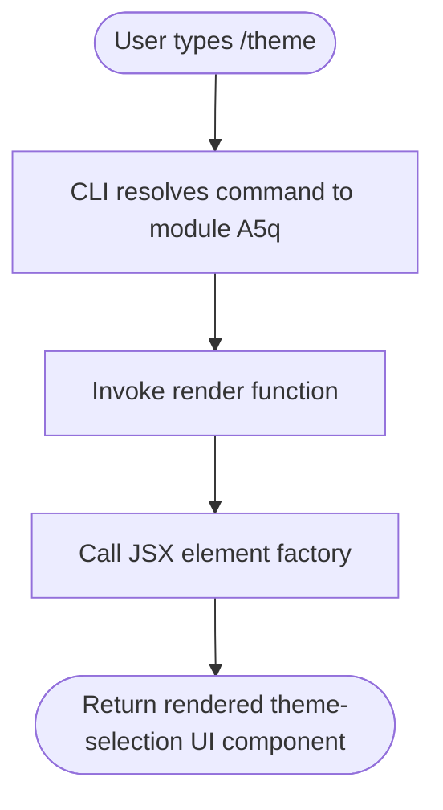

# `/theme`

> Analysis basis: CC v2.1.132 bundle.js (AST extraction + Claude interpretation)
> Minimum version: v2.1.132

---

## Overview

The `/theme` command allows the user to change the visual theme of the Claude Code CLI interface. It is implemented as a local JSX command, meaning its output is rendered directly as a React element tree within the terminal UI rather than returning plain text. The command's core mechanism delegates to a JSX component that presents theme selection controls to the user.

## Registration

| Field | Value |
|---|---|
| type | `local-jsx` |
| name | `theme` |
| description | `Change the theme` |
| module_id | `A5q` |

Analysis basis: CC v2.1.132 bundle.js:+11072126

## Input Branching

The depth-2 AST traversal captured a single call edge from the command's render function to a JSX element factory. No additional branching literals or conditional paths were found at this traversal depth.



Analysis basis: CC v2.1.132 bundle.js:+11071973 (call edge to JSX factory), +11072126 (registration)

<!-- TODO: not found in depth-2 traversal; needs --depth 4 -->
> **Note:** The internal logic of the rendered theme-selection component (e.g., available theme names, selection mechanism, keyboard navigation, persistence strategy) was not reachable within the depth-2 call graph. A deeper traversal of module `A5q` is required to fully characterize those paths.

## Behavioral Spec

### Theme Command Render Function

The command's top-level handler is a render function. When invoked by the CLI slash-command dispatcher, it constructs and returns a JSX element. No arguments from the command invocation line were observed being consumed at this traversal depth.

```
function renderThemeCommand(parsedInput):
    element = createJSXElement(ThemeSelectionComponent, props={})
    return element
```

Analysis basis: CC v2.1.132 bundle.js:+11071973

### Command Dispatch Integration

The command is registered under the `local-jsx` type, which instructs the CLI dispatcher to treat the return value of the render function as a React element to be mounted inline within the active terminal session, rather than streamed as text output.

```
function dispatchLocalJSX(command, parsedInput):
    if command.type == "local-jsx":
        element = command.renderFunction(parsedInput)
        mountInlineComponent(element)
    else:
        // other command types handled separately
```

Analysis basis: CC v2.1.132 bundle.js:+11072126 (type field: `local-jsx`)

## State & Side Effects

| Item | Detail |
|---|---|
| Telemetry | None detected at depth-2 traversal <!-- TODO: not found in depth-2 traversal; needs --depth 4 --> |
| Hook registration | <!-- TODO: not found in depth-2 traversal; needs --depth 4 --> |
| appState changes | <!-- TODO: not found in depth-2 traversal; needs --depth 4 --> |
| Sound | <!-- TODO: not found in depth-2 traversal; needs --depth 4 --> |
| Persistence | <!-- TODO: not found in depth-2 traversal; needs --depth 4 --> |

> **Note:** No `tengu_*` telemetry events were found associated with this command within the depth-2 traversal. It is possible that telemetry is emitted from within the theme-selection component itself, which was not reached.

## Version History

| Version | Change |
|---|---|
| v2.1.132 | Initial analysis — command registered as `local-jsx`, render delegates to JSX element factory |

## Common Mistakes

1. **Expecting plain-text output:** Because `/theme` is a `local-jsx` command, it renders an interactive UI component inline. Users should not expect a simple text confirmation; instead, a theme-selection interface will appear in the terminal.
2. **Passing arguments on the command line:** No argument-parsing literals were found at depth-2. Providing arguments after `/theme` may have no effect or may be silently ignored; verify behavior with a deeper traversal before documenting argument support.
3. **Assuming telemetry parity with other commands:** Unlike some CLI commands that emit `tengu_*` events, no telemetry was detected for `/theme` at this analysis depth. Do not assume usage is tracked the same way as other slash commands without a deeper bundle inspection.

## Appendix — Identifier Mapping

> For bundle debugging only. Identifiers change across versions.

| Identifier | Role |
|---|---|
| `f$7` | Theme command render function — top-level handler invoked by the slash-command dispatcher; calls the JSX element factory to produce the theme-selection component |