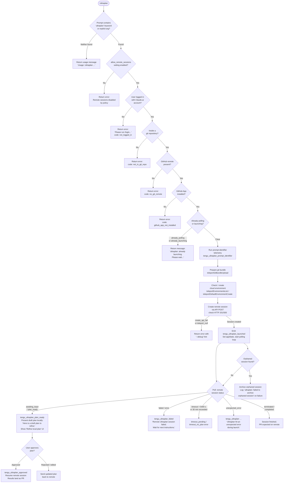

# `/ultraplan`

> Analysis basis: CC v2.1.139 bundle.js (AST extraction + Claude interpretation)
> Minimum version: v2.1.139

---

## Overview

`/ultraplan` launches a remote Claude Code web session (via the "teleport" subsystem) that drafts a structured plan for the given prompt, then presents the plan locally for user review and approval before proceeding. The command orchestrates eligibility checks, git-bundle preparation, remote session creation, long-poll monitoring, and local state updates; the result is ultimately delivered as a pull request once the remote session completes. It requires a Claude.ai account login (not an API key) and an active GitHub remote with the GitHub App installed.

---

## Registration

| Field | Value |
|---|---|
| type | `local-jsx` |
| name | `ultraplan` |
| description | `… · Claude Code on the web drafts a plan you can edit and approve. See …` |
| argumentHint | `<prompt>` |
| load_inline | `true` |
| load_ident | `DP7` |
| loc_byte | `11069595` |
| loc_byte_end | `11069839` |
| loc_line | `6683` |
| arbor_handler.name | `DP7` |
| arbor_handler.fqn | `claude-2.1.139::DP7` |
| arbor_handler.kind | `AsyncFunction` |
| arbor_handler.resolution_path | `load_ident` |
| arbor_handler.n_hits | `1` |

Analysis basis: CC v2.1.139 bundle.js:+11069595

The handler is inlined via a `load:()=>Promise.resolve({call: DP7})` shape; Arbor confirmed the single resolution hit at `load_ident` path.

---

## Input Branching

The command exhibits more than three distinct execution branches (pre-condition failures, duplicate-launch guard, prompt extraction, remote session outcomes), so a Mermaid flowchart is used.



Analysis basis: CC v2.1.139 bundle.js:+11067750, +11065264, +11065282, +11063876, +11065328, +11065394, +11066409, +11066427, +11051533, +11060686

---

## Behavioral Spec

### 1. Handler Entry — `ultraplanHandler` (DP7)

```
async function ultraplanHandler(context):
    rawPrompt = extractPromptText(context)          // $w8
    
    // Eligibility gate
    eligibilityResult = checkRemoteEligibility(context)  // Cq → kHq → ay_
    if eligibilityResult.blocked:
        return eligibilityResult.errorMessage

    // Duplicate-launch guard
    currentState = context.getAppState()
    if currentState includes "already_polling" or "already_launching":
        return "ultraplan: already launching. Please wait for the session to start."

    // Kick off remote session lifecycle
    sessionResult = launchUltraplanSession(rawPrompt, context)  // b26

    // Update appState
    context.setAppState(sessionResult.newState)
    
    // Orchestrate polling
    pollResult = pollUltraplanSession(sessionResult.sessionId)   // arH → lk, kR, iTH

    return pollResult
```

Analysis basis: CC v2.1.139 bundle.js:+11067750, +11067768, +11067803, +11067878, +11068074, +11068191, +11068229, +11068263, +11068292

---

### 2. Prompt Extraction — `extractPromptText` ($w8 → Mw8 → y$q)

```
function extractPromptText(rawInput):
    // Scan rawInput for the literal "ultraplan" (case-insensitive, global regex)
    // regex flags: "gi"  (bundle.js:+11053360)
    matches = rawInput.matchAll(/ultraplan/gi)

    if no match found at position 0:
        // Attempt slice after command name
        candidate = rawInput.slice(...)     // H.slice at +11053859
        candidate = candidate.replace(...)  // A.replace with "$1$2" at +11053956, limit 5 at +11053979

    // Normalize whitespace via replace pattern "$1$2"
    // Push normalized segments to queue
    return normalizedPromptString
```

Analysis basis: CC v2.1.139 bundle.js:+11053360, +11053368, +11053712, +11053859, +11053930, +11053956, +11053979

---

### 3. Eligibility Check — `checkRemoteEligibility` (Cq → kHq → ay_ → em / vHq)

```
function checkRemoteEligibility(context):
    // Check feature flags
    featureSet = loadFeatureFlags()         // em: firstParty, enterprise, team
    if featureSet does not include required tier:
        return blocked(reason)

    // Check allow_remote_sessions setting  (+11067771)
    if settings.allow_remote_sessions == false:
        return blocked("policy_blocked")

    // Check allow_product_feedback  (+9878217)
    if fK7.has("allow_product_feedback") == false:
        return blocked(reason)

    // Check authentication: must be Claude.ai account, not API key
    tokenStatus = readAccessToken()         // vHq → VHq.readFileSync (utf-8 at +9876831)
    if not tokenStatus.valid:
        return blocked("not_logged_in",
            "Please run /login and sign in with your Claude.ai account (not Console).")

    // Check git repo
    if not inGitRepo():
        return blocked("not_in_git_repo")

    // Check GitHub remote
    remoteUrl = getRemoteOriginUrl()        // lk: git config --get remote.origin.url
    if not remoteUrl:
        return blocked("no_git_remote",
            "Background tasks require a GitHub remote. Add one with `git remote add origin REPO_URL`.")

    // Check GitHub App installation
    appInstalled = checkGithubAppInstalled()  // iTH → I8.get
    if not appInstalled:
        return blocked("github_app_not_installed")

    return eligible()
```

Analysis basis: CC v2.1.139 bundle.js:+9874655, +9874941, +9874976, +11067771, +9878217, +7905028, +7905050, +7905129, +7905267, +7905289, +7905384, +7905538, +7905561

---

### 4. Remote Session Launch — `launchUltraplanSession` (b26 → zP7 → n1H / vcH)

```
async function launchUltraplanSession(prompt, context):
    // 1. Upload git bundle (seed the remote with repo state)
    bundleResult = teleportGitBundleUpload(context)    // q0_ → refs/seed/stash, refs/seed/root
    //   strategies tried: head, fallback_head, squashed, fallback_squashed (+7882605–+7882722)

    // 2. Resolve or create cloud environment
    envList = teleportEnvironmentsList()               // il → I8.get (+6510049)
    if envList empty or default not found:
        env = teleportDefaultEnvironmentCreate()       // cgH → I8.post (+6510612)
        // Default env: anthropic_cloud, python 3.11, node 20

    // 3. Create remote session via API
    response = I8.post(sessionEndpoint, {
        prompt: prompt,
        environment: env.id,
        beta: "ccr-byoc-2025-07-29",          // +7895822
        orgUUID: orgUUID,                      // x-organization-uuid header
        bundleRef: bundleResult.ref,
        mode: "system"                         // +11067843
    })

    if response.status != 201:                 // +7897151
        if response.status == 500:
            return error("create_api_fail")    // +11066409
        if session null:
            return error("teleport_null")      // +11066427

    // 4. Emit launch telemetry
    emit("tengu_ultraplan_launched")           // +11066720

    return { sessionId: response.session.id, state: "pending" }
```

Analysis basis: CC v2.1.139 bundle.js:+11065012, +11065201, +11065304, +11065417, +11065531, +7897057, +7897151, +11066409, +11066427, +11066720, +7895822, +7895844, +11067843

---

### 5. Git Bundle Preparation — `teleportGitBundleUpload` (q0_)

```
async function teleportGitBundleUpload(context):
    if not inGitRepo():
        throw Error("Not in a git repository")   // +7880866

    // Check for any existing refs
    refCount = git("for-each-ref", "--count=1", "refs/")   // +7881008, +7881023, +7881035
    if refCount == 0:
        throw Error("Repository has no commits yet")        // +7881212

    // Create stash bundle
    git("stash", "create")                        // +7881290, +7881298
    bundleFile = "ccr-seed.bundle"                // +7881944

    // Attempt upload strategies in order:
    //   head → fallback_head → squashed → fallback_squashed
    for strategy in [head, fallback_head, squashed, fallback_squashed]:
        result = tryUploadBundle(bundleFile, strategy)
        if result.status == 200:                  // +7881469
            emit("tengu_ccr_bundle_upload")
            return { ref: result.ref, strategy: strategy }

    // Fallback: explicit env bundle or source URL
    emit("tengu_teleport_bundle_mode")
    return { ref: null, strategy: "no_git_at_all" }
```

Analysis basis: CC v2.1.139 bundle.js:+7880866, +7881008, +7881212, +7881944, +7881469, +7882605, +7882644, +7882679, +7882722, +7899507

---

### 6. Polling Loop — `pollUltraplanSession` (fP7 → I$q → HP7 → LP7)

```
async function pollUltraplanSession(sessionId):
    timeoutMs = 5400 * 1000    // 5400 seconds (+11060686)
    startTime = Date.now()

    loop:
        if Date.now() - startTime > timeoutMs:
            emit("tengu_ultraplan_timeout_seconds")
            return error("timeout_pending" or "timeout_no_plan")

        taskNotification = waitForTaskNotification("task-notification")  // +11066029
        status = fetchSessionStatus(sessionId)   // ZN → Wq4/Pq4/Gq4/Tq4

        switch status:
            case "plan_ready" | "awaiting_input" | "needs_input":
                emit("tengu_ultraplan_plan_ready")    // +11061364
                emit("tengu_ultraplan_awaiting_input")// +11061296
                draftPlan = extractPlanFromSession()
                // Build prompt prefix: "Here is a draft plan to refine:" (+11060993)
                displayPlanForReview(draftPlan, "Refine local plan")   // +11066173

                userDecision = waitForUserApproval()

                if userDecision == "approved":        // +11051155
                    emit("tengu_ultraplan_approved")  // +11061772
                    resumeRemoteSession(sessionId)
                    // "Results will land as a pull request when the remote session finishes."
                    //   (+11062258)
                    return success()
                else:
                    sendUpdatedPlanToRemote(userDecision.editedPlan)
                    continue

            case "failed" | "error":
                emit("tengu_ultraplan_failed")        // +11062645
                return error("Remote Ultraplan session failed. Wait for the user's next instructions.")
                //   (+11063052)

            case "terminated":
                return terminated()

            case "completed":
                return completed()

            case "requires_action":
                // handled same as plan_ready branch

            default:
                // "running" / "starting" — sleep and retry
                sleep(pollingInterval)
                continue
```

Analysis basis: CC v2.1.139 bundle.js:+11060686, +11061296, +11061364, +11060993, +11061772, +11062258, +11062645, +11063052, +11051155, +11051342, +11051481, +11051533

---

### 7. Session Monitoring — `remoteSessionMonitor` (vcH → Mv1)

```
async function remoteSessionMonitor(sessionId):
    // Generate random session token (uEq.randomBytes, 8 bytes) (+12017494, +12017478)
    token = randomBytes(8)

    // Open remote_agent connection (+7908608)
    connection = openRemoteAgentConnection(sessionId, token)  // K78 → Vi.open

    pollInterval = 1000          // 1 second  (+7910196)
    maxDuration  = 1800000       // 30 minutes (+7910203)

    while connection.isOpen:
        if elapsed > maxDuration:
            return error("remote session exceeded 30 minutes")  // +7912766

        event = readNextEvent(connection)

        switch event.type:
            case "hook_progress":   handleHookProgress(event)   // +7911337
            case "hook_response":   handleHookResponse(event)   // +7911366
            case "hook_started":    handleHookStarted(event)    // +7911857
            case "SessionStart":    markSessionStarted(event)   // +7911947
            case "result":          finalizeResult(event)       // +7911154
            case "idle":            markIdle()                  // +7911773
            case "starting":        markStarting()              // +7912174
            default:
                if event is error:
                    return error("remote session returned an error")  // +7912725

    if no review output found:
        return error("no review output — orchestrator may have exited early")  // +7912803
```

Analysis basis: CC v2.1.139 bundle.js:+7908608, +7910196, +7910203, +7912725, +7912766, +7912803, +12017478, +12017494

---

### 8. Post-Launch Orphan Cleanup — inside `ultraplanHandler` (DP7)

```
function archiveOrphanedSession(context):
    // After new session is created, scan appState for any prior session
    // that is no longer active and archive it via the remote API.
    try:
        archiveSession(orphanedSessionId)
    catch err:
        log.warn("ultraplan: failed to archive orphaned session")  // +11067435
```

Analysis basis: CC v2.1.139 bundle.js:+11067435

---

### 9. Eligibility Pre-check Wrapper — `bgRemoteEligibilityCheck` (XM1)

```
async function bgRemoteEligibilityCheck(context):
    // Aggregates multiple async checks via Promise.all  (+6513787)
    results = await Promise.all([
        checkBYOC(),           // "byoc" flag  (+6514025)
        checkGithubDomain(),   // "github.com" check (+6514313)
        checkSeedBundle()      // tengu_ccr_bundle_seed_enabled (+6514117)
    ])
    emit("bg_remote_eligibility_check")    // +6513722
    return mergedEligibility(results)
```

Analysis basis: CC v2.1.139 bundle.js:+6513652, +6513722, +6513787, +6514025, +6514117, +6514313

---

## State & Side Effects

| Item | Detail |
|---|---|
| Telemetry — ultraplan-specific | `tengu_ultraplan_prompt_identifier` (+11060819), `tengu_ultraplan_create_failed` (+11065049), `tengu_ultraplan_launched` (+11066720), `tengu_ultraplan_awaiting_input` (+11061296), `tengu_ultraplan_plan_ready` (+11061364), `tengu_ultraplan_approved` (+11061772), `tengu_ultraplan_failed` (+11062645), `tengu_ultraplan_timeout_seconds` (+11060652) |
| Telemetry — remote/teleport infra | `tengu_slate_kestrel` (+9874855), `tengu_ccr_bundle_seed_enabled` (+6514117), `tengu_ccr_bundle_upload` (+7881098), `tengu_teleport_bundle_mode` (+7896224), `tengu_ccr_session_link` (+7890636), `tengu_teleport_bundle_mode`, `tengu_teleport_source_decision` (+7901132), `tengu_teleport_generate_title` (+7884275), `tengu_config_parse_error` (+3135421) |
| Telemetry — background daemon | `tengu_bg_dispatch_sigkill_escalate` (+14310587), `tengu_bg_low_mem_mb` (+14309754), `tengu_bg_dispatch_low_mem` (+14311166), `tengu_bg_spare_enable` (+14311781), `tengu_bg_sendclaim_failed` (+14292516), `tengu_bg_spare_claim` (+14311902), `tengu_bg_spare_spawn` (+14310364), `tengu_bg_spare_claim_fail` (+14312165), `tengu_feature_bad` (+943693), `tengu_feature_ok` (+943635) |
| `appState` reads | `_.getAppState()` called at +11068074 to check for `already_polling` / `already_launching` guards |
| `appState` writes | `_.setAppState()` called at +11068292 to record session launch state; session status updated via `f.update` (+11061597) |
| File system | Reads config via `q.readFileSync` (utf-8); writes git bundle to temp file (`ccr-seed.bundle`); performs `unlinkSync` / `IcH.unlink` for cleanup; uses `mkdirSync`, `readdirStringSync`, `copyFileSync` for bundle staging; `tl6.watchFile` / `tl6.unwatchFile` for config watching |
| Network | HTTP POST to create session (+7897057); HTTP GET to list environments (+6510049); HTTP POST to create default environment (+6510612); uses `anthropic-beta: ccr-byoc-2025-07-29` header; `anthropic-version: 2023-06-01`; requires `x-organization-uuid` header |
| Git operations | `git for-each-ref`, `git stash create`, `git rev-parse --verify HEAD`, `git update-ref -d`, `git symbolic-ref --short refs/remotes/origin/HEAD`, `git show-ref --quiet`, `git config --get remote.origin.url` |
| Background daemon | Spawns/claims spare background workers via `Ip.spawn` / `Ip.claim`; manages socket connections (`r08.connect`); SIGTERM/SIGKILL escalation paths present |
| Random UUID | `L0_.randomUUID()` used for task/session identity (+7894656) |
| Crypto | `uEq.randomBytes(8)` for remote agent session token (+12017478) |
| Timeout | Polling hard-limit: 5400 seconds (90 minutes) (+11060686); remote session monitor hard-limit: 1800000 ms (30 minutes) (+7910203); task notification retry: 15000 ms (+6510129); API retry delay: 1500 ms (+11067061) |

---

## Version History

| Version | Change |
|---|---|
| v2.1.139 | Initial analysis |

---

## Common Mistakes

1. **Using an API key instead of a Claude.ai account**: `/ultraplan` explicitly requires OAuth login via `/login` with a Claude.ai account. API key authentication returns `not_logged_in` and the error message "Please run /login and sign in with your Claude.ai account (not Console)." (bundle.js:+7905050).
2. **Running outside a git repository**: The command requires both a local git repo and a GitHub remote with the GitHub App installed. Missing either produces distinct error codes (`not_in_git_repo`, `no_git_remote`, `github_app_not_installed`).
3. **Invoking while a session is already starting**: If a prior `/ultraplan` invocation is still in the `already_polling` or `already_launching` state the command returns immediately with "ultraplan: already launching. Please wait for the session to start." (bundle.js:+11063876). Wait for the prior session to complete or time out.
4. **Organization policy blocking remote sessions**: If `allow_remote_sessions` is disabled at the organization level the command returns `policy_blocked` — "Remote sessions are disabled by your organization's policy. Contact your organization admin to enable them." (bundle.js:+7905561). This cannot be overridden client-side.
5. **Empty git repository**: Repositories with no commits cause the bundle-upload step to fail with "Repository has no commits yet". Run `git add . && git commit -m "initial"` first (bundle.js:+7881212, +7900569).
6. **No cloud environment available**: If environment listing returns empty and auto-creation also fails the command surfaces a link to `https://claude.ai/code/onboarding?magic=env-setup` (bundle.js:+7897795). Manual environment setup is required before retrying.

---

## Appendix — Identifier Mapping

> For bundle debugging only. Identifiers change across versions.

| Identifier | Role |
|---|---|
| `DP7` | Main async handler for `/ultraplan` (`ultraplanHandler`) |
| `$w8` | Outer prompt-extraction wrapper |
| `Mw8` | Inner prompt-normalization function |
| `y$q` | Regex-based prompt scanner (uses `H.startsWith`, `H.matchAll`) |
| `H` | Raw input string / general string variable (context-dependent) |
| `f` | WebSocket / stream handle (context-dependent; also used for `.close`, `.map`, `.find`) |
| `q` | Filesystem / queue collection (context-dependent; `unlinkSync`, `push`, `add`) |
| `M` | Message/event queue with `.push` |
| `A` | Lowercase-normalizer string / array (`.replace`, `.push`, `.values`) |
| `Cq` | Eligibility/feature-flag resolver |
| `kHq` | Feature-flag loader called by `Cq` |
| `ay_` | Token + config reader entry point |
| `em` | Tier checker (firstParty / enterprise / team) |
| `vHq` | Access-token file reader (utf-8 `readFileSync`) |
| `S1` | Settings accessor |
| `G7A` | Settings helper using `SH` |
| `SH` | String coercion / serialisation helper |
| `fWH` | Fallback string helper using `SH` |
| `NzH` | Notification/UI helper |
| `b26` | Session-launch orchestrator |
| `Q` | General async/promise utility |
| `L` | Async task wrapper with `.add`/`.delete`/`.finally` |
| `m$q` | UI message emitter |
| `Dw8` | Session-identifier builder |
| `zw8` | Prompt-identifier emitter (fires `tengu_ultraplan_prompt_identifier`) |
| `j6` | Feature-flag gate with `ZB`/`gfH` registry |
| `AP7` | Auxiliary prompt processor |
| `zP7` | Full remote-session creation pipeline |
| `VZH` | Pre-condition evaluator wrapping `XM1` |
| `XM1` | `bgRemoteEligibilityCheck` — parallel eligibility checks |
| `Q5` | Queue-operation event emitter (`later`/`enqueue`) |
| `G3H` | Event emitter using `np9.emit` + `Object.freeze` |
| `p0H` | Queue-operation state machine (`V6`, `U4_`) |
| `LP7` | Plan-prefix assembler ("Here is a draft plan to refine:") |
| `KP7` | Plan-segment helper (`_P7`) |
| `n1H` | `teleportToRemote` — main remote session API caller |
| `C6` | Context/environment resolver (`ry6`, `A_`) |
| `D7` | String diff / delta helper (`$H_`) |
| `O0_` | Permission-mode checker (`kA`, `SH`, `Do`) |
| `LH` | Error logger (`q_`, `SH`, `S1`, `CGK`, `Jd.logError`) |
| `Vv` | Session token / auth helper (`b6`, `kA`, `cT`, `zo`) |
| `GA` | Environment URL validator (local/staging/prod, OAUTH check) |
| `ZM` | HTTP response parser (`e_H`) |
| `q0_` | `teleportGitBundleUpload` — git bundle packager and uploader |
| `V6` | Queue-operation state entry |
| `lk` | Git remote URL resolver (`git config --get remote.origin.url`) |
| `Kv1` | Task record builder with `randomUUID` |
| `N` | Log-level resolver (debug/warn/error normalisation) |
| `yH` | JSON serialiser (`JSON.stringify`) |
| `f0_` | Session-link helper (`tengu_ccr_session_link`) |
| `il` | `teleportEnvironmentsList` — GET environment list |
| `cgH` | `teleportDefaultEnvironmentCreate` — POST default environment |
| `IH` | String-to-string coercer (`String`) |
| `lb4` | Task-description generator (title/branch via `teleport_generate_title`) |
| `kR` | Feature-flag check with boolean result (`L46`, `M46`, `Ya`, `b6`) |
| `iTH` | `checkGithubAppInstalled` — GET GitHub App status |
| `UZ` | Default-branch resolver (`git symbolic-ref`, main/master fallback) |
| `Tq` | UI component renderer (`Xo`, `Kq`, `IJ`) |
| `q_` | Error-to-string normaliser |
| `xD` | Environment URL builder (localhost / staging / prod) |
| `t_` | Module loader / ES-module shim |
| `V7_` | URL variant selector (`Tf6`, `ulL`) |
| `$P7` | Session state serialiser |
| `vcH` | `remoteSessionMonitor` — WebSocket event loop |
| `Xh` | Random-bytes generator (`uEq.randomBytes`) |
| `K78` | Remote agent socket opener (`Vi.open`) |
| `v2` | Timestamp/session health tracker (`Date.now`, `y3`) |
| `Hx4` | Session-status formatter (`J0_`, `N`, `String`) |
| `Mv1` | Remote session event processor (hook/result/idle/SessionStart) |
| `ZN` | Task polling manager (`Wq4`, `Pq4`, `Gq4`, `Tq4`) |
| `Wq4` | Polling handler variant A (`retain`, `task_started`) |
| `Pq4` | Polling handler variant B (`task_updated`) |
| `RO_` | Polling retry/back-off helper |
| `Gq4` | Polling handler variant C (date-based) |
| `Tq4` | Polling handler variant D (key-based) |
| `fP7` | Ultraplan polling loop coordinator |
| `I$q` | Low-level session-status ingester (`L.ingest`) |
| `HP7` | Pre-poll feature-flag check (`j6`) |
| `OP7` | Poll-result handler |
| `cY6` | Session cleanup (`RU_`, `zL.unlink`, `T1`) |
| `K` | Column/table formatter (`L.map`, `f.padEnd`) |
| `Vg` | Session-creation POST with conflict handling (HTTP 409) |
| `C9` | App-state set/delete wrapper (`$Z8`, `Object.assign`) |
| `y8K` | App-state key validator |
| `MP7` | Post-launch result handler |
| `b6` | Config file loader (`cfH`, `pVL`, `Date.now`) |
| `B6` | Config path resolver |
| `U8_` | Config schema validator |
| `cfH` | Config file reader (readFileSync, mkdirSync, copyFileSync, backup logic) |
| `U6` | JSON parser wrapper (`JSON.parse`) |
| `cS` | Config-key prefix stripper (`H.startsWith`, `H.slice`) |
| `w8` | Config write helper |
| `Z09` | Config directory scanner (`readdirStringSync`, `Rz.join`, `Rz.dirname`) |
| `l8_` | Config path joiner (`Rz.join`, `i8`) |
| `$` | General-purpose utility / map lookup (`NXq`) |
| `w` | Background daemon worker manager (`A.get`, `S.kill`, `Ip.spawn`) |
| `S` | Worker state machine (blurred/focused, `Date.now`, `Math.min`) |
| `xH` | Feature-check "ok" emitter (`tengu_feature_ok`) |
| `kH` | Feature-check "bad" emitter (`tengu_feature_bad`) |
| `ul_` | Low-memory detector (macOS `s08.freemem`, 1024-block) |
| `b` | Worker I/O handler (`clearTimeout`, `$.write`) |
| `Sl_` | Daemon socket claim+connect (`Ip.claim`, `r08.connect`, SIGTERM) |
| `ml_` | Background-session lifecycle manager (done/killed/stopped/blocked/crashed/working/active) |
| `Y` | Worker idle/dispose cycle (`j6`, `$.dispose`, `ul_`, `Date.now`) |
| `u` | Worker handle with `.dispose`, `.lastIndexOf`, `.slice` |
| `pVL` | Config file watcher (`tl6.watchFile`, `tl6.unwatchFile`, `C9`) |
| `Xc` | Config-change notifier |
| `arH` | Parallel eligibility resolver (`Promise.all`, `lk`, `kR`, `XL`, `iTH`) |

---

Note: index built via Arbor fallback; some signals (telemetry, literals) may be missing — see arbor-fallback.js.