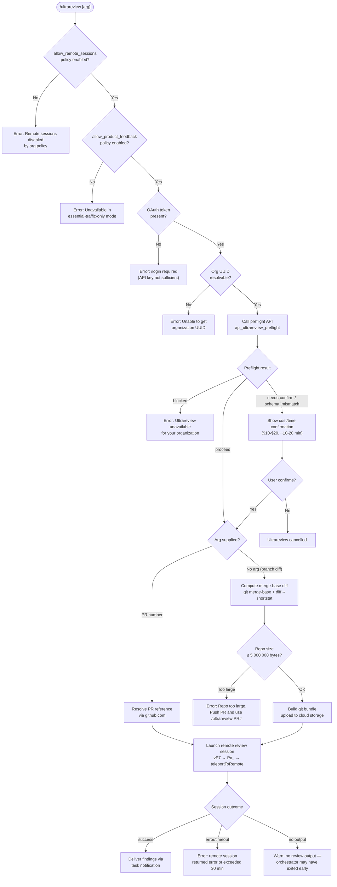

# `/ultrareview`

> Analysis basis: CC v2.1.139 bundle.js (AST extraction + Claude interpretation)
> Minimum version: v2.1.139

---

## Overview

`/ultrareview` launches a remote bug-finding review session that runs inside **Claude Code on the web**. Given the current git branch (or an explicit PR number), it packages and uploads the repository to a cloud environment, then executes an autonomous review agent that finds and verifies bugs. Results are delivered back to the local session via task notification; the estimated cost is in the range of `$10–$20` USD and runtime is approximately `~10–20 min`.

---

## Registration

| Field | Value |
|---|---|
| type | `local-jsx` |
| name | `ultrareview` |
| description | `" ... · Est. cost ... USD · Finds and verifies bugs in your branch. Runs in Claude Code on the web. See ..."` |
| loc_byte | `11080746` |
| loc_byte_end | `11081005` |
| loc_line | `6708` |
| module_id | `Q$q` |
| load_inline | `true` |
| arbor_handler.name | `NP7` |
| arbor_handler.fqn | `claude-2.1.139::NP7` |
| arbor_handler.kind | `AsyncFunction` |
| arbor_handler.resolution_path | `module_id` |
| arbor_handler.n_hits | `1` |

Analysis basis: CC v2.1.139 bundle.js:+11080746

---

## Input Branching

The command involves more than three distinct decision branches (policy checks, authentication checks, preflight API results, repo-size limits, PR vs. branch mode, overage gating, and confirmation flow), so a Mermaid flowchart is used.



Analysis basis: CC v2.1.139 bundle.js:+11078533 (handler entry `NP7`)

---

## Behavioral Spec

### 1. Policy and Authentication Pre-checks

```
async function ultrareviewHandler(arg):
    // Check remote-session org policy
    if not featureFlag("allow_remote_sessions"):
        display("Remote sessions are disabled by your organization's policy. Contact your organization admin to enable them.")
        emit telemetry: tengu_review_remote_precondition_failed
        return

    // Check essential-traffic-only mode blocks product features
    if not featureFlag("allow_product_feedback"):
        display("Ultrareview runs in Claude Code on the web and is unavailable when essential-traffic-only mode is active.")
        return

    // Require Claude.ai OAuth token — API key alone is insufficient
    oauthToken = getOAuthToken()
    if oauthToken is null:
        display("Ultrareview requires a Claude.ai account. Run /login to authenticate.")
        return

    // Resolve organization UUID
    orgUUID = resolveOrgUUID()
    if orgUUID is null:
        display("Unable to get organization UUID")
        return
```

Analysis basis: CC v2.1.139 bundle.js:+11078533, +11078536, +11078568, +11078570

### 2. Preflight API Call

```
async function ultrareviewPreflight(orgUUID, oauthToken):
    // POST to preflight endpoint with x-organization-uuid header
    // Timeout: 5000 ms
    response = await apiPost(
        endpoint = "api_ultrareview_preflight",
        headers  = { "x-organization-uuid": orgUUID },
        timeout  = 5000
    )

    status = response.status  // one of: "proceed", "blocked", "needs-confirm", "server", "schema_mismatch", "request_failed"

    if status == "blocked":
        display("Ultrareview is unavailable for your organization.")
        emit telemetry: tengu_review_remote_precondition_failed
        return ABORT

    if status in ["needs-confirm", "schema_mismatch"]:
        return NEEDS_CONFIRM

    if status == "proceed":
        return PROCEED

    // server / request_failed: surface error and abort
    return ABORT
```

Analysis basis: CC v2.1.139 bundle.js:+11039872, +11039900, +11040061, +11043127, +11043307, +11043345

### 3. Cost Confirmation Dialog

When the preflight returns `needs-confirm`, the command shows a confirmation dialog before proceeding. The estimated cost range is `$10–$20` and expected runtime is `~10–20 min`.

```
function showConfirmationDialog():
    emit telemetry: tengu_review_overage_dialog_shown
    present interactive prompt:
        - display cost estimate:  "$10-$20"
        - display time estimate:  "~10–20 min"
        - ask user to confirm or cancel

    if user cancels:
        display("Ultrareview cancelled.")
        return ABORT
    return PROCEED
```

Analysis basis: CC v2.1.139 bundle.js:+11038799, +11038891, +11079170, +11079475

### 4. Input Resolution: PR Number vs. Branch Diff

```
function resolveReviewTarget(rawArg):
    trimmed = rawArg.trim()

    if trimmed matches a PR number pattern:
        // Numeric argument treated as PR reference
        // Validates against github.com remote
        return { mode: "pr", ref: trimmed }

    // No argument: compute branch diff from merge-base
    mergeBase = git("merge-base", defaultBranch, "HEAD")
    diffStat   = git("diff", "--shortstat", mergeBase)
    return { mode: "branch", mergeBase: mergeBase, stat: diffStat }
```

Analysis basis: CC v2.1.139 bundle.js:+11041536, +11041591, +11042141, +11042162, +11042196, +11042711, +11042718

### 5. Repository Size Guard

```
function checkRepoSize(repoPath):
    // Run: git count-objects -v
    result = git("count-objects", "-v")
    sizeKB = parseCountObjectsSize(result)
    sizeBytes = sizeKB * 1024

    emit telemetry: tengu_ccr_bundle_max_bytes  // records size

    MAX_BYTES = 5_000_000  // 5 MB limit
    if sizeBytes > MAX_BYTES:
        display("Repo is too large to bundle. Push a PR and use `/ultrareview <PR#>` instead.")
        return TOO_LARGE

    return OK
```

Maximum bundled repository size: **5,000,000 bytes** (5 MB).
Analysis basis: CC v2.1.139 bundle.js:+7877806, +7877822, +7878247, +11041665

### 6. Git Bundle Upload (teleportGitBundleUpload)

```
async function teleportGitBundleUpload(repoPath, sessionInfo):
    emit telemetry: teleport_git_bundle_upload

    // Verify repo has commits
    refCount = git("for-each-ref", "--count=1", "refs/")
    if refCount == 0:
        return { status: "empty_repo", error: "Repository has no commits yet" }

    // Attempt HEAD bundle (preferred)
    bundleName = "ccr-seed" + ".bundle"
    success = tryCreateBundle(repoPath, "head")

    if not success:
        // Fallback: squashed bundle
        success = tryCreateBundle(repoPath, "squashed")
        mode = "fallback_squashed"
    else:
        mode = "head"

    if not success:
        return { status: "stash_failed" }

    // Upload bundle bytes to cloud storage
    uploadResult = await uploadBundle(bundleName)
    if uploadResult.failed:
        emit telemetry: tengu_ccr_bundle_upload (status="upload_failed")
        return { status: "upload_failed" }

    emit telemetry: tengu_ccr_bundle_upload (status="success", mode=mode)
    return { status: "success" }
```

Analysis basis: CC v2.1.139 bundle.js:+7880805, +7880834, +7881290, +7881944, +7882349, +7882392, +7882541

### 7. Remote Session Launch and Monitoring (teleportToRemote / vcH)

```
async function launchRemoteSession(sessionParams):
    sessionId = randomUUID()
    startTime = Date.now()
    MAX_DURATION_MS = 1_800_000   // 30 minutes

    // POST session creation request
    response = await apiPost("remote_agent", sessionParams)
    // Expected status 201 (created)
    if response.status != 201:
        throw Error("Server returned a malformed session response (no session id)")

    // Poll / stream session events
    while true:
        elapsed = Date.now() - startTime
        if elapsed > MAX_DURATION_MS:
            throw Error("remote session exceeded 30 minutes")

        event = await pollSessionEvent(sessionId)

        switch event.type:
            case "running":
                updateLocalUI(event)
            case "hook_progress":
                forwardProgressToUser(event)
            case "hook_response":
                handleHookResponse(event)
            case "completed":
                result = extractResult(event)
                if result is empty:
                    warn("no review output — orchestrator may have exited early")
                return result
            case "archived":
                return archiveResult(event)
            case "error":
                throw Error("remote session returned an error")
```

Maximum remote session duration: **1,800,000 ms (30 minutes)**.
Analysis basis: CC v2.1.139 bundle.js:+7908605, +7910203, +7912725, +7912766, +7912803

### 8. Post-Launch Local Acknowledgement

After dispatching the remote session, the local CLI displays a brief acknowledgement. The instruction to the local model is to confirm the launch without repeating the target URL or billing note, since findings will arrive via task notification.

Analysis basis: CC v2.1.139 bundle.js:+11078196

### 9. Overage / Billing Block

```
function checkBillingOverage(userContext):
    // Checks subscription tier: max, pro, admin, billing, owner, primary_owner
    // Subscription types: stripe_subscription, stripe_subscription_contracted,
    //                     apple_subscription, google_play_subscription
    if usageExceedsLimit(userContext):
        emit telemetry: tengu_review_overage_blocked
        display overage error with link to /admin-settings/
        return BLOCKED
    return OK
```

Analysis basis: CC v2.1.139 bundle.js:+11078835, +11078957, +11078978, +2003764

### 10. BYOC (Bring-Your-Own-Cloud) Detection

When the session is routed through a BYOC environment, the header `anthropic-beta: ccr-byoc-2025-07-29` is attached to the session creation request.

Analysis basis: CC v2.1.139 bundle.js:+7895805, +7895822

### 11. GitHub App Installation Check (iTH / checkGithubAppInstalled)

```
function checkGithubAppInstalled(accessToken, orgUUID):
    if accessToken is null:
        log("checkGithubAppInstalled: No access token found, assuming app not installed")
        return { status: "github_app_not_installed" }

    if orgUUID is null:
        log("checkGithubAppInstalled: No org UUID found, assuming app not installed")
        return { status: "github_app_not_installed" }

    // Query API; 400 response → app not installed
    result = await apiGet(endpoint, headers)
    if result.status == 400:
        return { status: "github_app_not_installed" }
    return { status: "installed" }
```

Analysis basis: CC v2.1.139 bundle.js:+6511596, +6511629, +6511742, +6512400

### 12. Remote URL Sanitization

Before any remote URL is transmitted or logged, credentials embedded in the URL (of the form `://user:password@`) are redacted to `://***@`.

Analysis basis: CC v2.1.139 bundle.js:+1038469, +1038493

---

## State & Side Effects

| Item | Detail |
|---|---|
| Telemetry: `tengu_slate_kestrel` | Fired during feature-flag evaluation (bundle.js:+9874855) |
| Telemetry: `tengu_review_remote_precondition_failed` | Fired when policy blocks launch or preflight returns blocked (bundle.js:+11040560) |
| Telemetry: `tengu_review_overage_blocked` | Fired when billing overage prevents launch (bundle.js:+11078835) |
| Telemetry: `tengu_review_overage_dialog_shown` | Fired when cost-confirmation dialog is displayed (bundle.js:+11079170) |
| Telemetry: `tengu_review_bughunter_config` | Records the review configuration object (bundle.js:+11038682) |
| Telemetry: `tengu_review_remote_teleport_failed` | Fired when teleport/launch fails (bundle.js:+11045992) |
| Telemetry: `tengu_review_remote_launched` | Fired on successful remote session launch (bundle.js:+11046476) |
| Telemetry: `tengu_ccr_bundle_max_bytes` | Records repo bundle size (bundle.js:+7877721) |
| Telemetry: `tengu_ccr_bundle_upload` | Records bundle upload status and mode (bundle.js:+7881098) |
| Telemetry: `tengu_ccr_bundle_seed_enabled` | Records seed bundle feature flag state (bundle.js:+6514117) |
| Telemetry: `tengu_teleport_bundle_mode` | Records chosen bundle mode (head/squashed/explicit/etc.) (bundle.js:+7896224) |
| Telemetry: `tengu_teleport_source_decision` | Records how source was determined (bundle.js:+7901132) |
| Telemetry: `tengu_ccr_session_link` | Records session URL on creation (bundle.js:+7890636) |
| Telemetry: `tengu_bg_spare_enable` | Spare background process management (bundle.js:+14310004) |
| Telemetry: `tengu_bg_spare_spawn` | Spare process spawned (bundle.js:+14310364) |
| Telemetry: `tengu_daemon_control` | Daemon start/stop signalling (bundle.js:+14345083) |
| Telemetry: `tengu_daemon_config_reload` | Daemon configuration reload (bundle.js:+14324140) |
| Telemetry: `tengu_feature_ok` / `tengu_feature_bad` / `tengu_feature_sad` | Feature-flag check outcomes (bundle.js:+943635, +943693, +943768) |
| Network I/O | Preflight API POST; bundle upload (random-bytes temp file via `fs.writeFile` / `fs.rename` / `fs.copyFile`); session creation POST; session event polling |
| File system | Temporary git bundle file written under OS temp dir; renamed atomically; unlinked after upload |
| Git commands executed | `rev-parse --is-inside-work-tree`, `config --get remote.origin.url`, `symbolic-ref --short refs/remotes/origin/HEAD`, `branch --abbrev-ref HEAD`, `merge-base`, `diff --shortstat`, `count-objects -v`, `for-each-ref --count=1 refs/`, `stash create`, `update-ref -d`, bundle pack operations |
| appState changes | Remote session ID and status stored; daemon status file `daemon.status.json` may be written |
| Sound | None found in depth-2 traversal |
| Hook registration | `remoteControlAtStartup` user setting checked; supervisor process managed |

---

## Version History

| Version | Change |
|---|---|
| v2.1.139 | Initial analysis |

---

## Common Mistakes

1. **Using an API key instead of a Claude.ai OAuth login.** The command explicitly checks for an OAuth token and rejects API-key-only authentication with the message directing users to run `/login`. Running `/ultrareview` before `/login` will always fail at the authentication gate.

2. **Running on a repository that exceeds the 5 MB bundle limit without a PR.** Repositories with more than 5,000,000 bytes of packed objects cannot be bundled locally. The correct workaround is to push a branch, open a PR, and pass the PR number as the argument: `/ultrareview <PR#>`.

3. **Assuming the review result appears immediately.** The remote session runs for up to 30 minutes. The local CLI acknowledges the launch, but findings arrive asynchronously via task notification — not as an inline response.

4. **Invoking the command in an organization where remote sessions are policy-disabled.** The `allow_remote_sessions` flag is checked first; if disabled by the org admin, no further progress is possible from the CLI. The admin must enable the policy at the `/admin-settings/` page.

5. **Using the command without the GitHub App installed on the target repository.** For PR-based reviews the GitHub App must be authorized. The eligibility check (`bg_remote_eligibility_check`) will return `github_app_not_installed` and block launch, directing the user to `https://claude.ai/code`.

6. **Passing a non-numeric or malformed PR argument.** The input parser attempts to match a PR number pattern; a non-matching argument falls through to the branch-diff path, which may not produce the intended review target.

---

## Appendix — Identifier Mapping

> For bundle debugging only. Identifiers change across versions.

| Identifier | Role |
|---|---|
| `NP7` | Main async handler for `/ultrareview` (Arbor-resolved entry point) |
| `Cq` | Feature-flag / policy check helper (checks `allow_product_feedback`, `allow_remote_sessions`) |
| `kHq` | Policy evaluation sub-routine called from feature-flag checker |
| `ay_` | Inner policy resolver |
| `em` | Feature-flag state machine (firstParty, enterprise, team checks) |
| `vHq` | Config file reader (reads UTF-8 config, uses `readFileSync`) |
| `S1` | String utility (wraps `G7A` → `SH` → `String`) |
| `G7A` | String coercion helper |
| `SH` | Core string conversion wrapper |
| `fWH` | Formatting helper (wraps `SH`) |
| `H` | Jitter/delay utility (uses `Math.random` + `setTimeout`, multiplier 2) |
| `Jx_` | Main orchestration function: precondition checks, git queries, preflight API |
| `KA8` | Git workspace detection (`rev-parse --is-inside-work-tree`) |
| `C6` | Process/context accessor |
| `ry6` | Async store accessor |
| `A_` | Application context helper |
| `$_` | Agent/session runner core |
| `$PH` | Session lifecycle manager (manages promise chain, reject, K_6, etc.) |
| `Y` | Background spare-process manager (memory check, timer, `tengu_bg_spare_*`) |
| `_ZK` | String conversion utility |
| `LH` | Log/error emitter (`Jd.logError`, RSH buffer) |
| `A` | Text-formatting helper (toLowerCase, padEnd) |
| `f` | Stream/connection object (close, finally) |
| `Q` | Core event/state accessor |
| `lk` | Git remote URL resolver (runs `git config --get remote.origin.url`, caches in `tSH`) |
| `vU` | Remote URL cache lookup helper |
| `_b8` | Per-repo metadata getter (`H7H.get`, key `remoteUrl`) |
| `K` | Column formatter (map + padEnd) |
| `L` | Async task tracker (add/delete/finally) |
| `N` | Git command executor / output parser (includes debug logging, redaction) |
| `y9K` | Git output parser helper |
| `yH` | JSON serializer (`JSON.stringify`) |
| `_` | String manipulation accumulator |
| `LM` | Path/URL redactor (replaces credentials, uses `[REDACTED]`) |
| `QyH` | Regex match helper |
| `R9K` | Git bundle file writer (uses `Buffer.byteLength`, size limits 1000/100 KB) |
| `eSH` | URL credential scrubber (`://***@` replacement) |
| `zPH` | Remote URL normalizer/parser (trim, match, protocol detection https/http) |
| `nMA` | URL component splitter (split, includes) |
| `i1` | Substring extractor (indexOf + slice) |
| `qv1` | Repo size checker (`git count-objects -v`, limit 5 000 000 bytes, emits `tengu_ccr_bundle_max_bytes`) |
| `Av1` | Count-objects output parser (extracts size-pack in KB, multiplies by 1024) |
| `_v1` | Error-display helper for size-exceeded path |
| `j6` | Notification/event dispatcher |
| `O8` | Session state accessor |
| `z` | Daemon stop/control handler (emits `tengu_daemon_control`) |
| `kH` | Daemon stop OK path |
| `xH` | Daemon stop failure path |
| `NR` | Daemon control router |
| `Da` | Daemon event emitter |
| `zWH` | Daemon virtual-runtime accessor |
| `W8_` | Daemon message dispatcher (randomUUID, emit) |
| `Cb` | Shutdown coordinator (`Promise.race`, `Promise.all`, `process.exit`) |
| `EB` | Graceful shutdown initiator (`FfH.shutdown`) |
| `NB` | Timeout canceller (`clearTimeout`) |
| `o8` | Abort timer (`setTimeout`, `clearTimeout`, `L.unref`) |
| `UZ` | Default branch resolver (`git symbolic-ref --short refs/remotes/origin/HEAD`, fallbacks: main/master) |
| `Ab8` | Cached default-branch getter (`H7H.get`, key `defaultBranch`) |
| `XJ` | Current branch resolver (`git branch --abbrev-ref HEAD`) |
| `eC8` | Cached current-branch getter (`H7H.get`, key `branch`) |
| `$` | Session/conversation object (dispose, findLast, some) |
| `NXq` | Daemon status file writer (`daemon.status.json`) |
| `Eo` | Status serializer |
| `RD` | Atomic file writer (randomBytes temp name, writeFile → rename, copyFile, unlink) |
| `fW6` | Path joiner for daemon status file |
| `jx_` | Review job runner: builds bughunter config, sends to remote, monitors result |
| `W$q` | Review preflight handler: auth checks, org UUID, API call, status dispatch |
| `U6` | JSON parser (`JSON.parse`) |
| `mw` | Web-session API caller (validates OAuth requirement, org UUID, posts with headers) |
| `D7` | HTTP client factory |
| `Vv` | Authenticated API request executor |
| `GA` | Claude.ai base URL resolver (prod/local/staging environments) |
| `$4A` | Environment variable reader |
| `V0K` | URL validator |
| `ZM` | API response normalizer |
| `e_H` | Error-response parser |
| `Y8` | Confirmation/state-change notifier |
| `NvH` | Review result renderer |
| `irH` | JSX UI component renderer for review status |
| `r78` | Billing/subscription check (calls overage check, emits `tengu_review_overage_blocked`) |
| `aZ` | Subscription-tier accessor |
| `RfH` | Overage check orchestrator |
| `a7` | Subscription payment-type classifier |
| `Pw` | Subscription plan checker (ANTHROPIC_API_KEY, apiKeyHelper, plan tiers) |
| `b6` | Timestamp/billing record helper (`Date.now`) |
| `e_` | Auth + plan validator |
| `lU` | Boolean coercer |
| `Cx` | User role checker (max, pro, admin, billing, owner, primary_owner) |
| `o1` | Plan-tier evaluator |
| `fFA` | Plan lookup helper |
| `LFA` | Role comparison helper |
| `Di` | Review cancellation handler |
| `vP7` | Top-level review dispatch: calls `Px_` (main review pipeline) and `IP7` |
| `Px_` | Main review pipeline: VZH eligibility, git checks, bundle, session launch, monitoring |
| `VZH` | Remote eligibility checker (policy, login, git, GitHub app — emits eligibility reasons) |
| `XM1` | Eligibility evaluation engine (checks policy_blocked, not_logged_in, byoc, not_in_git_repo, no_git_remote, github_app_not_installed) |
| `T` | Keyboard/input event handler (preventDefault, remoteControlAtStartup) |
| `u` | Input event object |
| `D2` | User settings accessor (key `userSettings`) |
| `D` | Supervisor/daemon config updater (stop/updateConfig/start) |
| `NzH` | Git commit validation helper |
| `P$q` | Progress UI renderer |
| `n1H` | Remote session creator: resolves env, posts session, returns session ID |
| `O0_` | Session creation request builder |
| `q0_` | Git bundle upload orchestrator (teleportGitBundleUpload) |
| `V6` | Session event stream consumer |
| `Kv1` | Control-request generator (set_permission_mode, randomUUID) |
| `f0_` | Session link emitter (`tengu_ccr_session_link`) |
| `il` | Environment list fetcher (`teleport_environments_list`, timeout 15000) |
| `cgH` | Default cloud environment creator (`teleport_default_environment_create`) |
| `IH` | String coercion utility |
| `lb4` | Task title generator via AI (`teleport_generate_title`, 75-token limit, `claude/task` prompt) |
| `kR` | Notification event emitter for session events |
| `iTH` | GitHub App installation checker (emits `bg_remote_eligibility_check`) |
| `Tq` | Task/conversation initializer |
| `q_` | Error message extractor (Error + String) |
| `vcH` | Remote session monitor: polls events, handles running/completed/error/timeout states |
| `Xh` | Session token generator (randomBytes, 8 bytes) |
| `K78` | WebSocket/SSE connection opener (`Vi.open`) |
| `v2` | Session keep-alive / heartbeat |
| `Hx4` | Session event parser |
| `Mv1` | Session event loop (30 min timeout, processes hook_progress, hook_response, completed, archived, idle, hook_started, SessionStart, starting, error) |
| `vZH` | Post-session cleanup handler |
| `xD` | Process termination helper |
| `IP7` | Argument mapper for review targets |
| `wx_` | Final cleanup / teardown hook |