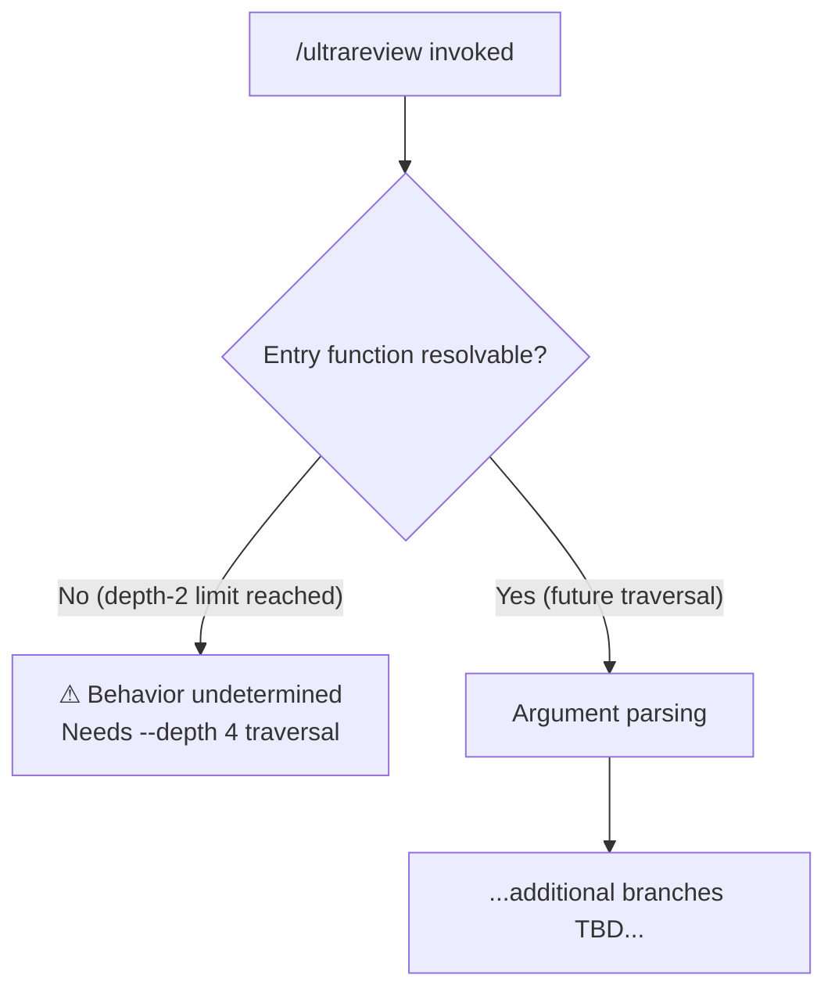

# `/ultrareview`

> Analysis basis: CC v2.1.139 bundle.js (AST extraction + Claude interpretation)
> Minimum version: v2.1.139

---

## Overview

`/ultrareview` is a local JSX slash command registered in CC v2.1.139. Its implementation module (`Q$q`) was identified at registration time, but the depth-2 AST traversal yielded no resolvable entry-point functions, call edges, string literals, or telemetry events. As a result, only the registration-level facts below can be stated with certainty; all behavioral details require a deeper traversal.

Analysis basis: CC v2.1.139 bundle.js:+11080746

---

## Registration

| Field | Value |
|---|---|
| type | `local-jsx` |
| name | `ultrareview` |
| description | `null` (no description string found in registration object) |
| loc\_byte | `11080746` |
| loc\_line | `6708` |
| module\_id | `Q$q` |

Analysis basis: CC v2.1.139 bundle.js:+11080746

---

## Input Branching

The depth-2 call-graph traversal returned an empty edge list for module `Q$q`, so no branching logic can be charted from verified bundle data.

<!-- TODO: not found in depth-2 traversal; needs --depth 4 -->



---

## Behavioral Spec

Because no entry functions were found during module traversal, no pseudocode can be written from verified data.

<!-- TODO: not found in depth-2 traversal; needs --depth 4 -->

### Command Dispatch

```
# Pseudocode skeleton — details require --depth 4 traversal
function ultrareview_dispatch(userInput):
    # 1. Command is registered as type "local-jsx", so the shell
    #    renders a JSX component rather than invoking a pure function.
    # 2. Component identity and props are in module Q$q (bundle.js:+11080746).
    # 3. All sub-steps below are UNKNOWN until deeper traversal resolves them.
    component = resolveLocalJSXModule("Q$q")   # verified: bundle.js:+11080746
    return render(component, props=UNKNOWN)
```

Analysis basis: CC v2.1.139 bundle.js:+11080746

---

## State & Side Effects

| Item | Detail |
|---|---|
| Telemetry | None detected in depth-2 traversal <!-- TODO: not found in depth-2 traversal; needs --depth 4 --> |
| Hook registration | <!-- TODO: not found in depth-2 traversal; needs --depth 4 --> |
| appState changes | <!-- TODO: not found in depth-2 traversal; needs --depth 4 --> |
| Sound | <!-- TODO: not found in depth-2 traversal; needs --depth 4 --> |

---

## Version History

| Version | Change |
|---|---|
| v2.1.139 | Initial registration confirmed at bundle.js:+11080746, line 6708; implementation details pending deeper traversal |

---

## Common Mistakes

1. **Assuming `/ultrareview` behaves like `/review`** — the command is registered under its own module (`Q$q`) with a distinct `local-jsx` type; any assumptions imported from other review-adjacent commands are unverified.
2. **Expecting a description string** — the `description` field is `null` in the registration object; no help text is surfaced by the command registration itself (Analysis basis: CC v2.1.139 bundle.js:+11080746).
3. **Running a depth-2 traversal and expecting full coverage** — the `note` field in the AST output explicitly states `"no entry functions found for module 'Q$q'"`, meaning a minimum of `--depth 4` is required before behavioral claims can be made.

---

## Appendix — Identifier Mapping

> For bundle debugging only. Identifiers change across versions.

| Identifier | Role |
|---|---|
| `Q$q` | Module containing the `/ultrareview` local-JSX command implementation (not a function identifier; this is the module ID as emitted by the bundler) |

> No obfuscated function-level identifiers were returned by the depth-2 traversal. Additional entries will appear here once a `--depth 4` (or greater) pass is completed.