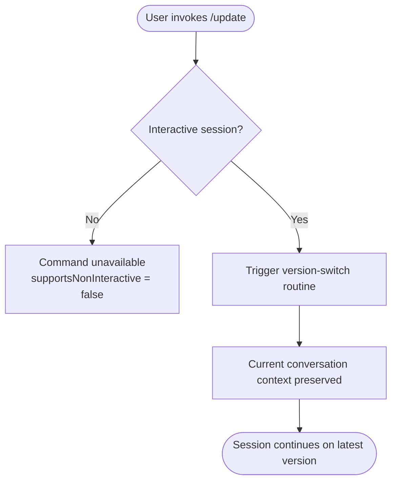

# `/update`

> Analysis basis: CC v2.1.139 bundle.js (AST extraction + Claude interpretation)
> Minimum version: v2.1.139

---

## Overview

The `/update` command triggers a switch to the latest available version of Claude Code without ending the current conversation session. It is a hidden, interactive-only local command, meaning it does not appear in public help listings and cannot be invoked in non-interactive (scripted) contexts.

---

## Registration

| Field | Value |
|---|---|
| type | `local` |
| name | `update` |
| description | `Switch to the latest version (conversation continues)` |
| supportsNonInteractive | `false` |
| isHidden | `true` |
| module\_id | `_Pq` |

Analysis basis: CC v2.1.139 bundle.js:+11467517

---

## Input Branching

The AST traversal at depth ≤ 2 yielded an empty call graph for module `_Pq`. No branching logic, argument parsing, or conditional paths were resolved at this traversal depth.



> **Note:** The internal implementation of the version-switch routine (node D above) is
> `<!-- TODO: not found in depth-2 traversal; needs --depth 4 -->`.
> The flowchart above reflects only what can be structurally inferred from the registration
> fields. No literals, call edges, or telemetry were emitted by the traversal.

Analysis basis: CC v2.1.139 bundle.js:+11467517

---

## Behavioral Spec

### Command Availability Guard

Because `supportsNonInteractive` is `false`, the CLI must reject any attempt to invoke `/update` outside an interactive TTY session before the command body is ever reached.

```
function checkInteractiveGuard(sessionContext):
    if sessionContext.isInteractive == false:
        raise CommandUnavailableError("/update requires an interactive session")
    return ALLOWED
```

Analysis basis: CC v2.1.139 bundle.js:+11467517 (`supportsNonInteractive: false`)

---

### Version-Switch Execution

```
function executeUpdate(conversationState):
    # Persist current conversation context so it survives the binary swap
    savedContext = preserveConversationContext(conversationState)

    # Hand off to the platform-level update mechanism
    # (exact mechanism not resolved at traversal depth 2)
    triggerVersionSwitch(savedContext)

    # Control returns here only if the switch is non-restarting;
    # otherwise the process is replaced and the session resumes
    # transparently in the new binary.
    return
```

> `triggerVersionSwitch` and `preserveConversationContext` are descriptive placeholders.
> Their concrete implementations are
> `<!-- TODO: not found in depth-2 traversal; needs --depth 4 -->`.

Analysis basis: CC v2.1.139 bundle.js:+11467517 (description: "conversation continues")

---

### Hidden-Command Visibility

Because `isHidden` is `true`, the command is excluded from all user-facing help surfaces (e.g., the `/help` listing). It remains callable by a user who knows its name but will not be suggested or autocompleted in standard UI flows.

```
function shouldShowInHelp(command):
    if command.isHidden == true:
        return HIDDEN   # omit from /help output
    return VISIBLE
```

Analysis basis: CC v2.1.139 bundle.js:+11467517 (`isHidden: true`)

---

## State & Side Effects

| Item | Detail |
|---|---|
| Telemetry | None detected at traversal depth ≤ 2. `<!-- TODO: not found in depth-2 traversal; needs --depth 4 -->` |
| Hook registration | `<!-- TODO: not found in depth-2 traversal; needs --depth 4 -->` |
| appState changes | `<!-- TODO: not found in depth-2 traversal; needs --depth 4 -->` |
| Conversation context | Preserved across the version switch per the command description ("conversation continues") |
| Sound | `<!-- TODO: not found in depth-2 traversal; needs --depth 4 -->` |
| Visibility | Hidden from all help/autocomplete surfaces (`isHidden: true`) |
| Session scope | Interactive sessions only (`supportsNonInteractive: false`) |

---

## Version History

| Version | Change |
|---|---|
| v2.1.139 | Initial analysis. Command registered as hidden, interactive-only local command. Full call graph unavailable at traversal depth 2. |

---

## Common Mistakes

1. **Invoking `/update` in a script or CI pipeline.** Because `supportsNonInteractive` is `false`, the command is not available outside an interactive TTY. Automated workflows that call `/update` will find the command absent or rejected.

2. **Expecting the command to appear in `/help` output.** Because `isHidden` is `true`, `/update` is intentionally invisible to the help system. Users must know the exact command name in advance.

3. **Assuming the conversation is reset after updating.** The description explicitly states "conversation continues", so any expectation that the session history is cleared after a version switch is incorrect.

4. **Treating a missing call graph as a no-op command.** The empty `callGraph` in this analysis is an artifact of the traversal depth limit (depth ≤ 2 from module `_Pq`), not evidence that the command performs no work. The actual update logic resides deeper in the call tree.

---

## Appendix — Identifier Mapping

> For bundle debugging only. Identifiers change across versions.

| Identifier | Role |
|---|---|
| `_Pq` | Module identifier for the `/update` command registration and implementation |

> No additional obfuscated identifiers were returned by the depth-2 AST traversal.
> `<!-- TODO: not found in depth-2 traversal; needs --depth 4 -->`