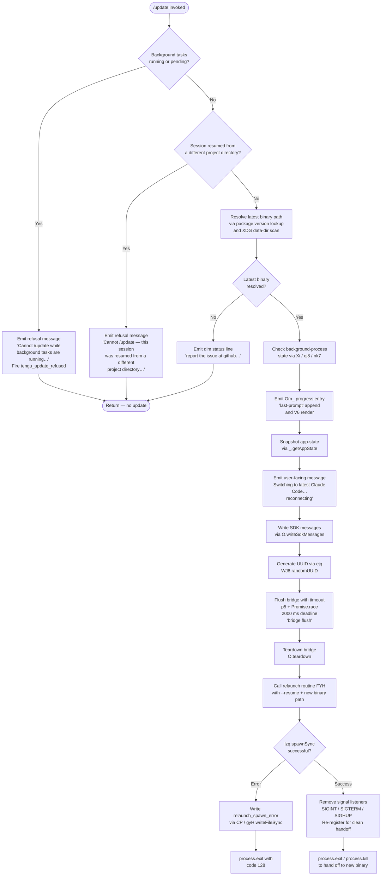

# `/update`

> Analysis basis: CC v2.1.139 bundle.js (AST extraction + Claude interpretation)
> Minimum version: v2.1.139

---

## Overview

`/update` is a hidden local slash command that upgrades the running Claude Code process to the latest installed version **without ending the current conversation**. It performs a series of pre-flight safety checks, emits a status message, flushes and tears down the active I/O bridge, then relaunches the process in-place — passing a `--resume` flag so the session continues seamlessly on the new binary.

---

## Registration

| Field | Value |
|---|---|
| type | `local` |
| name | `update` |
| description | `Switch to the latest version (conversation continues)` |
| isHidden | `true` |
| supportsNonInteractive | `false` |
| module_id | `_Pq` |
| load_inline | `true` |
| loc_byte | `11467517` |
| loc_byte_end | `11467719` |
| loc_line | `7151` |
| arbor_handler.name | `lG7` |
| arbor_handler.fqn | `claude-2.1.139::lG7` |
| arbor_handler.kind | `AsyncFunction` |
| arbor_handler.resolution_path | `module_id` |
| arbor_handler.n_hits | `0` |

Analysis basis: CC v2.1.139 bundle.js:+11467517

---

## Input Branching

The command has 5+ distinct decision branches (background-task guard, project-directory guard, background-process check, SDK flush path, and relaunch success/failure). A Mermaid flowchart is used.



Analysis basis: CC v2.1.139 bundle.js:+11465403 through +11466989

---

## Behavioral Spec

### 1. Entry Point — Handler Dispatch

The Arbor-resolved handler is `lG7` (an `AsyncFunction`), reached via `module_id` resolution of module `_Pq`. The call graph shows `lG7` is also called from `TJ8` (the loader wrapper) at bundle offset +11466845.

Analysis basis: CC v2.1.139 bundle.js:+11465403

---

### 2. Pre-flight: Binary and Version Path Resolution

```
function resolveLatestBinary():
    # checkExecutableOnPath calls lMA → Bun.which("claude")
    executablePath = checkExecutableOnPath("claude")   # loc +11465317

    # getInstallationPaths calls Tm → U48 → AzH → _L8 → q01.homedir()
    # Constructs XDG path: $HOME/.local/share/versions/<ver>/bin
    installPaths = getInstallationPaths()               # loc +11465370

    return (executablePath, installPaths)
```

The path construction uses the literal segments `".local"`, `"share"`, `"versions"`, `"bin"` joined via `hD6.join` / `kY6.join`.
Analysis basis: CC v2.1.139 bundle.js:+7467767, +7467776, +7827931, +7467846

---

### 3. Pre-flight: Background-Task Guard

```
function checkBackgroundTasksAllowUpdate(appState):
    taskStates = Object.values(appState.tasks)          # loc +11465640
    for task in taskStates:
        if task.status == "running" or task.status == "pending":  # loc +11465678, +11465700
            emitErrorMessage(
                "Cannot /update while background tasks are running — " +
                "wait for them to finish, then try again."            # loc +11465781
            )
            fireTelemetry("tengu_update_refused")                   # loc +11465417
            return REFUSED
    return OK
```

Analysis basis: CC v2.1.139 bundle.js:+11465640, +11465678, +11465700, +11465781

---

### 4. Pre-flight: Project-Directory Guard

```
function checkProjectDirectoryCompatibility(currentSession):
    # Checks whether the session was restored from a mismatched project dir
    # Uses Q (session context) and Z1 → Zo background-mode check
    if sessionRestoredFromDifferentDirectory(currentSession):      # loc +11466205
        emitErrorMessage(
            "Cannot /update — this session was resumed from a different " +
            "project directory. Restart manually with --resume to continue " +
            "on the latest version."                                # loc +11466022
        )
        return REFUSED
    return OK
```

The `--resume` flag literal at +11200135 is reused here in the user-facing message.
Analysis basis: CC v2.1.139 bundle.js:+11466022, +11466205

---

### 5. Progress Entry and App-State Snapshot

```
function emitProgressAndSnapshot():
    # Om_ appends a "last-prompt" entry to the conversation log
    appendConversationEntry("last-prompt")                          # loc +11939052
    renderView(V6)                                                  # loc +11466241

    # wI filters/computes assistant message prefix "assistant-"
    assistantPrefix = filterAssistantPrefix("assistant-")          # loc +11466323 / +11466257

    # Snapshot current app state before teardown
    stateSnapshot = getAppState()                                  # loc +11466269
    return stateSnapshot
```

Analysis basis: CC v2.1.139 bundle.js:+11466241, +11466257, +11466269

---

### 6. Status Message Emission and SDK Write

```
function emitSwitchingMessage(stateSnapshot):
    # Write the user-visible switching message
    message = "Switching to latest Claude Code… reconnecting"      # loc +11466515
    writeSDKMessages(message, type="text")                         # loc +11465463

    # Generate a fresh UUID for the new session handoff
    sessionUUID = generateUUID()          # ejq → WJ8.randomUUID   # loc +11466511

    # Update app state with the new session identifier
    setAppState(stateSnapshot, sessionUUID)                        # loc +11466405

    return sessionUUID
```

Analysis basis: CC v2.1.139 bundle.js:+11466491, +11466515, +11466511

---

### 7. Bridge Flush and Teardown

```
async function flushAndTeardownBridge():
    # p5 races a 2000 ms timeout against the flush promise
    FLUSH_TIMEOUT_MS = 2000                                        # loc +11466595
    FLUSH_LABEL      = "bridge flush"                              # loc +11466600

    await raceWithTimeout(
        promise  = bridge.flush(),                                 # loc +11466585
        timeout  = FLUSH_TIMEOUT_MS,
        label    = FLUSH_LABEL
    )
    bridge.teardown()                                              # loc +11466636
```

Analysis basis: CC v2.1.139 bundle.js:+11466582, +11466585, +11466595, +11466636

---

### 8. Relaunch Routine (`FYH`)

```
async function relaunchProcess(newBinaryPath, resumeFlag):
    # Verify new binary exists via nzq.stat                        # loc +11200082
    statResult = stat(newBinaryPath)

    # Flush remaining output and render final frame
    await Promise.all([
        flushOutput(),                                             # loc +11200176
        raceWithTimeout(30000, "flush timeout (relaunch)"),        # loc +11200197
        raceWithTimeout(CLEANUP_MS, "cleanup timeout")             # loc +11200259
    ])

    # Shut down background workers and scroll-summary rendering
    shutdownBackgroundWorkers()    # sE → uL                       # loc +11200192
    shutdownScrollSummary()        # jyH → Promise.all             # loc +11200248

    # Merge final object state
    Object.assign(finalState, ...)                                 # loc +11200447

    # Remove existing signal handlers
    process.removeAllListeners("SIGINT")                           # loc +11200522
    process.removeAllListeners("SIGTERM")                          # loc +11200531
    process.removeAllListeners("SIGHUP")                           # loc +11200541

    # Spawn the new binary synchronously with inherited stdio
    spawnResult = lzq.spawnSync(
        newBinaryPath,
        args  = [resumeFlag, ...],                                 # "--resume" loc +11200135
        stdio = "inherit"                                          # loc +11200643
    )                                                              # loc +11200608

    if spawnResult.error:
        # Write error marker file
        writeFileSync(errorPath, "relaunch_spawn_error")           # loc +11200837
        process.exit(128)                                          # loc +11200974 / +11200861

    # Re-register minimal signal handlers for clean handoff
    process.on("beforeExit", ...)                                  # loc +11200701
    process.on("exit", ...)                                        # loc +11200742

    # Hand off to new binary
    process.exit()    # or process.kill                            # loc +11200861, +11200926
```

The `--resume` argument is the critical continuity mechanism — it instructs the new binary to restore the current conversation session.
Analysis basis: CC v2.1.139 bundle.js:+11200006 through +11200926

---

### 9. Failure Display

```
function displayFailureInfo():
    # Shown when binary resolution fails or an unrecoverable error occurs
    dimText(
        "report the issue at https://github.com/anthropics/claude-code/issues"  # loc +11466989
    )
    # Package metadata embedded in bundle for display:
    # package: "@anthropic-ai/claude-code"        loc +11467072
    # docs:    "https://code.claude.com/docs/…"   loc +11467111
    # version: "2.1.139"                           loc +11467162
    # build:   "2026-05-11T17:03:24Z"             loc +11467251
    # commit:  "208bf4b44f987c4c62618ae20ce1715d53693c62"  loc +11467282
```

Analysis basis: CC v2.1.139 bundle.js:+11466989, +11467072, +11467162

---

## State & Side Effects

| Item | Detail |
|---|---|
| Telemetry: `tengu_update_refused` | Fired when background tasks are still running or pending and the update is blocked (loc +11465417) |
| Telemetry: `tengu_scroll_summary` | Fired inside the scroll-summary shutdown path during relaunch (`y68` → `Q` path, loc +5110602) |
| Telemetry: `tengu_amber_creek` | Fired inside the fullscreen/render negotiation path (`j6` → `evL`, loc +3232972) |
| Telemetry: `tengu_pewter_brook` | Fired inside a parallel render negotiation path (`FA` → `j6`, loc +3232880) |
| Bridge flush | `O.flush()` called with a 2000 ms race timeout before teardown (loc +11466585, +11466595) |
| Bridge teardown | `O.teardown()` called after flush (loc +11466636) |
| SDK message write | `O.writeSdkMessages` writes the "Switching…" status message (loc +11466491) |
| App-state read | `_.getAppState()` snapshots state before relaunch (loc +11466269) |
| App-state write | `_.setAppState()` updates state with new session UUID (loc +11466405) |
| Conversation log append | `_.appendEntry("last-prompt")` records the update action (loc +11939032) |
| Process signal listeners | All `SIGINT`, `SIGTERM`, `SIGHUP` listeners removed and re-registered before handoff (loc +11200522–11200581) |
| Process exit / kill | `process.exit()` or `process.kill()` used to hand off to the new binary (loc +11200861, +11200926) |
| Error file write | On spawn failure, `gyH.writeFileSync` writes a `relaunch_spawn_error` marker (loc +11200837) |
| Exit code on spawn failure | `128` (loc +11200974) |
| isHidden | `true` — command does not appear in the normal `/help` listing |
| supportsNonInteractive | `false` — cannot be used in non-interactive / headless mode |

---

## Version History

| Version | Change |
|---|---|
| v2.1.139 | Initial analysis — in-place process relaunch with `--resume`, 2000 ms bridge-flush timeout, background-task and project-directory guards, hidden from command list |

---

## Common Mistakes

1. **Running `/update` during active background tasks** — the command will refuse with a clear message and fire `tengu_update_refused`. Wait for all background tasks to reach a terminal state before retrying.
2. **Using `/update` in a session resumed across project directories** — the command detects a mismatched project root and refuses, instructing the user to restart manually with `--resume`.
3. **Expecting the command to appear in `/help`** — `isHidden: true` means `/update` is invisible in standard help output; it must be typed explicitly.
4. **Using `/update` in non-interactive (headless/SDK) mode** — `supportsNonInteractive: false` blocks this usage path; the command requires an interactive terminal session.
5. **Confusing this command with a package-manager upgrade** — `/update` performs an in-process relaunch to an already-installed newer binary found under `$HOME/.local/share/versions/`. It does not run `npm install` or equivalent.
6. **Not accounting for the 2000 ms flush delay** — the bridge-flush race means there is always a brief pause before the new binary starts. Scripts that send input immediately after issuing `/update` may lose messages.

---

## Appendix — Identifier Mapping

> For bundle debugging only. Identifiers change across versions.

| Identifier | Role |
|---|---|
| `lG7` | Main async handler for `/update` (Arbor-resolved entry point) |
| `TJ8` | Loader / dispatcher wrapper that invokes `lG7` |
| `Y3` | Executable-on-path checker (calls `lMA` → `Bun.which`) |
| `lMA` | Low-level `Bun.which` wrapper for locating the `claude` binary |
| `Tm` | Installation-path resolver (XDG data-dir scan) |
| `U48` | Path-component assembler (joins version/bin segments) |
| `j3` | Array type-guard utility (`Array.isArray`) |
| `AzH` | XDG base-dir resolver (calls `_L8` → `q01.homedir`) |
| `_L8` | Home-directory getter (`q01.homedir`) |
| `at` | Alternate path segment builder |
| `Z1` | Background-mode / daemon-state checker |
| `Zo` | Background mode constants holder (`"bg"`, `"daemon"`, `"daemon-worker"`) |
| `Q` | Session context accessor |
| `oW` | Binary basename resolver (`KX.basename`) |
| `V6` | View render / refresh function |
| `nm` | Module path utility |
| `ex_` | Directory-of-binary resolver (`rzq.dirname`) |
| `A_` | Auxiliary path helper used by `ex_` |
| `bK` | Additional path utility used by `ex_` |
| `CHH` | Project-directory comparison / guard check |
| `Xi` | Background-process state inspector (checks `nk7` set membership) |
| `ej8` | Background-process entry fetcher used by `Xi` |
| `Om_` | Progress-entry emitter (appends `"last-prompt"` to conversation log) |
| `uL` | Worker/background-task lifecycle manager |
| `C9` | App-state mutation helper (`$Z8.add` / `$Z8.delete` / `Object.assign`) |
| `y8K` | App-state undefined-sentinel guard |
| `_` | App-state store (`.getAppState`, `.setAppState`, `.appendEntry`) |
| `LH` | Telemetry / logging pipeline coordinator |
| `q_` | Error stringifier used by `LH` |
| `SH` | String coercion helper |
| `S1` | Telemetry queue flusher |
| `G7A` | Telemetry event formatter |
| `CGK` | Telemetry ring-buffer manager (`Qy6.shift` / `Qy6.push`) |
| `wI` | Assistant-message prefix filter (`"assistant-"`) |
| `O` | I/O bridge object (`.writeSdkMessages`, `.flush`, `.teardown`) |
| `x8` | Background-session SDK writer used by `O` |
| `ejq` | UUID generator (`WJ8.randomUUID`) |
| `p5` | Timeout-race utility (`setTimeout` + `Promise.race` + `clearTimeout`) |
| `FYH` | Full relaunch routine (stat → flush → spawn → exit) |
| `A$6` | Interval-clear helper (`jO_` → `clearInterval`) |
| `jO_` | Low-level `clearInterval` wrapper |
| `GTH` | Terminal output shutdown helper (`l$H.writeSync`, `H.unmount`) |
| `H` | Ink/renderer instance (`Math.random`, `setTimeout`, `.unmount`, `.replaceAll`) |
| `Ny` | Terminal cleanup step invoked by `GTH` |
| `Lr6` | Final terminal write helper (`pa.writeSync`, VT escape sequences) |
| `pWH` | Terminal capability checker (Ghostty ≥1.2.0, iTerm.app ≥3.6.6) |
| `xWH` | Additional terminal-capability handler |
| `sT` | tmux/screen escape-sequence rewriter |
| `y68` | Scroll-summary renderer shutdown path |
| `IZ` | Scroll-summary state accessor |
| `cH1` | Scroll-summary render helper |
| `dH1` | Scroll-summary timing calculator (`Date.now`, `Math.max`, `Math.round`) |
| `gH1` | Scroll-summary frame updater used by `dH1` |
| `FA` | Fullscreen / alternate-screen render negotiator |
| `TSH` | Terminal capability set checker (`T0K.has`) |
| `r__` | Render-path helper (`vq`, `SH`) |
| `vc` | Terminal color/style utility |
| `N` | ANSI / control-sequence formatter |
| `N46` | Platform (Windows) detection helper |
| `m_` | Fullscreen mode toggler (`Ix`) |
| `evL` | Alternate render path connector (calls `j6`) |
| `j6` | Core render-frame dispatcher (manages `gfH`, `ZB`, `q46` sets) |
| `sE` | Background-worker shutdown coordinator (calls `uL`) |
| `jyH` | Parallel-task shutdown helper (`Promise.all`, `Array.from`) |
| `CP` | Error-marker file writer (`gyH.writeFileSync`) |

---

Note: index built via Arbor fallback; some signals (telemetry, literals) may be missing — see arbor-fallback.js.