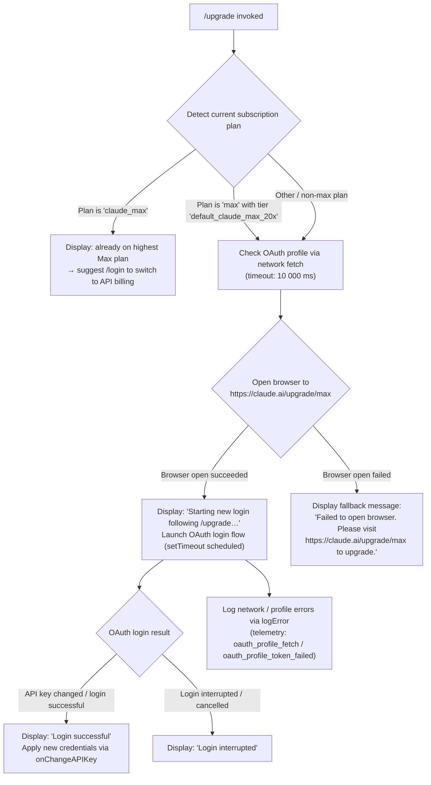

# `/upgrade`

> Analysis basis: CC v2.1.139 bundle.js (AST extraction + Claude interpretation)
> Minimum version: v2.1.139

---

## Overview

The `/upgrade` command guides the user through upgrading their Claude account to a Max subscription plan for higher rate limits and access to more Opus model capacity. It detects the user's current subscription tier, opens the Claude Max upgrade page in a browser, and optionally triggers a new OAuth login flow to apply the upgraded credentials immediately.

---

## Registration

| Field | Value |
|---|---|
| type | `local-jsx` |
| name | `upgrade` |
| description | `Upgrade to Max for higher rate limits and more Opus` |
| loc_byte | `11487622` |
| loc_byte_end | `11487882` |
| loc_line | `7152` |
| module_id | `RPq` |
| load_inline | `true` |
| arbor_handler.name | `HW6` |
| arbor_handler.fqn | `claude-2.1.139::HW6` |
| arbor_handler.kind | `AsyncFunction` |
| arbor_handler.resolution_path | `module_id` |
| arbor_handler.n_hits | `0` |

Analysis basis: CC v2.1.139 bundle.js:+11487622 – +11487882

---

## Input Branching

The handler has 4+ distinct logical branches: already-on-max-plan early exit, browser-open failure fallback, OAuth login success, and OAuth login interruption. A Mermaid flowchart is used.



Analysis basis: CC v2.1.139 bundle.js:+11486668 – +11487882

---

## Behavioral Spec

### 1. Subscription Tier Detection

When the command is invoked, the handler (resolved as `HW6` via `module_id` resolution) first calls the API-key / auth context resolver (`e_`, which delegates to `Pw`) to determine the active authentication mode and subscription tier.

```
async function upgradeCommandHandler(appState, context):
    authInfo = resolveAuthContext(appState)   // e_  → Pw

    if authInfo.plan == "claude_max":
        displayStaticMessage(
            "You are already on the highest Max subscription plan. " +
            "For additional usage, run /login to switch to an API usage-billed account."
        )
        return  // early exit — no browser open, no login flow
```

- Literal plan identifier `"claude_max"` detected at: CC v2.1.139 bundle.js:+11486897
- Already-on-max message detected at: CC v2.1.139 bundle.js:+11486998
- Plan value `"max"` / tier `"default_claude_max_20x"` detected at: CC v2.1.139 bundle.js:+11486754 and +11486779

### 2. Auth Context Resolution (`resolveAuthContext`)

The auth-context resolver (`e_` → `Pw`) inspects the current environment to decide whether credentials come from:

| Source checked | Literal | loc_byte |
|---|---|---|
| Bedrock | `"bedrock"` | +2001281 |
| Foundry | `"foundry"` | +2001331 |
| Anthropic AWS | `"anthropicAws"` | +2001387 |
| Mantle | `"mantle"` | +2001441 |
| Vertex | `"vertex"` | +2001489 |
| First-party (claude.ai OAuth) | `"firstParty"` | +2001498 |
| Claude Desktop | `"claude-desktop"` | +2886236 |
| VS Code | `"claude-vscode"` | +46715 |

Environment variables consulted: `ANTHROPIC_API_KEY` (+2889289), `CLAUDE_CODE_OAUTH_TOKEN_FILE_DESCRIPTOR` (+2018256), `CLAUDE_CODE_API_KEY_FILE_DESCRIPTOR` (+2018400).

If neither an API key nor an OAuth token is present, the resolver raises an error: `"ANTHROPIC_API_KEY or CLAUDE_CODE_OAUTH_TOKEN env var is required"` (CC v2.1.139 bundle.js:+2889710).

Analysis basis: CC v2.1.139 bundle.js:+2904583 (e_), +2887537 (Pw → fL), +2887635 (Pw → WR), +2887656 (Pw → dO)

### 3. OAuth Profile Fetch (`fetchOAuthProfile`)

Before opening the browser the handler calls `zo`, which fetches the user's OAuth profile with:

```
function fetchOAuthProfile(oauthToken):
    baseUrl = resolveOAuthBaseUrl(environment)  // GA → $4A / V0K
    response = httpGet(
        url      = baseUrl + "/profile",
        headers  = { "Content-Type": "application/json" },
        timeout  = 10000   // ms
    )
    emit telemetry "oauth_profile_fetch"          // on success
    if token_expired_or_invalid:
        emit telemetry "oauth_profile_token_failed"
    return profile
```

- Timeout constant `10 000` ms: CC v2.1.139 bundle.js:+2005157
- Telemetry event `oauth_profile_fetch`: CC v2.1.139 bundle.js:+2005173
- Telemetry event `oauth_profile_token_failed`: CC v2.1.139 bundle.js:+2005237

OAuth base-URL environment variants checked: `"prod"` (+927607), `"local"` (+928761), `"staging"` (+928786); localhost ports 8000, 4000, 3000, 8205 also referenced (+927881, +927968, +928058, +928641). Custom OAuth URL validation raises an error when the endpoint is not on the approved list: `"CLAUDE_CODE_CUSTOM_OAUTH_URL is not an approved endpoint."` (+928946).

Analysis basis: CC v2.1.139 bundle.js:+2005013 (zo), +2005067 (zo → I8.get), +2005170 (zo → kH), +2005212 (zo → Y8)

### 4. Browser Open (`openBrowserToUpgradePage`)

```
function openBrowserToUpgradePage():
    url = "https://claude.ai/upgrade/max"
    validateUrl(url)          // iq → Tk4: must be http: or https:
    platform = process.platform
    if platform == "darwin":
        spawn("open", [url])
    else if platform == "win32":
        spawn("rundll32", ["url,OpenURL", url])
    else:
        spawn("xdg-open", [url])
    return success | failure
```

- Target URL: CC v2.1.139 bundle.js:+11487151
- URL protocol validation (`"http:"`, `"https:"`): CC v2.1.139 bundle.js:+7432639, +7432661
- Platform string `"darwin"`: CC v2.1.139 bundle.js:+7432911
- Platform string `"win32"`: CC v2.1.139 bundle.js:+7432927
- `"rundll32"` / `"url,OpenURL"`: CC v2.1.139 bundle.js:+7433011, +7433023
- `"open"`: CC v2.1.139 bundle.js:+7433085
- `"xdg-open"`: CC v2.1.139 bundle.js:+7433092
- Browser-open failure message: CC v2.1.139 bundle.js:+11487415

Analysis basis: CC v2.1.139 bundle.js:+11487148 (iq), +7432876 (Tk4), +7432960 (O8)

### 5. Post-Upgrade Login Flow

After successfully opening the browser, the handler schedules a new OAuth login sequence via `setTimeout` and renders a JSX status component:

```
async function postUpgradeLoginFlow(appState):
    displayMessage("Starting new login following /upgrade. Exit with Ctrl-C to use existing account.")
    scheduleAfterDelay(function():
        result = await runOAuthLoginFlow()      // LH path
        if result.apiKeyChanged:
            onChangeAPIKey(result.newKey)
            displayMessage("Login successful")
        else:
            displayMessage("Login interrupted")
    )
```

- "Starting new login…" message: CC v2.1.139 bundle.js:+11487223
- "Login successful": CC v2.1.139 bundle.js:+11487342
- "Login interrupted": CC v2.1.139 bundle.js:+11487361
- `setTimeout` call site: CC v2.1.139 bundle.js:+11486983
- `onChangeAPIKey` callback: CC v2.1.139 bundle.js:+11487319
- JSX element creation (`Wm_.createElement`): CC v2.1.139 bundle.js:+11487184

### 6. Network / Log Transport (`logNetworkErrors`)

Errors surfaced during the OAuth profile fetch and login flow are logged via `Jd.logError` (+949122) and tracked through the telemetry queue managed by `LH` / `CGK` (shift/push ring buffer at +948402, +948414). Log severity `"error"` constant: CC v2.1.139 bundle.js:+949097. Telemetry channel labels `"essential-traffic"` (+947647) and `"no-telemetry"` (+947706) gate whether events are forwarded.

Analysis basis: CC v2.1.139 bundle.js:+948722 (LH → q_), +948981 (LH → S1), +949064 (LH → CGK)

---

## State & Side Effects

| Item | Detail |
|---|---|
| Telemetry — `tengu_feature_ok` | Emitted on successful feature-flag / telemetry-channel check (CC v2.1.139 bundle.js:+943635) |
| Telemetry — `tengu_feature_sad` | Emitted when a feature-flag / telemetry-channel check fails (CC v2.1.139 bundle.js:+943768) |
| Telemetry — `tengu_bg_spare_enable` | Emitted when a background spare process is enabled during the login spawn (CC v2.1.139 bundle.js:+14310004) |
| Telemetry — `tengu_bg_spare_spawn` | Emitted when the background spare process is actually spawned (CC v2.1.139 bundle.js:+14310364) |
| Telemetry — `oauth_profile_fetch` | Emitted on a successful OAuth profile HTTP call (CC v2.1.139 bundle.js:+2005173) |
| Telemetry — `oauth_profile_token_failed` | Emitted when the OAuth token is rejected by the profile endpoint (CC v2.1.139 bundle.js:+2005237) |
| Browser side effect | Opens system browser to `https://claude.ai/upgrade/max` via platform-specific launcher |
| `onChangeAPIKey` callback | Fires with new API key when post-upgrade OAuth login succeeds, updating appState credentials |
| `setTimeout` scheduling | Defers OAuth login flow after rendering the "starting login" UI message |
| `appState` changes | Subscription plan and API key fields updated on successful login; no change on early-exit (already-max) path |
| JSX render | Command handler renders a JSX component (`Wm_.createElement`) to display status messages inline in the terminal UI |
| Background spare process | Background spare subprocess lifecycle (enable + spawn events) triggered during the OAuth process |
| Error logging | Errors pushed to a ring buffer queue via `logError`; ring buffer managed by `CGK` (shift at +948402, push at +948414) |
| `flagSettings` | Feature-flag settings key consulted during auth resolution (CC v2.1.139 bundle.js:+2890230) |

---

## Version History

| Version | Change |
|---|---|
| v2.1.139 | Initial analysis |

---

## Common Mistakes

1. **Running `/upgrade` when already on `claude_max`** — The command exits immediately with a static message and performs no browser action. Users expecting a browser window should use `/login` to switch to an API-billed account instead.
2. **Cancelling the browser OAuth before completing it** — If the system browser opens but the user closes the tab or does not complete sign-in, the login flow will report "Login interrupted" and credentials will not be updated. Re-run `/upgrade` to retry.
3. **Missing `ANTHROPIC_API_KEY` or OAuth token** — If neither credential source is present in the environment, auth-context resolution throws before any upgrade action is taken. Set one of the required environment variables first.
4. **Sandboxed / headless environments** — On Linux systems without `xdg-open` (e.g. CI containers), the browser open will fail and the fallback message directs users to visit `https://claude.ai/upgrade/max` manually.
5. **Custom OAuth URL not on approved list** — If `CLAUDE_CODE_CUSTOM_OAUTH_URL` is set to an unapproved endpoint, the profile fetch will throw before the upgrade page is opened.

---

## Appendix — Identifier Mapping

> For bundle debugging only. Identifiers change across versions.

| Identifier | Role |
|---|---|
| `HW6` | Main upgrade command handler (AsyncFunction; arbor_handler for `/upgrade`) |
| `e_` | Auth context / credential resolver entry point |
| `Pw` | Auth mode dispatcher (branches on bedrock / vertex / firstParty / etc.) |
| `fL` | Flag / environment variable reader utility |
| `SH` | String coercion / normalization helper |
| `WR` | Credential source selector (checks API key helper, OAuth token, env vars) |
| `_p6` | AWS / Bedrock credential sub-resolver |
| `JL6` | Credential string formatter |
| `Do` | OAuth token file-descriptor reader |
| `sx` | Flag-settings aggregator |
| `dO` | Enterprise / cloud provider credential resolver |
| `WA` | Provider-type string resolver (bedrock / foundry / mantle / vertex / firstParty) |
| `w$` | API key resolution and validation orchestrator |
| `LH_` | API key helper sub-resolver |
| `yZ` | API key cache/store accessor |
| `ptH` | VS Code environment checker |
| `Ed8` | API key file-descriptor reader |
| `b6` | Telemetry event batcher / timestamp recorder |
| `AR` | History/key slice utility (last 20 chars — CC v2.1.139 bundle.js:+2019742) |
| `lU` | Boolean coercion wrapper |
| `zo` | OAuth profile fetch orchestrator |
| `GA` | OAuth base-URL resolver (prod / local / staging variants) |
| `$4A` | OAuth environment config builder |
| `V0K` | OAuth endpoint URL constructor |
| `_` | URL replacement / sanitizer utility |
| `kH` | Telemetry feature-ok emitter wrapper |
| `Q` | Core telemetry event emitter |
| `Y8` | Telemetry feature-sad emitter wrapper |
| `LH` | Network request dispatcher / log transport |
| `q_` | Error / string normalizer for network errors |
| `S1` | Log entry formatter |
| `G7A` | Log string builder |
| `CGK` | Telemetry ring-buffer manager (shift + push) |
| `iq` | Browser-open orchestrator (URL validation + platform dispatch) |
| `Tk4` | URL protocol validator (http: / https:) |
| `O8` | Browser spawn dispatcher |
| `$_` | Child-process spawn wrapper |
| `$PH` | Low-level process spawner with stdio/stream setup |
| `Y` | Background spare process manager |
| `_ZK` | Process argument string builder |
| `C6` | Async-local-storage context accessor for spawn |
| `ry6` | Store-context getter |
| `A_` | Spawn result handler |
| `H` | Random-delay / retry scheduler (uses `Math.random` + `setTimeout`, delay ~2000 ms) |

---

Note: index built via Arbor fallback; some signals (telemetry, literals) may be missing — see arbor-fallback.js.