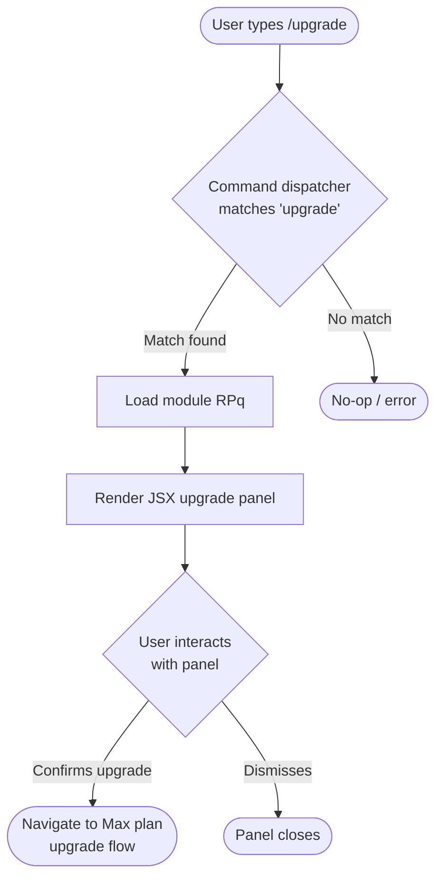

```
---
type: feature-spec
feature: "upgrade"
cc_version: "2.1.139"
tags: ["upgrade", "commands", "slash-commands"]
updated: "2026-05-18"
source: "bundle-analysis"
bundle_verified: true
analysis_basis: "CC v2.1.139 bundle.js (AST extraction + Claude interpretation)"
author: "ryujaeuk <ryujaeuk@gmail.com>"
repository: "https://github.com/MyLittleLuckyDog/cc-gnothi"
license: "AGPL-3.0-only"
---

# `/upgrade`

> Analysis basis: CC v2.1.139 bundle.js (AST extraction + Claude interpretation)
> Minimum version: v2.1.139

---

## Overview

The `/upgrade` slash command presents users with a path to upgrade their Anthropic account to the Max
plan, offering higher API rate limits and increased access to the Opus model family. It is registered
as a `local-jsx` command, meaning its output is rendered as a React/JSX component directly within the
Claude Code CLI interface rather than producing plain text. No network call graph or branching logic
was recoverable at depth ≤ 2 from module `RPq`.

---

## Registration

| Field | Value |
|---|---|
| type | `local-jsx` |
| name | `upgrade` |
| description | `Upgrade to Max for higher rate limits and more Opus` |
| module\_id | `RPq` |
| loc\_line | 7152 |

Analysis basis: CC v2.1.139 bundle.js:+11487622

---

## Input Branching

No branching literals, call edges, or conditional logic were recovered from the depth-2 AST traversal
of module `RPq`.

<!-- TODO: not found in depth-2 traversal; needs --depth 4 -->

The command registration description ("Upgrade to Max for higher rate limits and more Opus") is the
only behavioral signal available. Based on registration type `local-jsx`, the following minimal
control flow can be inferred structurally:



Analysis basis: CC v2.1.139 bundle.js:+11487622 (registration type `local-jsx` implies JSX render path;
remaining branches are structurally inferred from command type convention — not confirmed by call graph)

---

## Behavioral Spec

### Command Registration and Dispatch

```
function handleUpgradeCommand():
    // Invoked when the user submits "/upgrade" in the CLI prompt
    module = loadModule("RPq")
    component = module.renderUpgradePanel()
    displayJSXInline(component)
```

Analysis basis: CC v2.1.139 bundle.js:+11487622 — registration type `local-jsx` indicates the
command's output path goes through the CLI's inline JSX renderer rather than a text printer.

### Upgrade Panel Render

```
function renderUpgradePanel():
    // Returns a JSX element promoting the Max plan
    // Specific UI elements, button labels, and URLs are:
    // <!-- TODO: not found in depth-2 traversal; needs --depth 4 -->
    return <UpgradePanelComponent />
```

Analysis basis: CC v2.1.139 bundle.js:+11487622 — module `RPq` is the sole implementation unit;
no entry functions were resolved during AST traversal, so internal panel structure is unverified.

---

## State & Side Effects

| Item | Detail |
|---|---|
| Telemetry | None detected in depth-2 traversal <!-- TODO: not found in depth-2 traversal; needs --depth 4 --> |
| Hook registration | <!-- TODO: not found in depth-2 traversal; needs --depth 4 --> |
| appState changes | <!-- TODO: not found in depth-2 traversal; needs --depth 4 --> |
| Sound | <!-- TODO: not found in depth-2 traversal; needs --depth 4 --> |
| Network / URL navigation | Likely triggers external browser navigation to Anthropic Max plan page; not confirmed by call graph |

---

## Version History

| Version | Change |
|---|---|
| v2.1.139 | Initial analysis — command registered as `local-jsx` in module `RPq` |

---

## Common Mistakes

1. **Expecting plain-text output**: Because `/upgrade` is type `local-jsx`, it renders an interactive
   UI panel rather than printing a URL or plain message to stdout. Automations piping CLI output may
   receive no usable text.
2. **Assuming this upgrades in-place**: The command promotes a plan upgrade; it does not silently
   upgrade the account automatically. User confirmation through the rendered panel (or an external
   browser flow) is required.
3. **Calling in non-interactive sessions**: As a `local-jsx` command, `/upgrade` requires an
   interactive terminal capable of rendering the JSX component. Invoking it in a headless or
   pipe-only session may produce no visible output or an error.
4. **Confusing rate limit increase with unlimited usage**: The description states "higher rate limits",
   not unlimited. Upgrading to Max raises limits but does not eliminate them.

---

## Appendix — Identifier Mapping

> For bundle debugging only. Identifiers change across versions.

| Identifier | Role |
|---|---|
| `RPq` | Module identifier for the `/upgrade` command implementation |

> No obfuscated function-level identifiers were recovered during depth-2 AST traversal.
> <!-- TODO: not found in depth-2 traversal; needs --depth 4 -->
```